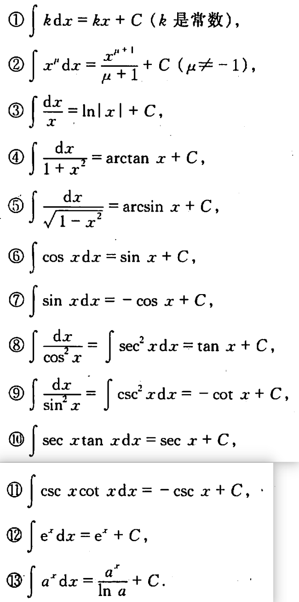

# 积分

## 不定积分定义

**原函数**

定义1 如果在区间 I 上,可导函数 $F(x)$的导函数为 $f(x)$即对任一$x \in I$，都有$F'(x)= f(x)$或 $dF(x)= f(x)dx$，那么函数$F(x)$就称为$f(x)$(或$f(x)dx$)在区间 I 上的原函数。

连续函数一定有原函数。

原函数为一个函数族：$F(x)+C$

**不定积分**

定义2 在区间 $I$ 上函数 $f(x)$的带有任意常数项的原函数称为 $f(x)$(或$f(x)dx$)在区间 $I$ 上的不定积分,记作

$$\int f(x)dx$$

其中记号$\int$称为积分号，$f(x)$称为被积函数，$f(x)dx$称为被积表达式, $x$称为积分变量。

由此定义及前面的说明可知,如果 $F(x)$是$f(x)$在区间 $I$ 上的一个原函数,那么 $F(x)+ C$ 就是$f(x)$的不定积分,即

$$\int f(x)dx=F(x)+C$$

函数 $f(x)$的原函数的图形称为 $f(x)$的积分曲线。

## 基本积分表

## 不定积分性质

性质1 设函数 $f(x)$及 $g(x)$ 的原函数存在,则

$$\int [f(x)+g(x)]dx=\int f(x)dx+ \int g(x)dx$$

性质2 设函数$f(x)$的原函数存在,  $k$为非零常数,则

$$\int kf(x)dx=k\int f(x)dx$$

**换元积分法**

定理1 设西数$f(u)$的原函数存在,  $u=\varphi(x)$可导，则有换元公式：

$$\int f[\varphi(x)]\varphi'(x)dx=[\int f(u)du]_{u=\varphi(x)}$$
