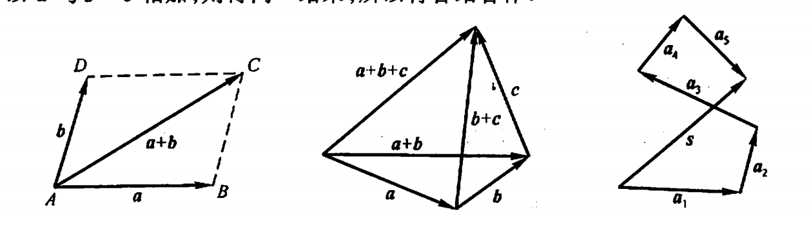
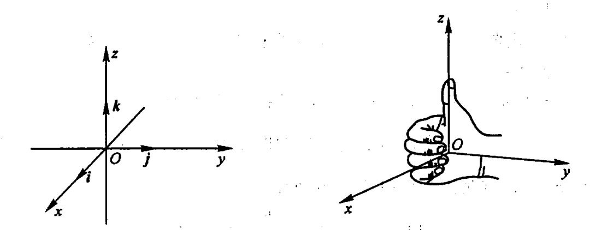
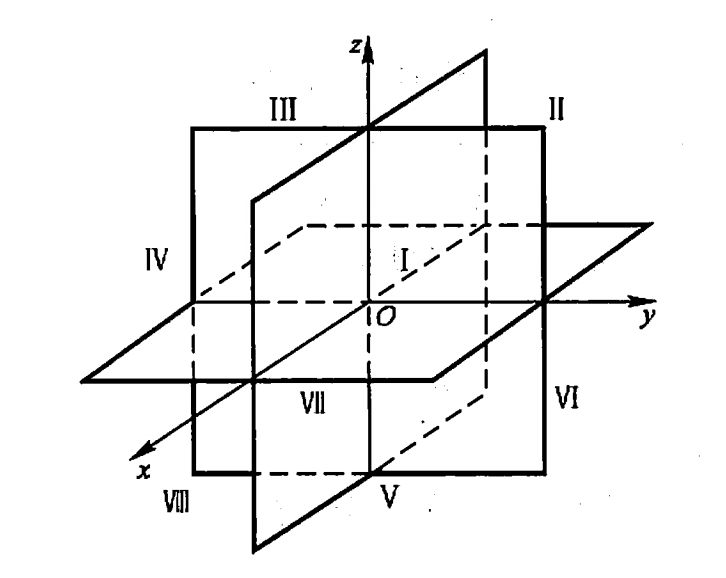
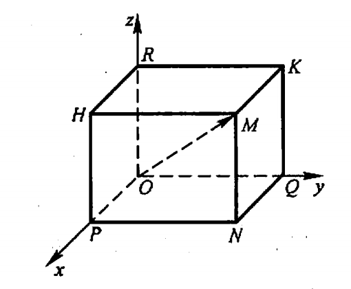
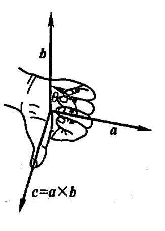

# 空间解析几何

## 向量定义

客观世界中有这样一类量,它们既有大小,又有方向,例如位移、速度、加速度、力、力矩等等,这一类量叫做向量(或矢量)

在数学上,常用一条有方向的线段，即有向线段来表示向量.有向线段的长度表示向量的大小,有向线段的方向表示向量的方向.

以A为起点、B为终点的有向线段所表示的向量记作$\vec{AB}$(图 8-1).有时也用一个黑体字母(书写时,在字母上面加箭头)来表示向量,例如 $a$或$\vec{a}$等等

在数学上我们只研究与起点无关的向量,并称这种向量为自由向量(以后简称向量）

由于我们只讨论自由向量,所以如果两个向量  和b的大小相等,且方向相同,我们就说向量 a 和b是相等的,记作 a = b这就是说,经过平行移动后能完全重合的向量是相等的

向量的大小叫做向量的模.向量$\vec{AB}、\vec{a}$的模依次记作$|AB|、|a|$。模等于1的向量叫做单位向量.模等于零的向量叫做零向量,记作$\vec{0}$。零向量的起点和终点重合，它的方向可以看做是任意的。

设有两个非零向量$a,b$,任取空间一点 O作$OA=a$,$OB= b$,规定不超过$\pi$的$\angle{AOB}$(设$\varphi=\angle{AOB}$，$0\le \varphi \le \pi$ )称为向量$\vec{a}$与$\vec b$的夹角。记作$(\widehat{a,b})$。

如果向量 a 与b 中有一个是零向量,规定它们的夹角可以在0到元之间任意取值

如果$(\widehat{a,b})=0或\pi$，则称a与b是平行的，记为$a // b$.如果$(\widehat{a,b})=\frac{\pi}{2}$，则称a与b是垂直的，记作$a\perp b$。

由于零向量与另一向量的来角可以在0到$\pi$之间任意取值,因此可以认为零向量与任何向量都平行,也可以认为零向量与任何向量都垂直.

当两个平行向量的起点放在同一点时,它们的终点和公共起点应在一条直线上.因此,两向量平行,又称两向量共线。

## 线性运算

**三角形法则**

设有两个向量$\vec a$与$\vec b$,任取一点A作$\vec{AB}=\vec a$,再以$B$为起点作$\vec{BC}=\vec b$,连接 AC那么向量$\vec{AC} =\vec c$,称为向量$\vec a$与$\vec b$的和,记作$\vec a+ \vec b$,即

$$\vec a + \vec b = \vec c$$

力学平形四边形法则相同。

- 交换律：a+b=b+a
- 结合律：(a+b)+c=a+(b+c)

由三角形两边之和大于第三边,有

$$|a+b| \le |a|+|b|$$

$$|a-b| \le |a|+|b|$$

**与数乘法**

向量$\vec a$与实数的乘积记作$\lambda \vec a$是一个向量,它的模

$$|\lambda \vec a| = |\lambda| |\vec a|$$

结合律：$\lambda(\mu\vec a)=\mu(\lambda\vec a)=(\lambda\mu)\vec{a}$

分配律：

$\lambda(\vec a+\vec b)=\lambda\vec a+\lambda\vec b$

$(\lambda+\mu)\vec{a}=\lambda\vec a+\mu\vec a$

## 空间直角坐标系

在空间取定一点O和三个两两垂直的单位向量i、j、k，就确定了三条都以O为原点的两两垂直的数轴,依次记为 x轴(横轴)、y 轴(纵轴)、z轴(竖轴)统称坐标轴。它们构成一个空间直角坐标系,称为 Oxyz 坐标系或$[O;i,j,k]$坐标系. 通常把x轴和y轴配置在水平面上,而z轴则是铅垂线;它们的正向通常符合右手规则,即以右手握住 z 轴,右手的四个手指从正向x轴以$\frac{\pi}{2}$角度转向正向y轴时,大指的指向就是轴的正向。

三条坐标轴中的任意两条可以确定一个平面,这样定出的三个平面统称为坐标面.x轴及y轴所确定的坐标面叫做xOy 面，另两个由y轴及z轴和由z轴及x轴所确定的坐标面分别叫做yOz 面及zOx 面三个坐标面把空间分成八个部分,每一部分叫做一个卦限.含有x轴、y轴与z轴正半轴的那个卦限叫做第一卦，限其他第二、第三、第四卦限,在 xOy 面的上方,按逆时针方向确定。第五至第八卦限,在 zOy 面的下方,由第一卦限之下的第五卦限,按逆时针方向确定,这八个卦限分别用字母 I、II、III、IV、V、VI、VII、VIII表示.

**坐标分解式**

$$\vec r=\vec{OM}=\vec{OP}+\vec{PN}+\vec{NM}=\vec{OP}+\vec{OQ}+\vec{OR}$$

设$\vec{OP}=x\vec i,\vec{OQ}=y\vec j,\vec{OR}=z\vec k$

$$\vec r=\vec{OM}=x\vec i+y\vec j+y\vec k$$

定义:有序数x、y、z称为向量$\vec r$(在坐标系 Oxyz 中)的坐标,记作$r=(x,y,z)$;有序数x、y、z称为点M(在坐标系 Oxyz 中)的坐标,记作$M(x,y,z)$。

记号(z,y,z)既表示点M,又表示向量$\vec{OM}$

## 向量的模

$$|\vec r|=\sqrt{x^2+y^2+z^2}$$

设有点 $A(z_1,y_1,z_1)$和点 $B(x_2,y_2,z_2)$,则点 A 与点B 间的距离|AB|就是向量$\vec{AB}$的模.由

$$\vec{AB}=\vec{OB}-\vec{OA}=(x_2,y_2,z_2)-(z_1,y_1,z_1)=(x_2-z_1,y_2-y_1,z_2-z_1)$$

即得 A、B 两点间的距离

$$|AB|=|\vec{AB}|=\sqrt{(x_2-z_1)^2+(y_2-y_1)^2+(z_2-z_1)^2}$$

## 方向角与方向余弦

非零向量$\vec r$与三条坐标轴的夹角$\alpha、\beta、\gamma$称为向量$\vec r$的方向角.设$\vec{OM}=\vec r=(x,y,z)$,由于x是有向线段OP的值,$MP\perp OP$故

$$\cos\alpha =\frac{x}{|\vec{OM}|} = \frac{x}{|\vec r|}$$

$$\cos\beta =\frac{y}{|\vec{OM}|} = \frac{y}{|\vec r|}$$

$$\cos\gamma =\frac{z}{|\vec{OM}|} = \frac{z}{|\vec r|}$$

从而

$$(\cos\alpha,\cos\beta,\cos\gamma)=(\frac{x}{|\vec r|},\frac{y}{|\vec r|},\frac{z}{|\vec r|})\\=\frac{1}{|\vec r|}(x,y,z)=\frac{\vec r}{|\vec r|}=\vec e_r$$

$\cos\alpha,\cos\beta,\cos\gamma$称为向量$\vec r$的方向余弦.上式表明,以向量$\vec r$的方向余弦为坐标的向量就是与$\vec r$同方向的单位向量$\vec e_r$.并由此可得

$$cos^2\alpha + cos^2\beta + cos^2\gamma = 1$$

## 向量投影

向量$\vec a$ 在直角坐标系 Oxyz 中的坐标$a_x,a_y,a_z$就是$\vec a$在三条坐标轴上的投影,即

$$a_x=Prj_x\vec a,a_y=Prj_y\vec a,a_z=Prj_z\vec a$$

或记作

$$a_x=(\vec a)_x,a_y=(\vec a)_y,a_z=(\vec a)_z$$

性质1 $(\vec a)_u=|\vec a|cos\varphi$，其中$\varphi$为向量$\vec a$与u轴的夹角。

性质2 $(\vec a+\vec b)_u=(\vec a)_u+(\vec b)_u$

性质2 $(\lambda\vec a)_u=\lambda(\vec a)_u$

## 数量积

$$\vec a \cdot \vec b=|\vec a||\vec b|cos\theta$$

场景如物理学功的计算概念。

交换律：$\vec a \cdot \vec b = \vec b \cdot \vec a$

分配律：$\vec a \cdot (\vec b+\vec c)=\vec a \cdot \vec b+\vec a \cdot \vec c$

$$\vec a \cdot \vec b =a_xb_x+a_yb_y+a_zb_z$$

$$cos\theta=\frac{\vec a \vec b}{|\vec a||\vec b|}=\frac{a_xb_x+a_yb_y+a_zb_z}{\sqrt{a_x^2+a_y^2+a_z^2}\sqrt{b_x^2+b_y^2+b_z^2}}$$

## 向量积

设向量 $\vec c$ 由两个向量$\vec a$ 与$\vec b$ 按下列方式定出:

$\vec c$的模$|\vec c|=|\vec a||\vec b|sin\theta$,其中$\theta$为$\vec a、\vec b$间的夹角;$\vec c$的方向垂直于$\vec a$与$\vec b$ 所决定的平面(即$\vec c$既垂直于$\vec a$又垂直于$\vec b$),$\vec c$的指向按右手规则从$\vec a$转向$\vec b$来确定,那么，向量$\vec c$叫做向量$\vec a$ 与$\vec b$ 的向量积,记作$\vec a \times \vec b$,即

$$\vec c=\vec a \times \vec b$$
