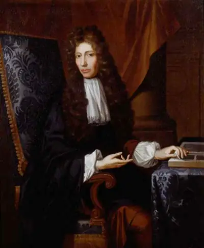

# 1627-1691 波义耳 Boyle

罗伯特·波义耳（Robert Boyle，1627年1月25日—1691年12月30日）

英国物理学家、化学家，化学科学的开山祖师，近代化学的奠基人，化学史家都把1661年作为近代化学的元年，因为这一年有一本对化学发展产生重大影响的著作出版问世，这本书就是波义耳所著的《怀疑派化学家》（The Skeptical Chemist）。

《怀疑派化学家》（1661年）《化学家的故事》《矿泉的博物学考察》《关于空气弹性及其物理力学的新实验》《关于火焰与空气关系的新实验》《形式与性质的起源》（1666年，总结了原子论哲学的要点）

正确地指出了研究化学的目的

17世纪以前的化学知识，一部分是炼金术的内容，目的在于变金属为黄金或白银；一部分是医药学的内容，目的在于发展医药，治病救人；一部分是化工生产的内容，目的在于增加产品的种类和提高产品的质量。化学研究没有独立性，主要由于没有明确的、正确的研究目的，而是其它部分的附属物。关于研究化学的目的问题，波义耳提出了与以前的炼金术家、医药学家和化工生产者有本质不同的见解。他认为研究化学的目的不是醉心于炼金术和医药，而是在于认识物质的本性。为此就需要进行专门的实验，收集所观察到的事实，使化学从炼金术和医药学中解放出来，发展成为一门专为探索自然界本质的科学。他说：“化学，到目前为止，还是认为只在制造医药和工业品方面具有价值。但是我们所说的化学，绝不是医学或药学的婢女，也不是甘当工艺和冶金的奴仆。化学本身作为自然科学中的一个独立部分，是探索宇宙奥秘的一个方面。化学，必须是为真理而追求真理的化学。”波义耳的自然观促使人们逐渐认识到，化学是具有自然特性的一门需要积极发展的科学。由于研究化学有了明确的研究目的、范畴和方向，使化学研究彻底地从炼金术、医药学、化工生产中解放出来，大大地推动了化学科学的发展。所以恩格斯高度评价说：“波义耳把化学确立为科学。”直到现在，波义耳所确定的化学研究的目的，对化学的研究和发展仍然具有指导意义。

第一个科学的元素定义

波义耳用实验证明，黄金不怕火烧，不会被火分解，更不会在火的作用下生成盐、硫或汞；但它可以跟其它金属融在一起变成合金，还可以溶解在王水里，而且所得到的产物经过适当处理黄金又可以恢复原性重现出来。他实验得出把砂子和灰碱两种东西混合在一起，经过加热可以熔化成透明的玻璃；生成的玻璃再也不会分解成土、水等东西。把灰碱和油脂烧煮会变成肥皂，但将肥皂加热所得到的产物却是跟碱和油脂完全不同的渣块。榨压葡萄得到的果汁，经过发酵可以变成酒精，果汁和酒精也都不会变成盐或硫。波义耳还指出，不少的化学变化都可以说明，同一物质经过不同处理可以转变成其它各种东西。这说明物质的组成和性质是复杂的，即不是亚里士多德所说的四元素，也不是医药学家所说的三元素。他还研究了在冶金和金属加工业中，金属锻烧以后所得的灰渣比金属还重的现象，决不是金属分解以后留下的元素，而得到的是比金属本身更复杂的物质。波义耳通过许多事实的论证后，给元素下了一个比较科学的定义：“我指的元素应当是某些不同任何其他物质所构成的原始的和简单的物质或完全纯净的物质”，“是具有一定确定的、实在的、可觉察到的实物，他们应是同一般化学方法不能再分解为更简单的某些实物。”这是世界上第一个科学的元素定义。由于波义耳给化学元素提出了科学的定义，为人类研究物质的组成指明了方向。虽然波义耳提出了科学的元素概念，由于时代的局限性，他并没有明确指出那些物质是真正的元素，而且仍然把火、水、气等当作元素。

发展了古代的微粒说

古希腊唯物主义哲学家德谟克利特认为物质是由微粒构成的。到17世纪这个观点重新复活起来，并获得了发展，牛顿、胡克、波义耳都是坚持微粒说的代表人物。关于光线通过棱镜而折射的问题，他们都以微粒作解释，可是微粒只是一种推想的东西，实际上谁也没有看过。化学家为了解释化学反应过程，也求助于微粒的运动和变化。虽然波义耳深信微粒说，但把它应用于化学却出现了问题。化学物质的性质是多种多样的，反应过程是复杂的，只是用微粒及其运动是难以解释的。他说：“我建议的关于特殊本源的微粒说，其重大困难就在于自然物体实际见到这种繁多的特性会起源于这样少的两种因素，而且简单到只是物质和位移运动，这是不能令人置信的。”他根据盐能溶于水而不能溶于油或汞，但黄金能溶于汞而不能溶于水和油，硫能溶于油而不能溶于水或汞等现象，认为应该在微粒说上面添加一些别的东西以补充其内容。他设想物质的基本微粒有各种不同形态和大小，并以不同的方式运动，或者相互固定在各种不同的次序和排列上，并在它们的细孔里保持着某些流出物或发散物。如同各个字母一样，可以有各种不同的方式组合起来，每个组合体代表一个化学物质。这就是他给微粒说添加的所谓“物体中的变异原理”。波义耳的变异原理，丰富了古希腊以来关于微粒说的内容，发展了哲学家的微粒说。

波义耳定律

波义耳在科学研究上的兴趣是多方面的。他曾研究过气体物理学、气象学、热学、光学、电磁学、无机化学、分析化学、化学、工艺、物质结构理论以及哲学、神学。其中成就突出的主要是化学。
和当时的许多科学家一样，波义耳首先研究的对象是空气。通过对空气物理性质的研究，特别是真空实验，他认识到真空所产生的吸力乃是空气的压力。他做了一系列实验来考察空气的压力和体积的关系，并推导出空气的压力和它所占体积之间的数学关系。在他的著作《关于空气弹性及其物理力学的新实验》中，他明确地提出：“空气的压强和它的体积成反比”。法国物理学家马略特在此后15年也根据实验独立地提出这一发现。所以后人把关于气体体积随压强而改变的这一规律称作波义耳-马略特定律。

波义耳用“U”形玻璃管继续实验，发现了很多值得注意的事情。当他向堵住的空气施加双倍的压力时，空气的体积就会减半；施加3倍的压力时，体积就会变成原来的1/3。当受到挤压时，空气体积的变化与压强的变化总是成比例。他创建了一个简单的数学等式来表示这一比例关系，如今我们称之为“波义耳定律”。就认识大气、利用大气为人类服务而言，这一定律是极为重要的。

波义耳定律（Boyle's law，或称Mariotte's Law）即在定量定温下，理想气体的体积与气体的压力成反比。是由英国化学家波义耳在1662年根据实验结果提出：“在密闭容器中的定量气体，在恒温下，气体的压强和体积成反比关系。”称之为波义耳定律。这是人类历史上第一个被发现的“定律”。

确立化学为科学

为了确定科学的化学，波义耳考虑到首先要解决化学中一个最基本的概念：元素。最早提出元素这一概念的是古希腊一位著名的唯心主义哲学家柏拉图，他用元素来表示当时认为是万物之源的四种基本要素：火、水、气、土。这一学说曾在两千年里被视为真理。后来医药化学家们提出的硫、汞、盐的三要素理论也风靡一时。波义耳通过一系列实验，对这些传统的元素观产生了怀疑。他指出：这些传统的元素，实际未必就是真正的元素。固为许多物质，比如黄金就不含这些“元素”，也不能从黄金中分解出硫、汞、盐等任何一种元素。恰恰相反，这些元素中的盐却可被分解。那么，什么是元素？波义耳认为：只有那些不能用化学方法再分解的简单物质才是元素。例如黄金，虽然可以同其它金属一起制成合金，或溶解于王水之中而隐蔽起来，但是仍可设法恢复其原形，重新得到黄金。水银也是如此。

至于自然界元素的数目，波义耳认为：作为万物之源的元素，将不会是亚里士多德的“四种”，也不会是医药化学家所说的三种，而一定会有许多种。波义耳的元素概念实质上与单质的概念差不多，元素的定义应是“具有相同核电荷数的同一类原子的总称”。如今这种科学认识是波义耳之后，又经三百多年的发展，直到20世纪初才弄清楚的。波义耳当时能批判四元素说和三要素说而提出科学的元素概念已经很不简单，是认识上一个了不起的突破，使化学第一次明确了自己的研究对象。在《怀疑派化学家》一书中，在明确地阐述上述两个观点的同时，波义耳还强调了实验方法和对自然界的观察是科学思维的基础，提出了化学发展的科学途径。波义耳深刻地领会了培根重视科学实验的思想，他反复强调：“化学，为了完成其光荣而又庄严的使命，必须抛弃古代传统的思辨方法，而像物理学那样，立足于严密的实验基础之上。”波义耳正是这样身体力行的。波义耳把这些新观点、新思想带进化学，解决了当时化学在理论上所面临的一系列问题，为化学的健康发展扫平了道路。如果把伽利略的《关于两大世界体系的对话》作为经典物理学的开始，那么波义耳的《怀疑派化学家》可以作为近代化学的开始。

酸碱指示剂

波义耳女友去世后，他一直把女友最爱的紫罗兰花带在身边。在一次紧张的实验中，放在实验室内的紫罗兰，被溅上了浓盐酸，爱花的波义耳急忙把冒烟的紫罗兰用水冲洗了一下，然后插在花瓶中。过了一会，波义耳发现深紫色的紫罗兰变成了红色的。这一奇怪的现象促使他进行了许多花木与酸碱相互作用的实验。由此他发现了大部分花草受酸或碱作用都能改变颜色，其中以石蕊地衣中提取的紫色浸液最明显，它遇酸变成红色，遇碱变成蓝色。利用这一特点，波义耳用石蕊浸液把纸浸透，然后烤干，这就制成了实验中常用的酸碱试纸——石蕊试纸。

也是在这一类实验中，波义耳发现五倍子水浸液和铁盐在一起，会生成一种不产生沉淀的黑色溶液。这种黑色溶液久不变色，于是他发明了一种制取黑墨水的方法，这种墨水几乎用了一个世纪。

磷的研究

晚年的波义耳在制取磷元素和研究磷、磷化物方面也取得了成果，他根据“磷的重要成分，乃是人身上的某种东西”的观点，顽强努力地钻研，终于从动物尿中提取了磷。经进一步研究后，他指出：磷只在空气存在时才发光；磷在空气中燃烧形成白烟，这种白烟很快和水发生作用，形成的溶液呈酸性，这就是磷酸，把磷与强碱一起加热，会得到某种气体（磷化氢），这种气体与空气接触就燃烧起来，并形成缕缕白烟。这是当时关于磷元素性质的最早介绍。

物理学

波义耳在物理学的其他方面也有许多贡献。他最先对固体的弹性进行了研究，在对钟摆长度变化所开展的固体膨胀研究中。发现了水在结冰时会膨胀。他主张热是分子的运动。他拥护原子论假说，认为一切物体都是由较小的、完全相同的粒子组成的。他于1663年首先提出色光是白光的变种，表述了白光的复杂性的思想，指出物体的颜色并不是物体本身的内在属性，而是由光线在被照射面上发生的变异引起的。1663年他还第一次记载了在肥皂泡和玻璃球中产生的彩色薄膜条纹。他观察到静电感应现象，指出化学发光现象是冷光等。他在实验过程中研制成气压计，并于1662～1663年引人“barometer”（气压计）这个名称。玻意耳特别重视和强调实验的重要意义。他自己从事实验的面非常广，在热学、声学、电学、光学、流体静力学、化学、医学、生物学、生理学多方面从事过许多实验，对以后实验物理学的发展有积极影响。

生理学

在生理学方面，波义耳研究了空气对生物的作用，发现了肺内血液颜色和摄取空气有关，1663年他还找出了毛细血管等。