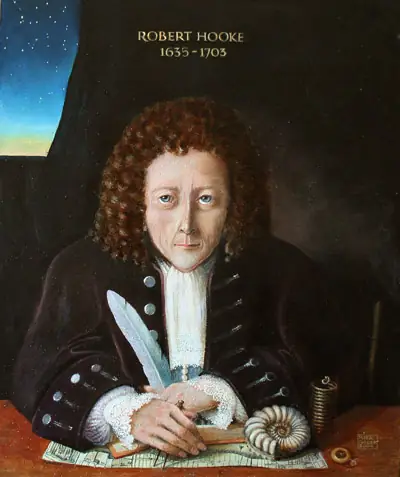

# 1635-1703 胡克 Hooke

罗伯特·胡克（Robert Hooke，1635年7月18日－1703年3月3日）

英国博物学家，发明家，被誉为英国的“双眼和双手”。

在光学方面，胡克是光的波动说的支持者。1655年，胡克提出了光的波动说，他认为光的传播与水波的传播相似。1672年胡克进一步提出了光波是横波的概念。在光学研究中，胡克更主要的工作是进行了大量的光学实验，特别是致力于光学仪器的创制。他制作或发明了显微镜、望远镜等多种光学仪器。

他曾为研究开普勒学说作出了重大成绩。在研究引力可以提供约束行星沿闭合轨道运动的向心力问题上，1662年和1666年间，胡克做了大量实验工作。他支持吉尔伯特的观点，认为引力和磁力相类似。1664年胡克曾指出彗星靠近太阳时轨道是弯曲的。他还为寻求支持物体保持沿圆周轨道的力的关系而作了大量实验。

1674年他根据修正的惯性原理，从行星受力平衡观点出发，提出了行星运动的理论，在1679年给牛顿的信中正式提出了引力与距离平方成反比的观点，但由于缺乏数学手段，还没有得出定量的表示。

1663年英国科学家罗伯特胡克有一个非常了不起的发现，他用自制的复合显微镜观察一块软木薄片的结构，发现它们看上去像一间间长方形的小房间，就把它命名为细胞。用自己制造的显微镜观察植物组织，于1665年发现了植物细胞（实际上看到的是细胞壁），并命名为“cell”，仍被使用。

1665年胡克出版了《显微术》一书，该书包括了一些他使用显微镜或望远镜进行的观察，包括上述的软木切片。 胡克所用的显微镜仍然保存在华盛顿国家健康与医学博物馆中。荷兰工匠列文胡克受《显微术》一书启发，对胡克的显微镜镜片进行了改进，对微生物进行了细致的观察，被称为微生物学之父。胡克随后被皇家学会要求确证列文胡克的发现并予以发表。

奠定胡克科学天才声望的要数《显微制图（Micrographia》一书。该书于1665年1月出版，每本定价为昂贵的30先令，引起轰动。胡克出生之前很久显微镜就被发明和制造出来，但是，显微镜发明后半个多世纪过去了，却没有像望远镜那样给人们带来科学上的重大发现。直到胡克出版了他的《显微制图》一书，科学界才发现显微镜给人们带来的微观世界和望远镜带来的宏观世界一样丰富多彩。在《显微制图》一书中，胡克绘画的天分得到充分展现，书中包括58幅图画，在没有照相机的当时，这些图画都是胡克用手描绘的显微镜下看到的情景。可惜的是，胡克自己的画像却一张也没有留存下来，据说唯一的一张胡克画像毁于牛顿的支持者之手。《显微制图》一书为实验科学提供了前所未有的既明晰又美丽的记录和说明，开创了科学界借用图画这种最有力的交流工具进行阐述和交流的先河，为日后的科学家们所效仿。1684年时任英国皇家学会会长的塞缪尔·佩皮斯就是看到胡克的这本书，对科学发生了浓厚的兴趣，于是立即购买仪器于1665年2月加入皇家学会。他称赞该书为他一生中所读过的最具天才的书。

1663年苏格兰天文学家格里高利设计了格里高利望远镜，但在制造时失败了。10年后胡克利用自己高超的机械设计技术成功建设了第一个这种反射望远镜，并使用这一望远镜首次观测到火星的旋转和木星大红斑，月球上的环形山和双星系统。

关于万有引力

胡克对万有引力定律的发现起了重要作用。1679年他写信给牛顿，信中认为天体的运动是由于有中心引力拉住的结果，而且认为引力与距离平方应成反比。按照这个想法，地球表面抛体的轨道应该是椭圆，如果地球能穿透，物体将回到原处，而不像牛顿所说的，物体的轨迹是一条螺旋线，最终将绕到地心。牛顿对此没有复信，但接受了胡克的观点，以后在J.开普勒关于行星运动的第三定律基础上用数学方法导出了万有引力定律。1686年牛顿将载有万有引力定律的《自然哲学的数学原理》卷一的稿件送给英国皇家学会时，胡克希望牛顿在序言中能对他的劳动成果“提一下”，但遭到牛顿的断然拒绝。这是后来胡克控告牛顿剽窃他的成果的来由。

死后一无所有

1703年3月3日，胡克在落寞中去世了。在他死后不久，牛顿就当上了英国皇家学会的主席。随后，英国皇家学会中的胡克实验室和胡克图书馆就被解散，胡克的所有研究成果、研究资料和实验器材或被分散或被销毁，没多久，这些属于胡克的东西就全都消失了。

技术革新

胡克对当时的机械进行了很多改造，并发明了很多新装置。他发明了锚型擒纵机，也发明了摆轮游丝，通过这一装置，可以按周期控制发条宽紧，仍是钟表制作中的关键部件。他也因为这一装置的优先权问题和荷兰物理学家惠更斯产生了长期的争论，直到2006年在英国汉普顿郡一家人的橱柜中发现了胡克的关于皇家学会会议的记录，提供了对胡克有利的证据。他第一个制造出了万向接头，有时候被叫做胡克接头，可以允许刚性杆向任意方向运动，仍广泛应用于车辆的传动装置中。虽然意大利数学家卡尔达诺一世纪前就提出了万能接头的想法，但是没有制造出成品。还有风向仪，水平仪等装置的发明权也常常归功于他。

