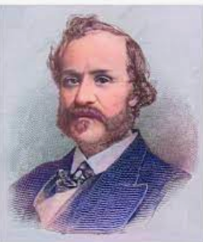
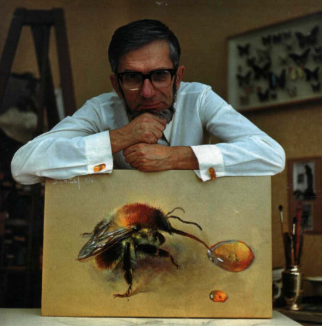

# 野史史人物清单

| 人物                             | 关键词               | 单位 | 简介                         |
| -------------------------------- | -------------------- | ---- | ---------------------------- |
| 1837-1898 基利 Keely             |                      |      |                              |
| 1869-1942 拉霍夫斯基 Lakhovsky   |                      |      |                              |
| 1871-1963 拉塞尔 Russell         |                      |      |                              |
| 1887-1951 爱德华 Edward          |                      |      |                              |
| 1888-1971 莱夫 Rife              |                      |      |                              |
| 1897-1957 赖希 Reich             | orgone               |      |                              |
| 1927 维克多·格雷本尼科夫 Viktor |                      |      |                              |
| 1932 瑟尔 Searl                  | SEG                  |      |                              |
| 1936-2015 纽曼 Newman            |                      |      |                              |
| 1958 凯史 Keshe                  |                      |      |                              |
| 戴维森 Davidson                  | 《形状的力量》       |      |                              |
| 吉姆·汉伯 Jim Humble            | 神奇矿物质溶液-MMS使 |      |                              |
|                                  |                      |      |                              |

## 1837-1898 基利 Keely

约翰·恩斯特·沃雷尔·基利 John Ernst Worrell Keely (September 3, 1837 – November 18, 1898)

## 1869-1942 拉霍夫斯基 Lakhovsky

乔治·拉霍夫斯基（Georges Lakhovsky ，原名乔治·拉霍夫斯基；1869年9月17日至1942年8月31日）是一位俄罗斯-法国工程师、作家、和发明家。

拉霍夫斯基备受争议的医疗发明——多波振荡器，据描述被他用于治疗癌症。主电路基本上由同心环组成，这些同心环形成电偶极子天线，其电容间隙彼此成180°相对（称为拉霍夫斯基天线）。该电路由发电机（通常是火花隙特斯拉线圈或欧丁线圈）提供高压和高频脉冲。如果设置正确，该装置应该会产生低幅度的宽带频谱，覆盖比激励发生器的频率范围大得多的频率范围（从 1 Hz 到 300 GHz）（通常为几百 kHz 到几 MHz）来自特斯拉变压器或来自感应线圈的几千赫兹）。该宽带噪声频谱中每个单独频率的功率都非常低。为了产生更多的谐波和分谐波，在一些设备中在次级侧增加了火花隙，直接安装在天线上，或者与次级线圈并联安装。

作品
The Secret of Life, London: William Heinemann (Medical Books), Ltd., 1939; Modern edition 2007 ISBN 978-142092995-9.

## 1871-1963 拉塞尔 Russell

沃尔特·鲍曼·拉塞尔（Walter Bowman Russell，1871年5月19日－1963年5月19日）是一位美国印象派画家（波士顿画派）、雕塑家、神秘主义者和作家。他的演讲和写作使他坚定地融入新思想运动。罗素撰写了大量有关科学主题的文章，但这些著作“没有被科学家认真对待”。

- 事迹1：在两本书中给出了以太物质模型，是对麦克斯韦“动态电磁场理论”的延伸
- 事迹2：在书中给出了元素周期表原子的以太模型，给出了常见物理学现象的新解释

The Universal One, 1926
The Secret of Light, 1st ed., 1947, 3rd ed., Univ of Science & Philosophy, 1994, ISBN 1-879605-44-9
A New Concept of the Universe, Univ of Science & Philosophy, 1953

## 1887-1951 爱德华 Edward

Edward Leedskalnin (Latvian: Edvards Liedskalniņš) (January 12, 1887 – December 7, 1951)
爱德华·利德斯卡尔宁（拉脱维亚语：Edvards Liedskalniņš）（1887年1月12日－1951年12月7日）是一位移居美国的拉脱维亚移民，自学成才的工程师，他一手建造了佛罗里达州的珊瑚城堡，并被列入国家历史名录。地点于 1984 年。Leedskalnin 也因发展磁力理论而闻名。

- 事迹1：留有实物建筑 爱德华和他的珊瑚宫殿
- 事迹2：写有《磁流》一书，证明磁场是双向粒子流

著作：《磁流》Magnetic Current Ed Leedskalnin Coral Castle.

## 1888-1971 莱夫Rife

罗亚尔·雷蒙德·莱夫（Royal Raymond Rife，1888 年 5 月 16 日 – 1971 年 8 月 5 日）

## 1897-1957 赖希 Reich

威廉·赖希（Wilhelm Reich，1897年3月24日—1957年11月3日），生于奥匈帝国杜布萨乌（现乌克兰），美国心理学家，心理分析家，弗洛伊德主义马克思主义代表人物。

## 1927 维克多·格雷本尼科夫 Viktor

维克多·斯捷潘诺维奇·格雷本尼科夫（Viktor Stepanovich Grebennikov；1927年4月23日生于辛菲罗波尔- 2001年生于新西伯利亚）

俄罗斯 科学家、生物学家、昆虫学家和超自然现象研究者的人，最著名的是他发明了一种通过附着昆虫结构来操作的悬浮平台。昆虫身体部位位于底部。格雷本尼科夫详细描述了他使用悬浮装置飞越俄罗斯乡村的经历。这些飞行经历以及他对其他超自然现象（通常涉及昆虫巢穴或部件）的观察报告出现在他自行出版的书《我的世界》（Moi Mir。新西伯利亚，俄罗斯：Sovetskaya Sibir，1997）中。

Viktor Stepanovich Grebennikov (Russian: Виктор Степанович Гребенников; 23 April 1927 in Simferopol – 2001 in Novosibirsk)

 Russian scientist, biologist, entomologist and paranormal researcher best known for his claim to have invented a levitation platform which operated by attaching dead insect body parts to the underside. Grebennikov wrote detailed accounts of his experiences flying over the Russian countryside using his levitation device. These flying experiences as well as his reported observations of other paranormal phenomena, usually involving insect nests or parts, appear in his self-published book My World (Moi Mir. Novosibirsk, Russia: Sovetskaya Sibir, 1997).

 ## 1932 瑟尔 Searl

约翰·瑟尔 John Searl 　1932年5月2日，约翰·瑟尔 John Roy Robert Searl 出生于英国旺蒂奇(Wantage)的一个贫困的家庭

## 1936-2015 纽曼 Newman

约瑟夫·韦斯特利·纽曼 Joseph Westley Newman (July 2, 1936 – March 6, 2015)

- 事迹1：提出了以太粒子的概念模型，在磁流双向粒子模型基础上，提出以太粒子为光速自旋光速前进的粒子模型
- 事迹2：著书给出了常见物理学现象的以太粒子动力学解释
- 事迹3：提出了一种电磁能源机的制造原理

著作：《纽曼的能源机》

## 1958 凯史 Keshe

M.T.Keshe，中文名迈赫兰·塔瓦科利·凯史，男，1958年出生于伊朗，是一名核物理学家。其父是一位X射线工程师，因而他在少年时期就涉入了辐射与核能领域。17岁时移居欧洲，接受核物理方面的深造。 1981年毕业于伦敦帝国学院（Imperial College London），成为一名核工程师，专攻反应器技术的系统控制。

- 事迹1：微型等离子反应器和相应专利
- 事迹2：在《光的结构》《宇宙的起源》《物质造物的普遍秩序》三本书提出了以太粒子概念模型，给出了常见物理学现象的新解释

## 戴维森 Davidson

达恩·A·戴维森 (Dan A. Davidson)

著作：《形状的力量》Shape Power: Davidson, Dan A.

## 吉姆·汉伯 Jim Humble

吉姆·汉伯 Jim Humble

《神奇矿物质溶液-MMS使用手册》

