# 历史人物清单

本清单记录的人物除了历史著名人物外，有大量一些不广为人知的人物，可能还有些有争议的人物。

| 人物                             | 关键词               | 单位 | 简介            |
| -------------------------------- | -------------------- | ---- | --------------- |
| 1473-1543 哥白尼 Kopernik        | 日心说               |      |                 |
| 1564-1642 伽利略 Galileo         | 加速度、望远镜       |      |                 |
| 1643-1727 牛顿 Newton            | 力学 微积分          | N    |                 |
| 1706-1790 富兰克林 Franklin      | 避雷针               |      |                 |
| 1736-1806 库仑 Coulomb           | 库仑定律             | C    |                 |
| 1745-1827 伏特 Volta             | 伏打电堆             | V    |                 |
| 1775-1836 安培 Ampere            | 安培定则             | A    |                 |
| 1777-1851 奥斯特 Orsted          | 电生磁               |      |                 |
| 1791-1867 法拉第 Faraday         | 电磁感应 电学之父    | F    | [[1791faraday]] |
| 1831-1879 麦克斯韦 Maxwell       | 麦克斯韦方程         |      |                 |
| 1834-1907 门捷列夫               | 元素周期律           |      |                 |
| 1837-1898 基利 Keely             |                      |      |                 |
| 1853-1928 洛伦兹 Lorentz         | 电子论               |      | [[1853lorentz]] |
| 1856-1943 特斯拉 Tesla           | 特斯拉线圈           | T    |                 |
| 1856-1940 汤姆逊 Thomson         | 电子                 |      |                 |
| 1857-1894 赫兹 Hertz             | 电磁波               | Hz   |                 |
| 1858-1947 普朗克 Planck          | 普朗克常量 量子力学  |      | [[1858planck]]  |
| 1869-1942 拉霍夫斯基 Lakhovsky   |                      |      |                 |
| 1871-1963 拉塞尔 Russell         |                      |      |                 |
| 1887-1951 爱德华 Edward          |                      |      |                 |
| 1888-1971 莱夫 Rife              |                      |      |                 |
| 1897-1957 赖希 Reich             | orgone               |      |                 |
| 1927 维克多·格雷本尼科夫 Viktor |                      |      |                 |
| 1927 维克多·格雷本尼科夫 Viktor |                      |      |                 |
| 1932 瑟尔 Searl                  | SEG                  |      |                 |
| 1936-2015 纽曼 Newman            |                      |      |                 |
| 1958 凯史 Keshe                  |                      |      |                 |
| 戴维森 Davidson                  | 《形状的力量》       |      |                 |
| 吉姆·汉伯 Jim Humble            | 神奇矿物质溶液-MMS使 |      |                 |
|                                  |                      |      |                 |

各人物相关文献下载：[One文献](/kb-sci-book/)

## 1473-1543 哥白尼 Kopernik

尼古拉·哥白尼（波兰语：Mikołaj Kopernik，1473年2月19日–1543年5月24日），文艺复兴时期波兰天文学家、数学家、教会法博士、神父。

在哥白尼40岁时，他提出了日心说，改变了人类对自然对自身的看法。当时罗马天主教廷认为他的日心说违反《圣经》，哥白尼仍坚信日心说，并认为日心说与其并无矛盾，并经过长年的观察和计算完成他的伟大著作《天球运行论》。

## 1564-1642 伽利略 Galileo

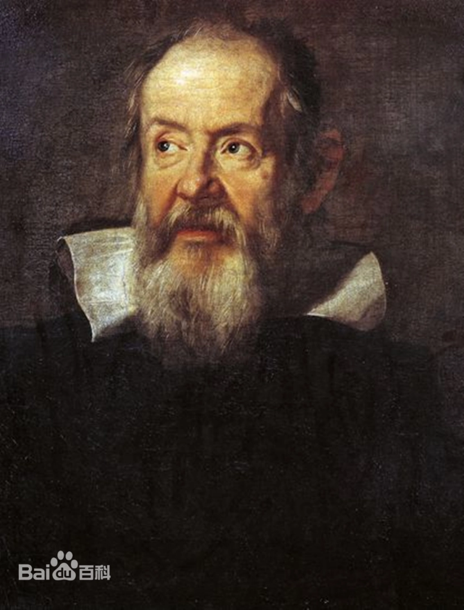

伽利略·伽利雷（1564年2月15日—1642年1月8日）享年77岁，原名（Galileo di Vincenzo Bonaulti de Galilei）

意大利天文学家、物理学家和工程师、欧洲近代自然科学的创始人。伽利略被称为“观测天文学之父”、“现代物理学之父”、“科学方法之父”、“现代科学之父”。

伽利略研究了速度和加速度、重力和自由落体、相对论、惯性、弹丸运动原理，并从事应用科学和技术的研究，描述了摆的性质和“静水平衡”，发明了温度计和各种军事罗盘，并使用用于天体科学观测的望远镜。他对观测天文学的贡献包括使用望远镜对金星相位的确认，发现木星的四颗最大卫星，土星环的观测和黑子的分析。

## 1643-1727 牛顿 Newton

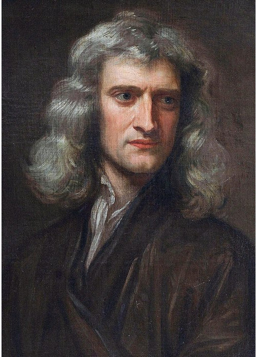

艾萨克·牛顿爵士 PRS MP（英语：Sir Isaac Newton，格里历：1643年1月4日—1727年3月31日）是一位英国辉格党政治家、物理学家、数学家、天文学家、自然哲学家和炼金术士。1687年他发表《自然哲学的数学原理》，阐述了万有引力和三大运动定律，由此奠定现代物理学和天文学，并为现代工程学打下了基础。他通过论证开普勒行星运动定律与他的引力理论间的一致性，展示了地面物体与天体的运动都遵循着相同的自然定律；为太阳中心学说提供了强而有力的理论支持，是科学革命的一大代表。

## 1706-1790 富兰克林 Franklin

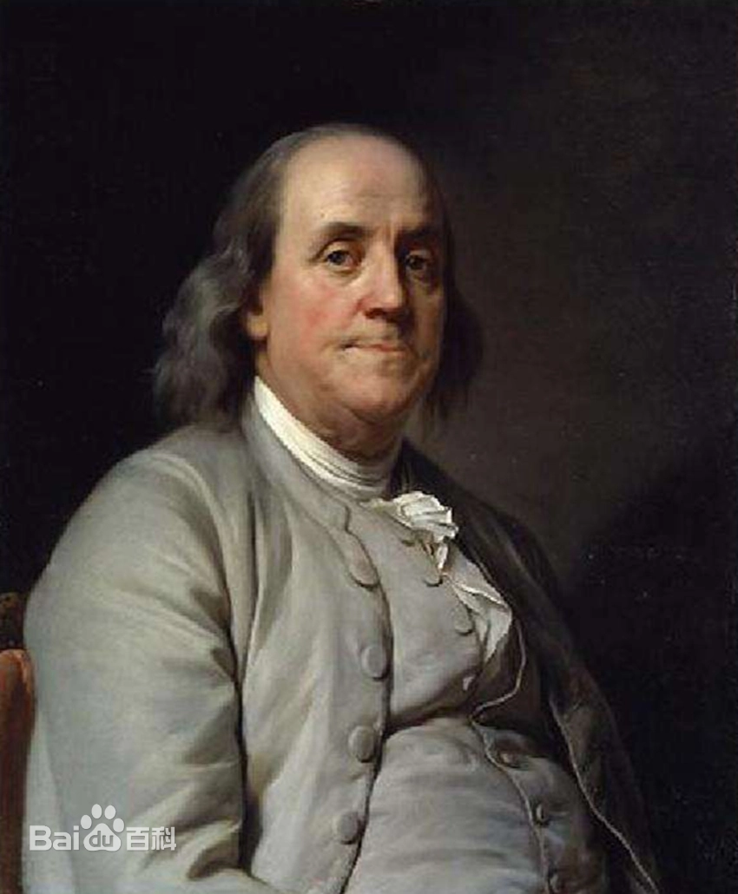

本杰明·富兰克林（英语：Benjamin Franklin，1706年1月17日－1790年4月17日），美国政治家、科学家、印刷商和出版商、作家、发明家，以及外交官，美国开国元勋之一。

富兰克林第一个发现了金属尖端放电现象。他又经过各种试验，在1747年末得出结论：电不是摩擦产生的，而是通过摩擦集中起来的。它是物质中的一个元素，有正(+)有负(-)，从而创造了(+)(-)概念。他否定了法国科学家提出的二流体理论，即电有玻璃电、琥珀电。

1752年6月，富兰克林进行了一项著名的费城电风筝实验（详见“轶事典故”目录），并由此发明了避雷针。消息不久传到英国。英国人立即采用这一发明成果，并于1752年年底发表了他的论文。在未征得富兰克林的同意下，英国皇家学会为表扬富兰克林对电的研究，在1753年选他为院士。

## 1736-1806 库仑 Coulomb

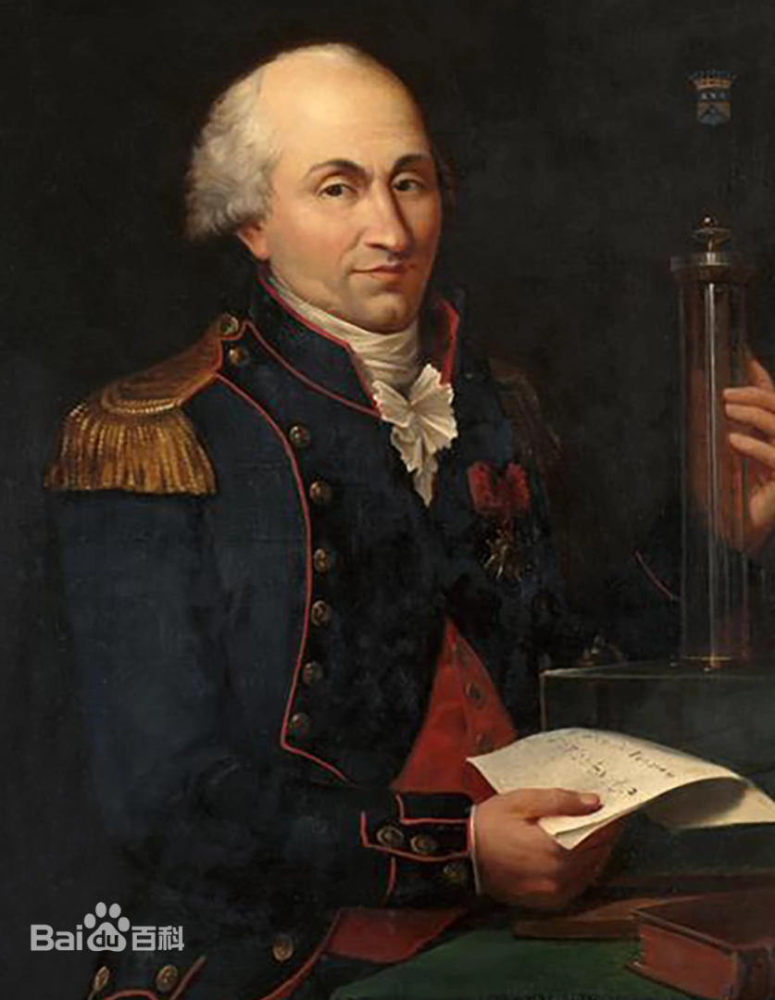

查利·奥古斯丁·库仑（Charles-Augustin de Coulomb，1736年6月14日---1806年8月23日）法国工程师、物理学家。1736年6月14日生于法国昂古莱姆。1806年8月23日在巴黎逝世。主要贡献有扭秤实验、库仑定律、库伦土压力理论等。同时也被称为“土力学之始祖”

库仑终于找出了在真空中两个点电荷之间的相互作用力与两点电荷所带的电量及它们之间的距离的定量关系，这就是静电学中的库仑定律，即两电荷间的力与两电荷的乘积成正比，与两者的距离平方成反比。

库仑定律是电学发展史上的第一个定量规律，它使电学的研究从定性进入定量阶段，是电学史中的一块重要的里程碑。电荷的单位库仑就是以他的姓氏命名的。

## 1745-1827 伏特 Volta

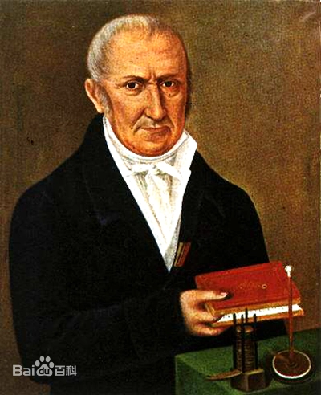

亚历山德罗·朱塞佩·安东尼奥·安纳塔西欧·伏特（Count Alessandro Giuseppe Antonio Anastasio Volta，1745年2月18日－1827年3月5日）

意大利物理学家。因在1800年发明伏打电堆而著名。后受封为伯爵。

## 1775-1836 安培 Ampere

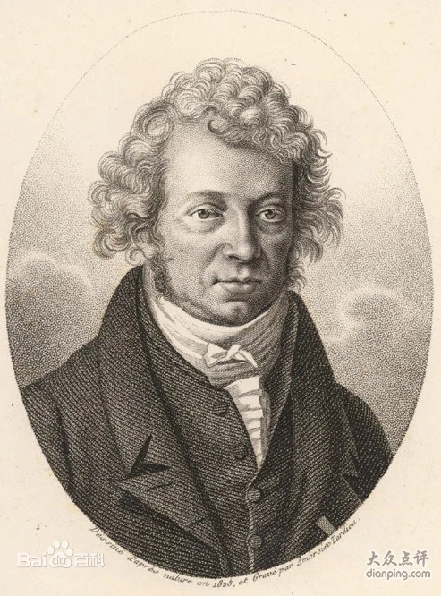

安德烈·玛丽·安培（André-Marie Ampère，1775年1月20日--1836年6月10日）

安培最主要的成就是1820～1827年对电磁作用的研究，他被麦克斯韦誉为“电学中的牛顿”。在电磁作用方面的研究成就卓著。电流的国际单位安培即以其姓氏命名。

安培定则是表示电流和电流激发磁场的磁感线方向间关系的定则，也叫右手螺旋定则。

1. 直线电流的安培定则用右手握住导线，让伸直的大拇指所指的方向跟电流的方向一致，那么弯曲的四指所指的方向就是磁感线的环绕方向。
2. 环形电流的安培定则让右手弯曲的四指和环形电流的方向一致，那么伸直的大拇指所指的方向就是环形电流中心轴线上磁感线的方向。

直线电流的安培定则对一小段直线电流也适用。环形电流可看成许多小段直线电流组成，对每一小段直线电流用直线电流的安培定则判定出环形电流中心轴线上磁感强度的方向。叠加起来就得到环形电流中心轴线上磁感线的方向。直线电流的安培定则是基本的，环形电流的安培定则可由直线电流的安培定则导出，直线电流的安培定则对电荷作直线运动产生的磁场也适用，这时电流方向与正电荷运动方向相同，与负电荷运动方向相反。

## 1777-1851 奥斯特 Orsted

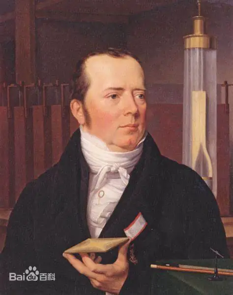

汉斯·克海斯提安·奥斯特（丹麦语：Hans Christian Ørsted，1777年8月14日－1851年3月9日），丹麦物理学家、化学家和文学家。在物理学领域，他首先发现载流导线的电流会产生作用力于磁针，使磁针改变方向。在化学领域，他发现了铝元素。

## 1791-1867 法拉第 Faraday

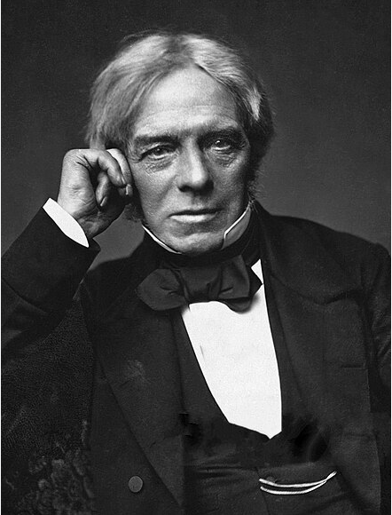

迈克尔·法拉第（英语：Michael Faraday，1791年9月22日—1867年8月25日）

迈克尔·法拉第是英国著名化学家汉弗里·戴维的学生和助手，他的发现奠定了电磁学的基础，是詹姆斯·克拉克·麦克斯韦的先导。1831年10月17日，法拉第首次发现电磁感应现象，并进而得到产生交流电的方法。1831年10月28日法拉第发明了圆盘发电机，是人类创造出的第一个发电机。

由于他在电磁学方面做出了伟大贡献，被称为“电学之父”和“交流电之父”。

[[1791faraday]]

## 1831-1879 麦克斯韦 Maxwell

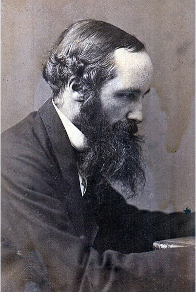

詹姆斯·克拉克·麦克斯韦 FRS FRSE（英语：James Clerk Maxwell；1831年6月13日—1879年11月5日）

- 事迹1：总结前人特别是法拉第的研究成果，用数学方式建模了电磁模型
- 事迹2：用数学方法证明以太模型和超距场模型数学结果一致，给出了基于以太的“动态电磁场理论”
- 事迹3：预测电磁波的存在

《动态电磁场理论》《电磁通论》

## 1834-1907 门捷列夫

 

 德米特里·伊万诺维奇·门捷列夫（俄语：Дмитрий Иванович Менделеев，1834年2月7日---1907年2月2日）

 俄国科学家，发现并归纳元素周期律，依照原子量，制作出世界上第一张元素周期表，并据以预见了一些尚未发现的元素。

## 1837-1898 基利 Keely

约翰·恩斯特·沃雷尔·基利 John Ernst Worrell Keely (September 3, 1837 – November 18, 1898)

## 1853-1928 洛伦兹 Lorentz

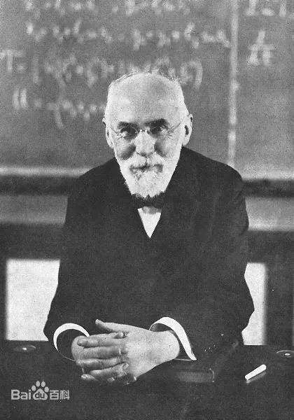

亨德里克·安东·洛伦兹（Hendrik Antoon Lorentz，1853年7月18日-1928年2月4日）

荷兰理论物理学家、1902年诺贝尔奖物理学奖获得者、数学家、经典电子论的创立者。

洛伦兹认为一切物质分子都含有电子，阴极射线的粒子就是电子。把以太与物质的相互作用归结为以太与电子的相互作用。这一理论成功地解释了塞曼效应，因此与塞曼一起获1902年诺贝尔物理学奖。

[[1853lorentz]]

## 1856-1943 特斯拉 Tesla

尼古拉·特斯拉（英语：Nikola Tesla；1856年7月10日—1943年1月7日）

## 1856-1940 汤姆逊 Thomson

约瑟夫·约翰·汤姆逊（Joseph John Thomson，1856年12月18日--1940年8月30日）

英国物理学家，电子的发现者，诺贝尔物理学奖获得者，第三任卡文迪许实验室主任，前英国皇家学会会长。

1897年在真空管阴极射线实验中证明了电子的存在。除了在物理研究中的贡献，汤姆逊还是一位杰出的教师，培养了7位诺贝尔奖得奖者。

[[1856thomson]]

## 1857-1894 赫兹 Hertz

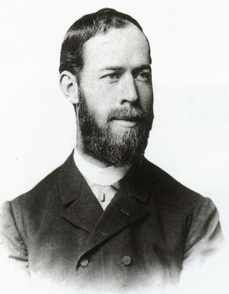

 海因里希·鲁道夫·赫兹（Heinrich Rudolf Hertz，1857年2月22日－1894年1月1日）

 海因里希・鲁道夫・赫兹（1857年~1894年），德国物理学家，于1887年首先用实验证实了电磁波的存在，并于1888年发表了论文。他对电磁学有很大的贡献，故频率的国际单位制单位赫兹以他的名字命名。

 赫兹用实验证明电磁波是存在的，且电磁波的传播速度相当于光速，赫兹实验为无线电、雷达和电视等无线电电子技术的发展开拓了创新途径。他对紫外光对火花放电的影响进行了研究，并从中发现了光电效应，认为在光的照射下物体能够释放电子，这个发现成为爱因斯坦建立光量子理论的基础。

## 1858-1947 普朗克 Planck

 

马克斯·普朗克（全名：马克斯·卡尔·恩斯特·路德维希·普朗克，Max Karl Ernst Ludwig Planck，1858年4月23日---1947年10月4日）

德国物理学家、量子力学重要创始人之一，普鲁士科学院院士，美国艺术与科学院院士，美国国家科学院外籍院士，1918年诺贝尔物理学奖获得者

[[1858planck][1858planck]]

## 1869-1942 拉霍夫斯基 Lakhovsky

乔治·拉霍夫斯基（Georges Lakhovsky ，原名乔治·拉霍夫斯基；1869年9月17日至1942年8月31日）是一位俄罗斯-法国工程师、作家、和发明家。

拉霍夫斯基备受争议的医疗发明——多波振荡器，据描述被他用于治疗癌症。主电路基本上由同心环组成，这些同心环形成电偶极子天线，其电容间隙彼此成180°相对（称为拉霍夫斯基天线）。该电路由发电机（通常是火花隙特斯拉线圈或欧丁线圈）提供高压和高频脉冲。如果设置正确，该装置应该会产生低幅度的宽带频谱，覆盖比激励发生器的频率范围大得多的频率范围（从 1 Hz 到 300 GHz）（通常为几百 kHz 到几 MHz）来自特斯拉变压器或来自感应线圈的几千赫兹）。该宽带噪声频谱中每个单独频率的功率都非常低。为了产生更多的谐波和分谐波，在一些设备中在次级侧增加了火花隙，直接安装在天线上，或者与次级线圈并联安装。

作品
The Secret of Life, London: William Heinemann (Medical Books), Ltd., 1939; Modern edition 2007 ISBN 978-142092995-9.

## 1871-1937 卢瑟福 Rutherford

欧内斯特·卢瑟福（Ernest Rutherford，1871年8月30日---1937年10月19日）

物理学家，纳尔逊男爵，英国皇家学会院士，诺贝尔化学奖获得者，生前是卡文迪许实验室主任。

欧内斯特·卢瑟福主要从事核科学和放射性方面的研究。

## 1871-1963 拉塞尔 Russell

沃尔特·鲍曼·拉塞尔（Walter Bowman Russell，1871年5月19日－1963年5月19日）是一位美国印象派画家（波士顿画派）、雕塑家、神秘主义者和作家。他的演讲和写作使他坚定地融入新思想运动。罗素撰写了大量有关科学主题的文章，但这些著作“没有被科学家认真对待”。

- 事迹1：在两本书中给出了以太物质模型，是对麦克斯韦“动态电磁场理论”的延伸
- 事迹2：在书中给出了元素周期表原子的以太模型，给出了常见物理学现象的新解释

The Universal One, 1926
The Secret of Light, 1st ed., 1947, 3rd ed., Univ of Science & Philosophy, 1994, ISBN 1-879605-44-9
A New Concept of the Universe, Univ of Science & Philosophy, 1953

## 1887-1951 爱德华 Edward

Edward Leedskalnin (Latvian: Edvards Liedskalniņš) (January 12, 1887 – December 7, 1951)
爱德华·利德斯卡尔宁（拉脱维亚语：Edvards Liedskalniņš）（1887年1月12日－1951年12月7日）是一位移居美国的拉脱维亚移民，自学成才的工程师，他一手建造了佛罗里达州的珊瑚城堡，并被列入国家历史名录。地点于 1984 年。Leedskalnin 也因发展磁力理论而闻名。

- 事迹1：留有实物建筑 爱德华和他的珊瑚宫殿
- 事迹2：写有《磁流》一书，证明磁场是双向粒子流

著作：《磁流》Magnetic Current Ed Leedskalnin Coral Castle.

## 1888-1971 莱夫Rife

罗亚尔·雷蒙德·莱夫（Royal Raymond Rife，1888 年 5 月 16 日 – 1971 年 8 月 5 日）

## 1897-1957 赖希 Reich

威廉·赖希（Wilhelm Reich，1897年3月24日—1957年11月3日），生于奥匈帝国杜布萨乌（现乌克兰），美国心理学家，心理分析家，弗洛伊德主义马克思主义代表人物。

## 1927 维克多·格雷本尼科夫 Viktor

维克多·斯捷潘诺维奇·格雷本尼科夫（Viktor Stepanovich Grebennikov；1927年4月23日生于辛菲罗波尔- 2001年生于新西伯利亚）

俄罗斯 科学家、生物学家、昆虫学家和超自然现象研究者的人，最著名的是他发明了一种通过附着昆虫结构来操作的悬浮平台。昆虫身体部位位于底部。格雷本尼科夫详细描述了他使用悬浮装置飞越俄罗斯乡村的经历。这些飞行经历以及他对其他超自然现象（通常涉及昆虫巢穴或部件）的观察报告出现在他自行出版的书《我的世界》（Moi Mir。新西伯利亚，俄罗斯：Sovetskaya Sibir，1997）中。

Viktor Stepanovich Grebennikov (Russian: Виктор Степанович Гребенников; 23 April 1927 in Simferopol – 2001 in Novosibirsk)

 Russian scientist, biologist, entomologist and paranormal researcher best known for his claim to have invented a levitation platform which operated by attaching dead insect body parts to the underside. Grebennikov wrote detailed accounts of his experiences flying over the Russian countryside using his levitation device. These flying experiences as well as his reported observations of other paranormal phenomena, usually involving insect nests or parts, appear in his self-published book My World (Moi Mir. Novosibirsk, Russia: Sovetskaya Sibir, 1997).

## 1932 瑟尔 Searl

约翰·瑟尔 John Searl 　1932年5月2日，约翰·瑟尔 John Roy Robert Searl 出生于英国旺蒂奇(Wantage)的一个贫困的家庭

## 1936-2015 纽曼 Newman

约瑟夫·韦斯特利·纽曼 Joseph Westley Newman (July 2, 1936 – March 6, 2015)

- 事迹1：提出了以太粒子的概念模型，在磁流双向粒子模型基础上，提出以太粒子为光速自旋光速前进的粒子模型
- 事迹2：著书给出了常见物理学现象的以太粒子动力学解释
- 事迹3：提出了一种电磁能源机的制造原理

著作：《纽曼的能源机》

## 1958 凯史 Keshe

M.T.Keshe，中文名迈赫兰·塔瓦科利·凯史，男，1958年出生于伊朗，是一名核物理学家。其父是一位X射线工程师，因而他在少年时期就涉入了辐射与核能领域。17岁时移居欧洲，接受核物理方面的深造。 1981年毕业于伦敦帝国学院（Imperial College London），成为一名核工程师，专攻反应器技术的系统控制。

- 事迹1：微型等离子反应器和相应专利
- 事迹2：在《光的结构》《宇宙的起源》《物质造物的普遍秩序》三本书提出了以太粒子概念模型，给出了常见物理学现象的新解释

## 戴维森 Davidson

达恩·A·戴维森 (Dan A. Davidson)

著作：《形状的力量》Shape Power: Davidson, Dan A.

## 吉姆·汉伯 Jim Humble

吉姆·汉伯 Jim Humble

《神奇矿物质溶液-MMS使用手册》

- 

[//begin]: # "Autogenerated link references for markdown compatibility"
[1791faraday]: 1791faraday.md "1791-1867 法拉第 Faraday"
[1853lorentz]: 1853lorentz.md "1853-1928 洛伦兹 Lorentz"
[1858planck]: 1858planck.md "1858-1947 普朗克 Planck"
[1856thomson]: 1856thomson.md "1856-1940 汤姆逊 Thomson"
[//end]: # "Autogenerated link references"