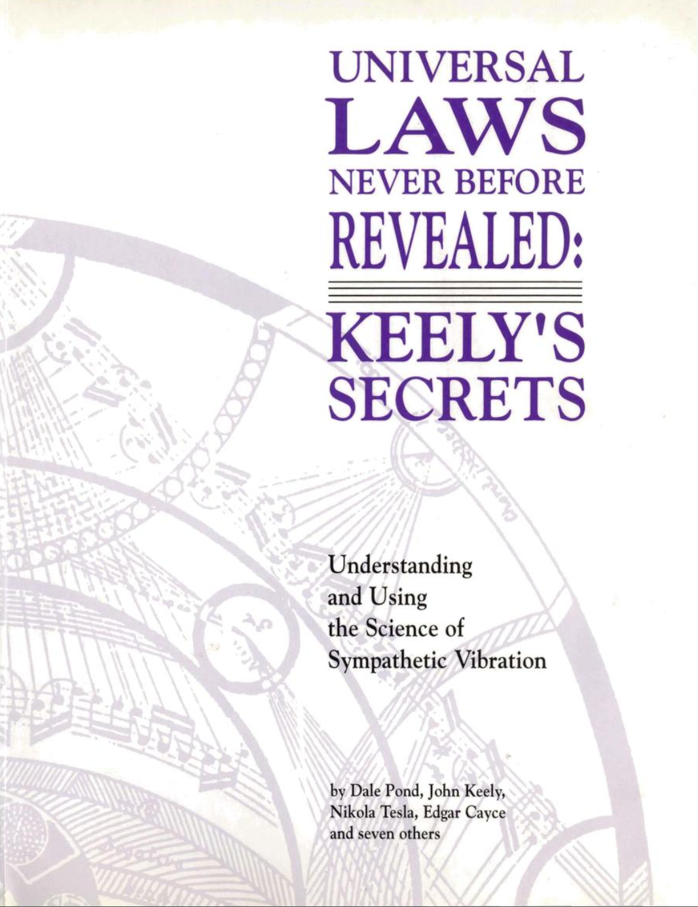

# 从未揭示的宇宙法则：基利的秘密

人物介绍：
- John Ernst Worrell Keely 约翰·恩斯特·沃雷尔·基利著
- Clara Bloomfield Moore 克拉拉·布鲁姆菲尔德·摩尔：一个有钱的寡妇，在Keely要破产时帮助他渡过难关，后来Keely的手稿落入她的手中
- Dale Pond 戴尔·庞德: 一个研究Keely技术十几年的研究人员，复制了Keely的设备

- 1000 Illustrations List
- 插图列表
- 1001 Disintegration of Stone (by R. Harte)
- 石头的解体（R.Harte著）
- 1002 Etheric Force Identified as Dynaspheric Force (by Mrs. Clara Jessup Bloomfield-Moore)
- 以太力被证实为动态球形力
- 1003 One Phase of Keely's Discovery in its Relations to the Cure of Disease (by Mrs. Clara Jessup Bloomfield-Moore)
- Keely发现与疾病治疗关系的一个阶段
- 1004 On Dynaspheric Force (by Laurence Oliphant)
- 动态球形力
- 1005 What is Matter and What is Force?
- 什么是物质，什么是力？
- 1006 The Astral Light (by Louise A. Off)
- 意识之光
- 1007 Mr. Plum's visit to Keely's Laboratory (from Dashed Against the Rock)
- 普鲁姆先生参观基利实验室（摘自《撞向岩石）
- 1008 Pyramids, Telescopes and Light (by John Keely, from Dashed Against the Rock)
- 金字塔、望远镜和光（约翰·基利著，《撞向岩石》）
- 1009 Levitation (by John Keely, from Dashed Against the Rock)
- 悬浮（约翰·基利著，《撞向岩石》）
- 1010 Amplitude of Force (by John Keely, from Dashed Against the Rock)
- 力的振幅（约翰·基利著，《撞向岩石》）
- 1011 The Chord Settings of Life (by John Keely, from Dashed Against the Rock)
- 生命的合唱背景（约翰·基利著，《撞向岩石》）
- 1012 The Dynamics of Mind (by Henry Wood)
- 心灵的动力（亨利·伍德著）
- 1013 The Neutral Center (by John Ernst Worrell Keely)
- 中立中心（约翰·恩斯特·沃雷尔·基利著）
- 1014 Theory and Formula of Aqueous Disintegration (by John Keely)
- 水分解理论与公式（约翰·基利著）[[4book-ks-1014]]
- 1015 Keely's Motor Secret Revealed at Long Last (By Dale Pond)
- Keely的汽车秘密终于揭晓（戴尔·庞德）
- 1016 Sympathetic Vibratory Physics (by Dale Pond)
- 交感振动物理学（戴尔·庞德著）
- 1017 Keely's Definitions of His Own Terms (by John Keely)
- 基利对自己术语的定义（约翰·基利著）
- 1018 The Basis of a New Science (by John Keely)
- 新科学的基础（约翰·基利著）
- 1019 Law of Matter and Force
- 物质与力定律
- 1020 Law of Corporeal Vibrations
- 物质振动定律
- 1021 Law of Corporeal Oscillations
- 物质振荡定律
- 1022 Law of Harmonic Vibrations
- 谐波振动定律
- 1023 Law of Transmissive Vibraic Energy
- 振动能量传递定律
- 1024 Law of Sympathetic Oscillation
- 交感振荡定律
- 1025 Law of Attraction
- 吸引力定律
- 1026 Law of Repulsion
- 排斥定律
- 1027 Law of Cycles
- 循环定律
- 1028 Latent Force in Interstitial Spaces (by John Keely)
- 间隙中的势能（约翰·基利著）
- 1029 The Role of Atomic Forces in Healing (by John Keely)
- 原子力在治疗中的作用（约翰·基利著）
- 1030 Law of Harmonic Pitch
- 谐波间距定律
- 1031 Law of Force
- 力的定律
- 1032 Law of Oscillating Atomic Substances
- 原子物质振荡定律
- 1033 Law of Sono-thermity
- 声热定律
- 1034 Law of Oscillating Atoms
- 原子振荡定律
- 1035 Law of Vibrating Atomolic Substances
- 原子物质振动定律
- 1036 Gravity Quotes (by Dale Pond)
- 重力说明
- 1037 Polarity of Science (by Dale Pond)
- 科学的极性
- 1038 Law of Oscillating Atomoles
- 原子振荡定律
- 1039 What is Gravity?
- 重力是什么？
- 1040 Law of Transformation of Forces
- 力的转换规律
- 1041 Law of Atomic Pitch
- 原子间距定律
- 1042 Law of Variation of Atomic Pitch by Rad-energy
- 原子间距随辐射能的变化规律
- 1043 Law of Variation of Atomic Pitch by Electricity and Magnetism
- 原子间距的电磁变化规律
- 1044 Law of Variation of Atomic Pitch by Temperature
- 原子间距随温度的变化规律
- 1045 Law of Pitch of Atomic Oscillation
- 原子振荡间距定律
- 1046 Mathematical Demonstration of the Size of an Atom, Weight, Volume  (By John Keely)
- 原子大小、重量、体积的数学证明（约翰·基利）
- 1047 Law of Variation of Pitch of Atomic Oscillation by Pressure 
- 原子振荡节距随压力的变化规律
- 1048 Law of Variation of Atomic Oscillation by Temperature 
- 原子振荡随温度变化的规律
- 1049 Law of Variation of Atomic Oscillation by Electricity
- 原子电振荡的变化规律
- 1050 Keely's Discoveries Vindicated? (by Dale Pond)
- 基利的发现得到了辩护？（戴尔·庞德）
- 1051 Law of Variation of Atomic Oscillation by Sono-thermism
- 声热作用下原子振荡的变化规律
- 1052 Law of Chemical Affinity
- 化学亲和定律
- 1053 Law of Chemical Dissociation
- 化学离解定律
- 1054 Law of Chemical Transposition
- 化学换位定律
- 1055 Law of Chemical Substitution
- 化学替代定律
- 1056 Law of Catalysis
- 催化定律
- 1057 Law of Molecular Synthesis and Combination
- 分子合成与组合定律
- 1058 Relativity of Circles and Triangles (by Dale Pond)
- 圆与三角形的相对性（戴尔·庞德著）
- 1059 Neutral Center Defined (by Dale Pond)
- 中性点定义（Dale Pond）
- 1060 Law of Chemical Morphology
- 化学形态定律
- 1061 Keely's Chords and Synthesized Wave Forms (by Dale Pond)
- 基利的合唱与合成波形（戴尔·庞德著）
- 1062 Mr. Keely's New Philosophy (by Clara Jessup Bloomfield-Moore)
- 基利先生的新哲学
- 1063 Man's Greatest Achievement (by Nikola Tesla)
- 人类最伟大的成就（尼古拉·特斯拉著）
- 1064 Law of Atomic Dissociation
- 原子离解定律
- 1065 Law of Atomolic Synthesis of Chemical Elements 
- 化学元素原子合成定律
- 1066 Mastery of Self is Mastery of Science (by Dale Pond)
- 掌握自我就是掌握科学（戴尔·庞德）
- 1067 Dangers of Ultrasonic Energy (by Dale Pond)
- 超声波能量的危险（戴尔·庞德著）
- 1068 Law of Heat
- 热定律
- 1069 Law of Electro-Chemical Equivalents
- 电化学当量定律
- 1070 Law of Cohesion
- 内聚定律
- 1071 Law of Refractive Indices
- 折射率定律
- 1072 Law of Electric Conductivity
- 电导率定律
- 1073 Music: A Vibration Analysis Shortcut (by Dale Pond)
- 音乐：振动分析快捷方式（戴尔·庞德著）
- 1074 Scale of Forces in Octaves (by John Keely)
- 八度音阶（约翰·基利著）
- 1075 Induction, Sympathy & Resonance (by Dale Pond)
- 感应、交感与共鸣（戴尔·庞德著）
- 1076 Gravity (by Edgar Cayce & John Keely)
- 重力（Edgar Cayce和John Keely著）
- 1077 Music of the Molecule (by Dale Pond)
- 分子的音乐（戴尔·庞德著）
- 1078 Much Ado About Nothing (by Dale Pond)
- 无事生非（戴尔·庞德著）
- 1079 Music-The Realm of Activity (by Dale Pond)
- 音乐活动的境界（戴尔·庞德著）
- 1080 Vibration vs Oscillation (by Dale Pond)
- 振动与振荡（Dale Pond著）
- 1081 The Neutral Force (by Dale Pond)
- 中立力量（戴尔·庞德著）
- 1082 Polarity (by Dale Pond)
- 极性（Dale Pond著）
- 1083 Clara Jessup Bloomfield-Moore (by Dale Pond)
- 克拉拉·布鲁姆菲尔德·摩尔 
- 1084 Keely's Trexar-A Superconductive Wire (by Dale Pond)
- Keely’s Trexar-A超导电线（戴尔·庞德）
- 1085 Musical Intervals (by Dale Pond)
- 音乐间隔（戴尔·庞德）
- 1086 John Keely-A Personal Interview (by Dr. Hall, Scientific Arena)
- 约翰·基利个人专访（霍尔博士，科学竞技场）
- 1087 A Second Visit to Mr. Keely (by Dr. Hall, Scientific Arena)
- 第二次拜访基利先生（霍尔博士，科学竞技场）
- 1088 Mr. Keely's Researches - Sound Shown to be a Substantial Force (by Henry B. Hudson)
- 基利先生的研究——声音被证明是一股强大的力量（亨利B.哈德逊著）
- 1089 The Keely Motor Illustrated (by Henry B. Hudson)
- Keely发电机展示（亨利B.哈德逊）
- 1090 Deciphering Keely's Harmonic & Inharmonic Chords (by Dale Pond)
- 解读基利的和声与非和声合唱（戴尔·庞德著）
- 1091 Keely's Triple Chords (by Dale Pond)
- 基利的三和弦（戴尔·庞德著）
- 1092 Keely's Acoustic Theoretical Charts (by John Keely)
- 基利的声学理论图表（约翰·基利著）

[//begin]: # "Autogenerated link references for markdown compatibility"
[4book-ks-1014]: 4book-ks-1014.md "1014 水分解理论与公式"
[//end]: # "Autogenerated link references"