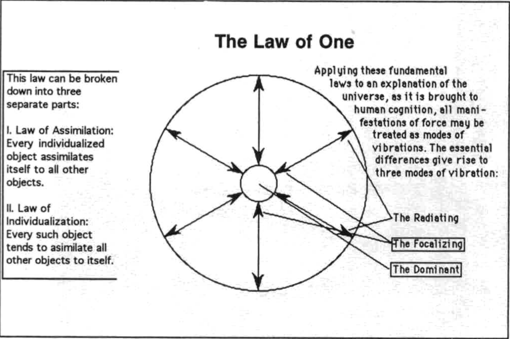

# 基利对自己术语的定义

Keely's Definitions of His Own Terms (by John Keely)

ATOMOLES are elementary units of matter uniform in size and weight, and exist in solid, liquid, gaseous, and isolated forms.

原⼦ 是⼤⼩和重量均⼀的物质基本单位，以固体、液体、⽓体和孤⽴的形式存在。

ATOMS are multiple combinations of atomoles, and they also exist in solid, liquid, gaseous, and isolated forms.

原⼦ 是原⼦分⼦的多种组合，它们也以固体、液体、⽓体和孤⽴的形式存在。

SIMPLE MOLECULES are formed by the union of two atoms of the same kind.

简单分⼦ 是由两个同类原⼦结合⽽成。

COMPOUND MOLECULES are unions of two atoms of dissimilar kind.

化合物分⼦ 是两个不同种类原⼦的结合。

COMPLEX MOLECULES are unions of molecules with other molecules or atoms.

复杂分⼦ 是分⼦与其他分⼦或原⼦的结合。

PITCH is the relative frequency of vibration.

⾳⾼ 是振动的相对频率。

VIBRATION is the rhythmical motion of a body within itself.

振动 是物体内部有节奏的运动。

OSCILLATION is a rhythmically recurring translatory movement. 

振荡 是⼀种有节奏地重复出现的平移运动。

TRANSMISSIVE ENERGY is rhythmical motion of condensation and rarefaction produced by the vibrating or oscillating body in the medium in which it is immersed.

传输能量 是由振动或振荡物体在其所浸⼊的介质中产⽣的凝聚和稀疏的有节奏的运动。

ATTRACTION is the mutual approach of aggregates caused by concentrated waves of harmonic energy, tending to move in line of least resistance, by becoming the center of one series of concentric waves instead of two or more series.

吸引⼒ 是由谐波能量的集中波引起的聚集体的相互接近，倾向于沿着阻⼒最⼩的线移动，成为⼀系列同⼼波⽽不是两个或更多系列的中⼼。

HARMONY is the simultaneous vibration of two or more bodies whose harmonics do not produce discords, and whose fundamental pitches are harmonics of the lowest pitch, or are a unison with the resultant notes or overtones, or undertones, of any two or more of them.

和声 是两个或多个物体的同时振动，其和声不会产⽣不和谐⾳，其基本⾳⾼是最低⾳⾼的和声，或者与其中任何两个或多个的合成⾳符或泛⾳或低⾳
⼀致。

ETHER is an atomolic liquid 986,000 times the density of steel.

以太 是⼀种原⼦液体，密度是钢的 986,000 倍。

ELECTRICITY is the oscillation of the atomoles of an atom.

电 是原⼦的原⼦分⼦的振荡。

INDUCTION is the transmissive force of the electric vibration in ether.

电感 是以太中电振动的传递⼒。

MAGNETISM is the mutual attraction of juxtaposed bodies vibrating at unison or harmonic electric pitches.

磁⼒ 是并列物体以⼀致或谐波电⾳调振动的相互吸引⼒。

GRAVITY is the mutual attraction of atomoles.

重⼒是原⼦之间的相互吸引⼒。

GRAVISM is the transmissive form through a medium of atomoles in the fourth state, or a medium composed of atomolini.

引⼒ 是通过第四态原⼦分子介质或由原⼦组成的介质的传输形式。

ATOMOLINI are ultimate units of atomoles, and when in a liquid state are the media for the transmission of gravism. The illimitable divisibility and aggregation of matter is a logical sequence.

ATOMOLINI 是原⼦分⼦的终极单位，处于液态时是重⼒传输的媒介。物质的⽆限可分性和聚合性是⼀个逻辑顺序。

The Law of One 

太极之道

This law can be broken down into three separate parts:
I. Law of Assimilation: Every individualized object assimilates itself to all other objects.
II. Law of Individualization: Every such object tends to asimilate all other objects to itself.

该法则可分为三个独立部分：
一、同化定律：每一个个体化的物体都会将自己同化为所有其他物体。
二、个体化规律：每一个这样的对象都倾向于将所有其他对象同化为自己。

Applying these fundamental laws to an explanation of the universe, as it is brought to human cognition, all manifestations of force may be treated as modes of vibrations. The essential differences give rise to three modes of vibration:
- The Radiating
- The Focalizing
- The Dominant

将这些基本定律应用于宇宙的解释，当它被带到人类的认知中时，力的所有表现都可以被视为振动模式。本质上的差异导致了三种振动模式：
- 辐射
- 聚焦
- 支配者
