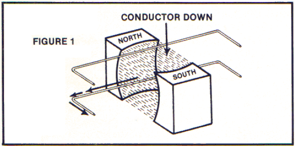
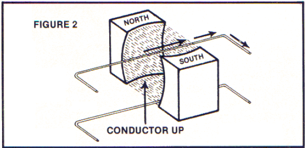
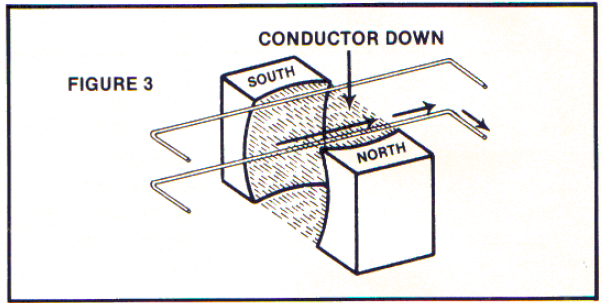
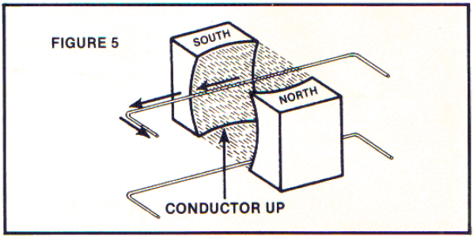

# 旋涡运动

Chapter 2 GYROSCOPIC ACTIONS

"The way in which Faraday made use of his lines of force in coordinating the phenomena of electric induction shows him to have been a mathematician of high order, and one from whom the mathematicians of the future may derive valuable and fertile methods."

-James Clerk Maxwell

法拉第用力线表示电感应现象展示了他已经是一个有很高水平的数学家，未来的数学家可能从他的方法中得到宝贵和丰富的方法。

-麦克斯韦

I will begin with the scientific facts concerning my initial reading in March, 1965 on the nature of Michael Faraday's Generator.

我将从我在1965年3月开始读的迈克尔-法拉第的发电机中的科学事实开始。

Anyone who cannot recognize the veracity of certain conclusions that I understood when I initially studied Faraday's facts has been unjustly influenced by the teaching process which rewards one for memorization and discourages questioning of the subject matter taught.

所有人都没有认识到某些结论的真像，当我开始学习法拉第的研究时我已经明白了，这些事实被不鼓励质疑鼓励死记硬背的教学过程不公正的影响了。

As you read the following list of experimental facts concerning Faraday's generator, you will retrace the steps of my initial readings during March 1965. With open eyes and an open mind, question for yourself what would happen under the conditions described below.*

当你读下面的关于法拉第的发电机实验事实时，你将追溯我在1965年的步伐。打开双眼打开思想，问你自己在下面描述的情况下会发生什么。

1.Push a conductor wire down and through a magnetic field at right angles to the lines of force and the electric current will flow to the left as drawn.

1.向下移动导线垂直于磁力线穿过一个磁场区域，电流会向左流。

2.Push a conductor up and through a magnetic field at right angles to the lines of force and the electric current flows to the right as drawn (opposite to Figure 1 above).

2.向上移动导线垂直于磁力线穿过一个磁场区域，电流会向右流（和图1相反）。

3.Flip over the magnet 1800 and the direction of the electric current flow will be reversed from that of Figures 1 and 2 above, although the direction and motion of the conductor remain the same (compare Figure 3 to Figure 1 and observe opposite results).

3.将磁体对调 $180^0$ 电流方向将和图1图2中的方向相反，虽然导线移动方向一样（图3和图1相比，观察相反的结果）。

4.Push the conductor "down" or "up" in a motion parallel to, and through the magnetic lines of force: no electric current will flow despite a vigorous or energetic pushing effort.

4.平行于磁力线上下移动导线：没有电流产生，不论用多大的力。

5.However, although the conductor can be very slowly pushed at right angles to the magnetic lines of force, the resulting electric current will move at the speed of light.

5.然而，虽然导线垂直于磁力线非常缓慢移动，电流将以光速运动。
