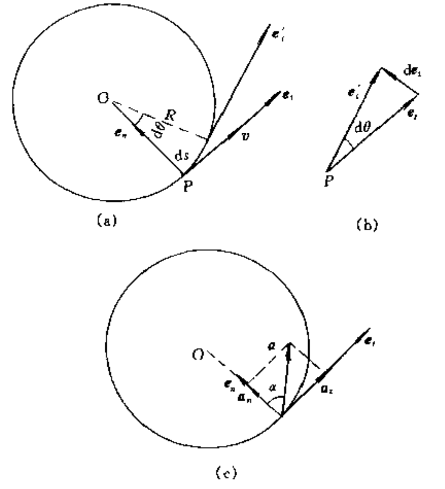
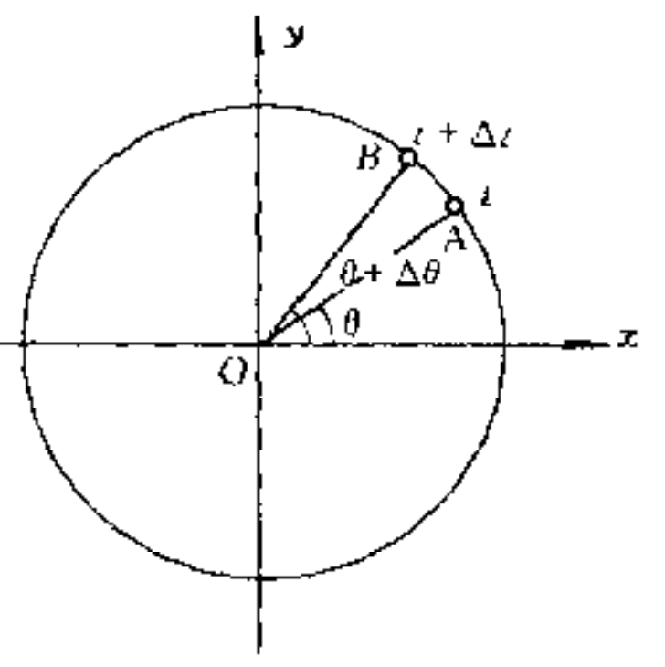
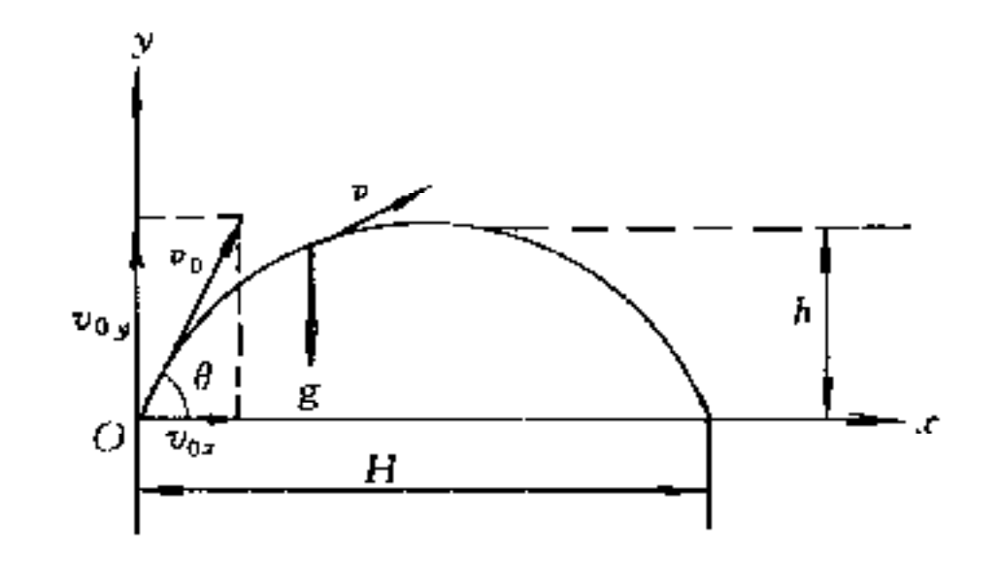
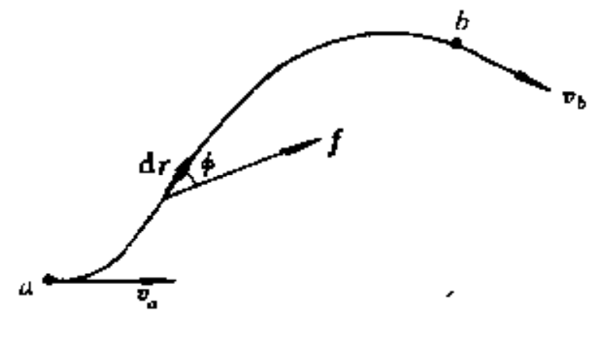
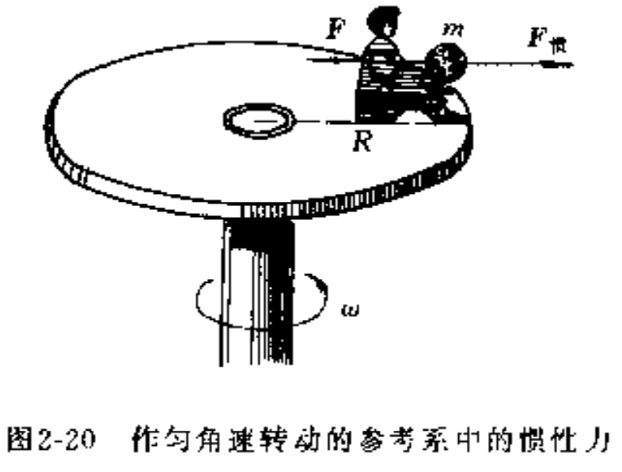

# 力学

## 第一章 质点的运动

### 质点 参考系 运动方程 

质点

征何物体都有一定的大小、形状、质量和内部结构，即使是很小的分子、原子以及其他微观粒子也不例外.一般地说，物体运动时，其内部各点的位置变化常是各不相同的，而且物体的大小和形状也可能发生变化，但是，如果在我们所研究的问题中，物体的大小和形状不起作用,或者所起的作用并不显著而可以忽略不计时我们就可以近似地把该物体看作是一个具有质量而没有大小和形状的理想物体,称为质点.

运动本身的绝对性

无论从机械运动来说，还是从其他运动形式来说，自然界中的切物质都处于永恒运动之中,运动和物质是不可分割的，运动是物质存在的形式、是物质的固有属性，物质的运动存在于人们意识之外，这便是运动本身的绝对性

参考系

在这些错综复杂的运动中，要描述一个物体的机械运动，总得选择另一物体或几个彼此之间相对静止的物体作为参考，然后研究这个物体相对于这些物体是如何运动的,被选作参考的物体叫做参考系

运动描述的相对性

在不同参考系中，对同一物体的运动具有不同描述的事实，叫做运动描述的相对性.

空间和时间

在自然科学的创始和形成时代，关于空间和时间,有两种代表性的看法. 莱布尼兹认为，空间和时间是物质上下左右的排列形式和先后久暂的持续形式,没有具体的物质和物质的运动就没有空间和时间。和莱布尼兹不同,牛顿认为，空间和时间是不依赖于物质的独立的客观存在.莱布尼兹强调空间和时间与物质运动的联系而忽视其客观性;牛顿强调空间和时间的客观存在而忽视其与物质运动的联系。

运动方程

在一个选定的参考系中，当质点运动时，它的位置 $P(x,y,z)$是按一定规律随时刻t而改变的, 所以位置是t的函数。这个函数可表示为

$$x = x(t) y =y(t) z=(t)$$

它们叫做质点的运动方程,知道了运动方程，我们就能确定任一时刻质点的位置，从而确定质点的运动。

### 位移 速度 加速度 

位矢

在坐标系中，质点的位置,常用位置矢量(简称位矢)表示.位矢是从原点指向质点所在位置的有向线段，用矢量”表示设质点所在位置的坐标为 x,y,z, 那么，坐标x,y,z就是$\vec r$沿坐标轴的三个分量.位矢的大小可由关系式

$$r=|\vec r|=\sqrt{x^2+y^2+z^2}$$

决定.引人沿着x,y,z三轴正方向的单位矢量$\vec i、\vec j、\vec k$后，我们可把$\vec r$写成

$$r=x\vec i+y\vec j+z\vec k$$

位矢的方向余弦是

$$cos\alpha =\frac{x}{r}、cos\beta  =\frac{y}{r}、cos\gamma=\frac{z}{r}$$

位移

设曲线AB是质点运动轨迹的一部分, 在时刻t，质点在 A点处，在时刻$t+\Delta t$,质点到达B点处.A、B 两点的位置分别用位矢$r_A$和$r_B$来表示在时间$\Delta t$内，质点的位置变化可用从 A 到 B 的有向线段$\vec {AB}$来表示，$\vec {AB}$称为质点的位矢量, 简称位移。位移$\vec {AB}$除了表明 B 点与 A 点之间的距离外，还表明了 B 点相对于 A 点的方位。

速度

当质点在时间 $\Delta t$ 内，完成了位移$\Delta \vec r$时，为了表示运动在这段时间内的快慢程度，我们把质点的位移$\Delta \vec r$与相应的时$\Delta t$的比值，叫做质点在这段时间$\Delta t$内的平均速度

$$v=\frac{\Delta \vec r}{\Delta t}$$

均速度的方向与位移$\vec r$的方向相同。

在描述质点运动时，我们也常采用“速率”这个物理量.我们把路$\Delta s$与时间$\Delta t$的比值做质点在时间$\Delta t$内的平均速率,这就是说,平均速率是一标量，等于质点在单位时间内所通过的路程，而不考惠运动的方向。

不能把平均速率与平均速度等同起来,例如,在某段时间内，质点环行了一个闭合路径，显然质点的位移等于零，所以平均速度也为零,而平均速率却不等于零

要确定质点在某一时刻 t(或某一位置)的瞬时速度(以下简称速度，应使时间$\Delta t$无限地减小而趋近于零，以平均速度的极限来表述用数学式表示便是

$$\vec v=\lim_{\Delta t\to 0}\frac{\Delta \vec r}{\Delta t}=\frac{d\vec r}{dt}$$

$$\vec v = \vec v_x \vec i+\vec v_y \vec j+\vec v_z \vec k$$

$$v=|\vec v|=\sqrt{v_x^2+v_y^2+v_z^2}$$

加速度

质点在轨迹上不同的位置,通常有着不同的速度。一质点在时刻t位于 A 点时的速度为$v_a$，在时刻$t+\Delta t$,位于B点时的速度为$v_B$.在时间$\Delta t$内，质点速度的增量为

$$\Delta \vec v=\vec v_B-\vec v_A$$

与平均速度的定义相类似，质点的平均加速度定义为

$$\vec a=\frac {\Delta \vec v}{\Delta t}$$

加速度定义为

$$\vec a=\lim_{\Delta t\to 0}\frac{\Delta \vec v}{\Delta t}=\frac {\Delta \vec v}{\Delta t}=\frac{d^2\vec r}{dt^2}$$

### 圆周运动及其描述 

#### 线量描述

$$\vec a=\frac{dv}{dt}\vec e_t+\frac{v^2}{R}\vec e_n$$

其中$\vec a_t=\frac{dv}{dt}\vec e_t$切向加速度表示质量速率变化快慢，$\vec a_n=\frac{v^2}{R}\vec e_n$法向加速度表示质量方向变化的快慢

对任何平面上的曲线运动都是适用的,但要注意，圆周运动中的恒定半径 R 不同，计算式中要用$\rho$代替 R，$\rho$是曲线在该点处的曲率半径

#### 角量描述

角速度

$$\omega=\frac{d\theta}{dt}$$

角加速度

$$\alpha=\frac{d\omega}{dt}$$

均速圆周运动的运动方程

$$\theta=\theta_0+\omega t$$

匀变速圆周运动的运动方程

$$\theta=\theta_0+\omega_0 t+\frac{\alpha}{2}t^2$$

$$\omega=\omega_0+\alpha t$$

$$\omega^2=\omega_0^2+2\alpha (\theta-\theta_0)$$

#### 线量角量关系

$$v=R\omega$$

$$a_t=R\alpha$$

$$a_n=\frac{v^2}{R}=v\omega=R\omega^2$$

### 曲线运动方程的矢量方程

$$x=x(t) y=y(t) z=(t)$$

$$\vec r=\vec r(t)$$

#### 圆周运动适量方程

xy平面的圆周运动方程

$$x=R\sin\omega t , y=R\cos\omega t ,z=0 $$

$$\vec r=R(\sin\omega t \vec i+\cos\omega t \vec j)$$

轨迹方程

$$x^2+y^2=R^2$$

$$v_x=\frac{dx}{dt}=
\frac{d}{dt}(R\sin \omega t)=R\omega\cos\omega t$$

$$v_y=\frac{dy}{dt}=\frac{d}{dt}(R\cos \omega t)=-R\omega\sin\omega t$$

$$a_x=\frac{dv_x}{dt}=-R\omega^2\sin\omega t$$

$$a_y=\frac{dv_y}{dt}=-R\omega^2\cos\omega t$$

#### 抛体运动方程的矢量形式

$$\vec r=\int_0^t\vec vdt=(v_0t\cos\theta)\vec i+(v_0t\sin\theta-\frac{1}{2}gt^2)\vec j$$

$$\vec r=(v_0\cos\theta\vec i+v_0\sin\theta\vec j)t-\frac{1}{2}gt^2\vec j$$

$$\vec r=\vec v_0 t+\frac{1}{2}\vec gt^2$$

轨迹方程

$$y=xtg\theta-\frac{1}{2}\frac{gx^2}{v_0^2\cos^2\theta}$$

射程

$$H=\frac{v_0^2\sin2\theta}{g}$$

$\theta=45^0$在时射程最大

最大高度

$$h=\frac{v_0^2\sin^2\theta}{2g}$$

### 伽利略坐标变换

空间绝对性、时间绝对性

## 第二章 牛顿运动定律

第一定律 惯性定律

任何物体都保持静止的或沿一直线作匀速运动的状态，直到作用在它上面的力迫使它改变这种状态为止

第二定律

物体受到外力作用时，它所获得的加速度的大小与外力的大小成正比，并与物体的质量成反比，加速度的方向与外力的方向相

$$\vec F=m\vec a$$

第三定律

两个物体之间的作用力和反作用力，在同一直线上,大小相等丽方向相反.或者说，当物体 A 以力 $F_{AB}$作用在物体 B 上时，物体B 必定同时以力 $F_{BA}$作用在物体 A 上;$F_{AB}$和$F_{BA}$在一条直线上，大小相等而方向相反

$$\vec F_{AB}=-\vec F_{BA}$$

### 常见力

**重力**

**弹力**

发生形变的物体，由于要恢复原状，对与它接触的物体会产生力的作用,这种力叫弹力

一种是两个物体通过一定面积相互挤压的情形.这时相互挤压的两个畅体都会发生形变,即使小到难于观察，但形变总是存在的，因而产生对对方的弹力作用

另一种弹力是绳线对物体的拉力. 这种拉力是因绳线发生了伸长形变而产生的，其大小取决于收紧的程度,它们的方向总是沿着绳线而指向绳线收紧的方向

绳产生拉力时，其内部各段之间也有相互的弹力作用. 这种内部的弹力叫做**张力**.在很多实际问题中，绳线的质量往往可以忽略，这时，可以认为绳上各点的张力都是相等的,而且就等于外力

**摩擦力**

两个相互接触的物体在沿接触面相对运动时，或者有相对运动的趋势时，在接触面之间产生一对阻比相对运动的力，叫做摩擦力.相互接触的两个物体在外力作用下，虽有相对运动的趋势，但并不产牛相对运动，这时的摩擦力叫静摩擦力.

最大静摩擦力正比于正压力N：

$$f_s=\mu_sN$$

滑动摩擦力

$$f_k=\mu_kN$$

滑动摩擦系数随速度的增大而减小

**万有引力**

$$F=G\frac{m_1m_2}{r^2}$$

$$G=6.67\times10^{-11}Nm^2/kg^2$$

引力质量、惯性质量

粒子之间的万有引力是非常小的，例如两个相邻的质子之间的万有引力大约只有 $10^{-34} N$,因而完全可以忽略

**电磁力**

存在于静止电荷之间的电性力以及存在于运动电荷之间的电性力和磁性力，由于它们在本质上相互联系，总称为电磁力.在微观领域中，还发现有些不带电的中性粒子也参与电磁相互作用. 电磁力和万有引力一样都是长程力，但与万有引力不同，它既有表现为引力的也有表现为斥力的，比万有引力大得多.两个质子之间的电力要比同距离下的万有引力大上 $10^{36}$倍

**强力**

当人们对物质结构的探索进人到比原子还小的亚微观领域中时，发现在核子、介子和超子之间存在一种强力.正是这种力把原了内的一些质子以及中子紧紧地束缚在一起,形成原子核.强力是比电磁力更强的基本力，两个相邻质子之间的强力可达$10^4 N$，比电磁力大 $10^2$ 倍.强力是一种短程力，其作用范围很短，粒子之间距离超过 $10^{-15} m$ 时,强力小得可以忽略;小于$10^{-15} m$时,强力占主要支配地位;而且直到距离减小到大约 $0.4 \times 10^{-15} m$时，它都表现为引力.距离再减小,强力就表现为斥力

**弱力**

在亚微观领域中，人们还发现一种短程力，叫弱力.弱力在导致$\beta$衰变放出电子和中微子时，显示出它的重要性,两个相邻质子之间的弱力只有$10^{-2}N$ 左右

### 第二定律微分形式

$$F=m\frac{d\vec v}{dt}$$

$$F_x=m\frac{dv_x}{dt}=m\frac{d^2x}{dt^2}$$

$$F_y=m\frac{dv_y}{dt}=m\frac{d^2y}{dt^2}$$

$$F_z=m\frac{dv_z}{dt}=m\frac{d^2z}{dt^2}$$

$$F_t=ma_t=m\frac{dv}{dt}$$

$$F_n=ma_n=m\frac{dv}{dt}=m\frac{v^2}{\rho}$$

《自然哲学的数学原理》运动的变化与所加的动力成正比，并且发生在这力所沿直线的方向上.

牛顿在定律中提出的同，并非我们艺没而谈的运动达而是有其严格定义的，他把物体的质量和速度矢量之积定义为“运动”我们知道,现在这个乘积 $m\vec v$ 叫做物体的动量,用$\vec p$表示，则

$$\vec p=m\vec v$$

而牛顿所说的运动的变化指的是动量的变化率,所以，牛顿对第二定律的说法实质上是

$$\frac{d\vec p}{dt}=\vec F$$

### 第二定律的积分形式 动量定理

$$\vec F dt=d\vec p$$

力的时间累积效果

$$\vec I=\int_{t_1}^{t_2}\vec Fdt=\vec p_2-\vec p_1$$

物体在运动过程中所受合外力的冲量,等于该物体动量的增量.这个结论叫做动量定理

### 第二定律的积分形式 动能定理

物体在力$\vec F$下的作用下发生一无限小的位移 $d\vec r$(元位移)时，此力对它做的功定义为，力在位移方向上的投影和此元位移大小的乘积.

$$dA=(F\cos \varphi)|d\vec r|$$

$$dA=\vec F \cdot d\vec r$$

标量:只有大小和正负，没有方向的量

功：力和位移的点积

功率

$$P=\frac{dA}{dt}=\vec F\frac{d\vec r}{dt}=\vec F \cdot \vec v$$

在国际单位制中，力的单位是N,位移的单位是m，因此功的单位是 N·m,叫做J(集耳). 功率的单位是 J/s,叫做W(瓦)

**能量**

能量是物体状态的单值函数. 

物体作机械运动，它的状态是用位置和速度描述的，我们把位置和速度叫做状态参量.这样，量度机械运动的机饿能应是位置和速度的单值函数.

当物体在变力f作用下，从a点沿曲线运动到b点时，我们用$v_a$和$v_b$分别表示它在起点a和终点b处的速度,变力严在这过程中所作的功是

$$A=\int_{a}^{b}f\cos \varphi |d\vec r|$$

$$A=\int_{v_a}^{v_b}mvdv=\frac{1}{2}mv_b^2-\frac{1}{2}mv_a^2$$

动能

$$E_k=\frac{1}{2}mv^2$$

动能定理

$$A=E_{kb}-E_{ka}$$

动能定理告诉我们:合外力对物体作的功总等于物体动能的增量.

动能和功的单位是一样的，但是意义不同.功反映力的空间累积，其大小取决于过程，是人过程量，动能表示物体的运动状态，是个状态量，或者叫做状态函数.动能定理启示我们:功是物 体在某过程中能量改变的一种量度，这个观点将有助于我们去识别与理解其它形式的能量

动能定理微分形式

$$\vec F \cdot \vec v = \frac{dE}{dt}$$

### 非惯性系 惯性力

牛顿定律对非惯性系是不成立的

加速运动的列车是个非惯性系

圆盘上坐着一人,手中捧了个小球,球的质量为 m，人与转轴的距离为R.从地面参考系来看，小球是以角速度$\omega$随圆盘一起转动的，具有向心加速度a,对小球提供向心力的是人手的拉力F.这符合牛顿定律.但从圆盘上的人看来,小球受力情况不变，但静止着，手虽然拉着小球,小球却并不运动，这显然不符合牛顿定律。

以上的讨论表明，在相对于惯性系以加速度a 运动的非惯性系中,生顿定律不再适用,但在实际问题中，往往需要在非惯性系中观察和处理物体的运动,这时，我们要引人惯性力的概念，以便在形式上利用牛顿定律去分析问题.惯性力是个虚拟的力，它是在非惯性系中来门参考系本身加速效应的力.和真实力不同，惯性力找不到相应的施力物体。它的大小等于物体的质量m和非惯性系加速度a的乘积，但方向和a相反

$$\vec F_惯=-m\vec a$$

在非惯性系中，如物体受的真实力为F，另外加上惯性力，则物体对于此非惯性系的加速度a'就可在形式上和生顿定律一样,求得如下:

$$\vec F + \vec F_惯=m\vec a'$$

## 第三章 运动的守恒定律

一般地说，对于物体系统内发生的各种过程，如果某物理量始终保待不变,该物理量就叫做守恒量

能量守恒、动量守恒和角动量守恒,由宏观现象总结出的这几个守恒定律在微观世界已经过严格检验，证明它们同样有效,它们不仅适用于任何物理过程,也适用于化学、生物等其它过程.自然界至今还没有发现违反官们的事例

**功能原理**指出，机械能有两种形式，即动能和势能,机械能守恒定律到进一步指出，在一定条件下，质点系统的动能和势能可相互转化,但它们的总和保持不变.机械能守恒定律是能量守恒定律的一个特例,作为自然界的一个普遍规律,能量守恒定律指出了物体运动形式可以相互转化或转移，在运动转化中,能量始终是守恒的,动量守恒定律同样是自然界的普遍规律，它揭示了通过物体的相互作用，机械运动发生转移的规律.和动量相似，角动量也是个重要的守恒量.

### 保守力

功的大小只与物体的始末位置有关，而与所经历的路径无关，这类力叫做保守力

保守力：重力、弹力、引力、静电力

非保守力：摩擦力

### 成对力的功

任何一对作用力和反作用力所作的总功具有与参考系选择无关的不变性质，只要牛顿第三定律成立、无论从补么参考系去计算，成对力所作的功的结果都一样

在任意的参考系中，成对保守力的功只取决于相互作用质点的始末相对位置，而与各质点的运动路径无关

### 势能

重力势能：$E=mgh$

弹性势能：$E=\frac{1}{2}kx^2$

引力势能：$E=-G_0\frac{mM}{r}$

成对保守力的功等于系统势能的减少(或势能增量的负值).

物体系统在两个不同位置的势能差具有一定的量值，它可用成对保守力作的功来量度。鉴于成对保守力作的功与参考系的选择无关，所以这个势能差是有其绝对意义的，而这正是我们在处理问题时所感兴趣的内容.至于系统的势能的量值，却只有相对意义,如果我们选定在某个位置，系统的势能为零，则它在其他位置的势能才有具体的量值，此值等于从该位置移动到势能零点时保守力所做的功。势能零点可根据问题的需要来选择,而作为两个位置的势能差，其值是一定的，与势能零点的选择无关

 

