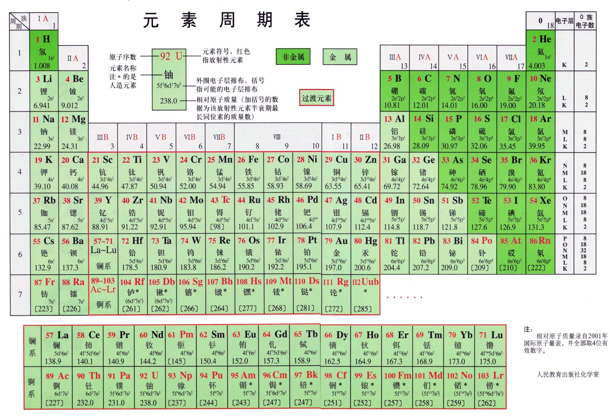
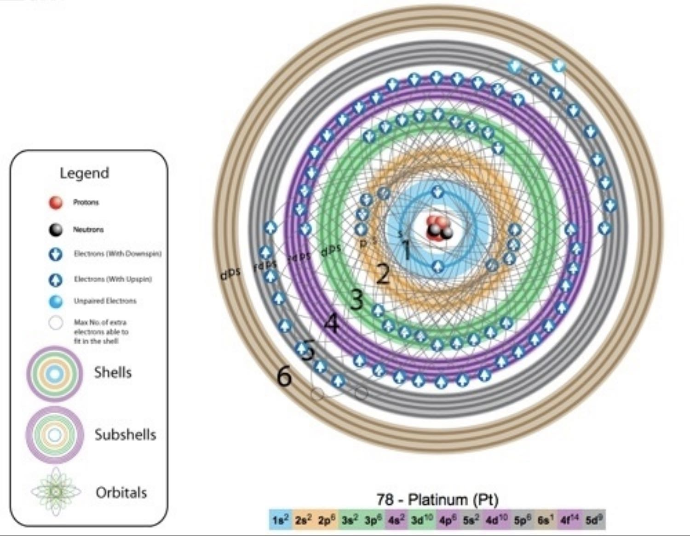
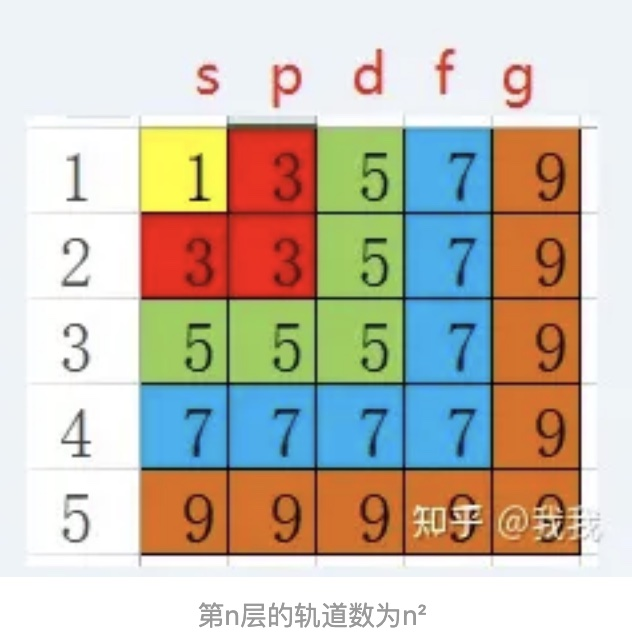

# 元素周期表基础知识

## 原子轨道

轨道指的是围绕着原子运动的电子运行的轨道，更准确地说是电子出现在外空间某个地方的概率，有s、p、d、f、g、h等，再往后的轨道属于我未知的领域。

每个轨道上，最多能够容纳两个电子，运动方向相同。轨道上有一个电子的时候不稳定，有两个电子的时候稳定。大概是拨浪鼓的样子。

s轨道有1个，p轨道有3个，d轨道有5个，f轨道有7个，g轨道有9个，h轨道有11个，以此类推。

在原子核外面的电子是分层的，每层可容纳的电子数最多是2n²，就是第一层最多2个，第二层最多8个，第三层最多18个。原子外面的电子并不是像下图那样绕着一个球运动，而是按照轨道的方式运动。

补注：为什么容纳电子数是2n²呢？因为：
- 第1层外层只有1个s轨道，轨道总数量为1=1²，最大可容纳电子数为2*1²=2；
- 第2层外层有1个s轨道和3个p轨道，可容纳的轨道数为1+3=4=2²，最大可容纳电子数为2*2²=8；
- 第3层外层有1个s轨道、3个p轨道和5个d轨道，可容纳的轨道数为1+3+5=9=3²，最大可容纳电子数为2*3²=18；
- 可推导第n层电子层，可容纳的最多轨道数为n²，可容纳的最多电子数为2n²

每一层电子，都先有s轨道，再有p轨道，再有d轨道，就是说第一层的两个电子形成了一个稳定的s轨道，第二层又从s轨道开始，电子填满了才会有p轨道。

第一层的电子最多有两颗，是s轨道，对应的分别是氢和氦。

氢是1s1，原子外面有一个电子在s轨道上，不稳定，需要形成氢气或者和其他元素反应成为稳定的物质。

氦是1s2，原子外面有两个电子在s轨道上，稳定。

第二层电子有最多八颗，第二层电子在第一层的s轨道外面，先由两颗电子形成一个第二层的s轨道，满了之后再形成p轨道。

锂是2s1，原子外面先有一个层的s轨道，第一层s轨道外面再套一个s轨道，上面只有一个电子，不稳定。

铍是2s2，原子外面先有一个层的s轨道，第一层s轨道外面再套一个s轨道，上面有两个电子，稳定。

第二层的s轨道排满了之后，后面的六颗电子就按照p轨道运动，p轨道有三个，分别在xyz轴上

## 轨道杂化

轨道杂化，只发生在最外层的轨道！里面已经填满了的轨道是稳定的不用管的。

https://www.orbitals.com/orb/orbtable.htm