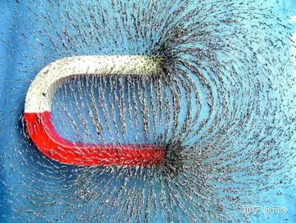

---

title: 磁陀螺运动与现代物理学漫谈（6）——重论法拉第力线 ——对法拉第磁力线形成物理原理及其应用的探讨 - 知乎

date: 2024-05-12 21:51:13

categories: vortex

tags: 
- 无

original_url: https://zhuanlan.zhihu.com/p/72238268

---

# 磁陀螺运动与现代物理学漫谈（6）——重论法拉第力线 ——对法拉第磁力线形成物理原理及其应用的探讨 - 知乎

**磁陀螺运动与现代物理学漫谈（6）——重论法拉第力线**

——对法拉第磁力线形成物理原理及其应用的探讨

**司** **今**

（广州毅昌科技研究院 广州 510663 E-mail:jiewaimuyu@126.com）

**摘要：**英国物理学家法拉第于1831期间在研究电磁感应现象时形成了“力线”思想，他用磁力线、电力线来描述磁铁与带电金属球体周围的力分布“状态”；至于这些力线是如何形成的？它包含什么物理含义？等实质性问题，法拉第并没有给出明确解释。

法拉第力线无疑是目前场物理学研究中最重要的场物理模型，但它也存在一定缺陷；找出磁力线产生的物理机制及其代表的物理意义，对考究场理论建立的基础是否牢固、正确，无疑是最佳的楔入口。

本文正是沿着这一思路，尝试性地探讨了法拉第力线形成的物理机制及其原理（磁极矩原理），并将这一原理运入到偶磁极自旋体（如磁陀螺、自旋磁粒子、自旋星体等）在磁场中运动的讨论中，从而解惑了很多现代物理学存在的谜团。

**关键词：**磁极 磁力线 磁力矩 磁陀螺 磁偶极子 自旋磁子

**中图分类号：** 0441 **文献标识码：A**

**0** **引言**

法拉第“发明”磁力线无疑是场物理学发展史中一大创举，它不仅使抽象的场概念直观化，也给高斯、麦克斯韦电磁波理的出现论指明了方向；高斯通过磁通量将场空间分布属性几何化，麦克斯韦二“论法拉第力线”，从流体力学概念出发为它建立了一套数学描述格式；我这里“重论法拉第力线”，从“磁极矩原理”出发，想为它建立一种力学描述形式。

  

  

我们知道，法拉第力线是由磁体对撒落在其周围铁粉磁化并产生重新排布现象而抽象出来的、一种关于“磁场”理论的物理模型；磁场是真实存在的，但磁力线并不是真实、客观存在的，它是为了形象描述“磁场”而人为假想的线。

  

  

将磁场理论建立在这种不存在的力线概念之上，其建立基础的可靠性、牢固性应当受到质疑：

1、如果法拉第力线不存在，那么他否定磁场力超距性的依据是什么？

2、如果法拉第力线不存在，那么高斯磁定律的物理意义何在？

3、如果法拉第力线不存在，那么洛伦兹运动中电子切割磁力线现象该如何诠解？

4、如果法拉第力线不存在，那么法拉第电磁感应中磁通量变化又有什么物理含义？

5、如果法拉第力线不存在，那么麦克斯韦的电磁波理论该如何解读？

……，……，……

法拉第力线模型在解决电磁学的一些运动现象时是不够彻底、深刻的，当电子进入“量子力学”空间时，发现它有自旋磁矩，就更显示出了法拉第磁力线模型的弊端来。

那么，我们应该建立一个怎样的“场”物理模型才能够使量子力学所描述的一些带场的粒子运动图景清晰起来？这是摆在目前场物理学发展里程中不可逾越的巨大障碍！

解铃还须系铃人，追根溯源，探寻法拉第力线形成的物理机制和物理本质很有必要。

**1** **磁极与磁库伦定律**

人类发现磁现象要比发现电现象早；最早发现磁现象是从磁铁开始的，磁铁有 N、S 两极，它们同号相斥、异号相吸，于是人们假定，在一根磁棒的两极上有一种叫做“磁荷”的东西，N极上的叫正磁荷，S极上的叫负磁荷，同号磁荷相斥，异号磁荷相吸；后来发现电现象也有类似情况，电荷也有正、负两种，它们也是同号相斥、异号相吸。

**1.1** **磁极**

如图-1，如果将一块条形磁铁投入到碎铁屑中，再取出时可以发现，靠近磁铁二极的地方吸引的铁屑特别多，即磁性特别强，这块磁性特别强的区域就称为磁极，中部没有磁性的区域叫做磁中性区；磁极之间遵循“同极相斥、异极向吸”原则。

  

  

从广度和深度而论，磁铁的这些特性对与宏观的偶磁极恒星、行星、磁陀螺、小磁针等，微观的偶磁极原子核、质子、中子、电子等应都适用。

**1.2** **磁库伦定律**

库伦在用“扭秤”（如图-2）测得点电荷之间的相互作用力服从平方反比分布关系之后，直觉地感到磁极之间的相互作用力也服从类似的关系；与电偶极子类比，一个小磁针也可以看成是一个“磁偶极子”，在它的两端各带有正负磁荷（设N极带正磁荷+qm，S极带负磁荷-qm）。如图-3所示，库伦用类似电“扭秤”原理精心设计磁“扭秤”实验，最终证明，磁极（又称点磁荷）1、2之间也服从类似点电荷之间的磁库伦定律，即F=kmqm1qm2/r2.

  

  

**1.3** **磁性起源**

在磁物理学发展史中，关于磁性起源问题存在二种观点：最先出现的是“磁荷”观点，后来安培提出了“分子电流”观点；这二种观点至今还深深地影响着现代物理学。

今天，磁起源的电流观点因其能够完满地解释各种实验现象而得到了公认；磁荷观点却因一直找不到磁单极而渐为人们所淡忘。

其实，用磁荷观点建立起的一套理论，与电学理论具有明显的对称性，磁荷理论阐述的一系列定理、定律和公式，以及用它们所做的问题计算，不仅同样有效，而且有时更为简洁和便于记忆，究其根本原因就是，虽然至今没有发现磁单极，但磁偶极子确实存在。

现代物理学认为：磁偶极子实际就是一个小圆电流的等效模型，“电流说”与“磁荷说”两种理论观点正是通过“小电流环— —磁偶极子”这个两重性模型被联系了在一起。

我觉得现代物理学的这种“联系”有一些“牵强”，存在不合理性，因为“电流说”只能解释“公转”磁效应，并不能解释“自旋”磁效应。

其实，磁性起源应包括二个方面：（1）公转生磁，（2）自旋生磁；但现代物理学只一味地强调用分子电流观点（即公转生磁）去认识磁性起源，这就深深掩盖了“自旋生磁”现象的存在，它留给量子力学关于“自旋磁矩”起源的论述只能用“内禀”一词去“挡驾”了（内禀：存在但并不彰显，或不为人知）；量子力学用“内禀”性来诠解“自旋磁矩”，这显然是一种逃避磁起源本质深层探索的懒惰做法。

自旋生磁效应可以用公式qm=mω来描述，即对一个自旋物体而言，其自旋“磁荷”量大小是由其质量m、自旋角速度ω共同决定的；如中子星体积小，但m、ω大，故会表现出强磁性；再如，金星质量m比火星大，但其自旋角速度ω比火星小，即有qm金=mω=4.83×1024×2π/243×24＜qm火=mω=6.4×1023×2π/24.6，故金星表现的磁场就比火星要弱。

当然，公转生磁效应也与其公转角速度Ω分不开，它的“磁荷”量大小可以用qm=mΩ来描述——具体论述可参阅司今《物质自旋与力的形成》、《磁子论》等文章。

**2** **小磁针偏转实验与磁极矩原理**

小磁针与条形磁铁一样，也有二磁极性，且遵循“同极相斥、异极相吸”原则。

小磁针在磁场中的受力表现是通过小磁针磁极与磁体磁极相互作用而实现的，对此，我们可以通过实验加以验证：

**2.1** **先放置小磁针，后放置磁体**

实验视频-1：我们先将小磁针排放好，然后将一块条形磁铁移向小磁针放置区；在磁铁移动过程中，我们会发现，小磁针会随磁铁磁极靠近的先后顺序而产生旋转变化，这说明，小磁针的磁极受到磁铁磁极影响而产生了偏转。

**2.2** **先放置磁体，后放置小磁针**

实验视频-2：我们先放置一块磁铁，然后在磁体周围逐个次第放置小磁针，就会发现，小磁针磁极转动与排列过程与实验视频-1是一致的，这说明小磁针转动及磁极排列方向是受磁铁磁极影响的结果。

  

  

  

  

那么、小磁针为什么要产生转动？其磁极方向为什么要产生如此排列呢？

小磁针是一个偶极磁体，它磁性表现最强部分也是在其二端，且在其几何体中心处有一个可以转动的轴存在。

当我们把磁铁向小磁针放置区移动时，小磁针二端磁极就会受磁铁磁极力矩作用而产生变化；如果小磁针二端所受磁铁磁极力矩作用相等时，它就不会产生转动，如图-4中的0小磁针；如果小磁针二端所受磁体磁极力矩作用不相等时，它就会产生转动，如图-4中的1、2、3、4小磁针。

  

  

由此可见，小磁针旋转变化是受磁铁磁极力矩作用的结果，即称之为“**磁极矩原理** ”；但图-4中小磁针的分布状态并不按法拉第磁力线所描绘的曲线形式排列。

如果我们将小磁针之间首尾靠近一些，它们又会产生什么样的排列分布形式呢？

如图-5.1所示，将没有旋转轴的小磁针片首尾靠近排列成二行，并保持各小磁针片之间因玻璃平面摩擦力作用而不移动，然后轻敲玻璃板以克服磁针片与玻璃平面间摩擦力的影响，则小磁针片就会产生图-5.2所示的分布状态，它接近符合法拉第磁力线的排列形式，这是为什么?

  

  

我们从磁体磁极角度分析可以发现，这些小磁针片在磁铁周围空间要受到五个力作用，即：

F1：为小磁针磁极与磁铁磁极之间的引力，它使小磁针磁极产生较大偏转；

F2：为不同经度和维度的小磁针磁极之间的引力，它使小磁针磁极产生较小偏转；

F3：为同经度、不同维度小磁针磁极之间的磁极引力，它使小磁针磁极之间产生相互吸引并连接呈线状；

F4：为同维度、不同经度小磁针磁极之间水平方向的磁极斥力，它使小磁针磁极之间产生相互排斥，从而使得不同维度的小磁针产生分离而形成各自独立的经线行分布状态；

f:为小磁针片与玻璃板之间的静摩擦力，它阻止小磁针向磁体磁极移动（如图-16示）。

  

  

如果这个实验放在太空中做，那么，小磁针将不会再呈现如此稳定的“磁力线”排列形式，它们会向中心磁体磁极移动，且在中心磁体二端的小磁针移动速度要比中间的快一些。

通过上述力分析可见，对小磁针而言，要形成法拉第磁力线排列状态应具备在四个条件：

（1）、中心磁体的空间长度要比小磁针片大；

（2）、各小磁针片之间首尾要靠得很近；

（3）、小磁针片要与玻璃平面有一定的摩擦力；

（4）、轻敲玻璃板时能够使小磁针片产生上下振动。

下面用一组动态演示图\[3\]来观察不同磁体磁极对小磁针排列形式的影响：

  

  

  

  

  

  

我们知道，对一根由长颗粒组成的曲线而言，颗粒越小，其组成的曲线越明显和光滑，那么，为了在实验中得到更明显、光滑的磁针排列曲线，我们能不能找到比小磁针更小的偶极磁颗粒呢？有，那就是铁粉，法拉第磁力线思想的形成正是由这些铁粉给予的启迪。

**3** **法拉第磁力线模型的形成过程**

早年，法拉第曾在玻璃板上撒布铁粉，并轻敲玻璃板使其振动，则铁粉就会呈现出许多细小的曲线段，从而显示出永久磁铁或电流导线周围的磁场分布，据此他“发明”了磁力线来形象描述磁体磁场分布的物理特性。

法拉第力线形成的实验演示过程如下：

图-10为实验视频-3的qq截图，实验步骤为：均匀撒铁粉—→轻敲玻璃板—→确定磁力线方向—→顺铁屑分布轮廓画线—→得磁力线模型图。

  

  

法拉第磁力线有如下特征：

（1）磁力线是人为假象的曲线，客观上并不存在。

（2）磁力线有无数条且各自独立存在。

（3）磁力线是立体分布的。

（4）所有的磁力线都不会交叉。

（5）磁力线疏的地方表示磁性较弱，磁力线密的地方表示磁性较强。

**4** **法拉第磁力线形成的物理本质**

铁粉本是无磁性的，当我们将它撒在条形磁铁周围时，铁粉就会被磁铁磁场极化成微型“小磁针”，这些 “小磁针”由于受磁铁磁极力和它们之间磁极力的作用而产生新的有序排列，即形成“磁力线”排布形状；如图-11所示，如果我们将这些有序排列在磁铁周围的铁粉放大，就会发现，它们的排列原理同图-5“宏观”磁针片排列原理是一致的，即在“五个力”作用下，遵守“磁极矩原理”排布。

仔细观察实验视频-3还可以发现，当我们向玻璃上撒铁粉时，铁粉分布曲线形状并不明显，这主要是玻璃面对铁粉颗粒有摩擦力作用，使铁粉颗粒不能自由移动所造成的；但当我们轻敲玻璃时，铁粉就会因振动而产生移动，并且被极化的铁粉“小磁针”在磁铁磁极及它们之间磁极力的相互作用下，使铁粉“小磁针”磁极产生经向首尾“相连”、 纬向相互“排斥”、斜向相互“吸引”的作用形式，结果它们就分化成了一根根独立的曲线状；这就是法拉第磁力线现象形成的物理本质，可将这一本质称作法拉第磁力线形成的“**磁极矩原理**”。

  

  

法拉第磁力线反映的是磁体磁极与大量“小磁针”磁极之间相互作用而使“小磁针”产生重新排列分布的结果；对单个小磁针而言，它与磁场磁极作用并不符合法拉第力线形式，而是遵循“磁极矩原理”相互作用；这不仅说明法拉第磁力线是不存在的，而且也说明法拉第磁力线只是对“铁粉”实验现象直观“截取”的描述，并没有触及磁力线形成的物理本质。

由法拉第磁力线模型建立起来的一整套关于磁场的物理理论，如磁通量理论、切割磁力线理论等，甚至电力线、质量力线等概念，都不得不让人产生疑虑：法拉第力线模型真的能够揭示场的物理本质吗？

至此，可以看出，用法拉第力线建立起的场物理理论的基础是不真实、也是不牢靠的，对之必须做一些“修订”；同时，依据法拉第力线建立起来的场理论也应作一些补充和修缮。

**5** **磁极矩原理在物理学中的应用**

既然法拉第磁力线是由磁体磁极相互作用产生的，那么，我们在研究小磁针在磁体磁场中受力时，就应充分运用“磁极矩原理”来洞悉它们在磁场空间里所产生的各种运动变的物理本质才是；同时，对于与小磁针有类似性的物体，如自旋小磁陀螺、自旋偶磁极星体、自旋偶磁极粒子等，对它们在磁场中的运动变化也应充分考虑“磁极矩原理”在此所发挥的作用——由此，不但可以拓展“磁极矩原理”的应用范围，也为自旋偶磁极物体在磁场中运动所应遵循的规律找到了一个可以实验验证的物理模型和理论依据。

但要注意，自旋偶磁极物体在磁场中的运动不同于铁粉、小磁针，铁粉、小磁针没有自旋性，且且自旋偶磁极物体在磁场中运动多表现出“个体性”，即各自旋偶磁极物体之间在磁场中都有自己的“量子化轨道”，它们之间相互影响的作用可以忽略不计。

**5.1** **磁极矩原理与磁流体变化的形成**

用磁流体作实验也能体现 “小磁针”颗粒在磁铁磁极作用下按“磁极矩原理”重新排布现象。

磁流体是用Fe 3O4或其它含铁化合物的纳米颗粒（直径一般为10nm或更小）分散到有机溶剂或水的载体中制作成的胶体；这些纳米颗粒表面因包附有表面活性剂（如图-12），故该流体在静态时无磁性吸引力，当外加磁场作用时，才会表现出磁性。

  

  

我们把磁流体倒在玻璃平面上，它呈凸堆形，然后在玻璃平面下方放入一块磁铁，则它就会产生如图-13所示的美丽图案；当取走磁铁时，它又恢复凸堆形，这是为什么？

  

  

  

  

它的形成原理与图-5小磁针在磁铁周围有序排列的原理基本一致；如图14-1所示，分布在胶体中的Fe 3O4纳米级颗粒几乎没有磁性，故它们在胶体中呈“无序”状分布；当我们在玻璃板下面放入磁铁后，它们立刻就会被极化成“小磁针”，在磁铁磁极磁场和它们磁极磁场的相互作用下，按照“磁极矩原理”自然就会排列成如图14-2所示的有序形式了，其中，F1、F2、F3、 F4的物理意义与图-5标注的相同。

当然，纳米级硬磁体颗粒同样也可以制成磁流体，它们在外界磁铁磁极力影响下也会产生图-13所示的有序排列现象。

**5.2** **磁极矩原理与磁陀螺进动的形成**

磁力线是在微观概念下产生的一种“假想”的场物理模型，它对磁陀螺在磁场中运动变化的描述却是无能为力的，研究磁陀螺在磁场中的运动时，必须用“磁极矩原理”来描述才会更真实、有效。

同时，对磁陀螺而言，如果把它缩小到“微观”，那它就与微观自旋偶磁极粒子相雷同；如果把它放大到“宏观”，那它就同宏观自旋偶磁极星体相类似；由此可以拓展：微观自旋偶磁极粒子与宏观自旋偶磁极星体在磁场中运动所应遵守的原理应该同磁陀螺运动一样——这就是我为什么一直苦苦致力于“磁陀螺在磁场中运动”探究的根本动机所在。

本文只论述静态自旋磁陀螺受外磁体磁极影响下的进动变化问题，而对平动自旋磁陀螺受磁体磁极的运动变化问题将放到《磁陀螺运动与现代物理学》一文中作详细讨论。

**5.2.1** **单磁极对磁陀螺进动的影响**

我们知道，一个小磁针受磁体磁极力矩作用时会产生指针方向偏转变化，对于一个自旋磁陀螺而言也应如此；如图-15所示，让一个磁陀螺轴保持与平面垂直状态下自旋，当我们取一块磁铁放到磁陀螺自旋轴上方一定距离处，磁陀螺自旋轴就会发生倾斜，这意味着自旋磁陀螺轴受到了外力矩作用，它应产生进动效应，其进动变化的结果则是绕磁体磁极作圆周运动，此实验过程可见实验视频-4。

  

  

**5.2.2** **偶磁极对磁陀螺进动的影响**

如图-16所示，我们在一水平面上分二行分别摆放着自旋的小磁陀螺和小磁针，当我们将一块磁铁沿行中线推进时，小磁针与小磁陀螺的磁极都会发生偏转变化；对小磁针而言，这种偏转会使小磁针向磁铁磁极位移，甚至小磁针会被吸引到磁铁磁极上；但对自旋小磁陀螺而言，它却并不会被吸引到磁铁磁极上。

  

  

如图-17所示，我们竖直安装三层中间有孔的玻璃平面，然后将小磁陀螺自旋轴垂直放在玻璃平面上自旋着；当我们将一块磁铁插入玻璃孔时，小磁陀螺将会产生什么运动变化呢？它还会遵循“同极相斥、异极相吸”规律吗？

为此引述杨燕老师的《自旋磁陀螺的反向倾斜和公转》\[7\]实验论文来说明这个问题：

我在图磁盘中央钻了一个洞，穿上非铁磁性的铝轴，并将铝轴两端锉尖。这样就制成了一个磁陀螺，其一端为N极，另一端为S极，再在支撑板中央钻孔，使之可放入条形磁铁，并可使条形磁铁上下移动(见图18，图(a)中N极刚露出支撑板面上方，图(b)中S极刚露出支撑板面下方)。

  

  

使磁陀螺在支撑板面上稳定自旋，没有发现磁陀螺移动。再在支撑板面中央的孔内放入条形磁铁，奇怪的现象发生了:磁陀螺马上就绕着条形磁铁公转.更奇怪的是：磁陀螺公转时，发生倾斜，倾斜方向竟然与条形磁铁磁力作用方向相反--同性相吸，异性相斥！此外，磁陀螺自转方向改变时其公转方向也随着改变，但反向倾斜特性不变。

对之，许多电磁学和力学的老师(包括大学教授)，他们都表示难以解释。

为此，齐齐哈尔大学梁法库教授重新做此实验（见实验视频-5：），并在《对自旋磁陀螺反向倾斜和公转运动的讨论》\[9\]一文中陈述道：

  

  

如图-19所示，磁陀螺从高速自转位置A到因受磁场影响而转到倾斜稳定位置B的轨迹。图-19中(a)、(b)图是陀螺质心从自转位置A 到稳定位置B相对支点(轴与面的接触点) 的轨迹，轨迹尾端的方向即为陀螺质心初始速度的方向，又因由自转到稳定公转的过程进行的较快，以致我们的肉眼不易观察。

  

  

在图19(a)磁陀螺的初始切向速度〔与图18(a) 公转方向相反〕因磁场排斥作用而远离且由平面摩擦而减小，很快就被陀螺的旋滚公转方向的速度淹没了。因此，在图19(a) 位置情况下，观察到的稳定公转是与陀螺旋滚方向一致的公转：图19(b) 磁陀螺初始切向速度〔与图18(b) 公转方向相同〕因磁铁的吸引而使陀螺的公转半径缩小，即增大了切向速度，此时可观察到图19(b) 现象。

但我觉得上述分析不够合理，因为梁教授没有注意到磁陀螺自旋轴上、下端会受中心磁体磁极力影响和“双旋轴进动” \[10\]等因素的存在。

对此，我的看法是：这个实验是由于磁陀螺受外加磁场磁极力矩影响，先产生“双旋轴进动”，当其自旋轴上、下二端所受的外加磁体磁极力矩处于平衡时，才会转化成绕中心磁体的公转形式，公转形成过程的具体分析如图-20(组)所示：

图-20.1表示：没有中心磁体插入中间孔时，磁陀螺在平面上做定点自旋，且自旋轴与平面垂直。

图-20.2表示：有中心磁体插入中间孔时，磁陀螺因受中心磁体磁极力作用，上部分受

斥力要大于下部分吸力，因中心磁体磁场强度分布从上到下逐渐减小；这样磁陀螺轴因受上下不同的力矩作用而向左倾斜，从而使它的自旋轴下端点产生“双旋轴进动”，如图-20.3、图-20.4所示。

  

  

图-20.5表示：自旋磁陀螺轴下端运动半周后，磁陀螺上部N极与中心磁体N极的斥力矩及它们S极的引力矩就会变化成平衡状态，这时磁陀螺质心所受的合力矩为0，因此，它的自旋轴下端就不会再跨过下半圆做“双旋轴进动”了；但因磁陀螺所受中心磁体磁极的力矩作用还存在，这时，它就不得不受中心磁体磁极力约束而产生绕中心磁体公转了——这才是“杨燕实验”中自旋磁陀螺所体现的“同极相吸、异极相斥”公转形式形成的物理机制所在。

**5.3** **磁极矩原理与地球自旋轴、磁轴倾斜的形成**

如图-21所示，地球绕太阳作椭圆公转时，地球自旋轴与其公转轨道平面有23.5°的夹角，同时，地球有南北磁极，其磁轴与自旋轴间夹角为11°，太阳赤道平面也与地球公转轨道平面有7.2°的夹角，以此计算就可得：地球自旋轴与太阳自旋轴之间的夹角为23.5°-7.2°=16.3°，地球磁轴与太阳自旋轴夹角为23.5°-7.2°-11°=5.3°。

  

  

由此可以看出，地球绕太阳公转就像一个自旋磁陀螺绕中心磁体进动一样，这种进动形成的物理机制与“杨燕实验”基本相同，都遵循“磁极矩原理”，但不同的是地球磁陀螺是在无“重力场”参与下形成的公转。

  

  

至于为什么太阳磁轴会表现出上S、下N的形式？如图-22所示，这是因为太阳组成有分层性，其内部自旋也应有对流分层性，从而会产生分层旋转磁场；这正是行星在太阳外产生量子化轨道分布的成因所在，也是太阳磁极磁场表现紊乱的根本原因。

以此为据可以推断，在太阳自旋轴上方不同的空间高度，我们可以测出太阳应表现出不同的磁极性；同时，银河系中心体的自旋 轴与太阳自旋轴也应存在一定的倾角（如图-23）；详述请参阅司今《太阳系行星量子化轨道形成原因之分析》一文。

  

  

同时，我们应注意：要使自旋磁陀螺绕中心磁体产生公转，则中心磁体的轴向高度要比磁陀螺自旋轴的高度大很多才可以形成；由此可知，地球只能绕太阳运动，不可能绕比地球半径小的其他天体运动；同理，中子星由于其自旋轴半径小，它就无法扑捉到自己的卫星。

**5.4** **磁极矩原理与法拉第电磁感应的形成**

现代物理学认为，电子是一个自旋粒子体，有自旋磁矩存在，因此，电子也可以被看做是一个自旋的“微磁陀螺”，那么，它遇到外界磁铁磁场时会产生什么样的运动变化呢？

对此，我们不妨用法拉第电磁感应现象予以探讨。

如图-24，法拉第电磁感应现象描述的是：当通过一个闭合导电回路所围面积的磁通量发生变化时，不管这种变化是由什么原因引起的，闭合回路中都会有电子流产生。

  

  

  

  

如图-25-1所示，假设电子们“垂直”分布在金属线圈内，并被金属元素的原子核所“禁锢”着；当在线圈上方施加外磁场时，它们就会受磁体磁极力矩影响而产生自旋轴倾斜，这种倾斜变化就会使电子产生像实验视频-5、6那样绕磁体磁极的进动(如图-25-2所示)，结果电子就在线圈内产生定向流动；假如电子从a极流出，通过灯丝后则流入b极，这就是法拉第电磁感应现象产生的物理本质。

当然，运用“磁极矩原理”，我们还可以解释经典电磁学中的洛伦兹运动、LC振荡、“电磁波”发射等现象，而且还能解释量子力学中卢瑟福原子模型、莫拉尔进动、AB效应、电子衍射、斯特恩-革拉赫实验、波粒二象性等现象，但因篇幅所限，这里就不一一赘述了；对这些内容有兴趣的朋友可参阅司今《磁陀螺运动与现代物理学》、《洛伦兹运动的几种形态及其推广》、《原子系电子量子化轨道形成原因之分析》、《“波粒二象性”的本质》等文章。

**6** **小结**

6.1、法拉第力线是人为假想的线、实际并不存在，它只是为描述场物理学而提出的一种假设物理模型，这一模型对场物理学的建立及初期发展起到了一定的推动作用，但随着物理学实验与研究的深入，它的弊端也逐渐显现出来了，如它对研究自旋偶磁极物体在磁场中的运动就存在严重束缚性。

6.2、法拉第力线产生的物理本质是磁体磁极之间相互作用的结果，从“磁极矩原理”出发，重新建立现代场物理学模型势在必行。

6.3、支配电磁学、量子力学、行星运动学等自旋偶磁极体运动的最基本物理模型应是自旋磁陀螺在磁场中运动的模型。

6.4、“磁极矩原理”是支配自旋偶磁极体，如磁陀螺、粒子、星体等在磁场中产生曲线运动（进动）的最基本原理，用此原理可以揭开现代物理学中的诸多谜团。

**7** **结束语**

法拉第磁力线概念无形中掩盖了磁体间相互作用遵守“磁极矩原理”这一物理本质，它对后来场物理学发展所带来的影响后果是严重的；从此，人们对磁场的研究与认识就深陷于法拉第力线所描绘的虚幻泥潭中而不能自拔……

直到现代，人们对场物理学的认识还被力线思想模型所禁锢；不打开这个锁，人们将永远无法真正靠近“场”的物理本质；也很难看清、理解磁力线出现的物理机制及其物理意义，借此想真正揭开现代“场”物理学及量子力学所蕴藏的奥秘将是不可能的！

“自旋+偶磁极”性是宏观宇宙与微观世界普遍存在的现象，这应该引起广大物理学理论研究者们的深思与关注！

物体自旋及其物理效应是被一直物理学疏漏的重大问题；物体自旋可以产生自旋磁场，这才是磁性的真正起源；大到银河系、太阳、地球，小到原子、电子、光子等都可以看作是一个自旋体，它们都有自旋磁场存在，也就是说，从系统论而言，它们都可以看做是一个自旋磁陀螺——这就为我们研究和建立新的“场”物理学开启了一扇光明之门。

**将法拉第磁力线的磁极矩性与自旋磁陀螺结合，可以盘活整个现代物理学！**

——这就是我重新解读法拉第力线的用意所在，也是我始终坚持物理学探索的信念所在！

**【参考资料与文献】**

1、赵凯华，陈熙谋/著《电磁学》，高等教育出版社2003年4月第1版。

2、赵凯华，罗蔚茵/著《量子力学》，高等教育出版社2003年12月第1版。

3、刘学富/主编《基础天文学》，高等教育出版社2004年第1版。

\[1\] 实验视频-1：[http://v.youku.com/v\_show/id\_XOTU0MTMyOTI=.html?from=y1.2-1-91.3.5-2.1-1-1-4-0](https://link.zhihu.com/?target=http%3A//v.youku.com/v_show/id_XOTU0MTMyOTI%3D.html%3Ffrom%3Dy1.2-1-91.3.5-2.1-1-1-4-0)

\[2\] 实验视频-2：[http://v.youku.com/v\_show/id\_XMzI4MDk2OTE2.html?from=y1.2-1-87.3.7-1.1-1-1-6-0](https://link.zhihu.com/?target=http%3A//v.youku.com/v_show/id_XMzI4MDk2OTE2.html%3Ffrom%3Dy1.2-1-87.3.7-1.1-1-1-6-0)

\[3\] 磁极动态演示：[http://v.youku.com/v\_show/id\_XMjMzMjM5NTg0.html?f=5410400&from=y1.2-3.4.9](https://link.zhihu.com/?target=http%3A//v.youku.com/v_show/id_XMjMzMjM5NTg0.html%3Ff%3D5410400%26from%3Dy1.2-3.4.9)

\[4\] 实验视频-3：[http://v.youku.com/v\_show/id\_XNzg3NjE2OTQ0.html?from=y1.2-1-87.4.5-1.1-1-2-4-0](https://link.zhihu.com/?target=http%3A//v.youku.com/v_show/id_XNzg3NjE2OTQ0.html%3Ffrom%3Dy1.2-1-87.4.5-1.1-1-2-4-0)

\[5\] 实验视频-4：[http://v.pps.tv/play\_376MLL.html](https://link.zhihu.com/?target=http%3A//v.pps.tv/play_376MLL.html)

\[6\] 、\[8\] .实验视频-5、6：[http://blog.sina.com.cn/s/blog\_d288bb3b0101fu61.html](https://link.zhihu.com/?target=http%3A//blog.sina.com.cn/s/blog_d288bb3b0101fu61.html)

\[7\]. 杨燕/《自旋磁陀螺的反向倾斜和公转》《自然杂志》1 9 9 2 年第4 期第304 页.

\[9\]. 梁法库/《对自旋磁陀螺公转与反向倾斜运动讨论》《物理实验》1997年第6期.

\[10\] 司今/《关于陀螺运动及其研究方法的探讨》：国家科技图书文献中心：

[http://www.nstl.gov.cn/preprint/main.html?action=showFile&id=2c9282824a765e95014d710566eb030d](https://link.zhihu.com/?target=http%3A//www.nstl.gov.cn/preprint/main.html%3Faction%3DshowFile%26id%3D2c9282824a765e95014d710566eb030d)

\[11\] 白炽灯的工作原理和白炽灯发光原理是什么：百度经验：

[http://jingyan.baidu.com/article/a17d52852370928098c8f229.html](https://link.zhihu.com/?target=http%3A//jingyan.baidu.com/article/a17d52852370928098c8f229.html)

**司** **今**：男，1966年10月出生，皖蚌埠市人，工程师，业余时间从事自旋场理论的研究与探索，有《关于地球椭圆轨道和自旋变化成因的探讨》、《物质自旋与力的形成》、《高斯定理的物理意义及其在场物理学中应用的得失》、《量子力学磁矩的含义》、《关于陀螺运动及其研究方法的探讨》等多篇论文发表。

**通讯地址：**广州市萝岗区科学城南翔三路 广州毅昌科技公司

**E-mail：**jiewaimuyu@126.com 电话：13825126113

**【参考文献】**略

**【注】：**

1、本文所用图片除作特别说明和自我绘制外，均来自「百度图片」，在此对「百度」网表示感谢！

2、特别声明：如其他媒体、网站或个人从本博转载此文，须保留本博“地址”，否则视为侵权行为。

**上期目录：磁陀螺运动与现代物理学漫谈（5）——现代磁学研究中的物理模型及定**

**下期预告：磁陀螺运动与现代物理学漫谈（7）——磁场空间的构成形式及属性**