---

title: 磁陀螺运动与现代物理学漫谈（12）—均匀磁场对磁陀螺运动的影响（2） —兼谈粒子衍射形成的物理机制 - 知乎

date: 2024-05-12 22:16:32

categories: vortex

tags: 
- 无

original_url: https://zhuanlan.zhihu.com/p/75901269

---

# 磁陀螺运动与现代物理学漫谈（12）—均匀磁场对磁陀螺运动的影响（2） —兼谈粒子衍射形成的物理机制 - 知乎

## **磁陀螺运动与现代物理学漫谈（12）——均匀磁场对磁陀螺运动的影响（2）**

## ——兼谈粒子衍射形成的物理机制

  

**司** **今**（jiewaimuyu@126.com）

  

**【题记】：**

“波粒二象性”是量子力学建立的基础命题之一，但对此人们一直持有困惑，因为微观粒子世界是看不见摸不着的，粒子为什么会产生“波粒二象性”运动，这种运动到底蕴含了什么样的物理规律？在宏观物体运动中有没有“波粒二象性”运动现象？……多少年来，我一直在思考这个问题。

通过研究磁陀螺运动才发现，粒子“波粒二象性”运动形成的物理机制就藏在磁陀螺运动中，本文正是想尝试性地从磁陀螺运动的物理原理方面来诠解粒子“波粒二象性”的本质问题，并借此抛砖引玉——当然，这只是我的“开篇”，要想真正看清“波粒二象性”产生的物理本质问题，敬请朋友们关注下一篇《波粒二象性的本质》一文吧！

▁▁▁▁▁▁▁▁▁▁▁▁▁▁▁▁▁▁▁▁▁▁▁▁▁▁▁▁▁▁▁▁▁▁▁▁▁▁▁▁

  

自旋磁陀螺

**1、自旋磁陀螺在均匀磁场中的非闭合曲线运动**

在量子力学教科书中，常用子弹通过窄缝或小孔实验来与电子通过窄缝或小孔实验做对照，以说明电子通过窄缝或小孔的行为不同于子弹，就会产生衍射；其实，这种比拟是不合理的，会给人一种认识错觉，因为子弹是经典无自旋、无磁性的牛顿粒子，而电子是自旋且有自旋磁矩的非经典粒子；并且经典的窄缝是没有磁场性的，而有自旋磁粒子组成的非经典窄缝应是有磁场性的（要求窄缝宽度很小）。

课程举例都是没有磁性的子弹，它们穿过缝时当然不会产生衍射现象，如图-1所示；对此我这里不妨变通一下，用磁子弹通过一个窄缝形式的磁场空间或许更贴近带有自旋磁矩的粒子的运动特征。

  

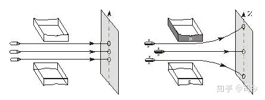

图-1 图-2

如图-2所示，假如我们用磁性材料做子弹，它一半是S极、另一半是N，当把它放到枪膛里被射出，并让它穿过带有均匀磁场的窄缝空间，则它在均匀磁场空间中的运动路径就会表现出直线和曲线二类，其中磁场“0梯度面”上的磁子弹将在均匀窄缝磁场中作直线运动，而在“非0梯度面”上或下空间则将作曲线运动。

这种无自旋的磁子弹在经过磁场区后所产生的上、下扩散运动是由于磁子弹上、下面受窄缝磁场磁极力不相等，即均匀磁场有梯度分布差异所造成的，但直线运动的磁子弹也受磁场磁极力影响，只是其上下面所受磁场磁极力大小相同罢了。

但对于自旋磁陀螺，它在窄缝磁场中的运动要比没有自旋的磁子弹复杂得多，因为自旋磁陀螺一方面要受上、下磁场磁极影响，另一方面还会在磁场中作切割磁力线的曲线“进动”。

如图-3所示，自旋磁陀螺0位于窄缝磁场空间的“0梯度面”上， 1、2则分别位于“0梯度面”上方和下方；当它们以相同速度（包括平动和自旋）穿过窄缝磁场区域时，则在后屏幕上就会看到自旋磁陀螺0、1、2穿过磁场空间后的运动变化是不同的：

  

图-3

对于磁陀螺0，当它通过磁场空间时，由于其自旋轴上下端所受磁场磁极力相等，说明磁陀螺在磁场中会保持在“0梯度面”上作切割磁力线的曲线运动。

磁陀螺1或2则不同，它们自旋轴一方面要做切割磁力的线曲线运动，另一方面还因受磁场磁极梯度力作用而产生向上或向下的“自由落体运动”，这种运动的合成轨迹就呈向上或向下的曲线运动图景。

如图-4所示，如果我们在“0梯度面”上分别发射S极在上、逆时针自旋和N极在上、顺时针自旋的磁陀螺，对N极在上、顺时针自旋的磁陀螺而言，由于其磁轴受磁场磁极极化影响就会产生180°翻转，这样就会在“0梯度面”上形成与S极在上、逆时针自旋的磁陀螺相反的运动曲线，我们在后接受屏上也就会看到一个以Z为对称轴的磁陀螺分布图案来。

  

图-4 图-5

如图-5所示，如果我们在同一个“非0梯度面”上分别发射逆时针和顺时针的自旋磁陀螺，则它们会在后接受屏上排列成顺逆、上下不同且左右以“Z轴”对称的图案形式。

按照“衍射”定义，仔细分析以上自旋磁陀螺通过磁场区域的不同运动形式，我们会发现，它们通过磁场空间在后屏幕上落点的分布形式也可以被看作是一种“衍射”行为。

以此为据，我们是不是可以用之去探讨自旋磁粒子运动出现“波粒二象性”现象的本质问题呢？

**2、粒子衍射形成的物理机制**

**2.1、衍射的定义**

衍射（英语：diffraction）是指波遇到障碍物时偏离原来直线传播的物理现象。

在经典物理学中，波在穿过狭缝、小孔或圆盘之类的障碍物后会发生不同程度的弯散传播。假设将一个障碍物置放在光源和观察屏之间，则会有光亮区域与阴晦区域出现于观察屏，而且这些区域的边界并不锐利，是一种明暗相间的复杂图样这现象称为衍射，当波在其传播路径上遇到障碍物时，也有可能发生这种现象。

衍射的形式论还可以用来描述有限波（量度为有限尺寸的波）在自由空间的传播情况；例如，激光束的发散性质、雷达天线的波束形状以及超声波传感器的视野范围都可以利用衍射方程来加以分析\[1\]。

对于粒子衍射，我们不妨定义为：粒子通过障碍物或小孔、窄缝空间时会产生偏离原来直线传播方向运动的物理现象，即产生“转弯”运动现象。

我们知道，原子核、质子、电子、光子等都有自旋和自旋磁矩性，也就是说，原子核、质子、电子、光子等均可以被看作是一个带有自旋磁场的小磁陀螺体，它们通过由原子核、质子等带有自旋磁场的粒子组成的窄缝或小孔空间时，会不会产生象上述自旋磁陀螺一样的“衍射”运动行为呢？如果会，那就说明自旋粒子的“衍射”现象并不能说明粒子运动形式是波动——其实，微观自旋磁粒子的“衍射”行为实质就是它们以一定速度通过窄缝磁场空间时会产生像自旋磁陀螺一样的曲线运动，这种运动就会使粒子通过磁场空间后在接受屏上表现出所谓的“衍射”图景来。

**2.2、解决粒子衍射问题须关注的几个方面**

要想真正弄清粒子如电子或光子通过窄缝或小孔空间时会产生衍射现象的物理本质，就必须从以下几个认识方面入手：

（1）、任何微观粒子都有自旋与自旋磁矩性，它们就像一个自旋磁陀螺，磁场最强部分位于自旋轴上，如图-6所示；对此，现代物理学实验就可以用“很细”的磁探针感知物质上自旋粒子磁轴的存在，如图-7所示。\[2\]

  

图-6

（2）、任何自旋粒子在磁场空间中运动都与自旋磁陀螺在磁场中的运动相类似，且遵循自旋磁陀螺在磁场中运动的基本原理（磁场包括均匀和非均匀磁场二种情形）。

（3）、任何粒子流中的组成粒子在平动空间的瞬间排列都不是杂乱无章的，而是有一定 “空间结构”排列而运动着的，如图-8所示；粒子这种有序排列运动的瞬时“空间结构”就可以被看做是一种流动的“粒子晶格”包体，它们这种“空间结构”排列就像固体晶体中粒子排列一样井然有序，犹似NaCL晶格；如水、空气、电、光等粒子流中，粒子的瞬间空间排列都具有“晶格”性，只不过这种结构易受外界因素（如电、磁场，温度等）影响而产生相应变化而已。

  

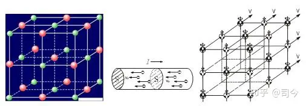

图-8 NaCL晶体 .金属导线电子流 .自旋粒子流晶格结构

现在的流体力学只是用“宏观统计”理论来研究微观粒子的大量运动现象，并没有从微观“空间结构”组成和粒子个体运动属性等方面来探究其运动的“晶格”性，也就是说，我们的流体力学是建立在宏观现象统计基础之上的，并不适于研究微观粒子个体运动和粒子流“空间结构”运动。

为此，我们是不是应该建立一门关于描述“微观流体‘准晶格’结构”的物理学呢？——这值得大家去关注和研究！

在“绝对真空”（没有场或物质的空间）中，粒子流中微观粒子的运动不仅是等速的，且会保持一定的稳定空间“晶格”结构状态——这与量子力学中真空“波包”思想是一致的。

如图-9所示，真空中光波包就是一束光子流具有“晶体结构”思想的再现，因为波包体中光子的平动速度分量都是一样的，否则就不可能在任意时刻内保证波包体的完整性和稳定性；波包中光子能量的差异主要体现在速度垂直分量不同上；其实，量子力学的波包可以用人站在一个匀速运动的小车上抖动“绳子”来予以理解，如图-10所示，波动绳上的组成质点的运动形式就可以被看做是对“波包”或“波粒二象性”概念的诠解。

  

图-9. 图-10

因此说，量子力学选用“波粒二象性”来描述自旋磁粒子通过小孔或窄缝空间会产生衍射这一现象，其真实用意就是为了体现一束“同步运动”的粒子流中粒子可以具有不同的动能，但因粒子们平动速度相同，那么，就必须引入一个能够体现其总动能不同的分量，因此选用粒子波动运动就比较合适；因为粒子波动运动不但有一个水平速度，且还有一个垂直振荡速度，为了描述垂直振荡速度的可变性（色散环境下呈现变化），于是又给出了一个“相速度”概念；这样，一束运动粒子流通过小孔或窄缝时就可以有“群速度”、“相速度”色散中的变异现象，至此量子力学宣称“成功解释了自旋磁粒子的衍射问题”。

对此，我有不同“看法”：在没有认识到粒子都有自旋和自旋磁矩性及小孔、窄缝空间也有磁场存在之前，采用“波粒二象性”来描述粒子衍射问题是可以理解的；但现代物理学已经完全揭示了粒子自旋有磁性，且由自旋磁粒子组成的小孔或窄缝空间在一定距离范围内也会表现出明显的磁场性，在这种情况下为什么我们不去用粒子和小孔、窄缝空间的这种磁属性本质去诠解自旋粒子的衍射，却还要死抱着用“波粒二象性”观念去看待它们的衍射问题不放呢？！

（4）、任何小孔或窄缝空间都是有体积的，如图-11所示，对于粒子入口孔面积而言，可有上、下、左、右多个粒子通道；不同自旋时针方向的粒子通过小孔或窄缝面进入小孔或窄缝磁场空间时，它们的自旋磁轴都会受到小孔或窄缝磁场磁极的影响而产生自旋轴方向的变化（也可称为磁极化）。

同时，孔或缝的厚薄度对粒子衍射图案也会产生影响，孔或缝越厚，自旋粒子在此空间产生的水平弯曲度和Z方向运动的距离就会越大，由此形成的衍射图案宽度也就越显。

  

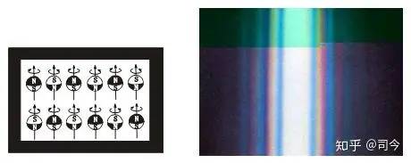

图-11. 图-12

折射或衍射轨迹的弯曲度大小主要由运动光子距离窄缝空间距离大小所决定的，同时还与窄缝空间磁场强弱有关，即用不同物质做成同宽、同厚的窄缝，当用同一束光通过它时所产生的衍射图案将是不同的，季灏研究员在这方面做过此类实验，有兴趣的朋友可以参阅季老师这方面研究的实验论文。\[3\]

（5）、根据库伦磁定理，在“0梯度面”上、下的磁场强度分布遵循1/z²分布规律，这正是粒子衍射图案中产生Z分量的根源；如果磁场空间高度足够大，则从“0梯度面”通过的自旋粒子磁轴就不会感受到磁场磁极的明显影响，那么，这些粒子通过该磁场空间时就会表现出近似于直线的运动。

如图-12所示，在光通过窄缝的衍射图案中，中心区呈白光就是因为窄缝“0梯度面”附近的磁场强度太弱、不能使通过的自旋光子产生较明显曲线运动的结果；对于靠近窄缝磁场磁极区域，则因磁场强度明显增大，它对通过的自旋光子就会产生较强的磁影响作用，故自旋磁光子就会形成较明显的衍射图案。

（6）、任何衍射现象都是窄缝或小孔空间磁场对通过此空间的粒子不能使其形成闭合曲线运动的结果，否则，这些粒子就不可能通过该磁场空间，而是在此空间中作闭合圆周运动或被磁场磁极吸附。

如图-13所示，在均匀磁场外围，如果磁场B很小或磁场空间水平面积很小，不足以使以v速运动的自旋磁粒子在该磁场空间“0梯度面”上产生闭合曲线运动，那么我们在距离磁场磁极体后一定距离处安置一个接受屏，我们就可以看到自旋磁粒子通过磁场空间后会落在接受屏上，且打到接受屏上的自旋磁粒子会表现出偏离原运动速度方向的现象；这说明自旋磁粒子通过“0梯度面”磁场后会产生运动方向的改变，我们就可以称这种现象为自旋磁粒子的“衍射”现象（衍射本质就是运动粒子通过物质空间后会产生速度方向改变的现象，即转弯现象）；但如果均匀磁场足够强（如图-13内层磁场），则自旋磁粒子进入该磁场空间后只能在此空间内作闭合曲线运动，这样我们就不会在后接受屏上看到它们飞来的身影——从系统论而言，这也可以看作是一种“内吸收”形式。

  

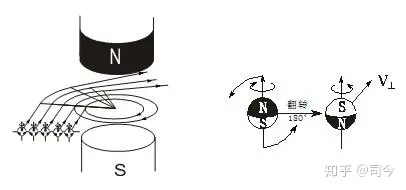

图-13 图-14

（7）、磁场磁极对自旋粒子磁轴方向都有极化、翻转影响作用。

翻转就是自旋粒子磁轴受磁场磁极影响会产生180°的翻转变化；如图-14所示，以自旋磁陀螺为例，当在它的自旋轴二端施加力偶矩使其翻转180°时，磁陀螺会产生一个垂直向内的翻转速度V⊥翻；结果是磁陀螺的自旋时针方向和自旋轴的N、S极方向将呈现与原来相反的变化。

这种翻转现象在微观自旋磁粒子运动中也存在，如将电子看做是一个自旋磁陀螺，规定它是逆时针自旋且自旋轴上端为S极、下端为N极，如图-15所示；那么正电子则是电子产生180°翻转的“对称”粒子，即如图-16所示。

  

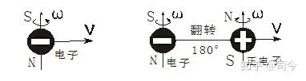

图-15 图-16

由此推理，电子与正电子本质上应是同一种粒子。

如图-17所示，如果我们将正电子沿均匀磁场“0梯度面”射入，则它在接近磁场空间入口处时，因其自旋磁轴受磁场磁极影响会产生180°翻转，并由此产生一个V⊥翻速度，这时它就成了一个S极在上、逆时针自旋的电子，它在磁场空间运动时就会产生一个与V⊥翻方向相反的切割磁力线速度V⊥切；这样，正电子在磁场空间做切割磁力线曲线运动的合成速度就是**V＝V⊥＋V0＇**，其中V⊥＝V⊥翻－V⊥切，V= V0 .

  

图-17

电流或光束中应包括不同自旋时针方向的电子或光子，当它们进入窄缝或小孔磁场空间时，磁场磁极就会对这些不同自旋方向的粒子产生翻转极化影响，使它们自旋轴磁场方向趋于统一；对被磁极翻转的自旋粒子而言，它们在磁场中的运动就与不翻转的粒子运动方向相反，从而使它们通过磁场空间后会产生一个空间“对称”的衍射图案（如图-29所示）。

（8）、任何自旋磁粒子在磁场中作曲线运动，其运动方向的判断都遵循左手或右手法则，这不仅是陀螺进动方向的判断法则，也是正电子或电子在磁场中作洛伦兹运动的方向判断法则——由此可见，自旋磁粒子是可以当做自旋磁陀螺来看待的。

**2.3、电子、正电子在磁场中的运动**

**2.3.1、几种空间磁场对电子、正电子运动轨迹的影响**

（1）、电子或正电子在均匀磁场空间运动会产生圆曲线运动轨迹，如图-18所示。

  

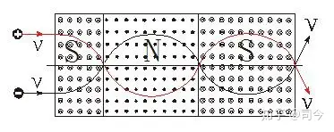

图-18

（2）、电子或正电子在轴对称非均匀磁场空间会产生抛物线运动轨迹，如图-19所示。

  

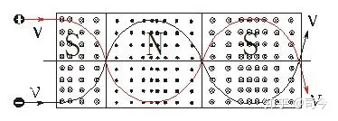

图-19

（3）、电子或正电子在点对称非均匀磁场空间会产生抛物线或双曲线运动轨迹，如图-20示。

  

图-20

（4）、电子或正电子随距离磁场中心点距离的近远不同，它们的运动曲线曲率会产生明显变化，如图-21、22所示。

  

图-21

  

图-22

**2.3.2、窄缝空间磁场的构成形式及自旋磁粒子运动**

任何物质都是由自旋磁粒子如原子核、质子、电子等组成的，如果我们从一块物质中间开一个窄缝，那么这个窄缝在一定宽度下就必然会显示出这些磁粒子耦合的磁性场来，即窄缝空间在一定范围内应是有明显磁场性的。

（1）、构成物质骨架的自旋粒子（原子核）垂直排列时，其形成的窄缝空间磁场为均匀磁场，它对其他自旋磁粒子通过该空间时，就会产生改变它们原有运动方向的影响；如图-23所示，自旋磁电子通过这种窄缝磁场时，会产生“衍射”运动，这是一种“上下型”磁场对自旋磁粒子运动的衍射行为.

  

图-23

（2）、构成物质骨架的自旋粒子（原子核）水平排列时，其形成的窄缝磁场是非均匀磁场，它对其他自旋磁粒子通过此空间时，也会产生改变它们原有运动方向的影响；如图-24所示，自旋磁电子通过这种窄缝磁场时，也会产生“衍射”运动，其实这是一种“中心型”磁场对自旋磁粒子运动的衍射行为。

  

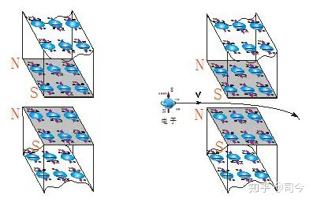

图-24

可见，窄缝空间磁场可以有二种性质不同的组成形式，即“上下型”磁场和“中心型”磁场，因此，自旋磁粒子通过不同构成形式的窄缝磁场，会产生不同的衍射行为，且它们产生衍射的物理本质也就会有差异，具体分析可参阅《磁陀螺运动与现代物理学漫谈（15）——中心型磁场对磁陀螺运动的影响（1）——兼谈杨燕实验与太空磁陀螺运动》一节。

同时还要注意，均匀磁场空间造成的衍射与非均匀磁场空间衍射是存在差异的：均匀磁场由于有“0梯度面”，在这个梯度面上磁粒子自旋磁轴二极所受磁场磁极梯度力相等，即磁场梯度力之和为0，它就不会产生Z方向的磁场梯度差运动，故在磁场空间后的接受屏上形成的衍射图案中心可以有粒子存在；相反，对于“上下型”非均匀磁场由于没有“0梯度面”，故自旋粒子形成的衍射图案中心就不会有粒子存在；关于这二种衍射差异形成的物理机制请参阅《磁陀螺运动与现代物理学漫谈（14）—磁陀螺在非均匀磁场中的非闭合曲线运动（2）——兼论施特恩-格拉赫实验形成的物理机制》一节。

**2.3、光窄缝衍射形成的物理机制**

图-25是物理学教材中常见的光通过窄缝产生衍射的插图，从这个图案中可以发现：

光束是由光子组成的，光子通过带有磁场的窄缝空间产生衍射时，会形成水平方向和垂直方向不同弯曲度的光子排列序列，即：红、橙、黄、绿、蓝、靛、紫的弯曲度逐渐减小；如果把光子看做是一个自旋并带有自旋磁矩的准刚体粒子（像自旋电子那样），那么，它们在窄缝磁场空间的运动就可以用自旋磁陀螺运动来描绘，如图-26就可以看做是自旋光子通过均匀磁场空间时产生“衍射”现象的物理机制图景。

  

图-25 图-26

但这里却有一个困惑问题，即图-25的衍射图案与图-28彩虹、图-29三棱镜折射所形成的光色排列序列为什么正好相反呢？

  

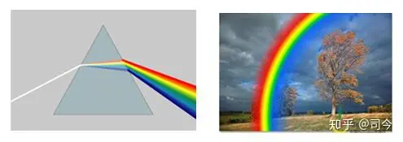

图-27 图

原来，我们所得的图-25光衍射图案是在窄缝后加了一个凸透镜的结果；如图-29所示，从折射率来看，如果窄缝后面没有加凸透镜，则光通过窄缝所产生的光排列序列就会与彩虹、三棱镜折射所形成的光排布序列一致了。

  

图-29

现代物理学对白光衍射现象通常是从光子运动频率存在差异的观点来给予解释的；但当我们用超纯频率的激光作光源时，让它通过小孔或窄缝时也会产生类似“红橙黄绿青蓝紫”的光“衍射”形式的排列图案，这就无法再用“频率差异”去解释了，如图-30所示。

  

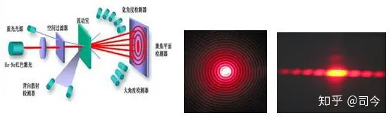

图-30.激光孔衍射.红激光孔衍射.He-Ne激光窄缝衍射

现代物理学实验证明，紫光能量比红光大，这个能量应指动能，这样说来，同频率光的平动速度就应接近一致；从超纯频激光通过窄缝的衍射图案中可以看出，越靠近小孔或窄缝边缘通过的激光光子，其受窄缝磁场磁极的影响就越大，故在Z轴方向产生的垂直运动速度也越大，依据速度矢量合成法则，则此衍射图案上的激光光子速度就有V1= V0+ Vz1＞V2= V0+ Vz2，（Z为磁场“0梯度面”到孔或缝边缘的垂直距离，其中Z2＞Z1）；也就是说，在激光衍射图案中，越靠近衍射图案中心的激光光子总动能越小，反之越大。

如图-31所示，在均匀磁场的“非0梯度面”上作磁螺螺运动的自旋磁光子速度可以分解为水平速度V圆和垂直速度V梯二个分量，且有V螺=V圆+Vz，V圆=C=V∥+V⊥，V梯=Vz.

  

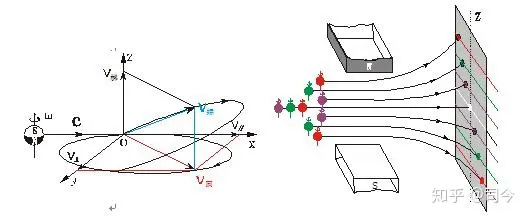

图-31 图-32

再看白光通过孔或缝产生衍射时，如果∑E紫＞∑E红，则说明∑V紫＞∑V红，假如光子群速度均为c，则说明光束波包中光子垂直振动速度分量有V⊥紫＞V⊥红，那么这个“垂直振动速度分量”的物理含义是什么呢？其实质就是小孔或窄缝空间存在磁场梯度对自旋光子磁轴施加力影响所产生Vz分量的表现；而光速c不变，实质就是以速度c自由运动的光子，进入磁场空间作切割磁力线时，它在洛伦兹平面（粒子平动速度与磁场磁力线垂直的平面）上作曲线运动的速率不变，仍为c.，这不仅符合“爱因斯坦光速不变”原理，也与均匀磁场中电子“洛伦兹运动速率不变性”原理相一致。

如此看来，越靠近窄缝运动的光子其产生的V螺就越大，产生的折射率也就越大，光子所具有的总动能也会增大。

因此说，白光通过窄缝、小孔或三棱镜产生衍射或折射时（衍射与折射的物理本质应是相同的），它们对光“折射率”的影响主要是由光子距离窄缝、小孔或三棱镜组成原子的原子核远近所造成的，并不是说白光中紫光子折射率就一定会比红光子大；如果红光子靠近窄缝边缘或三棱镜原子核近处，紫光子远离窄缝边缘或三棱镜原子核处时，那么，红光子的折射率也可能会比紫光子大，如图-32所示。

同时，仔细分析还可以发现，爱因斯坦光速不变原理体现的应该是动能守恒，他包括二个方面：（1）.光速在任何物质中作洛伦兹平面运动时，其曲线合成速度为c不变；（2）.光源中的光子从约束态变成自由态时，其运动速度为c，这个速度与光源运动速度无关，因光源就是它的参照物。

关于微观粒子运动动能公式有二个，即E=mc2和E=hf；但这二个公式的物理含义是有明显差异的：E=mc2指的是光子在自由状态下作直线运动的平动动能，E=hf指的是光子在非自由状态下作曲线运动的动能，且在同一运动平面内有E=mc2=hf=mv⊥2+ mv∥2，c2= v⊥2+ v∥2，如图-33所示。

  

图-33

**2.4、三棱镜折射与色散问题**

现代物理学认为，白光是由七色光组成的，当它们进入玻璃三棱镜以后，其紫光速度最慢，偏折得最厉害，因此，紫光就位于折射光谱序列的下端；而红光速度最快，偏折得也就比较少，因此，红光位于折射光谱序列的上端；橙、黄、绿、蓝、靛等色光，按波长长短，依次排列在红光和紫光之间，三棱镜就是这样把白光分解成七色光谱的。\[4\]

对此解释我有不同“看法”：单从粒子论观点看，既然红光速度较紫光块，为什么红光所表现的能量却比紫光小？（如果说是频率差异所致，这岂不又回到“波粒二象性”老议题上了，如此这般也就将永远不可能揭示“粒子波粒二象性”产生的物理本质了！）。

光通过三棱镜或水珠产生折射问题，就其本质而言也是一种光粒子“衍射”行为，不过这种衍射机理不同于窄缝衍射，它是“中心型”非均匀磁场对自旋磁光子运动所产生影响的结果；具体分析请参阅《磁陀螺运动与现代物理学漫谈（16）—单体磁场对动态磁陀螺运动的影响（2）—兼谈太阳与原子系形成的动态原理及AB效应形成的物理机制》一节。

我们从“中心型”磁场的磁陀螺运动实验中得知，“中心型”磁场对自旋磁陀螺运动会产生二种不同的运动曲线轨迹，如图-34是一种双曲线运动，图-35是一种抛物线运动。

  

图-34 图-35

玻璃的微观结构是由硅酸盐组成的，在硅酸盐晶体中，硅原子核排列是有序的晶格结构，如图-36所示；将它做成三棱镜，其斜面的硅原子核就会错开排列，这种斜面排列形式就杜绝了光线从硅原子核下方进入镜体的可能性；如图-37所示，从硅原子核上方通过的光子有二种类型，它们互呈“180°翻转”对称，假如一种光子从硅原子核上方通过时会产生双曲线运动，那么，这种运动就表现为“反射型”偏振光；而另一种光子从硅原子核上方通过时就会产生圆或椭圆形式的曲线运动，这种运动就表现为“折射型”偏振光。

  

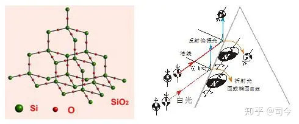

图-36 图-37

根据库伦磁荷定理F=kmQmqm/r²可知,越靠近硅原子核的光子所产生的运动曲线曲率就越大，其透过三棱镜后产生的弯曲度就越大，并向紫光靠近；反之产生的弯曲度就越小，则向红光靠近，如图-38所示。

  

图-38

这就是三棱镜对照射光线产生折射与反射的物理本质所在。

**3、结束语**

通观现代光学理论可以看出，我们对光现象的解释是一种无厘头的描述，从“几何光学”到“波动光学”再到“量子光学”都没能真正解决光的“波粒二象性”本质问题，这是因为光子运动真的具有“波粒二象性”吗？我看非然！

现在我们知道了光是由光子组成的，光子具有自旋和自旋磁矩性，但我们解释光衍射现象时却曾没有真正地将它的这些物理属性运用到“波粒二象性”的诠解上来，这不能不让人深思！

光几何学和波理论充其量只能算是对光现象描述的理论，根本不是对光衍射形成物理机制本质的探讨；量子力学虽然在这方面做过“努力”，但它却忽略了物质空间的磁场性，这是它也无法真正解决“波粒二象性”本质的根源所在！

如果我们从粒子自旋、自旋磁矩性出发，兼考虑窄缝、小孔空间的磁场性，那就为我们解决“波粒二象性”的本质问题凭添了“一种”希望。

  

  

本节正是沿着这一思想去“尝试”性地思考“波粒二象性”现象出现的物理本质问题，但愿这种“尝试”能够对广大物理学研究者和爱好者产生“启迪”效果，并期望更多“有志之士”关注这种“思路”的研究与探索！——对此，本人将“感激不尽”！

**但愿“追光”路上，我不再孤独！**

  

  

**【特别声明】：**

1、本文所用图片除作特别说明和自我绘制外，均来自「百度图片」，在此对「百度」网表示感谢！

2、特别声明：如其他媒体、网站或个人从本博转载此文，须保留本博“地址”，否则视为侵权行为。

  

**【参考文献】略**

  

**【注】：**

\[1\]、衍射：[http://baike.sogou.com/v2782499.htm;jsessionid=07290DD71433EFCF93ABA94B222A9C80.n2](https://link.zhihu.com/?target=http%3A//baike.sogou.com/v2782499.htm%3Bjsessionid%3D07290DD71433EFCF93ABA94B222A9C80.n2)

\[2\]、中科院物理研究所·物理实验室/《单自旋量子态的探测与控制》：

[http://sf5.iphy.ac.cn/chinese/directionview.asp?cid=12](https://link.zhihu.com/?target=http%3A//sf5.iphy.ac.cn/chinese/directionview.asp%3Fcid%3D12)

\[3\]、季灏/《“干涉”实验的新研究》，《中国科技成果》2008年 第14期 ，P30-32.

[http://blog.sina.com.cn/s/blog\_9f045b310101d24x.html](https://link.zhihu.com/?target=http%3A//blog.sina.com.cn/s/blog_9f045b310101d24x.html)

\[4\]、光的色散：

[http://baike.baidu.com/link?url=2ceMbX9bFkYpxGHvgoLVDplkn3GAP71w37OruOjZ5CiPadOPZERCf6lGl8j\_q3akJLfitvMGp80CbusCY9\_7Qa](https://link.zhihu.com/?target=http%3A//baike.baidu.com/link%3Furl%3D2ceMbX9bFkYpxGHvgoLVDplkn3GAP71w37OruOjZ5CiPadOPZERCf6lGl8j_q3akJLfitvMGp80CbusCY9_7Qa)

**上期目录：磁陀螺运动与现代物理学漫谈（11）——均匀磁场对磁陀螺运动的影响（1）**——兼谈洛伦兹运动形成的物理机制

**下期预告：磁陀螺运动与现代物理学漫谈（13）——非均匀磁场对磁陀螺运动的影响（1）**——兼谈磁镜效应形成的物理机制