---

title: 天机，隐藏在陀螺里的“大统一”论 ——读《陀螺里的天文、时空与量子理论》一文随感 - 知乎

date: 2024-05-12 22:51:00

categories: vortex

tags: 
- 无

original_url: https://zhuanlan.zhihu.com/p/69711538

---

# 天机，隐藏在陀螺里的“大统一”论 ——读《陀螺里的天文、时空与量子理论》一文随感 - 知乎

## 天机，隐藏在陀螺里的“大统一”论

——读《陀螺里的天文、时空与量子理论》一文随感

司 今（jiewaimuyu@126.com）

* * *

  

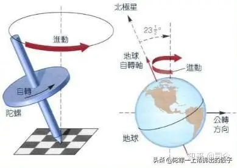

  

**0、引言**

最近，有幸拜读了2004年诺贝尔物理学奖获得者弗兰克·维尔切克撰写的一篇读书感小文——《陀螺里的天文、时空与量子理论》，他在文中强调了一个观点：”如果人们能更深入地思考和研究陀螺，那么机械工程与众多工业门类将取得更大的进展……而我们对于光、热辐射以及其他电磁现象的认知也会拓展得更为迅速“（参考附录1）。

 

  

因这个观点与我的“自旋场理论”基本相通，为此，我想写点关于现代物理学与陀螺运动（特别是磁陀螺运动）之间关联的随感，借此抛砖引玉，并希望今后的物理学能够在这条道路上结出“正果”，也愿从事基础理论研究的物理学人们能够关注这一思考思路，或许它真的能够打开一扇通向宏观与微观物理规律大统一的格物之门.....

**1、我的感悟**

在我们的视野中，旋转是宇宙中物质运动的重要组成部分，大到星系、行星，小到电子、光子，它们都有自旋、公旋性，要正确认识客观世界的运动，就应该洞悉这些物质自旋和公旋所隐藏的物理本质；而且，有趣的是这些旋转运动现象却与陀螺（磁陀螺）运动基本相通。

现代物理学已证明：大到银河系、太阳、地球，小到原子、电子、光子都有自旋和自旋磁矩存在，而且它们都可以被视作一个自旋磁陀螺，它们通过自旋磁场的相互作用，可以形成各种其他形式的曲线运动。

  

  

因此，我一直认为，陀螺—特别是磁陀螺，是宇宙真正的主宰者，是上帝掷出的骰子。

可以这么说，磁陀螺运动上通“大宇宙”，下连“原子系”，直至包括光子运动；就其所包含的物理学范围而言，它前可以衔接牛顿万有引力、库伦电、磁荷力，后可以关联天体物理学、量子力学、粒子物理学等，是破除目前物理学困境的最佳选择法宝！

  

  

但是，在我们的物理学发展史中，物体自旋及其物理效应问题却一直被物理学界所遗漏或忽视的问题；物体自旋可以产生磁场吗？带有磁场的自旋物体通过磁场空间时会产生什么样的运动变化？物体自旋与其平动有什么直接联系？等等，对于这些重要的运动问题，直到现代也没有被人们真正提起和重视过。

  

  

而我专注研究陀螺、磁陀螺运动多年，目的就是为了找到一个既适合于微观粒子也适用于宏观星体运动描述的统一物理模型，并通过这个物理模型去诠解它们在磁场空间中运动所呈现的那些复杂现象的物理本质。

  

  

通过多年不辍地实验、研究和思考，我隐约发现，磁陀螺在磁场中运动确实可以作为一个物理模型，用这个模型既能够诠解宏观世界星系、行星、卫星的运动现象，也能够阐述微观领域原子、电子、光子的运动机制；同时，也间接证明了“物体自旋可以产生磁”这一物理本质；并认为，地球磁场与电子磁场所产生的物理机制是一样的，如果将地球、电子、光子等可看作是实实在在的“自旋磁粒子”，那么，它们的磁场都是其自旋运动效应的体现，而且这些“粒子”运动所表现的曲线性和波动性，都是它们在宇宙或物质磁场空间做“磁陀螺运动”所表现出的“假象”……

我在“新华网•发展论坛”上，曾看到一位叫陈广民的网友呼吁：

“谁掌握陀螺运动原理（特别是磁陀螺运动原理），谁就拿到了打开科学大门的金钥匙，谁就拿到了砸碎伪科学的大铁锤！掌握陀螺运动原理后的中国科学一定会在很短时间内雄起来！”——这与维尔切克的想法真有点“不谋而合”的味道。

在此，我想他的感悟是深沉的，也是深厚的！希望有关科研部门能够关注并重视陀螺、特别是磁陀螺运动的理论研究！

**2、陀螺与磁陀螺运动研究的困境**

  

  

陀螺运动是一个既古老又新颖、既复杂又迷人的话题；说它古老，在中国新石器时代就出现了石制陀螺，在欧洲也可以追溯到十八世纪之前；说它迷人，不仅指它的运动属性特殊，而且自十八世纪欧拉开创陀螺研究之风后的三百多年里，人们对陀螺运动的研究、开发和运用活动就从没有停止过；说它复杂，可以从欧拉刚体力学方程组和李群代数中看出这种端倪；说它新颖，可以在太阳系行星运动、量子力学拉莫尔进动中看到它的踪影……

  

  

也许由于历史的厚重，也许陀螺运动现象用现代物理语言描述太复杂，直到现在我们对它运动的真正物理奥秘仍显得知之甚少，特别是磁陀螺运动问题。

  

  

现代，由于人类观测视野的拓展和实验水平的提高，我们不论从宏观天体还是微观粒子的运动中都能够觉察出它们运动共性，即陀螺运动性；不过，这种陀螺运动性有别于经典的陀螺运动，因为它们都带自旋和自旋磁矩，因此，它们的运动就与自旋磁陀螺运动有相似之处，所以，认真研究陀螺运动形成的物理原理，特别是磁陀螺运动原理，犹显得意义重大。

 但就目前而言，将磁陀螺运动的物理模型纳入物理学宏观与微观研究中去的最大难题是，磁场的真正起源问题。

**3、磁性起源与自旋**

从目前物理学已有的研究理论成果来看，物质磁性的起源有二种假说形式：

**3.1、安培分子电流假说**

安培认为，在原子、分子等物质微粒内部存在着一种环形电流--分子电流，使每个微粒成为微小的磁体，分子的两侧相当于两个磁极.通常情况下磁体分子的分子电流取向是杂乱无章的，它们产生的磁场会互相抵消，对外不显磁性；但当有外界磁场作用后，分子电流取向就会大致相同，内部分子间相邻的电流作用会相互抵消，而表面未抵消的部分，就会显示出宏观磁性来。

  

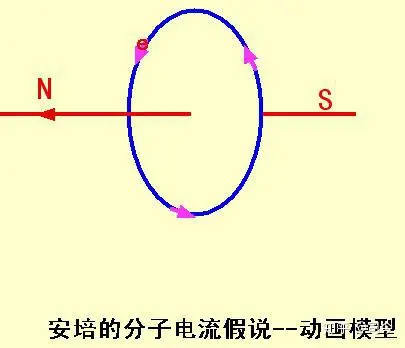

  

安培分子电流假说在当时人们对物质结构知识甚少的情况下是无法得以证实的，因此，当时人们普遍认为它带有相当大的臆测成分；但在今天，我们已经了解到物质由分子组成结构层次，即分子是由原子组成的，原子中有绕核运动的电子......因此，安培分子电流假说有了实实在在的物理内容，它已成为人们现代认识物质磁性起源的一个重要理论依据。

  

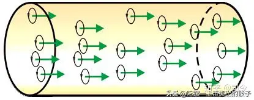

  

但与安培同时期的德国物理学家塞贝克曾反对安培分子电流假说，他认为，磁是更为本质的东西，电流则是磁作用的结果。

今天，我们从现代物理学角度来看安培分子电流假说，它存在一个致命的弱点，即这种假说不能够解决基本粒子磁性起源问题，这就间接证明了塞贝克的“反对”是有一定科学道理的。

**3.2、物质自旋假说**

**3.2.1、微观方面**

为了解释施特恩-格拉赫实验、碱金属精细结构分裂及反塞曼效应等问题，1925年，乌仑贝克与古兹米特联合发表了关于电子自旋假设的论文，在这篇论文中，他们认为电子自旋会产生自旋磁矩，即电子自旋可以产生自旋磁场，这被物理学认为是物质磁性的第二个起源。

  

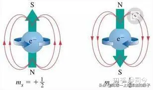

  

但量子力学提出的自旋磁矩假说，也有一个致命弱点，那就是对于点粒子而言，无法从物理原理上给出自旋与其磁矩的内在联系及理论定量，因为点粒子是没有内部组成结构的最基本粒子，如电子、光子等。

  

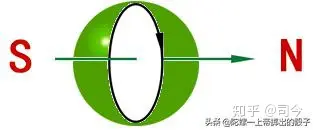

  

对此，我们认为，现代物理学在研究物质自旋问题上缺失了一个重要环节，那就是对物质自旋所产生的物理效应问题探讨的缺失，这也是牛顿力学和经典电磁学遗留下的重要问题。

**3.2.2、宏观方面**

1947年，英国物理学家、1948年诺贝尔物理学奖获得者——布莱克特曾提出，任意一个旋转质量体都具有磁矩，它与旋转体内是否存在电荷无关；他认为，地球和其他天体的磁场都是在旋转中产生的，也就是说星体自旋生磁，就好像电子转动能产生磁场一样。

  

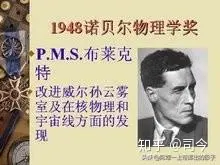

  

但是，这一假说在试验和天文观测两方面都遇到了困难，因为在现有的实验条件下，还没有观察到旋转物体产生的磁效应，而对天体的观测结果表明，每个星球的磁场分布状况都很复杂，尚不能证明星球的旋转与磁场之间存在着必然的依存关系。

因此，布莱克特后来发表声明，说他放弃这种假说。

  

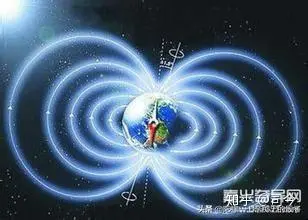

  

不过，值得说明的是，无论地球表面测得的地磁场方向如何发生变化，但在太空中地磁场的方向却始终不变；因为在太空中测得的地磁场是整个地球自转产生的旋转质量场效应，它并不会因为地壳与地核相对速度的改变而发生变化；根据左手定则，在太空中测得的地磁场的N方向始终在地理南极上空。

目前，有人提出，将安培分子电流观点与量子力学自旋磁矩理论相结合去探讨讨宏观自旋物体磁性起源问题（参考附录1：《浅析旋转体假说》）。

他们认为：在电磁感应效应中，通电导体产生的磁场强度与电流强度成正比，即与导体内“定向移动”的自由电子数目成正比；而每个电子的自旋角动量又是恒定的，所以磁场强度实际上是与所有电子的自旋角动量之和成正比。

  

同理，宏观物体产生的磁场强度，也应与旋转质量场的角动量成正比，即与物体的质量和自旋角速度成正比，与质量场的旋转半径（观测点到物体质心的距离）成反比。

用公式表示为：

H = f mω/r = f 0 m / T r (f 0为常数，T为自转周期，r为旋转质量场半径).

根据这一公式，在地球表面测得的磁场强度H，只与地核的质量成正比，角速度ω的取值为地壳与地核自转角速度之差，r为地球的半径（地磁场强度为5×10-5特斯拉）。而地球在太空中形成的空间磁场，其磁场强度与整个地球的质量成正比，与地球的自转角速度成正比（近似值），与观测点到地球中心的距离成反比。

  

  

因此，在近地球的宇宙空间，地球所形成的空间磁场强度大于地表的磁场强度；空间磁场的最大特点是磁极恒定，不会像地球表面磁场那样发生磁极倒转现象，这就是自旋磁场与耦合磁场的根本差异。

**3.3、我的行星磁场观**

从九大行星有关数据来看，行星磁场强度和行星自转应该有密切相关，例如：金星，它和地球其它参数很接近，但它的自转速度却很慢，因此表现出几乎没有可观的磁场表现；而自转周期短的其他行星几乎都有强磁场，如：木星、土星等；所以，我们认为，行星磁场应该来源于它们本身所具有的质量与其自旋角速度。

  

  

如果我们把行星看作是一个“类刚体”，依据我的“自旋生磁”理论，则行星自旋所产生的磁量大小就可以用qm=mω来予以定量，如果是类似于罗兰圆盘那样的旋转方式，则可以用qm=mΩ（Ω是公转角速度）来予以描述。

  

自旋生磁：qm=mω

现代物理学已证明，微观粒子都有自旋，同时也都有自旋磁矩存在；宏观天体也都有自旋，同时也应有磁场存在，天文观测证实了这一点，而且天体所具有的磁场强弱确实也与其自旋角速度大小有关。

  

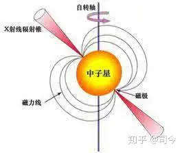

  

例如：中子星由于其自旋快、质量大，虽其体积很小，但却能够表现出极大的磁性，故它会在其周围空间表现出极强的磁场分布，同时，这种强大的自旋磁场使它对周围其它存在物体磁场的星体产生强大的吸引力；又如木星、土星、海王星等，因其自旋速度和质量都比地球大，故其表现出的自旋磁场就比地球强；再如金星，虽其质量比火星、水星大，但因其自旋速度较小，故其表现出的自旋磁场就比火星、水星弱。

  

  

我们可以以金星与火星为例，通过计算作以比较：

设金星质量为m(金)、自旋角速度为ω(金)，火星质量为m(火)、自旋角速度为ω(火)，依据qm=mω计算，则得：

q(金)=m(金)ω(金)=4.83×10^24×2π/243×24=0.0052×10^24（kg/h）.

q(火)=m(火)ω(火)=6.4×10^23×2π/24=1.67467×10^23（kg/h）.

故有q(火)＞q(金)，这表明金星对外空间表现出的磁场要比火星弱得多。

**4、特斯拉的动态场理论**

在研究自旋与场的关系问题上，我们不应忽略一个“隐形大神”——特斯拉！

  

  

1936年，尼古拉·特斯拉完成了他的划时代论著——《引力的动态理论》，这个理论被誉为是大统一场理论的先驱，但与爱因斯坦理论不同的是：特斯拉的理论是一个基于牛顿万有引力延伸出来的理论。

特斯拉认为：旋转是万物的共性，旋转从小到大是无止尽的，每一个引力的诞生都会归附到旋转之上，成为重力场；物质运动只有旋转概念，没有速度，速度的参数必须被销毁，不存在速度；对于个体系统的「引力段」才有速度概念，且它们有大段和小段之分，但最小引力段的速度也必定略快于光速，直到衔入重力场成为新旋转，引力段才消失，速度也就随之消失。

  

特斯拉在他的《引力动态理论》中试图想通过以太运动来解释引力产生的原因，即通过高速旋转的电场来带动以太旋转，从而改变引力的大小和方向，对此，我们不敢苟同，但他认为能量与质量具有二元性，还是值得肯定的。

  

总之，特斯拉的动态场描述的就是一种旋转场，而且场与场之间的力效应会使它们产生平动；也就是说，平动是建立在旋转（自旋）概念之上的一种特殊运动方式。

但令人遗憾的是，特斯拉的引力理论并没有真正给出的旋转“引力公式“来。

**5、我的自旋场理论**

我们知道，平动速度是牛顿力概念提出的基础，如果平动速度被销毁，那么牛顿力概念也将不复存在；那么，新的力概念将如何定义呢？

  

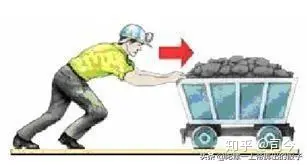

  

按照特斯拉的动态引力观点——旋转是力产生的根本原因，那么我们就用旋转概念来重新定义出力概念，这种力概念是建立在物质旋转或自旋场基础之上的，它也就不再是平动速度之上的力概念了。

对此，我从牛顿力学中的刚体或质点动量公式思路出发，给出了一个描述刚体或质点自旋的客观物理量，即P＇=mω；既然P=mω与P=mv分别描述了二种不同形式运动的“动量”，那么，我们通过它们就应该可以定义出各描述自运动状态的力概念。

  

  

我们知道，将物质平动速度与时间结合，可以得出牛顿力的定义，即：

dF=dP/dt=m.dv/dt.

而且，将这种力概念运用到天体运行系统中就可以得出牛顿万有引力公式：

F=GMm/R².

  

  

同理，如果我们将物质自旋角度与时间结合，也应该可以得出自旋力的定义，即：

dF＇=kdP＇/dt=kmdθ/dt.

（这里，k=MΩ/πR²，dθ/dt=ω，Ω是M的自旋角速度，ω是m的自旋角速度）.

而且，将这种力概念运用到天体运行中也可以得出物质自旋引力公式：

F＇=(MΩ)(mω)/πR²=(Ωω/π)(Mm/R²)；

如果令G＇=Ωω/π，则可得与牛顿万有引力相类似的自旋场力的数学描述公式：

F＇=G＇Mm/R².

  

  

当我们将太阳与地球的自旋角速度代入计算，则得：G＇=Ωω/π=6.6638×10^-11周²/秒².

而我们现在用卡文迪许扭秤测定的万有引力常量值为：G=6.6726×10^-11m³/kg.s².

可见二者的数学值大小基本相同。

但这里留给我们的最大困惑是：为什么会出现用自旋角速度计算出的G＇值与牛顿万有引力G值的物理量纲不同的情况呢？

对此，我认为，这是因二者力概念建立的方式不同所致，前者的力概念是建立在自旋角速度之上的，后者则是建立在平动速度之上的，它们是二种不同力的描述体系，即分别描述了二种不同的物质运动形态，故二个公式中各自引力常数的物理量纲就会出现不同。

  

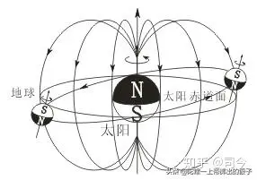

  

（**注：**关于这方面物理论述与数学推理，敬请参阅司今《物质自旋与力的形成—关于万有引力与磁荷力本质与统一问题的探讨》一文）。

**6、广义相对论与诺特定理**

爱因斯坦广义相对论认为，引力只不过是时空为弯曲的一种表现形式，要想把这种表现用数学形式表达出来，须借助于新的数学形式，即黎曼几何；爱因斯坦在运用黎明几何搭建他的“新万有引力方程”时，引入诺特定理才使他最终找到了将时空曲率和处于其中的质量和能量相联系的方程，这也是广义相对论中唯一独立于几何之外的为数不多的非几何性的物理内容。

  

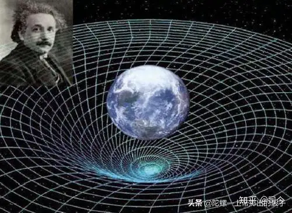

  

诺特定理是20世纪理论物理的中心结果之一，它描述的是物质运动连续对称性与守恒定律的一一对应性，它是基于最小作用量原理而成立的物理定律；它的物理意义不仅左右着量子力学的微观世界，也对宏观天体物理学产生深远影响，堪称是20世纪最伟大的物理规律发现之一。

诺特认为，在物质运动中，一个守恒量的存在并非理所当然，而是宇宙规律对称性的体现。无论任何物理理论，只要符合某种对称性，那么这个理论中就一定有一个对应的守恒量，这个量不会随着系统的演化而变化。如果物理定律在时间长河中的每一个时刻都相同，它就有着所谓的“时间平移不变性”，对应的守恒量就是能量；如果绕着茫茫宇宙任何一个方向旋转，物理定律仍然不变，那么它就有“旋转不变性”，则对应的守恒量就是旋转角动量。

  

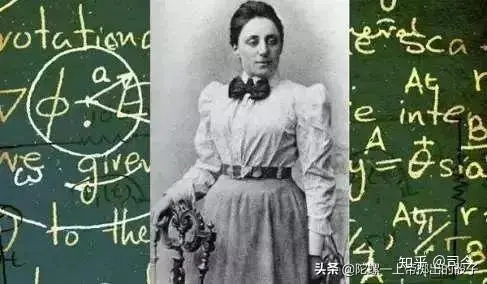

  

无论什么宇宙，无论什么规律，只有有一个对称性，则就有一个守恒量；角动量，不过是旋转不变性所对应守旋转恒量罢了。

从诺特定理的物理内涵中我们可以看出，旋转、对称、守恒是一一对应的，但爱因斯坦在引入诺特定理建立他的广义相对论方程时，倒是没有体现旋转性（包括自旋）；由此而论，广义相对论方程的缺陷不仅仅是引入了一个万有引力常量G的问题，而且还有缺失了一个宇宙运动共性的参量，即旋转（包括自旋）参量，因此说，爱因斯坦的广义相对论是存在一定缺陷的，如它一遇到旋转问题就“失灵”了。

  

  

爱因斯坦广义相对论的物理本质是想抛弃牛顿力思想，从空间几何角度去重新解读牛顿万有引力及场的问题，他认为，场是质量引起的时空弯曲现象。

但当我们深入分析爱因斯坦理论时，就会发现他规避了一个物理本质问题，即场是如何得来的问题。

  

  

如果说场是由质量引起的，那么，这个质量体是在运动中产生场还是在静止时就有场？如果是后者，那他的所谓广义引力理论就与牛顿的万有引力理论没有什么本质区别，只不过是换了个思考角度，用黎曼几何方法去重新诠解牛顿万有引力而已；如果是前者，那么**，**在他的统一场方程中却根本就找不出与“自旋”相关的物理参量，这就违背了他引入诺特定理去搭建广义相对论方程的初衷，这也将预示着广义相对论可能存在严重缺陷！

广义相对论方程如下：

  

  

其中，G是万有引力常量，Pm是能量-动量张量；可见，其中并没有包含旋转参量。

  

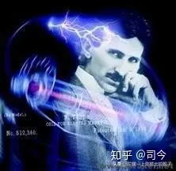

  

尼古拉·特斯拉曾尖锐批评过爱因斯坦的广义相对论，说他完全催毁了牛顿力学体系是一种错误；他认为，每个引力的诞生都会归附到旋转上而成为重力场，整个宇宙只有旋转概念，没有速度概念，或者说速度是在寄生在旋转之下的一种相对概念；但这个观念适只用于实证派科学上，却不适用于爱因斯坦广义相对论......

由此，我们认为，物质自旋是场的真正起源，因此，在统一场探索的进程中，特斯拉的想法可能要比爱因斯坦广义相对论的想法要深刻得多，因为他发现了宇宙运动的共性——旋转与场的内在关联性。

**7、广义相对论的缺陷与爱因斯坦—嘉当理论**

自爱因斯坦将牛顿引力理论推广为广义相对论（爱因斯坦引力理论）以来，爱因斯坦的这种引力理论经受了严格的实验检验，并取得了巨大成功；但随着实验观察数据的积累，爱因斯坦引力理论也遇到了诸多困境，如：

（1）、Ia型超新星观察数据表明，宇宙是加速膨胀的；为了在爱因斯坦引力理论中说明宇宙的加速膨胀现象，须引入具有负压的暗能量，而暗能量的观察密度却与量子场论的估计值相差 n倍。用光度资料测得的星系质量无法说明星系旋转曲线，为了在爱因斯坦引力理论中说明此现象，必须引入占星系质量为96%的暗物质，暗物质在星系中的分布情况却又难以用现有的物理理论予以说明。

  

  

（2）、美国的先锋号宇宙飞船在远离太阳时受到了无法用爱因斯坦引力理论（牛顿引力理论）及其它物理效应说明的指向太阳的微小引力变化；后来物理学家仔细研究了其它宇宙飞船也发现了不能用爱因斯坦引力理论（牛顿引力理论）及其它物理效应来说明这种微小作用力，这种宇宙飞船轨道异常现象强烈的表明：爱因斯坦引力理论具有缺陷。

（3）、利用标准的正则量子化方法和路径积分方法将爱因斯坦引力理论进行量子化，却得到了不能重整化的结果，这宣告了爱因斯坦引力理论的标准量子化的失败。虽然圈量子化方法取得了一定的成果，但圈量子化是否具有爱因斯坦引力理论极限却没有得到证明。粒子物理学的理论也取得了一定成果，但仍未得到一个可重整化的量子引力理论。爱因斯坦引力理论的量子化困难提示我们：爱因斯坦引力理论可能存在缺陷。

  

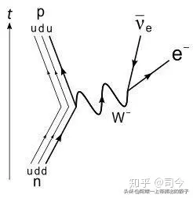

  

（4）、当将爱因斯坦引力理论与狄拉克电子理论作比较研究时，我们发现：爱因斯坦引力理论与狄拉克电子理论根本不相容。由于狄拉克电子理论的实验检验精度远大于爱因斯坦引力理论的实验检验精度，因此我们有理由认为：爱因斯坦引力理论具有缺陷性。

  

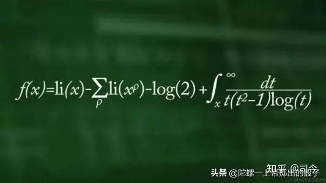

  

......，......，......

面对爱因斯坦引力理论有如此多不如意的地方，1922年，法国数学家埃利-嘉当首先提出一个猜想，即认为广义相对论应该被延伸成包括仿射扭率(其物理意义可以视作一种自旋态)，于是他给出了包含自旋参量在内的“新广义相对论方程”，这个方程又被称为爱因斯坦-嘉当引力-自旋场理论，其物理意义是：

  

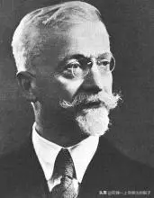

  

(1) 用仿射理论代替了爱因斯坦的度规理论，这会对重力能提供更好地描述；

(2) 将仿射扭率与自旋关联起来，其在几何意义上就是时空介质的位错场项的连续近似，这样就能够兼容体现电子自旋的狄拉克电子理论。

如此以来，通过将爱因斯坦引力理论推广为有挠时空中的爱因斯坦-嘉当引力-自旋场理论，就可以消除爱因斯坦引力理论与狄拉克电子理论之间的矛盾，因此可以认为，爱因斯坦-嘉当引力-自旋场理论要是比爱因斯坦广义相对论更加接近“真像”；而且，利用爱因斯坦-嘉当引力-自旋场理论可以在不引入暗能量的情形下，解释飞船轨道异动和宇宙加速膨胀，也可以说明星系暗物质的分布情况。

  

  

由此可见，爱因斯坦-嘉当理论是后期的理论物理学将广义相对论延伸至旋转领域以正确处理自旋角动量而予以修订的更广义的引力理论。

这个理论曾预言：磁化物质之间除了有磁场作用力外，还应存在附加的自旋-自旋的作用力；对此，我们认为，这种预言模糊了“自旋生磁”的本质，因为，自旋本身就是磁性起源方式之一，故说这种论断将是不可靠的。

  

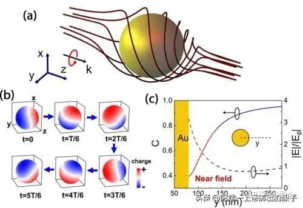

  

那么，广义相对论为什么不能够正确描述关于自旋轨道耦合的问题呢？

我们知道，广义相对论是建构在黎曼几何之上的，但在黎曼几何中要求里奇曲率张量Rab中的a与b必须是对称，即Rab=Rba.

当爱因斯坦曲率张量Gab定义为Gab=Rab-Rgab时，也就要求Gab必须对称。

  

  

在广义相对论中，爱因斯坦曲率张量为局域重力建构了模型，且其（透过重力常数G的联系）等同于应力-能量张量或能量-动量张量Pab.（注：此处我们将能量-动量张量表示为P，是因为广义相对论中常用来表示能量-动量张量的T，在爱因斯坦-嘉当理论留给了仿射扭率）；可见，爱因斯坦曲率张量的对称性强迫动量张量也必须是对称的，然而，当自旋与轨道角动量进行交换时，根据角动量守恒的广义式，则知动量张量并不对称，因自旋流散度（Tab-Tba）/2=0；因此，广义相对论就无法适当地为自旋轨道耦合建构出一个合理的物理模型了。

  

  

**8、结束语**

展望物理学未来，或许没人知道物理统一的终极理论会是什么？但每个人都会认为它一定拥有像诺特定理所描述的那样，具有高度的对称之美，而这种美却能在小小的陀螺运动中得以展现。

当我们打开物理学宏观与微观的天窗时，眺望：宇宙在旋旋，行星在自旋，原子在旋转，电子在自旋.......整个物理世界就是一个旋转与自旋的世界！对此，我们惊叹：

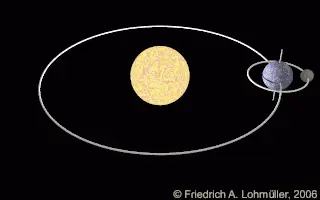

陀螺，真是天地间的尤物，上帝掷出的一骰子，统一论里的骄子，她在永恒地运动中检验着人类思考的成果，挑战着人类思维的极限！

* * *

**【附录1】：**

**浅析旋转体假说**

作者 何维

**摘　要：** 本文将首先对地磁场起源的假说进行分类概括，指出现有假说的不足，进而重点探讨旋转体假说，用旋转体假说解释地磁场的奇特性质，并且类比电流产生磁场，提出质量流的概念，对旋转体假说的理论基础进行探讨。

  

  

  

  

  

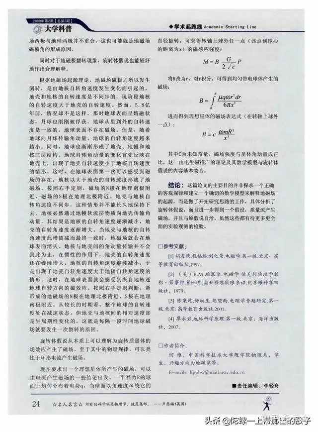

  

  

* * *

**【附录2】：**

## **陀螺里的天文、时空与量子理论**

2018年10月15日 | 作者: 弗兰克·维尔切克 | 来源: 环球科学

“如果人们能更深入地思考和研究陀螺，那么机械工程与众多工业门类将取得更大的进展……而我们对于光、热辐射以及其他电磁现象的认知也会拓展得更为迅速。”

  

  

**“如果人们能更深入地思考和研究陀螺，那么机械工程与众多工业门类将取得更大的进展……而我们对于光、热辐射以及其他电磁现象的认知也会拓展得更为迅速。”**

这是我们今天要谈的一本书《陀螺及其运动》（Spinning Tops and Gyroscopic Motion）的开头。这本书非常有趣，而且看了很长知识。它的作者约翰·佩里（John Perry）是爱尔兰的一位工程师和数学家，于1920年去世。该书主要根据他在1890年的一个广受欢迎的课程整理而成。我最近在新罕布什尔州逛一家旧书店的时候，发现了这本书。我才翻阅了前几页，便被深深吸引住了。

这本书只有79页（包括附录在内）。其中包括了58幅图，但没有数学公式。它将插图（在这就只能靠读者自己想象了）与解释融于一体，从最简单的例子开始，逐渐过渡到复杂的情况，从而每一步都容易理解。

佩里在他的书中使用了大量的篇幅来描述陀螺仪，这种装置大致上就是安在一个架子上、可以自由旋转的陀螺。陀螺仪的神奇之处在于，它有一个简单，却又意义深刻的特点：它的旋转会锁定在一个固定方向。一个高速旋转的陀螺可以抗拒外界的干扰而保持旋转方向稳定不变，即使你把它从一个地方挪到另一个地方。因此我们可以用陀螺的转轴方向作为参考，来确定我们的方向。

与之相反的是，我们无法通过一件简单的仪器来确定我们的空间位置。为了确定你的位置，你可以通过时刻监测加速度的变化来计算你移动了多远。或者，你可以利用GPS卫星导航系统，依据三角测量原理来确定你的位置。

在佩里著书的那个时代，陀螺罗盘还属于前沿技术，尚未发展成熟。如今，它们已经是海上导航的必备装置。由于观测者随着地球一起旋转，因此指向北方的陀螺旋转轴看似在缓慢地改变指向，其实却是固定的。

在更广泛的层面上，陀螺仪已经发展成一个叫做惯性制导的领域。没有它，飞机和太空飞船就会迷路（或者更准确地说，晕头转向）。

**自转的地球本身就是一个巨大的陀螺仪。它自转轴的倾斜度几乎是保持不变的——与地球绕太阳公转的轨道平面之间的夹角为23.5度，正因如此，才会形成四季的规律变化。宇宙中最有趣的一类天体脉冲星，就是高速自转的中子星。而目前，我们正开始观测自转的黑洞，从中寻找时空几何自身的陀螺运动。**

而在自然界尺度的另一端——**微观物质世界中，我们也发现了陀螺运动。电子、光子和其他的基本粒子都具有内秉的“自旋”。旋转就和这些粒子的质量一样，是它们的基本特性之一。由于这些小东西们完全不受摩擦的干扰，它们可以说是完美的陀螺。**

**利用激光、磁场和一些基于量子纠缠的新技巧，我们正学着如何掌握和改变这些基本粒子的自旋方向。随着我们操控光子和电子（还有原子核）自旋的技术水平日新月异，一场量子技术革命正在形成。**

旧书的一大魅力便是你能够看到它们当初的预言是否成真。约翰·佩里的预言很准，陀螺的确意义重大。当我一口气读完整本书，仍然意犹未尽。书中的内容不停出现在我脑海，让我反复思考。作为一名实践派的量子力学家，我早已习惯了**通过公式来思考自旋**。而这本书让那些抽象的物理量变得形象化，使之成为一些奇怪却可触摸的物体，这不仅打开了新的视角，也提出了新的问题。我不知道这是否会带来什么重要的启迪。但不管怎样，我一定会拜托圣诞老人捎给我一些高质量的陀螺。

原文地址：[https://huanqiukexue.com/a/guandian/zhuanlan/weierqiekezhuanlan/2018/1015/28146.html](https://link.zhihu.com/?target=https%3A//huanqiukexue.com/a/guandian/zhuanlan/weierqiekezhuanlan/2018/1015/28146.html)

  

