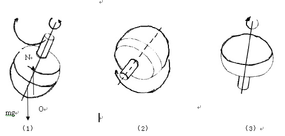

# 翻转陀螺的研究

研究背景：

物理课上老师为我们播放了翻转陀螺的视频，可以看到一个底部为大半球体，顶部是一个圆柱形细杆（最高处是一个锥形体，使陀螺翻转后可以做旋转运动）的陀螺在旋转过程中，逐渐倾斜，最后竟然倒过来旋转，这一现象引起了我的兴趣，课下通过查找资料并结合课本所学的知识，对普通陀螺和翻转陀螺做一下简单的研究。

研究目的：

陀螺在现实生活中很常见而且与它相关的陀螺仪在各领域的应用都很广泛。通过对普通陀螺和可以翻转的陀螺的研究，可以帮助我们理解角动量守恒定律以及进动现象，并了解陀螺的原理，提高我们解决问题的能力。

原理：

普通陀螺：陀螺在旋转过程中，一方面在绕自身的轴线做自转运动，另一方面其旋转轴也在绕竖直轴转动。陀螺不会倒的力学原理，其一是，转动惯量，即旋转具有稳定性。其二是摩擦力，陀螺的尖端是一个近似的圆锥形，当陀螺旋转时由于空气阻力等原因向一方倾倒时，尖端锥体的这一侧将和支撑面接触摩擦，这将导致陀螺的尖端向倾倒的方向运动。可以看到，摩擦力是保证陀螺稳定旋转的一个必要条件，如长脚的陀螺可以在比较粗糙的平面上平稳的旋转，但是在光滑的玻璃面上将不停的跳动，以获取更多的摩擦力；如果在玻璃面上涂润滑油，它不但不能运转的平稳反而更艰难。当陀螺受力旋转时，保持动态平衡，接著受到空气阻力、地面摩擦、或陀螺重心问题等各因素的影响，最后会左摇右晃地倒了下来。

翻转陀螺：与普通陀螺不同的是，翻转陀螺的底部是一个多半球体，它与支持面接触的地方是一个圆面，而不是一个“尖点”，这就导致翻转陀螺在倾斜时与支持面的接触点是不断变化的，而不像普通陀螺一样接触点固定在“尖点”处。陀螺的倒转和其重心偏移的角度有关。陀螺重心偏下方，而陀螺正转时，因重心到支点的连线与中心线的夹角较大，造成陀螺旋转时的晃动也大，因此产生动摩擦力的时间也较长，这正是推动陀螺翻转的力量来源。而倒立后，重心移到上面，重心到陀螺旋转支点的连线与中心线的夹角变小，不易晃动，所以陀螺自然就翻转过来了。即倒转后陀螺的旋转是相对稳定的。

原理分析：

先分析普通陀螺：

如上图，陀螺绕自身的轴线做自转运动，同时旋转轴绕数值轴AA’转动，起初陀螺获得一个角动量，便绕轴线转动，从上往下设它沿逆时针方向转动，主要受到重力mg、支持力和摩擦力f，起始状态，陀螺受到合理为0，一段时间后，由于空气阻力等的影响，陀螺偏离数值轴AA’朝右倾斜，此时陀螺的重心移向接触点的右侧，，陀螺就会受到净力矩的作用，即M=R×G（其中R为矢径，G为重力），其方向垂直于纸面向内，由于陀螺在高速旋转，所以发生进动现象，也就是说，陀螺的平衡虽然遭到破坏，但是它并没有倾翻，它的自转轴绕着竖直轴AA’转动，从而保持相对的稳定性；另一方面，陀螺发生倾斜导致摩擦力的合力不再为零，这将导致接触点O向右侧运动。

再分析翻转陀螺：

如图（1），先给它一个冲量，假设使它沿自身轴线逆时针旋转，由于他它的底面是一个球面，因此更加不稳定，更容易受空气阻力，重心等因素的影响，故自身轴线发生向右的倾斜，但是与普通圆锥底陀螺不同的是，翻转陀螺的重心位于接触点O的右侧，因此重力产生的净力矩的M的方向与普通陀螺相反，即垂直于直面向外，陀螺的平衡也就不容易遭到破坏，当然也就不会出现进动现象，即自转轴线不会绕竖直轴转动。由角动量守恒定律Mdt=dL，此时M的方向垂直于直面向外，故dL的方向垂直于纸面向外，有矢量的叠加原理得陀螺转动的角动量的方向由斜向上到斜向下的趋势发生变化，出现的结果是陀螺持续向一侧倾斜，而受的净力矩也越来越大，当自转轴线水平时，由于转动的惯性，再加上较长时间的摩擦力的影响，最后会引起陀螺的反转。翻转后，陀螺的重心在上部，重心与接触点O的连线与竖直线的夹角会变小，因此旋转是稳定的。但是旋转的方向是顺时针，与初始状态相反。

讨论：

可以看到，不管是普通陀螺还是可以翻转的陀螺，在运动过程总是遵循角动量定理，重要的是运动过程中，摩擦力都会影响运动的状态，在翻转陀螺运动中，摩擦力更是提供反转动力的关键。联系生活实际，也可以发现在玻璃等光滑的的材料上做陀螺的实验，陀螺会发生不稳定的状态（前面说过陀螺会不停的跳动以获取足够的摩擦力）。翻转陀螺的底部为球形，使它在倾斜时产生向外的力矩，进而角动量发生变化，达到翻转的效果。

结论：

通过比较普通陀螺与可以翻转的陀螺的不同，发现陀螺结构与质量分布的不同导致二者有不同的运动状态，其关键之处在于倾斜时接触点与重心的相对位置，随之影响重力产生的力矩的方向。当然摩擦力在其中也起着重要的作用，在具体实验时应该考虑到这一点。