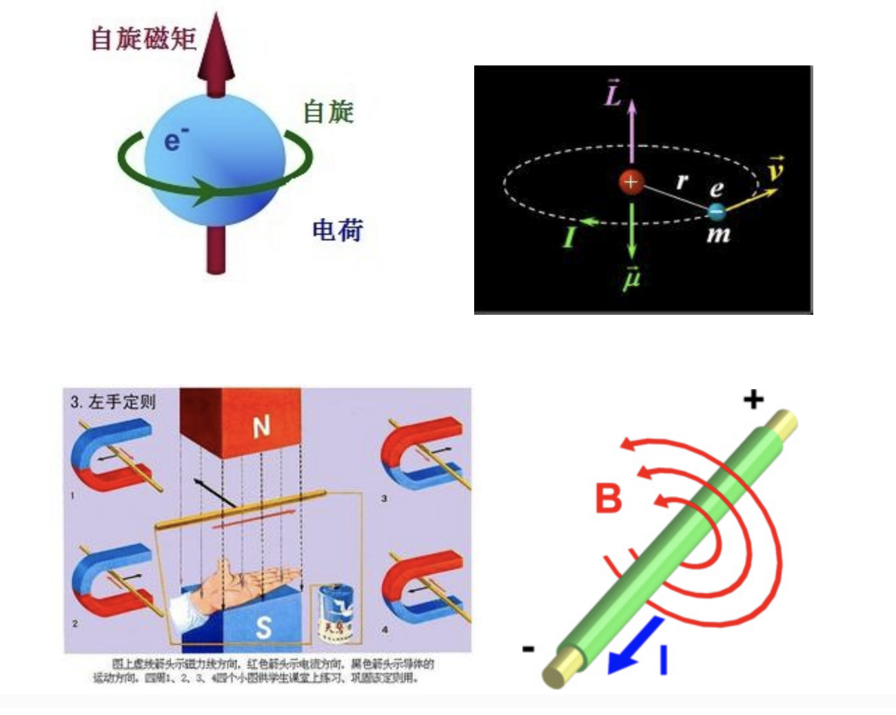

# 电子在不同环境下运动速度一览比较

【转录按】 电子是构成电磁学和量子力学最常见、最基本的粒子之一，它有自旋和自旋磁矩，在磁场中可以作曲线洛伦兹运动，它同时又带有负电荷，能够与正电子相吸泯灭而生产光子......电子，这个大自然赐予人类的小精灵，承载着微观世界多少奥秘？赋予了人们多少遐想空间？这值得从事物理学探索的人们去着迷和深究！

王夜辉老师从科普或教材上收录了电子在不同环境下的运动速度，通过阅读、分析、比较，我们能够从中读出什么？诚望热爱电子的“粉丝们”深思……

电子在不同环境下运动速度一览比较

整理：王夜辉

研究电子在不同环境下运动速度问题，对知识的运用与提高有很大益处；本录材料全来自科普或教材，供大家参考与思考。

一、阴极射线的速度

阴极射线是由带负电的微粒组成，即阴极射张就是电子流．让这些电子流垂直进入互相垂直的匀强电场和匀强磁场中，改变电场强度或磁感应强度的大小，使这些带负电微粒运动方向不变，这时电场力eE恰好等于磁场力eBv，即eE=eBv，从而得出电子运动速度v=E/B。1894年汤姆逊利用此方法测得阴极射线的速度是光速的1/1500，约2×10^5米/秒．

二、电子绕核运动速度

在原子核式结构的发现中，提到电子没有被原子核吸到核上，是因为它以很大的速度绕核运动，这个速度有多大呢？按玻尔理论，氢原子核外电子的可能轨道是rn=n2r1，r1=0.53×10^-10米。根据电子绕核运动的向心力等于电子与核间的库仑力，可计算电子绕核的速度 v=((ke2)/(mr1))^1/2 ，代入数据得v1=2.2×10^6米/秒，同理可得电子在第二、第三能级上的运动速度 v2=1.1×10^6米/秒;v3=0.73×10^6米/秒．从以上数字可知，电子离核越运其速度越小。

三、光电子速度

在光的照射下从物体发出电子的现象叫做光电效应．发射出来的电子叫光电子，光电子的速度有多大呢？由爱因期坦光电效应方程mv2/2=hυ-W，可以计算出电子逸出的最大速度，如铯的逸出功是3.0×10-19焦，用波长是0。5890微米的黄光照射铯，光电效应方程与υ=c/λ联立可求出电子从铯表面飞出的最大初速度vm=((2/m)·((ch/λ)-W))^1/2，代数字得vm=2.9×10^5米/秒．如果用波长更短的光照射铯，电子飞出铯表面的速度还会更大．从而得知，不同的光照射不同的物质，发生光电效应时电子飞出的最大速度也不同。

四、金属导体中自由电子热运动的平均速率

因为自由电子可以在金属晶格间自由地做无规则热运动，与容器中的气体分子很相似，所以这些自由电子也称为电子气．根据气体分子运动论，电子热运动的平均速率v=((8kT)/(πm))^1/2，式中k是玻耳兹常数，其值为1.38×10^-23焦/开，m是电子质量，大小为0.91×10^-30千克，T是热力学温度，设t=27℃，则T=300K，代入以上公式可得v=1.08×10^5米/秒．

五、金属导体中自由电子的定向移电速率

设铜导线单位体积内的自由电子数为n，电子定向移动为v，每个电子带电量为e，导线横截面积为S．则时间t内通过导线横截面的自由电子数N=nvtS，其总电量Q=Ne=nvtSe．根据I=Q/t得v=I/neS，代入数字可得v=7.4×10^-5米/秒，即0.74毫米/秒．从以上数据可知，自由电子在导体中定向移动速率（约10^-4米/秒）比自由电子热运动的平均速率（约10105米／秒）少约1/109倍．这说明电流是导体中所有自由电子以很小的速度运动所形成的．这是为什么呢？金属导体中自由电子定向移动速度虽然很小，但是它是叠加在巨大的电子热运动速率之上的．正象声速很小，如将声音转换成音频信号载在高频电磁波上，其向外传播的速度等于光速（c=3×10^8米/秒）．电流的传导速率（等于电场传播速率）却是很大的（等于光速）．

六、自由电子在交流电路中的运动速率

当金属中有电场时，每个自由电子都将受到电场力的作用，使电子沿着与场强相反的方向相对于晶格做加速的定向运动．这个加速定向运动是叠加在自由电子杂乱的热运动之上的．对某个电子来说，叠加运动的方向是很难确定的．但对大量自由电子来说，叠加运动的定向平均速度方向是沿着电场的反方向．电场大小变化或电场方向改变，其平均速度大小和方向都变化．对50赫的交流电而言，可推导出自由电子的定向速度v=-(eεmτ/m)sin(t-ψ)，τ为自由电子晶格碰撞时间，其数量级为10^-14秒．所受到的合力F=-2eεmsin(ψ/2)cos(ωt-ψ/2)，即电子所受的力满足F=-kx．这说明自由电子在交流电路中是做简谐运动．其电子定向运动的最大速率为：vm=eεmτ/m≈10^-4米/秒，振幅约为10^-6米．

七、打在电视荧光屏上的电子速度

其实电视机与示波管的基本原理是相同的，故电子在电视荧光屏上的速度，也可根据带电粒子在匀强电场中的运动规律mv2=eU求出．以黄河47cm彩电为例，其加速电压按120伏计算，电子打在荧光屏上的速度v=(2eU/m)^1/2，代入数字得v=6.5×10^6米/秒．

八、打在对阴极上的电子速度

伦琴射线产生时：“炽热钨丝发出的电子在电场的作用下以很大的速度射到对阴极上．”设伦琴射线管阴阳两极接高压为10万伏，则电子在电场力作用下做加速运动，求其速度用mv2=eU公式显然是不行的．因为电子质量随其速度增大而增大，故需用相对论质量公式代入上式求出，即mv2/(2×(1-v1/2/c1/2)^1/2)代入数字得v=6.5×10^6米/秒．

九、β射线速度

天然放射性元素中，研究β射线在电场和磁场中的偏转情况，证明了β射线是高速运动的电子流。β射线的贯穿本领很强，很容易穿透黑纸，甚至能穿透几毫米厚的铝板．那么β射线的速度有多大呢？法国物理学家贝克勒耳在1990年研究β粒子时的方法，大体上同汤姆逊在1897年研究阴极射线粒子的过程相同．通过把β射线引入互相垂直的电场和磁场，贝克勒耳测算出了β粒子的速率接近光速（c=3×10^8米/秒）

十、正负电子对撞的速度

“我国1989年初投入运行的第一台高能粒子器---北京正负电子对撞机，能使电子束流的能量达到28+28亿电子伏．”那么正负电子相撞的速度有多大呢？根据E=m0v2/(2×(1-v1/2/c1/2)^1/2)即可求出V=2.98×10^8米/秒．可见其速度之大接近光速（光速取3×10^8米/秒）．

十一、轰击质子的电子速度

为了探索质子的内部结构，使用了200亿电子伏的电子去轰击质子．这样的高能电子是利用回旋加速器得来的．电子的速度同样可用E=m0v2/(2×(1-v1/2/c1/2)^1/2)来计算，代入数字得2.999×10^8米/秒，此速度极接近光速．

通过以上讨论可知，在各种不同情况电子的速度大小各异，但电子运动的速率永远不能等于光速，更不能大于光速，只可能接近光速．1901年德国物理学爱考夫曼用镭放射出的β射线进行实验时，发现了电子质量随速度变化而变化的现象，当电子速度接近光速时其质量急剧增加。

1905年爱因斯坦发表了狭义相对论，他提出：物体的质量不是固定不变的，它随物体运动速度的增大而增大．当物体运动速度（c为光速）时，其运动质量为静止质量的1.7倍，当物体运动速度v=0.8c时，其运动质量为静止质量的3.1倍．28亿电子伏的电子其运动质量是静止质量的8.77倍．200亿电子伏的电子其运动质量是静止质量的1224倍。