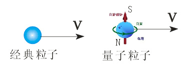
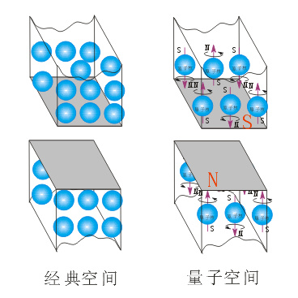

# 量子力学所描述的粒子运动属性与经典力学的有什么本质差异？

在17世纪到18世纪末，由于人类研究物质的工具手段落后，对微小物质的物理特性也就不能够进行细致、全面地观察与深入研究，故对微观粒子的认识只能局限在“经典力学”范畴内，认为粒子运动应遵循经典力学理论，这就是经典粒子概念的内涵。

但到了19世纪后，随着科技水平的发展，人类能够在在纳米级水平上做实验，研究原子、电子等更微小的粒子及其特性，这时我们就发现，微观量子粒子的“属性与运动”和经典粒子的“属性与运动”存在很大差异，具体表现在：

3.1.粒子属性差异

经典粒子：只有平动，没有自旋，也没有自旋磁矩存在，它们的运动完全遵循经典物理学运动规律；

量子粒子：有自旋、平动，且有自旋磁矩存在，它们的运动往往不符合经典物理学运动规律；

3.2.空间属性差异

经典粒子通过的小孔或窄缝，空间范围较大，没有磁场存在；

量子粒子通过的小孔或窄缝，空间范围较小，有一定的磁场存在；

3.3、运动状态差异.

经典粒子通过小孔或窄缝空间时，表现出直线运动性；

量子粒子通过带有磁场的小孔或窄缝空间时，表现出曲线运动性；

量子力学虽然认识到经典粒子与微观量子粒子的属性存在差异，但它没有意识到空间属性也存在差异，从而造成其运动状态出现不同；也就是说，量子力学仍把小孔或窄缝看作是没有磁场存在的“经典小孔或窄缝”，这样，当带有自旋、自旋磁矩的粒子通过“经典小孔或窄缝”时就不会对粒子运动产生磁场影响，即微观量子粒子通过“经典小孔或窄缝”与经典粒子通过小孔或窄缝的运动处境完全一样，这其实就与把微观量子粒子与经典粒子“等同”了的做法。

用“经典粒子”概念去看待“微观量子粒子”通过“带有磁场的小孔或窄缝”，或用“经典小孔或窄缝”概念去解读“带有自旋、自旋磁矩的量子粒子”通过其空间的运动，都必然会得出“波粒二象性”结论来。

可见，量子力学“波粒二象性”认识的本质是没有摆脱牛顿经典粒子或经典小孔空间概念的影响，其描述的物理过程就是给经典粒子概念装一个自旋和自旋磁矩的外套，配备一驾“机械波”马车，让它穿过经典小孔或窄缝，这里关键是忘了非经典的小孔或窄缝空间也具有磁场性。

微观粒子“波粒二象性”揭示的是带有自旋磁场的量子粒子通过小孔或窄缝磁场空间时，会产生“光子洛伦兹运动”，其物理意义是：经典粒子+自旋+自旋磁矩+磁场空间—→磁场平面内“洛伦兹运动”+磁场梯度下“自由落体运动”—→粒子运动的“波粒二象性”（具体论述请参阅司今《波粒二象性的本质》一文）。