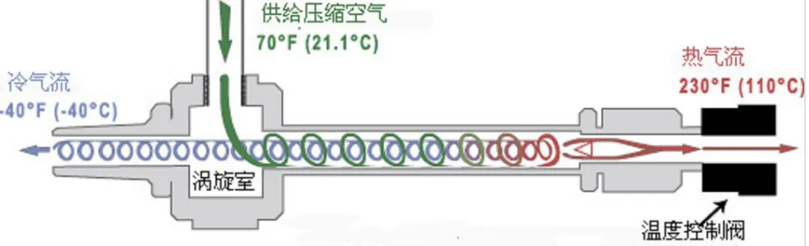

# 涡流管制冷

涡流管制冷是一种借助涡流管的作用使高速气流产生漩涡分离出冷、热两股气流，利用冷气流而获得制冷方法。Ranque是研究涡流管的第一人，在他早期研究过程中，他认为内旋气体流的绝热膨胀过程和外旋气流的绝热压缩过程是产生涡流管产生能量分离效应的根本原因。Hilsch认为产生涡流管能量分离的原因除了Ranque原因外还因包括外旋气流层之间的粘性摩擦效应。

涡流管制冷由喷嘴、涡流室、分离孔板、管子和控制阀组成。涡流室居中，将管子分为冷、热两端。喷嘴沿涡流室切向布置，即引导高压气流切线方向进入涡流室。孔板在涡流室与冷管子之间，热端管子出口处安装了控制阀。

经过压缩并冷却到常温的气体进入喷嘴，在喷嘴中膨胀并加速到音速，从切线方向射入涡流室，形成自由涡流。自由涡流的旋转角速度愈靠近中心愈大，由于角速度不同，在自由涡流的层与层之间就产生了摩擦。中心部分的气流角速度最大，摩擦结果是将能量传递给外层角速度较低的气流，中心层部分的气流失去能量，动能低，速度降低，温度降低，通过涡流管中心的孔板从一端引出，得到制冷需要的冷气流。而外层部分的气流获得动量，动能增加，同时又与涡轮管壁摩擦，将部分动能转换成热能，从涡流管的另一端通过控制阀被引出，形成热气流。可以通过控制控制阀，调节冷热两股气流的流量和温度。

常用气体是空气、二氧化碳、氮气等。高压气体为常温时，冷气流的温度可以达到-10~-50°C，热气流的温度达到100~130°C。

