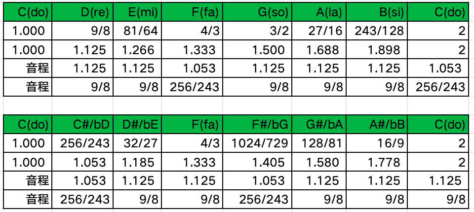
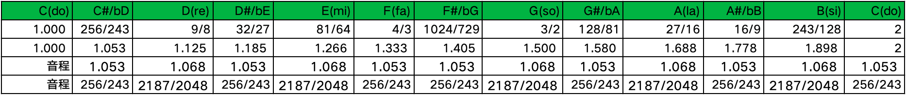
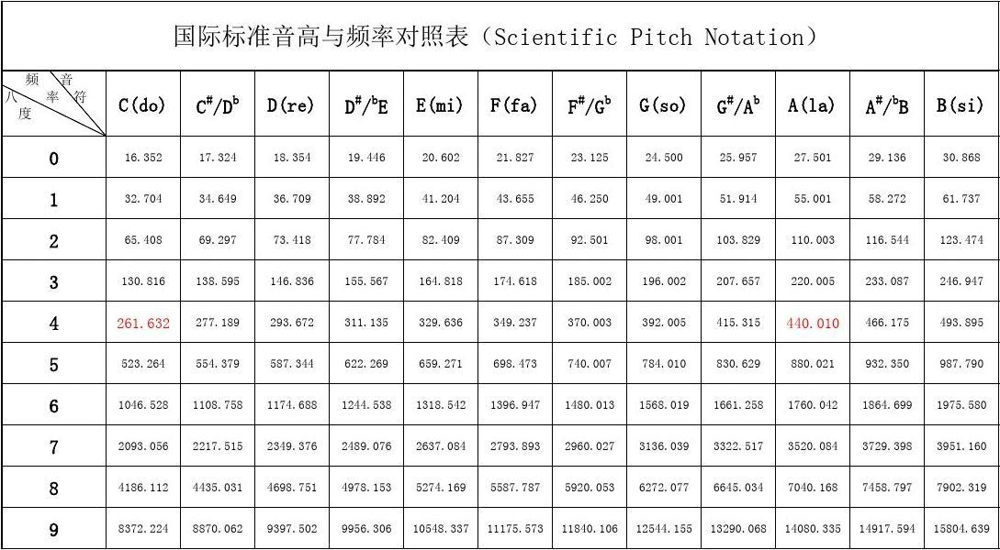
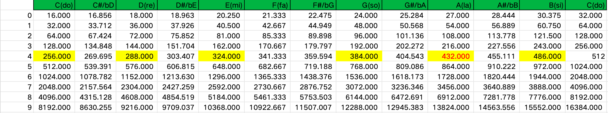

# 乐理基础

## 自然音节为什么有七个

振动发声的原理：弦振动和管内驻波发声，因此最早的乐器有两类：琴和笛。

人们演奏时需要用双手两个拇指来支撑笛身，双手只剩八个手指可以用来按音孔，因此最多也就能用8孔发音。

相比于笛，琴是通过弹拨不同长短琴弦发声，固定琴身后双手都可演奏，手可以移动，故琴弦数量不固定，可多可少。中国有诗为证：“锦瑟无端五十弦，一弦一柱思华年 。”

琴的诞生远晚于笛，因此，人们在转调需求增大前，潜意识习惯性优先将音阶限制在8个以内。

## 音高制定

音的高低直接与乐器发声体(振动的空气柱或琴弦)有效长度有关。确定音的方式要具有可操作性和稳定性，才能保证其纯正的标准性。

振动长度L给定时，基础音也是固定的(频率为f)。人们通过不断尝试发现，只要改变振动长度为原长的简单整数比例（最简有理分数），所产生的音与基准音先后结合（单线条旋律）或同时结合（多线条旋律或和声）时，听起来更协和（悦耳）。所以，人们优先保留协和悦耳的音作为音阶。

L是有效弦长，T是琴弦张力，μ是弦的线密度，即单位长度上的质量，显然频率f和弦长L成反比。

**物理学上两个声音频率比为简单分数听起来会很和协**，所以和协音调的确认就是找有限量的频率，他们的相互比值是简单分数。

最简有理数尺寸产生的振动音 之所以听起来跟基准音很协和，是因为分数的分母和分子的最小公倍数比较小，从而人脑能很快地单独进入两种共振模式，并体会到特殊的“周期同步”。

可以参考视频：[【物理老师讲音乐课】音乐为什么好听（上）](https://www.bilibili.com/video/BV13T4y1J7Qr/)

## 音调计算

基音为频率f，取n分之一弦长，频率为nf，成倍数的音听起来是最和谐的。

在f到2f之间找到和谐的音就找到了所有和谐的音，因为成倍数可以映射到所有频段。

f~2f之间的音取弦长为二分之一弦长到整个弦长，可取的整数比例有2/3、3/4、3/5、4/5、5/6、4/7、5/7、6/7、5/8、7/8、5/9、7/9、8/9等。

最简单的正数比为2/3、3/4，而且这两个分数还有一个隐藏关系，一个的倒数与另一个为一倍关系，后续在计算时可以看到一个神奇的关系。

另外，像3/5、5/6，4/5、5/8，4/7、7/8等也有这种倍数关系。

计算f~2f和谐音高时注意事项：

- 因为取弦长的一部分，所以频率为弦长比的倒数据，如取2/3弦长频率为3/2f。
- 如果计算的频率大于2，除以2以回到f到2f频段，这是基于整体数据的音是和谐的基础。

## 以分数2/3计算和谐音

这里以整个弦长L频率为f，中间1/2L弦长频率为2f，f~2f频段的和谐音就是不断取1/2L~L部分弦长的频率，除了取3/2的那步。

- 取2/3第一次：3/2f
- 取2/3第二次：9/4f>2,除2移回得9/8f
- 取2/3第三次：27/16f
- 取2/3第四次：81/32f>2,除2移回得81/64f
- 取2/3第五次：243/128f
- 取2/3第六次：729/256f,除2移回得729/512f
- 取2/3第七次：2187/1024f,除2移回得2187/2048f
- 取3/2第一次：2/3f<1,乘2移回得4/3f
- 取3/4第一次：4/3f,这和取3/2是一样的 

从数量、单独听和互相和谐的角度，f~2f取到和谐音：

3/2f、9/8f、27/16f、81/64f、243/128f、4/3f

把得到的音，重新按从低到高排列：

C(1)，D(9/8)，E(81/64)，F(4/3)，G(3/2)，A(27/16)，B(243/128)，C(2)

从C(1)计F(4/3)在第四个位置，所以叫四度，G(3/2)在第五个位置，所以叫五度。

上面共有八个音，建立八度的距离概念。C(2)叫基音C(1)的纯八度音(2:1)关系。其中G音在第五个位置，所以叫纯五度音（3:2关系）——欧洲教会经常使用这种五度和声，听起来有种富丽堂皇感。F叫纯四度音(4:3关系)，比五度音的情况要多了一点不和谐(变化)的感觉，有种飘忽感，若在钢琴上试试四度音叠置连续出现，有种飞升天堂或隆重登场的感觉。

**音程**

在生成七个音后，让相邻的两个数相除（大数除以小数），得到相邻音的音程距离依次为

$$ \frac98，\frac98，\frac{256}{243}，\frac98，\frac98，\frac98，\frac{256}{243}$$

可见，这里只有两种不同的音程关系：较大值9:8(约1.125)，被称为一个全音(距离)；较小值256:243(约1.053)，被称为一个半音(距离)。当然，这里两个半音并不等于一个全音。明显，音阶满足“全全全半，全全半”的音程 音阶非常类似。

## 以分类4/3计算和谐音

这里以整个弦长L频率为f，中间1/2L弦长频率为2f，因为2/3计算的和谐音分子为偶数，所以这里要用4/3弦长取法，就是以1/2L弦长不断的取4/3弦长频率，所以第一次频率要乘2f。

- 取4/3第一次: 3/4*2f=3/2f
- 取4/3第二次: 9/8f
- 取4/3第三次: 27/32f<1,乘2移回得27/16f
- 取4/3第四次: 81/64f
- 取4/3第五次: 243/256f<1,乘2移回得243/128f
- 取4/3第六次: 729/512f
- 取4/3第七次: 2187/2048f
- 取3/4第一次: 4/3f
- 取2/3第一次: 3/2f

从这里可以看出以2/3取弦和以4/3取弦结果是一样的，这是因为这两者是倍数关系，而倍数的频率是可以平移频段的。

## 四度音的和谐音

前面用3/2和3/4计算的和谐音都是计算的五度音3/2f的和谐音，其中只取了一个四度音4/3f。

如果为4/3f找和谐音，发现用3/2找会回归八度音，4/3*3/2=2。

如果用4/3找和谐音，会生成一系列分母为奇数比例的和谐音。

- 取3/4第一次: 4/3f
- 取3/4第二次: 16/9f
- 取3/4第三次: 64/27f>2,移回32/27f
- 取3/4第四次: 128/81f
- 取3/4第五次: 512/243f>2,移回256/243f
- 取3/4第六次: 1024/729f

把得到的音，重新按从低到高排列：

C(1)，C#/bD(256/243)，D#/bE(32/27)，F(4/3)，F#/bG(1024/729)，G#/bA(128/81)，A#/bB(16/9)，C(2)

这里加#为对应五度音升半音，加b为对应五度音降半音。可以看到这里和五度音一样，形成了一个四度音的八度关系。

这里的音程为：

$$ \frac{256}{243}，\frac98，\frac98，\frac{256}{243}，\frac98，\frac98，\frac98$$

## 十二音阶

以f为基音，用4/3和3/2计算f~2f频段所有和谐音，会产生两个系列。

用思维导图的方式可以看清这个过程，3/2要一直乘3/2，4/3要一直乘4/3，都取倒数也一样。

- 3/2
  - 乘4/3=2 停止 
  - 乘3/2=9/4>2，移段9/8
    - 后续类似
- 4/3
  - 乘3/2=2,停止
  - 乘4/3=**16/9**
    - 乘3/2=8/3,移段4/3 停止
    - 乘4/3=64/27,移段**32/27**
      - 乘4/3=256/81,移段**128/81**
        - 乘4/3=512/243,移段**256/243**
          - 乘4/3=2048/729,移段**1024/729**

**五度音序列**

C(1)，D(9/8)，E(81/64)，F(4/3)，G(3/2)，A(27/16)，B(243/128)，C(2)

音程

$$ \frac98，\frac98，\frac{256}{243}，\frac98，\frac98，\frac98，\frac{256}{243}$$

**四度音序列**

C(1)，C#/bD(256/243)，D#/bE(32/27)，F(4/3)，F#/bG(1024/729)，G#/bA(128/81)，A#/bB(16/9)，C(2)

音程

$$ \frac{256}{243}，\frac98，\frac98，\frac{256}{243}，\frac98，\frac98，\frac98$$

**十二音序列**

把两个序列的和谐音从小到大排列，会形成一个十二个间的序列

C(1)，C#/bD(256/243)，D(9/8)，D#/bE(32/27)，E(81/64)，F(4/3)，F#/bG(1024/729)，G(3/2)，G#/bA(128/81)，A(27/16)，A#/bB(16/9)，B(243/128)，C(2)

音程

$$\frac{256}{243},\frac{2187}{2048},\frac{256}{243},\frac{2187}{2048},\frac{256}{243},\frac{256}{243},\frac{2187}{2048},\frac{256}{243},\frac{2187}{2048},\frac{256}{243},\frac{2187}{2048},\frac{256}{243},$$

这里256/243(约1.053)与2187/2048(约1.068)交替出现，音与音之间比例相关比较小。

其中以F音的位置比较特殊，他在两个序列中都在四度位置，前后音程都是256/243(约1.053)。

## 十二平均律

从我们推导出的十二音序列可以看出，音程是比较平均的，1.053和1.068，那如果音程完全平均是多少,$\sqrt[12]{2} \approx1.059$，介于1.053和1.068之间。

用$\sqrt[12]{2}$为音程将一个八度分为十二个音的方法就是十二平均律，本质上是一种模糊的计算，但是转调方便。

## 标准音高

1939年9月，英国标准协会（BSI）在伦敦召开了一次正式会议，会议规定了中央C上的标准音高A=440Hz。这一定义在1953年被国际标准化组织ISO所接受并沿用至今，成为目前世界通用的国际音高标准。

从西藏古老的颂钵到非洲早期的宫廷乐器科拉（Kora），其实都是以432Hz作为标准音。根据我国古代乐典《曾侯乙钟铭》的推算，周代黄钟律的标准音为864.07Hz。虽然十二音平均律到16世纪才被提出，但通过计算我们可以得到，这一标准音降个八度便是432.035Hz。世界各地古代乐器出现的“432Hz巧合”，在部分学者看来则正好说明了432Hz这一频率可能是人耳最容易接受的频率。

432Hz做为标准音高计算出来的其他音，五度音除了F其他都是整数，至于有没有其他作用没有依据。

这是国际版十二平均律音高表，音程为$\sqrt[12]{2}$

这是432Hz音高表，音程为计算出的256/243(约1.053)与2187/2048(约1.068)。除了F，CDEGAB都为整数频率。

