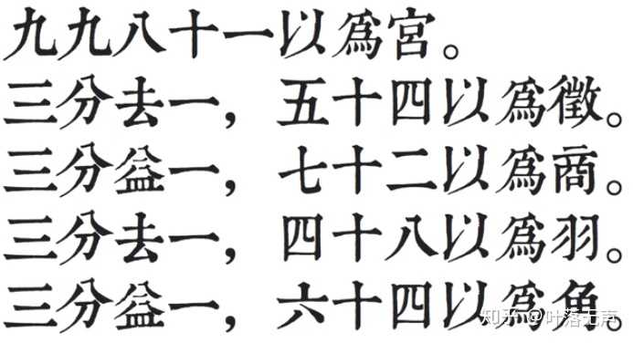

# 自然大小调的音阶是如何规定的？

[知乎原文](https://www.zhihu.com/question/363418318)

“为什么时间是六十进制 而不是十进制？”“为什么一个星期是七天？”“为什么彩虹或者光谱大致分为七色？”。这些问题其实都是类似的，必然不能只是归结为习惯原因，更不是统计归纳结果——这些解释都是非常浅的思考，因为都是_结果_而非_原因_。

类似地，自然音阶七个音阶和特定的相互音程关系模式，必然有其“自然”之处。只不过这种“自然”来得并不像字面意思那么轻松。**有些东西的来源也许比我们想想要复杂得多，并不是水到渠成的，而是众多必然和偶然因素使然**。有句话最恰当——**这是历史的偶然，也是必然**。

下面试着从历史和人文的角度来给出解释。当然，这不是权威的答案，但都有历史根据的。

要想解释“自然大小调的音阶怎么得到的，何谓「自然」？”这个问题，根据自然音阶是七个音，且满足特定音程关系的这一事实，只须回答如下两个问题即可：

> 为什么音阶数量是七个，而不是十个，二十个？  
> 为什么音程关系恰好就是听上去的那种音高比例，别的任意比例不自然吗？

但这两个问题无法分开来回答，因为它们是相互联系发展的结果。下面就不分彼此地叙述这个发展的过程。

**1.早期乐器的产生对制音数量的影响**

早期的人类在实践探索过程中发现了振动发声的原理：弦振动和管内驻波发声，因此最早的乐器有两类：琴和笛。到目前为止的考古结果是：德国霍赫勒-菲尔斯洞穴发现了几根用鸟骨和猛犸象牙是目前世界最早的琴，约有5000年的历史。

人们实践发现，给定弦长和笛子，其本身发出的基准音就已经固定（因为频率固定），但借助乐器抒发情感，只有一个音显然不成，至少要三个音（音乐是表达情感的语言，从音乐语法角度来讲，主音、下属音和属音就可构成一个简单而完整的骨架）。通过实践很快发现，不同振动弦长和笛的开孔高度占原发声长度的比例，影响着产生的音到基准音的距离（音程）。利用这个原理制出不同的音来满足需要。

世界众多考古发现，骨笛开1到8个音孔的都有(4到8孔为主)。例如，我国考古发掘最早的乐器是属于新石器时期的河南省舞阳县贾湖骨笛 多在5到8孔之间。

为什么9-12孔很少见？因为，人们演奏时需要用双手两个拇指来支撑笛身，双手只剩八个手指可以用来按音孔，因此最多也就能用8孔发音。并且那时候人们还没形成成熟的调性概念，谈不上移调的考虑，所以对于音的数量，仅仅处于自身演奏的方便来确定。

直到调性概念成熟，包括频繁转调的需求增大后，才出现更多个音的需求（十二平均律就是为方便转调 就多达16孔。

相比于笛，琴是通过弹拨不同长短琴弦发声，固定琴身后双手都可演奏，手可以移动，故琴弦数量不固定，可多可少。世界历史上，4弦、5弦、7弦、13弦、16弦、18弦、21弦、25弦、50弦的琴都有过。如，中国有诗为证：“锦瑟无端五十弦，一弦一柱思华年 。”限于篇幅，不再举证。

但考古发现，琴的诞生远晚于笛——这很容易理解——在早期人类社会，音色好、不易断的优质琴弦材料的获取，比骨头、竹子这种天然坚硬空腔材料的获取要难得多(毕竟鸟兽骨头很容易得到)。所以琴弦虽多，理论上音阶数量没有任何限制，想制定几个就几个，但必定会受到历史上骨制乐器制音习惯的影响。因此，人们在转调需求增大前，潜意识习惯性优先将音阶限制在8个以内。

**2.音律的制定对音阶和数量的影响**

人们通过实践发现，音的高低直接与乐器发声体(振动的空气柱或琴弦)有效长度有关，虽然能方便地改变尺寸得到高低不同的音，但人们频繁制作乐器后产生了一个想法：把几个常用音尽量集中在一个相对窄的音域范围，就能便于演奏更多的旋律；否则，每次想要抒发不同心情去演奏不同曲子时总要去制作新的乐器，岂不太麻烦(且浪费材料)？而且，还要选择一个实用标准，规定好常用的标准音之间的距离，以便于重新制作乐器时有个参照，防止演奏中发生“跑调”问题。可以说，这就是“音律”产生的最原始目的了。

确定音的方式要具有可操作性和稳定性，才能保证其纯正的标准性，否则每个人随意改动得到结果不完全一样，那岂不太糟糕？另外，方法也要兼顾音好听，不然失去了音乐的本质。

不难想象这个标准需要具备的条件：指定产生新的音的方式，保证方法有可操作性和稳定性，并且兼顾音的悦耳和丰富度。音律一旦产生，就确定了音阶的标准。其意义类似统一交流语言。

因此，只要精心选择乐器制音的尺寸标准即可，但选择哪些尺寸比较好呢？

很显然，早期西方人对于有理数是偏爱的，这在第一次数学危机中，毕达哥拉斯学派要把证明根号2是无理数的内部“叛徒”希帕索斯 ：

> 我国古代早期经典数学著作《九章算术》开方术 数起了一个专门名词——“面”，即现在的无理数。（按：实际上“无理数”的翻译有问题，应该是“不可比数”，有理数应译为“可比数”）。  
> 与古希腊毕达哥拉斯学派对于无理数存在时的惊慌失措表现相比，中国古代数学家却是相对坦然地接受了那些“开不尽”的无理数，这也许应归功于中国古代数学家早就习惯使用的十进位制，因为这种十进位制使他们能够有效地计算被称为“面”的无理数——“不尽根数”的近似值：  
> 为《九章算术》作注的三国时代数学家刘徽就在“开方术”注中明确提出了用十进制小数任意逼近不尽根数的方法，他称之为“求微数法”，并指出在开方过程中，“其一退以十为步，其再退以百为步，退之弥下，其分弥细，则……虽有所弃之数，不足言之也”。

_补充：毕达哥拉斯学派认为“万物皆数 。所以，在中国古人看来，无理数的存也没什么大不了，用近似逼近思想去看待就行了。_

因此，无论东方还是西方，最初都是以有理数尺寸乐音的产生过程间接给出音高定义标准的。当然后面我们会看到，选择有理数也是有代价的——牺牲了转调的方便性（不同调需要专门制作不同的乐器）。

振动长度L给定时，基础音也是固定的(频率为f)。人们通过不断尝试发现，只要改变振动长度为原长的简单整数比例（最简有理分数），所产生的音与基准音先后结合（单线条旋律）或同时结合（多线条旋律或和声）时，听起来更协和（悦耳）。所以，人们优先保留协和悦耳的音作为音阶。

这是可以从生理学角度得到解释的。(以下为背景知识内容，若理解上述结论则可跳过下面内容：)

>首先，人脑对于有规律的事物比较感兴趣，比如人对有规律的数字或押韵的诗句比较容易记得住，或者印象深刻。对于那些无规律，或有规律但过于复杂的事物，人脑会感到认知疲劳 和记忆费力。

>其次，现代的我们通过物理公式知道，**振动几何尺寸比其实决定乐音的频率比**(线性振动系统频率与振动尺寸成反比)。最简有理数尺寸产生的振动音 之所以听起来跟基准音很协和，是因为分数的分母和分子的最小公倍数比较小，从而人脑能很快地单独进入两种共振模式，并体会到特殊的“周期同步”。这句话可能有些人不理解，下面从钢琴演奏角度来解释。

>比如左手与右手节拍比为2:3，会发现人脑注意力只能集中在2拍周期，或3拍周期上。能两手配合好这个2对3的节奏，是因为最小公倍数 这个“特殊周期”同步“振动”就行。但如果这个节拍比变为29:73，人基本很难做到。

>所以，听上去不和谐的两个音，只不过是因为频率比例过于复杂（比如是无理数的比，或最简分数非常复杂的比例，导致“同步周期”过大，人脑难以短时间适应长周期的同步振荡 规律）。为什么现代人喜欢电音、摇滚和架子鼓？因为节奏感很强，能带动自己一起在心理层面的共振。下面这个视频对此解释得非常到位：

[【物理老师讲音乐课】音乐为什么好听（上）](https://www.bilibili.com/video/BV13T4y1J7Qr/)

**五度相生**

在西方，古希腊学者受到古埃及和美索不达米亚 ”。其主要观点如下：

1. 以弦长为基础产生音阶中的音程关系，当弦长比为2:1时，两音的音程关系为八度；当弦长比为4:3时，两音为四度关系；当弦长比为3:2时，两音为五度关系。
2. 只有四、五、八度才是和谐的音程，其余的音程都是不和谐音程。

注意，这个理论对西方后来的音乐观念产生了重要影响。

下面叙述毕达哥拉斯是怎么用数字和谐的方法研究音阶的。

前面提到，最简单有理数的比例产生的音先后结合或同时结合比较悦耳，首先就考虑最简单的有理分数比——1:2，也就是1/2L长度 产生的新音。它与L长度发出的基础音听起来超级协调，但就是些单调——因为听上去感觉差不多，只是音调高一些而已。

实际上，根据前面提到的线性振动频率与尺寸的反比例规律，1/2L振动长度得到的新音频率是2f(即高八度音)。等于说，**只要长度减半，得到的都是频率翻倍的高八度音；反过来，长度加倍，得到的就是低八度的音。**其实，早在毕达哥拉斯之前，世界各地的人都知道了这个经验常识，只不过当时没有人总结一个音阶理论。

考虑到振动长度比越接近1:1，新音就越接近基础音，所以**只考虑大于1/2小于1的尺寸比例**即可。相当于以一个八度内的音列作为标准音，而更高或更低的音，完全可以通过减半或加倍相应振动长度，将八度内的所有音都“平移”到低频段或高频段。

按照最简整数比的想法，在1/2到1之间，取2/3是唯一最简单而和谐的选择。如果基础音频率记作f，音名记为C，那么生成的新的音，相当于生成了3/2f=1.5f的频率音，听上去跟现在的G音有点像，但更和谐好听(当然，差别不很明显)。毕达哥拉斯认为，这种比例组合非常完美，而且听起来好听，故叫做纯五度音(当他建立七个音阶后，才给了度数概念，这里先借用一下) 。

按照这个思路，以这个新的G音为基础音 ，再次用2/3比例（向上五度），得到4/9L振动长度，新的音频率为9/4f=2.25f>2f，超出了一个八度。对这种情况，毕达哥拉斯统一做法：把音平移回八度内，相当于加倍振动长度或减半频率，得到频率为9/8f=1.125f的音，听上去有点类似现在的D音，但不完全相同，因为这个G和D听起来比现在的G和D更和谐。

继续以D为基础音，向上五度，得到频率为27/16f=1.6875f的音，听上去类似A音，DA听起来很和谐。继续向上五度，发现超出一个八度，频率减半，得到频率为81/64f=1.2656f的音，听上去类似E音，且AE听上去很和谐，只不过E单独听起来有点不好听。仍继续以E音为基础，向上五度，得到频率为243/128f=1.898f的音，听上去类似现在的B音，且EB听起来也和谐。但是，这个B音单独听起来比E单独听起来还难听（现代的B音也一样难听），因为比例太复杂了。

继续向上五度，超出了八度范围，仍然平移回八度内，得到频率为729/512f=1.423828f的音，它听上去类似于现在的#F音，并且B和#F听起来很和谐。但这个#F的音单独听起来比B更难听，更要命的是，它跟除了B音之外的其他音都不和谐。再继续下去会得到更多类似更难听的音，虽然能保证所有五度之间的音很和谐。毕达哥拉斯认为向上五度下去没有意义了。因为，和谐数字才是宇宙真理。于是放弃了#F，转而从C音开始向下五度的方式来找新的和谐音 。

向下五度相当于把频率乘以2/3，易得C下方五度音频率为2/3f，凡是遇到低于C的音都上移八度，亦即乘以2，得到频率为4/3f的音。嗯，这个比例简单，听起来接近现在的F。弥补了E和G之间距离过大的问题，同时这个F没有#F那种与其他音不和谐的问题。

毕达哥拉斯很满意地停止了继续推导，把得到的七个新的音，重新按一个八度内从低到高排列：

C(1)，D(9/8)，E(81/64)，F(4/3)，G(3/2)，A(27/16)，B(243/128)，C(2)

上面共有八个音，建立八度的距离概念。C(2)叫基音C(1)的纯八度音(2:1)关系。其中G音在第五个位置，所以叫纯五度音（3:2关系）——欧洲教会经常使用这种五度和声，听起来有种富丽堂皇感。F叫纯四度音(4:3关系)，比五度音的情况要多了一点不和谐(变化)的感觉，有种飘忽感，若在钢琴上试试四度音叠置连续出现，有种飞升天堂或隆重登场的感觉。毕达哥拉斯认为只有这三种是最和谐简单、好听。

当然，他还可以继续往下推导更多的音，但他没有。我猜，也许是因为以下问题：

他发现，如果把#F继续向上五度，得到#C(2187/2048)，#G……，与CDEFGAB结合上很不协和；所以干脆从F继续往下五度，得到16/9f这个音，它比B音低一点，比A音高一点，类似现在的bB音，继续以向下五度循环下去，依次得到类似bE、bA、bD、bG的音，都与上面CDEFGAB七个音不协和，并且这个bG居然和#F不重合，也就是推导永远没有结束的时候。

_补充：bG和#F不重合，所以音程要分成增四度。_

追求完美和谐的毕达哥拉斯 自然接受不了这个事实，毕竟他无法接受无理数的存在（当然也就错过发现十二平均律），这种无穷无尽的不和谐音列对于他来说，没有保留的必要。于是得到F后就停止了推导。

不过，他没有停止音乐理论的总结。在满足于七个音后，他让相邻的两个数相除（小数除大数），得到相邻音的音程距离依次为

$$ \frac98，\frac98，\frac{256}{243}，\frac98，\frac98，\frac98，\frac{256}{243}$$

可见，这里只有两种不同的音程关系：较大值9:8(约1.125)，被称为一个全音(距离)；较小值256:243(约1.053)，被称为一个半音(距离)。当然，这里两个半音并不等于一个全音。明显，音阶满足“全全全半，全全半”的音程 音阶非常类似。

以上就是毕达哥拉斯从理论的角度对西方音乐的贡献。

这就是最初自然音阶的雏形，它“自然”之处在于——**人很自然地喜欢和谐悦耳的音，从而在一个八度内找到了七个好听且相互音程关系简单稳定的音阶**（指五度和谐以及全-半音的整齐关系）。

前面这种由分别向上和向下循环五度生出音的方法叫做“五度相生律的产生。

_题外话：看到这个FCGDAEB#F序列，大家不难想到五度圈 了？对，和声理论其实跟这个有关。_

**三分损益**

不难发现，C-G-D-A-E-B-#F这种相邻度数关系依次是**上方五度、下方四度**，循环三次。实际上，在遥远东方的中国，早在商周时期就有五声、七声十二律的说法了。后世的春秋时期（早毕达哥拉斯100多年）的管仲，把中国上古音乐 经验也按理论总结出了一种的先增后减的算法。

《管子》一书中就详细记载了这个方法，命名为“三分损益律”(知乎暂时不能传图，后面再补)：

三分损益法

意思是说，把基础音(C，频率f)对应的振动长度看成九九八十一份，称作“宫”(1f)，取其三分之二振动长度（这步叫“三分损一”，相当于上方纯五度），得到“徵”(3/2f)；再取“徵”音振动长度的三分之四（这步叫“三分益一”，相当于下方纯四度），得到“商”(9/8f)，完成损益的完整一次过程。若继续损益各一次，分别得到“羽”音(27/16f)和“角”(81/64f)。整个过程依次是：宫-徵-商-羽-角。若按照频率从小到大排列（省略f），为：

宫(1)、商(9/8)、角(81/64)、徵(3/2)、羽(27/16)，这是中国的一种**五声音阶**。

管仲命名宫商角徵羽 。对于这五个音，《管子》很感性地介绍道：

> 凡听徵，如负猪豕觉而骇。凡听羽，如鸣马在野。凡听宫，如牛鸣窌中。凡听商，如离群羊。凡听角，如雉登木以鸣，音疾以清。

描述还挺形象：徵音听起来感觉像是听到小猪被背走而大猪惊叫的声音。羽音听起来好像荒野的马叫。宫音听起来像是地窖里的牛鸣。商音听起来像是失群的羊在叫。角音就好像野鸡在树上鸣叫，声音又快又清亮。

中国古代五声音阶始终是主导地位。当然，三分损益过程还可以继续，不过管仲没有继续推下去。但当时已经有人有尝试过继续推演——

1）在得到角(81/64)后，继续向上推五度（三分损一），得到变宫(243/128)。排列下来有：

宫(1)，商(9/8)，角(81/64)，徵(3/2)，羽(27/16)，变宫(243/128)，这是中国的一种**六声音阶**。

继续向下四度（三分益一），得到变徵(729/512)，加入上面，构成中国的**雅乐七声音阶 **，又叫正声音阶或古音阶：

宫(1)，商(9/8)，角(81/64)，变徵(729/512)，徵(3/2)，羽(27/16)，变宫(243/128)。

这七个的音频率比，跟毕达哥拉斯最初得到七个音阶中的CDE#FGAB是一样的，只是名字不同。

2）当然，不一定要向上五度，还可以向下五度。于是从高八度宫向下五度，得到4/3f，这个音比角稍亮，叫清角(4/3)，与五声音阶 一起构成中国的另一种六声音阶：

宫(1)、商(9/8)、角(81/64)、清角(4/3)、徵(3/2)、羽(27/16)

考虑到音高关系：角(E)<清角(F)<变徵(#F)<徵(G)，而清角比变徵好听，于是把雅乐音阶中的变徵替换为清角，构成中国的**清乐七声音阶**，又叫新音阶(或下徵音阶)：

宫(1)、商(9/8)、角(81/64)、清角(4/3)、徵(3/2)、羽(27/16)，变宫(243/128)。

这七个音的频率比，跟毕达哥拉斯选的七个音阶CDEFGAB是一样的，只是名字不同。故清乐七声音阶可看成是自然大调音阶。不过它们音阶虽然完全一样，但产生的音乐听起来风格还是不一样。因为中国始终以正音为主导，其他都是从属地位。换句话说，自然大调中七个音都是一视同仁地使用在音乐中，而中国则以五声为主，其他都是配角。从这个意义来讲，**清乐七声音阶跟自然大调音阶是两种本质不同的东西** 。

3）前面清乐音阶中其他音阶听起来还好，就是变宫音(就是现代的导音)比较难听，因比例太复杂，而且跟清角(F)不是五度关系，所以不协和，于是想要换掉它。仍然从清角产生的思路，将清角向下五度，然后平移回来，得到4/3\*2/3\*2=16/9，这个比例简单，好听，比羽稍亮，叫清羽(16/9)。音高关系为：羽(A)<清羽(#A)<变宫(B)<宫(C)。于是得到中国的**燕乐七声音阶**，又叫俗乐音阶：

宫(1)，商(9/8)，角(81/64)，清角(4/3)，徵(3/2)，羽(27/16)，清羽(16/9)。

这个音阶相当于西方的CDEFGA#A音阶。它叫俗乐音阶，可见中国古代民间用的比较多。

_补充：之所以叫雅乐，因三分损益法是音律准绳，雅乐里面的音阶严格按三分损益法得到，清乐和燕乐的七声音阶中加入的两个偏音（清角、清羽）不是按该法产生，不具备五度相生和谐感，故是往俗乐演变。_

---

前人对音律的追求不满足于五音，于是以三分损益法为标准，选一个固定的音，命名为“黄钟”，损、益交替十一次，得到八度内的十二个音(十二律)的频率比例：

黄钟(C, 1)，林钟(G, 3/2)，太簇(D, 9/8)，南吕(A, 27/16)，姑冼(E, 81/64)，应钟(B, 243/128)，蕤宾(#F, 729/512)，大吕(#C, 2187/2048)，夷则(#G, 6561/4096)，夹钟(#D, 19683/16384)，无射(#A, 59049/32748)，仲吕(#E, 177147/131072)。

注意，符号#只表示音升高，但这十二个音并非严格等音程 的音程。

若以黄钟为宫音，那么太簇是商，姑冼是角，林钟是徵，南吕是羽，蕤宾是变徵，应钟是变宫。但清角(F, 4/3)不在十二律里 。因为，清角和清羽不是三分损益标准法得到，不是中国古代标准音。不过，这种非标准音与标准音的差距，人耳需要仔细听才能区分。

上面现象说明，**中国的三分损益法跟西方的五度相生律还是有点小区别的**，因为三分损益法是一直向上五度，而五度相生则是向上、向下五度。因此，五度相生律和三分损益法里面的带有升降的音可能会同名，但音高并不一样。

_补充：这十二个音都可以作为起调的音，类似钢琴上十二个琴键音（当然，这十二个音在考古出土的编钟上，都能听得到）。若与五声音阶搭配，可形成六十个调，例如黄钟宫调，南吕羽调。当然也可和七声音阶配合。不过这些古代的十二个音现代音乐基本不用，都用现代钢琴的十二音，所以一般用现代的D宫调，或#F羽调之类的说法。中国的七声音阶，配合现代十二音，有八十四个调。_

上面三分损益法只推得十一个音，若继续把仲吕(#E)升高五度，它无法与升高八度的黄钟音 重合，而是得到“清黄钟”（比高八度黄钟略高一丝，与黄钟极不和谐），十二律不能周而复始。因此，继续下去将分无穷无尽，这就不方便转调。

在此后近两千年里，我国历代都有学者对该音律学问题进行了不懈探索，直到明朝的朱载育 带到西方），解决了转调问题。但十二平均律是无理数的频率比，牺牲了乐音之间的悦耳性（毕竟人耳没那么敏感，对于不稍微和谐的音能勉强接受）。

---

五度相生律和三分损益法得到的七声音阶虽然在因纯五度和简单比例关系，听起来很和谐，尤其是音之间全、半音结构很稳定，所以在写作的单音曲子非常好听。但由于中国人专心在五声音阶，把偏音放在下等地位（也根本没有导音之类用法），就无需研究多声部问题，故中国一直在和声方面没有发展。而西方一直到中世纪都广泛采用五度相生律写作音乐。

进入文艺复兴时期，复调音乐 开始使用纯律。

**纯律**

纯律最早是谁提出的，至今还存在争议。大部分人认为纯律和五度相生律都是由毕达哥拉斯提出或整理，也有人认为2400年前的中国战国时代就已开始应用纯律，还有人认为是古希腊学者亚里士托森努斯（亚里士多德 的学生）提出的。但不管怎样，纯律至少已经有两千多年的历史了。

其思想是，在毕达哥拉斯的自然七音阶基础上调整EAB三个音，让其频率变为最简比例。

原始七音阶：C(1)，D(9/8)，E(81/64)，F(4/3)，G(3/2)，A(27/16)，B(243/128)，C(2)

考虑将三和弦CEG中不和谐的E(81/64)改成E(80/64=5/4)，这是最简比例，很好听。分子只是改动一点点，人耳分辨不出来微小区别。这样，就构成了三个非常和谐的三和弦音 

C(1)，E(5/4)，G(3/2)——三和弦理论基础

这三音的频率比为4:5:6，确定了明亮大调感觉，称呼C和E之间频率比4:5为大三度 关系，E和G之间的5:6称为小三度关系。很明显CG之间仍为纯五度关系。所以相当于“纯五度=大三度+小三度”。

_补充：除此之外，能想到更简单的比例2:3:4，结果发现是C(1),G(3/2),C(2)，这也是分解和弦 do-sol-do好听的依据。_

考虑到F(4/3)和C(2)也是纯五度关系，类比CEG，只须让F到A是大三度关系，得到A(5/3)，改进后的A和E满足纯五度关系！而新旧A的差距：27/16-5/3=1/48，非常小。故新的A听起来跟旧的A的区别非常小！

现在就剩B没有修正。若仍按照上述方法实施，发现无法简化。4:5:6和谐原因是大三度+小三度，那反过来，小三度+大三度呢？发现是10:12:15的比例，正好低八度A和CE构成10:12:15，听起来非常柔美好听，确定了小调的感觉(小三和弦)。

这个可以认为是大调色彩的对立面。由于EGB中EG比例是小三度关系，故要三和弦好听，EGB只能是10:12:15，算出B(15/8)。新的B听上去与原B差别很小。此时，GBD这三个音频率比是4:5:6，是大三和弦 。

至此音调整为：

C(1)，D(9/8)，E(5/4)，F(4/3)，G(3/2)，A(5/3)，B(15/8)，这便是纯律的七音阶。

相邻音之间的比例为

$$ \frac9 8，\frac{10}9，\frac{16}{15}，\frac98，\frac{10}9，\frac98，\frac{16}{15} $$

显然有两个全音和一个半音，8:9称为全音(大二度)。易知，大三度=全音+小全音，小三度=全音+半音，纯四度=大三度+半音。

注意，纯律中的半音比五度相生律中的半音要大，而且D和A之间不再是纯五度，比纯五度略小，叫“狭五度”（因此DFA不是完美的小三和弦）。

这个音阶中除了一个狭五度之外，大三度、小三度、纯四度、纯五度关系都存在，和声非常优良。由于三弦音的同时结合非常好听，所以纯律适合多声部音乐。但它也存在缺点，全音有两种，因而音阶先后出现不够平滑稳定，单音音乐不好听。

当然，还可以继续按照纯五度、大三度关系在纯律七音阶上进行适当扩展，得到纯律十二音阶：

C(1)，bD(16/15)，D(9/8)，bE(6/5)，E(5/4)，F(4/3)，#F(45/32)，G(3/2)，bA(8/5)，A(5/3)，#A(16/9)，B(15/8)

其中各音阶到C的比例依次为纯一、小二、大二、小三、大三、纯四、增四、纯五、小六、大六、小七、大七度 。

**十二平均律**

但随着多声部音乐的发展，转调的频繁，加上键盘乐器在演奏纯律上的困难，因而受到很大限制。十二平均律在音的先后结合、同时结合上虽然都不不如五度相生和纯律那么自然，但因转调方便，在键盘乐器演奏和制造上有着许多优点，因此近百年来被广泛采用 。

其主要思想是：把一个八度划分为十二等分，不管从哪个音开始，总能循环回到出发音，所以方便转调。这里“等分”指的是频率为等比数列 ，这是一个无理数。显然无理数的比例非常不好听。的确，钢琴上的小二度音不好听。但这种等音程构成大三度、纯四度、纯五度时，不是原始好听的那种有理数比例，但是在数值上非常接近，所以人耳还能接受。

**总结**

以上反映了中西方对于音律的不同发展过程，都将常用音阶数量使用最多到七个。这个“自然”指的是人类对于音阶的使用和演奏需求、以及对于和谐的需要(实质上是频率比的简单)而得到的这七个音阶的一种“偶然而又必然”的自然结果。

不过，有自然音阶，也有“非自然”音阶存在。比如，阿拉伯的音乐风格，带有较多的变化音阶，甚至微分音阶(比半音距离还小的音阶)，还有日本的民族调式音阶，布鲁斯音阶 等，这反映了不同地区和民族对于音乐美的定义不同。

---
  
下面来说一下调式的问题：

**中国调式**

调式取决于音之间的相对比例，而不是绝对音高 这种频率比例的就是商调式，余仿此。共五个调式。

每个调式起调的音(频率)高低可以改变，所以实际上可以有很多个调名。比如，用西方自然七音阶起调，那就有35种调式（如E宫调，F羽调之类）。调式相同，听感就类似。西方自然音阶有C大调和a小调这种关系大小调，五声音阶也有同宫系调（如C宫调、D商调、A羽调等），它们宫音音高相同，但音阶顺序不同而已。

对于不同调式的听觉感受，我们可以从同宫系调去理解：**C宫调式听上去有种大地的厚重感，不喜不悲；D商调式则比宫调式的厚重感减少一些，但稍显悲怆，用得很少；E角调式则有大地回春万物萌发，春风拂面之感；G徵调式有热烈活泼跳动感；A羽调式哀婉清幽而富于明丽。**

之所以有这样的感觉，主要是音程关系决定。包含大三度纯五度大六度 音阶有个特点，就是全都是正音，导致这些音程关系都存在，所以有种混合感，比如宫调式和徵调式像是孪生兄弟，一个沉稳厚重，一个活泼情况；同样，商调式和羽调式也是如此，商调式是哀伤有余，明丽不足，羽调式则相反。但角调式则比较独立了，风格非常明显。

**西洋调式**

自然音阶只有大小调两类，主要是来源于前面说的大小三和弦关系，CDEFGAB是自然大调音阶；而ABCDEFG为自然小调 。

前面提到的五声调式有五种，自然音阶也可以这样也旋转一下顺序，变为别的调式。西方这个源头在古希腊的四音列(一个八度内排布两组四音列)。

四音音阶带有很明显的原始的印记(只是那时没有任何记录，更无理论)，因为无论是从旧石器时代骨笛考古实物能演奏出sol-la-do-mi四音（和上古出土陶埙、骨笛已知测音资料研究论述（三）  中最后一段），还是从如今原始部落时期特征保留较为完整的非洲南部地区音乐中存在不同版本的四到七声音阶这一事实来看，四声音阶的确较为古老。

在公元前5世纪左右，古希腊人就总结出四音音列 音阶体系和它们的变体，以当时古希腊几个重要部落的名字来命名，分别是：多里亚（Dorian）、弗里几亚（Phrygian）、利底亚（Lydian）。变体形式中前缀 “hypo”表示“副”或者“下”的含义，前缀 “mixo”表示“混合”的含义。

但古希腊的四音音列的音阶形式，不同于我们现在的音阶含义，它开始只是作为一种符号表示乐器的弦，或是演奏者按音的音位。后来音乐在发展中常常为宗教服务，于是产生了**教会调式 **音阶形式和调式。这些调式就是分别循环移位以自然音阶七个音为主音的音阶调式：

Ionian、Dorian、Phrygian、Lydian、Mixolydian、Aeolian、Locrian。

然而这些调式反过来又表现了和弦的不同类别，算是和弦到音阶，音阶又回到和弦的过程吧。

