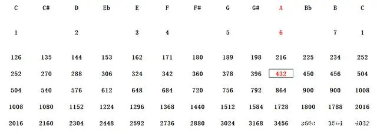

# 音乐的频率

声音的本质是传播媒介的振动，耳膜将其转化为神经电位，从而在大脑皮层产生听觉。而对于人类所定义的每个音高，都有与之对应的客观频率，这与声音的另外两大特性——音量和音色毫无关系（振动幅度决定音量，波形和传播媒介决定音色）。因此，唯一决定音高的因素就是发生源的振动频率，以“Hz”为单位。

## 标准间高

1939年9月，英国标准协会（BSI）在伦敦召开了一次正式会议，会议规定了中央C上的标准音高A=440Hz。这一定义在1953年被国际标准化组织ISO所接受并沿用至今，成为目前世界通用的国际音高标准。

从西藏古老的颂钵到非洲早期的宫廷乐器科拉（Kora），其实都是以432Hz作为标准音。根据我国古代乐典《曾侯乙钟铭》的推算，周代黄钟律的标准音为864.07Hz。虽然十二音平均律到16世纪才被提出，但通过计算我们可以得到，这一标准音降个八度便是432.035Hz。世界各地古代乐器出现的“432Hz巧合”，在部分学者看来则正好说明了432Hz这一频率可能是人耳最容易接受的频率。

如果以432Hz作为标准音高又会发生什么呢？下方两个纵列分别是A=432Hz（左）和 A=440Hz（右）的时候，其他音高的对应频率：

```
C=256      C=261.63 
D=288      D=293.66
E=324      E=329.63 
F=352      F=349.23
G=384      G=392.00 
A=432      A=440.00
B=486      B=493.88
```




物理上根据波动方程求解得到。弦振动频率（基频）具体表达式为：

