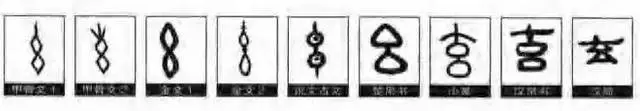

# 太玄经

道德经：道可道，非常道。 名可名，非常名。 无名天地之始；有名万物之母。 故常无欲以观其妙；常有欲以观其徼。此两者同出而异名，同谓之玄。玄之又玄，众妙之门。

有无相生，有无同谓之玄。玄之又玄，众妙之门。

世间之道可以一以贯之，在不同的空间尺度上，可以统一在一种结构之下。在中华文化中，在其字型字义上非常最贴合这个“一”的字叫“玄”。

“玄”之一字妙之又妙，它即有旋之意又有缠之意，即有自旋之意又有螺旋之意。

[[1dn-xuan-1000]]

[//begin]: # "Autogenerated link references for markdown compatibility"
[1dn-xuan-1000]: xuan-1000/1dn-xuan-1000.md "太初有道-玄子的诞生"
[//end]: # "Autogenerated link references"