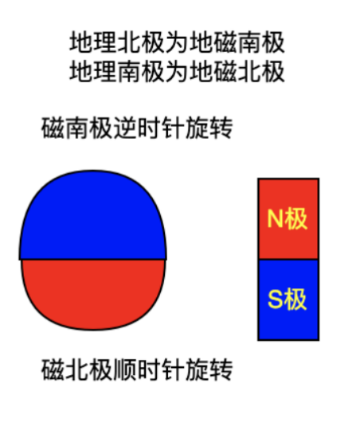
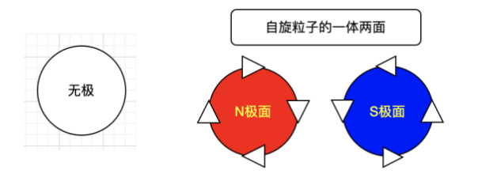
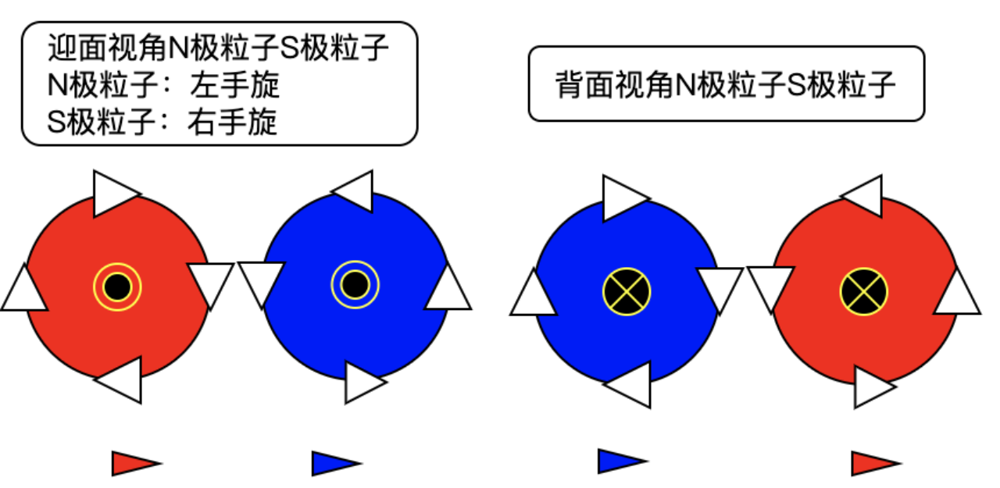
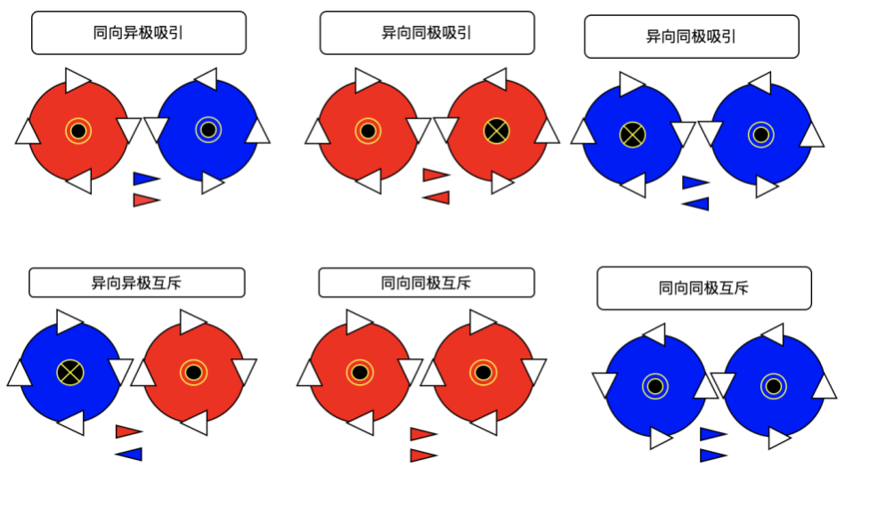
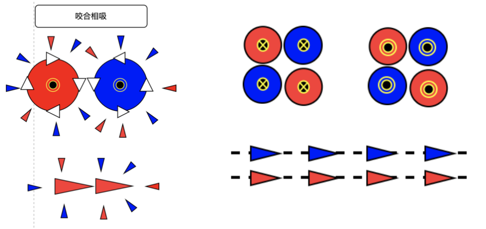
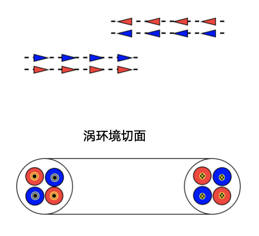
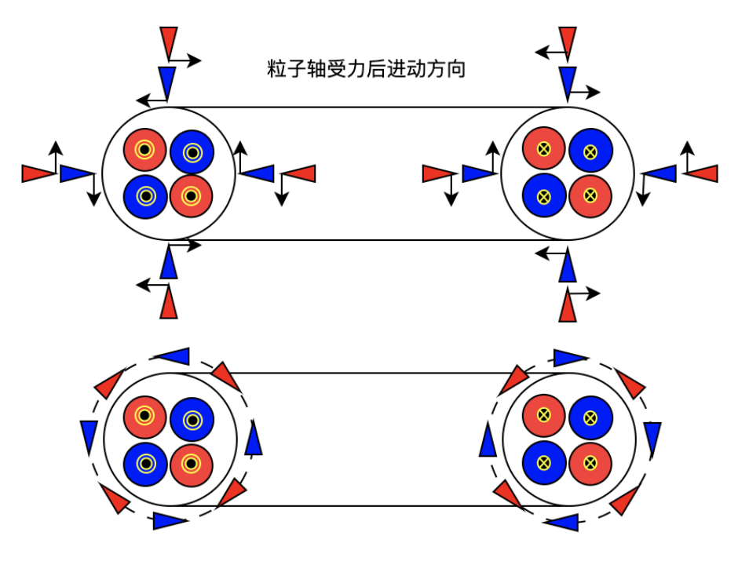
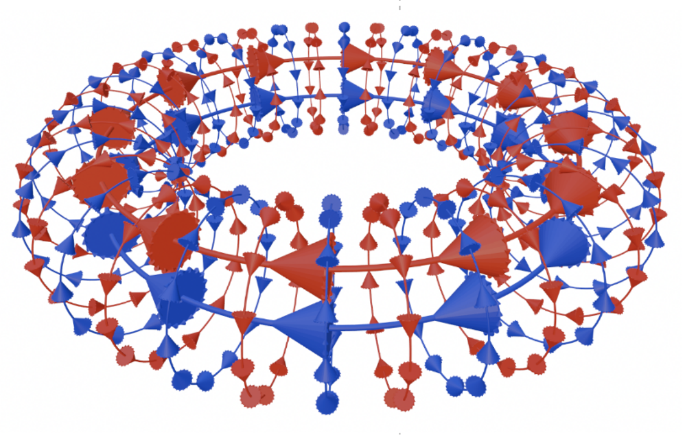
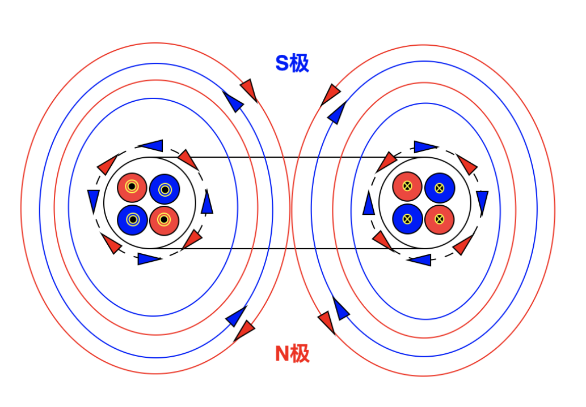
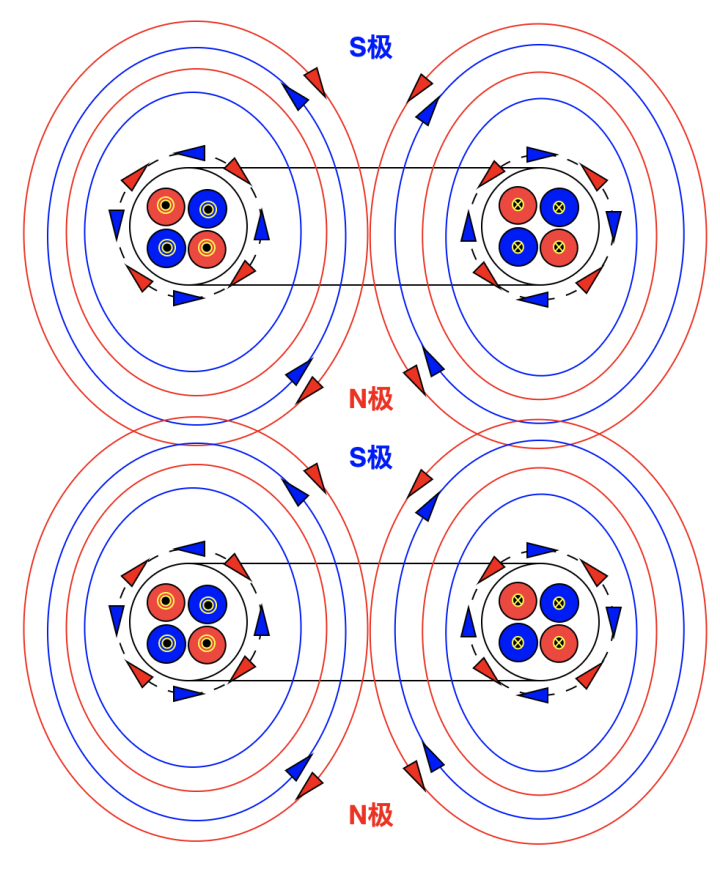

# 太初有道-玄子的诞生

## 基本概念

地球的极性和颜色标识

无太生太极：自旋粒子有极性，但还是一种粒子

太极生两仪：自旋粒子加平动生成两种粒子

## 粒子的排斥与吸引

考虑粒子受周围粒子撞击的动量变化，有吸引排斥相互作用。

## 粒子流

同类粒子形成链：受周围粒子撞击形成链更稳定，考虑动量

同向异极粒子链形成粒子束：形成致密粒子流

## 涡环的形成

粒子流对流会相互吸引形成环状结构

自旋环周围粒子运动情况：自旋粒子运动参考陀螺仪进动

## 涡环示意图

## 涡环极性

## 玄子

无序的自旋粒子会自发形成涡环结构，涡环结构又可以看成更大尺度的自旋粒子。所以不同空间尺度上的本源结构都是涡环粒子。

这里将涡环粒子叫做玄子，玄之又玄形成不同维度的世界。

玄子的核心是个致密高速自旋环，后续我们简称玄子环，周围会成形磁场球，世界主要由这类自然形成的自旋磁体组成，在不同尺度维度上都有类似的结构。

玄子环相对玄子球非常之小，以银河系为例，银河系的直径约为10万光年,银心区域约1万光年，但其中心超大质量黑洞约为0.0014光年，为银心区域的千万分之一，约为太阳的大小。银河系中心的超大质量黑洞类比于玄子核。

如果各维度玄子环类比银河系（河系维度）比例（千万分之一 10^-7），不同维度玄子尺度如下：

恒星系维度:我们可以认为太阳系为组成银河系（河系维度）玄子的下一维度玄子，太阳类似银河系的银心，银河系是太阳系的5*10^7倍太阳系，太阳中心玄子环类比银河系中心黑洞大小约为100米大小。

行星系维度：地球也是自旋磁体，也为玄子，直径约为太阳的百分之一，中心玄子环约1米大小。

原子维度：原子也为自旋磁体，也为玄子，原子核类似太阳系太阳，原子直径在0.1纳米到0.5纳米之间，玄子环直径约为10^-17米，直径约为质子的百分之一.(1纳米等于10^-9米）

电荷维度：质子电子也是自旋磁体，也为玄子，直径为1到3飞米(10^-15米)，玄子核同上计算直径为10^-22米。

玄子环直径为玄子球直径的千分之一，则玄子环的体积为玄子球体积的10^-21分之一，也就是说玄子核体积是玄子球体积的十万亿亿分之一。

这里特别说明玄子球，也就是涡环中的自旋环，是因为它是玄子的本源结构，结构致密且微不可见，以非常高的速度在自旋。我们一般所见物质结构为涡环的磁体结构，这个磁体结构是依托于玄子环而生的。
