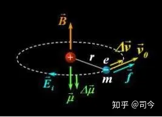
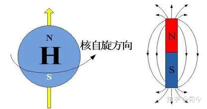
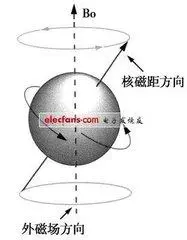

---

date: 2024-05-12 14:17:14

categories: vortext

tags: 
- 无

original_url: https://zhuanlan.zhihu.com/p/70428786

---

# 磁陀螺运动与现代物理学漫谈（1）—我为什么要研究磁陀螺运动？

**磁陀螺运动与现代物理学漫谈（1）—我为什么要研究磁陀螺运动？**

  

**司** **今**（jiewaimuyu@126.com）

  

陀螺运动是一个既古老又新颖、既复杂又迷人的话题；说它古老，在中国新石器时代就出现了石制_陀螺_，在欧洲也可以追溯到十八世纪之前；说它迷人，不仅指它的运动属性特殊，而且自十八世纪欧拉开创陀螺研究之风后的三百多年里，人们对陀螺运动的研究、开发和运用活动就从没有停止过；说它复杂，可以从欧拉刚体力学方程组中看出端倪；说它新颖，可以在太阳系行星运动、量子力学拉莫尔进动中看到它的踪影……

也许由于历史的厚重，也许陀螺运动现象用现代物理语言描述太复杂，直到现在我们对它运动的物理奥秘仍显得知之甚少，特别是磁陀螺运动问题。

现代，由于人类观测视野的开阔和实验水平的提高，我们不论从宏观天体还是微观粒子运动中都能够觉察出它们运动共性，即陀螺运动性；不过，这种陀螺运动性有别于经典的陀螺运动，因为它们都带自旋和自旋磁矩，因此，它们的运动就与自旋磁陀螺运动有相似之处，所以，认真研究陀螺运动形成的物理原理，特别是磁陀螺运动原理，犹显得意义重大。

旋转是宇宙中物质运动的重要组成部分，大到星系、行星，小到电子、光子，它们都有自旋、公旋性，要正确认识客观世界的物质运动，就应该洞悉这些物质的自旋和公旋性，而这些旋转性与陀螺运动原理基本相同，因此，彻底弄清陀螺运动、特别是磁陀螺运动的物理本质，是认识客观世界物质运动基本规律真相的必经之们。

可以这么说，磁陀螺运动上通“大宇宙”，下连“原子系”，直至包括光子运动；就其所包含的物理学范围而言，它前可以衔接牛顿万有引力、库伦电、磁荷力，后可以关联天体物理学、量子力学、粒子物理学等，是破除目前物理学困境的最佳选择法宝！

但是，在我们物理学发展史中，物体自旋及其物理效应问题却一直被物理学界所遗漏或忽视：物体自旋可以产生磁场吗？带有磁场的自旋物体通过磁场空间时会产生什么样的运动变化？物体自旋与其平动有什么直接联系？等等，这些问题直到现代也没有被人们真正提起和重视过。

本人专注研究陀螺、磁陀螺运动多年，目的就是为了找到一个既适合于微观粒子也适用于宏观星体运动描述的统一物理模型，并通过这个物理模型去诠解它们在磁场空间中运动所呈现的一些现象的物理本质。

通过不辍地实验、研究和思考，我隐约发现，磁陀螺在磁场中运动确实可以作为一个物理模型，用这个模型既能够诠解宏观世界星系、行星、卫星的运动现象，也能够阐述微观领域原子、电子、光子的运动机制；同时，也间接证明了“物体自旋可以产生磁”这一物理本质，如地球磁场与电子磁场所产生的物理机制是一样的，如果将地球、电子、光子等可看作是实实在在的“自旋磁粒子”，那么，它们的磁场都是其自旋运动效应的表现；这些“粒子”运动所表现的曲线性和波动性，都是它们在宇宙或物质磁场空间做“磁陀螺运动”所表现出的“假象”……

在“新华网•发展论坛”上，我曾看到一位叫陈广民网友的呼吁：

“谁掌握陀螺运动原理（**特别是磁陀螺运动原理**），谁就拿到了打开科学大门的金钥匙，谁就拿到了砸碎伪科学的大铁锤！掌握陀螺运动原理后的中国科学一定会在很短时间内雄起来！”

我想，他的感悟是深沉的、也是深厚的！在此，希望有关科研部门关注并重视陀螺运动、特别是磁陀螺运动的理论研究！

## **【附录】** **：**为了更好地直观比较和理解宏观与微观自旋、公转的共性及自旋磁场性，本文收录了现代物理学中比较公认的理论图片，以飨读者。

**1、太阳系行星运行**

1.1、太阳系行星运行及动画演示

  

  

  

  

[http://www.daode99.com/attach/video/](https://link.zhihu.com/?target=http%3A//www.daode99.com/attach/video/)太阳和行星运行图动画.swf

1.2、太阳、地球像个大磁陀螺

  

  

  

  

1.3、地球轨道磁矩

  

  

**2、原子系电子运动**

2.1、原子系电子运动及动画演示

  

  

  

  

[http://www.ihep.cas.cn/kxcb/kpcg/gnwl/200907/t20090722\_2156317.html](https://link.zhihu.com/?target=http%3A//www.ihep.cas.cn/kxcb/kpcg/gnwl/200907/t20090722_2156317.html)

2.2、原子核、电子像个小磁陀螺

  

  

  

  

2.3、电子轨道磁矩

  

**【注】：**1、本文所用图片除作特别说明和自我绘制外，均来自「百度图片」，在此对「百度」网表示感谢！

2、特别声明：如其他媒体、网站或个人从本博转载此文，须保留本博“地址”，否则视为侵权行为。

**下期预告：磁陀螺运动与现代物理学漫谈（2）——我们该如何研究磁陀螺运动？**