---

date: 2024-05-12 21:54:43

categories: vortex

tags: 
- 无

original_url: https://zhuanlan.zhihu.com/p/73724099

---

# 磁陀螺运动与现代物理学漫谈（7）——说说磁场空间构成形式及属性 

## **磁陀螺运动与现代物理学漫谈（7）——说说磁场空间构成形式及属性**

**司 今**（jiewaimuyu@126.com）

  

几种磁场空间的磁力线分布形式

磁体都是偶极的，不论磁体空间体积大小如何，即使一个自旋电子、光子，它们也是集N、S极于一身的偶极磁子。磁场依据磁体而存在，不同形状的磁体或磁体不同的空间排列形式都会形成不同的磁场空间。那么，由磁体不同形状或磁体不同排列而形成的空间磁场就有多种分类形式：

  

偶磁极自旋电子

（1）、按构成磁场空间磁体个数多少，可分为单体型、双体型、多体型等磁场形式；

（2）、按构成磁场空间的磁体分布，可分为单级型磁场、中心型磁场、上下型磁场、复合型磁场等；

（3）、按磁体运动情况，可分为静态磁场、动态磁场等。

（4）、按磁场空间平面强度分布情况，可分为均匀磁场、非均匀磁场等。

本文将以分类2为骨架，融合其他分类来讨论磁场空间属性及磁陀螺在磁场中的运动。

我在《重论法拉第力线》一文中阐明了**磁力线的本质反映的是小磁针在磁体磁场空间受磁体磁极影响所产生的排列分布现象**；本文将延续这一思路来尝试性地诠解磁场空间的构成形式及属性问题。

**1、** **几种磁场强度定义及其物理意义**

**1.1、依据库伦磁荷力定义的磁场强度**

库伦磁荷定理是从偶极磁体磁极磁荷概念出发得出的，即F=kmqm1qm2/r2；库伦磁荷定理描述的是质点荷之间的作用力，如图-1、2，它的磁场场强可定义为H=kmqm/r2；从质点角度讲，库伦磁场强度大小与距离r呈线性关系。

  

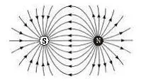

图-1

磁库伦定理描述的磁场强度是与磁力线方向一致的，不同r间的磁场强度差△H= kmqm(1/r12-1/r22)，这也可以称磁场梯度，它与目前物理学描述的磁场梯度力F=μzdB/dz中的磁场梯度dB/dz有密切关系。

  

图-2

**1.2、依据高斯磁场定理定义的磁场强度**

高斯磁场强度反应的是单位面积上通过垂直磁力线根数的多少，即B=Φ/S；但物理学为了将库伦磁定理与高斯定理相衔接，就改成F=qm1qm2/4πμ0r2=qm1qm2/μ0S，即B=qm/μ0S；这是质点磁荷概念延伸出的磁场强度。

如图-3，二个球面之间上的磁场强度差是△B=qm/μ0（S1-S2）= qm/4πμ0（r12- r22）。

  

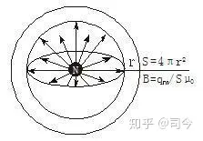

图-3

磁荷是从电荷概念中推测出来的概念，但并不真实存在，如图-4，在宇宙中存在的都是集N、S于一身的偶极磁子，那么，对于磁子的空间磁场如何描述呢？

  

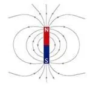

图-4

首先，磁子不可质点化，因它具有线偶极性；

其次，如图-5，对于一个闭合球面而言，它可以包裹住磁子，但由磁子产生的磁力线并不都穿过球面，因此没有办法再用高斯磁荷磁场B=qm/μ0S来描述磁子形成的空间磁场；

  

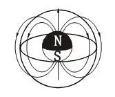

图-5

再次，磁子产生的磁力线本身具有闭合性……

这些都是目前磁学中忽略与模糊的领域，也是目前物理学对磁子描述困难的根源所在。

对静磁场而言，任何磁场都是由磁体形成的，而任何磁体都是偶极的；磁体磁场与另一个磁体作用时都是磁场磁极与磁体磁极相互作用的表现，从这个意义上来说，用库伦磁荷定理来描述磁场会比高斯定理描述磁场更有实际意义，如图-6；特别是对像小磁针、球形磁体等相互作用；我的磁陀螺运动理论就是建立在磁场磁极与磁陀螺磁极相互作用概念之上的。

  

图-6

根据一些实验数据，也可以定义出某磁场空间的磁场大小来，常用的方法如下：

**1.3、依据洛伦兹力定义的磁场强度**

如图-7所示，利用洛伦兹力定义B=F/qv；

  

图-7

**1.4、依据安培力定义的磁场强度**

如图-8所示，根据电流元Idl在磁场中所受安培力dF=Idl×B定义B=dF/ Idl；

  

图-8

**1.5、依据磁矩定义的磁场强度**

如图-9所示，根据磁矩m在磁场中所受力矩L=m×B来定义B；如图-4所示，单根载流线圈在磁场中的安培力是F=IlB,安培力对线圈一边产生的磁力矩是FR=IlR=ISB/2=L,其中S=2lR是线圈平面面积，由此定义出载流线圈平面的磁矩是m=IS=L/B，即B=L/m.

  

图-9

这三种定义，方法雷同，完全等价。

**2.双体偶极磁场空间构成形式及其属性**

**2.1、双体偶极磁场空间构成形式**

二个磁体磁极相对构成的磁场空间就称作**双体偶极磁场空间**，如图-1所示，由于磁体磁极形状不同，它们形成的空间磁场可分为均匀磁场空间和非均匀磁场空间二种形式，图-10形成的空间磁场就是一种均匀磁场，图-11、12所形成的空间磁场就是非均匀磁场。

  

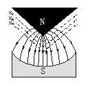

图-10

  

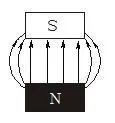

图-11

  

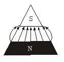

图-12

**2.2、小磁针在双体偶极磁场空间的受力变化**

在图-13中，磁场空间有均匀和非均匀之分，在非均匀区域，小磁针处在磁场空间的N、S分界面上与均匀磁场的力线平行外，其他都表现出倾斜，而在均匀磁场区，则小磁针都表现出与磁力线平行；对于图-14、15，因其构成的磁场空间是非均匀空间，故小磁针除在磁场中心线表现出与磁力线平行外，其他都表现出倾斜性。

  

图-13

  

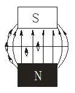

图-14

  

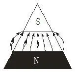

图-15

**2.3双体偶极磁场空间的强度变化与磁场梯度**

**2.3.1均匀磁场空间的磁场与磁场梯度**

高斯磁场强度反应的是单位面积上通过的垂直磁力线根数多少，由此定义均匀和非均匀磁场。

物理教科书通常用图-16来描述均匀磁场，这是按法拉第力线守恒思想描述的结果，它只代表同一平面上的**磁力线密度**处处相等；但它无法描述不同平面间N或S极磁场强度差异的变化，如用高斯定理描述不同z方向的N极磁场，则它们应是相同的，即H1N=H0N=H2N，因为穿过Sz1、Sz0、Sz2平面上的磁力线根数是相同的。

  

图-16

但从N极磁场梯度而言，却有H1N>H0N>H2N，这说明在均匀的法拉第力线空间，不同垂高度平面上的磁极磁场强度处处是变化的。

如果我们在0、1、2三个平面上分布放在一个小磁针，我们就会发现：小磁针在0平面上可处于平衡状态，但在1或2面上，则它将向N或S极移动，这就是磁场梯度力作用的结果；可见，在0平面上的小磁针最稳定，我们将这个平面称为**0梯度面**，在此平面之上或下的磁场空间平面称为**非0梯度面**；这种现象对单体磁场也存在。

高斯定理描述的磁场强度是垂直于磁力线平面的磁力线密度，它是纬度面性的，即B=Φm/S = qm/Sμ0，因此，对不同经度下的磁场强度描述就不在适用。经度上的磁场强度也遵循距离平方反比规律，但它是线性的，即遵循库伦磁定理H=kmqm/z2，这种不同z上的磁场强度差异称为磁场梯度；

可见，磁场梯度反映的是高斯面之间磁场强度随空间位移z的变化率，现代物理学用符号dH/dz表示；这说明高斯面之间磁场梯度的本质就是库伦线磁场强度的空间差。

当然，我们也可以借鉴现代电磁学中对**均匀**电场电势差、**等势面（**实质就是电场梯度面**）**的描述来对均匀磁场、磁势差、等磁势面等进行处理。

如图-16所示，均匀磁场就是指在同一等势面内（如平面1、0、2）任意一点所具有的磁场场强大小和方向均相等。但二个等势面上的磁场强度是不同，存在一个磁势差，如等势面1与0之间的磁势差就为UB1.0＝B1－B0）Z＝△BZ，且B1＞B0.正是因为均匀磁场中不同等磁势面之间的磁场场强不同，才使磁性物体以v速度通过磁场区时会表现出运动轨迹不同的变化，如产生上、下弯曲或左、右弯曲的运动特性来。

磁陀螺在磁场中的运动变化不但与磁场空间强度有关，还与磁场梯度有关。如果我们放置的是一个自旋磁陀螺，它们又会怎样呢？如果是运动的自旋磁陀螺分别通过0、1、2平面，它们的运动又有什么不同呢？

**2.3.2非均匀磁场空间的强度与梯度**

在静电学中，我们知道带电体电场强度的分布随带电体的几何形状不同而不同，带电体曲率越大的地方，电场强度越大。静磁体的磁场强度分布也是如此，如下图组所示，倒三角磁极磁场最强的地方在其三角尖端，在z方向，磁场强度梯度分布也遵循H=kmqm/z2规律，而每一个磁场梯度平面的磁力线分布又呈非均匀态。

一个偶极磁体在z垂线以外空间的任何位置处，它所受的磁场力有二个：(1)、垂直方向受磁场梯度作用而产生向磁极的磁场梯度力，(2)、水平方向受非均匀磁场作用而产生向z轴靠近的磁力线密度力。

常见的非均匀磁场空间如图组-1所示；自旋磁陀螺通过这些非均匀磁场时会产生不同的运动轨迹。因此，研究这些磁场的磁力线分布很有必要。

图-17，三角形磁场空间，会使磁陀螺产生“折射“动；

  

图-17

图-18，圆锥形磁场空间，会使磁陀螺产生”锥螺旋“运动,；

  

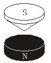

图-18

图-19，倒三角磁场空间，会使磁陀螺产生“施特恩衍射”运动等。

  

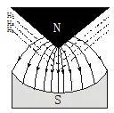

图-19

以倒三角磁场空间为例，其非均匀磁场的磁力线分布如图-19所示，它的等磁面很复杂，只能在磁极近处按磁极几何形状予以粗略描述；由此可以看出磁极附近的磁场梯度分布状况；但在这个磁梯度面上，磁场强度分布是非均匀的。

在偶极磁场中，不论是均匀磁场或非均匀磁场，形成磁场的二个磁极间都存在一个对平行磁力线的小磁针磁极二端产生磁力相等的平面**，**我们称这个平面为磁场的**0梯度面**或**洛伦兹面**；磁陀螺在这个平面内运动时自旋轴不会发生倾斜。

**3、复合磁场空间（内洛伦兹与外洛伦兹运动）**

如图-20所示，对双体偶极磁场空间构成来看，如果将二个磁体看做是一个整体空间的话，那么，它们就形成了一个单体偶极磁场空间+双体偶极磁场空间的复合磁场空间。

  

图-20

可见，双体偶极磁场空间可分为内、外二种，内空间磁场又有均匀与非分均匀之分。

我们称二个磁体组成的磁场为上下型磁场。在这个磁场中，一个偶极磁子的二极都能极感受到磁场的引力或斥力，但我们要注意，上下型磁体结构形成的磁场在更大的间范围来看会有二个产生，一个在内层，为均匀磁场；一个在外层，为非均匀磁场，这个磁场既可以看做是单体偶极磁场，又可被看做为双体偶极磁场，磁陀螺或自旋电子在这二个磁场空间将会产生不同的运动形式，我在《洛伦兹运动形成的物理机制及其几种形式》一文中谈到的“内洛伦兹”和“外洛伦兹运动”就是以这种复合磁场结构为基础而建立的。

**3、单体偶极磁场（磁子磁场）空间构成形式及其属性**

**3.1、单体偶极磁场空间构成形式**

单体偶极磁场(又称磁偶极子磁场)，就是一个磁体或磁子在其周围空间形成的磁场，其磁力线分布形态可用图-21描述。

不过，这里要特别注意，柱磁体与菱形、球磁体的磁场分布是存在差异的；菱形小磁针与球形磁体都存在一个N、S磁场强度为最大的轴线，柱磁体磁场则也存在最大区域，但在在这个区域中，又存在高斯磁场强度为均匀磁场的平面空间。

  

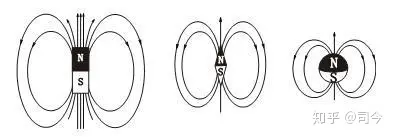

图-21

磁陀螺磁场是单体偶极磁场，从法拉第力线来看，它分闭合和开放二部分，但真正能够与外磁场磁极产生作用的则是开放部分，即自旋轴向磁场，其他部分由于表现的磁极磁场较弱，它们与磁场磁极作用也就相对较弱了。

对于一个自旋球体而言，因它自旋所产生的磁场在其自旋轴二端方向为最强，它可以被看做是球磁体磁极轴。

**3.2、小磁针在单体偶极磁场空间的受力变化**

如图-22所示，小磁针二个磁极在0位置受到磁体二个磁极的引力是相等的，故它的最大磁轴与磁体磁轴是平行的，但对于小磁针1就没有这种现象存在，这时，小磁针磁轴会受磁体磁极影响而产生倾斜，小磁针2虽磁轴不会产生倾斜，但磁针的二个磁极受力是不相等的，它会向磁体磁极靠近。

  

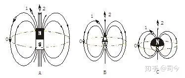

图-22

**3.3单体偶极磁场空间的强度及梯度变化**

图-23所示：单体偶极磁体的磁场分布，小磁针磁轴会沿磁力线产生倾斜，说明单体偶极磁场是一种非均匀磁场，这种磁场也有梯度存在。

  

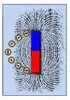

图-23

如果按法拉第力线思想，我们对此磁场作理想描述就是图-24所示状态。

  

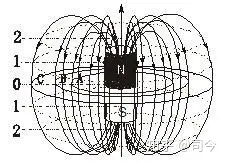

图-234

它的磁力线分布呈扁南瓜型，磁场强度有二种描述形式：

（1）、沿赤道或赤道平行面产生的磁力线密度分布差，即在同一赤道平面上，磁力线为非均匀分布，这个磁场强度分布符合高斯磁定理：B=Φm/S=qm/πr²μ0，可称为**水平磁场梯度**；磁场随距离中心磁体的距离不同而不同，如A、B、C三平面内的磁场强度就有BA＞ BB＞BC，小磁针在水平面上会受力而向磁体靠近。

（2）、沿赤道面法线方向产生的**垂直磁场梯度**，即沿赤道平面法线方向，随高度的增加而磁力线密度增大，如0、1、2高度处有H2＞H1＞H0，这个磁场强度分布符合库伦磁荷定理：H=kmqm/z2，可称为垂直磁场梯度；小磁针在0磁面最稳定，在0面上或下都会受到磁极力作用而产生上或下移动，同时还会产生向磁体靠近的运动。

对一个静态自旋磁陀螺而言，遇到这样的磁场就不会像磁体靠近，而是因自旋轴上下端受力不相等而产生绕磁体的曲线公转运动。

**4、磁极磁场空间构成形式及其属性**

**4.1、磁极磁场空间构成形式**

磁极磁场是指偶极磁体的某一极上方空间所表现出来的磁场，磁场空间的磁力线分布随磁极形状不同而表现不同，如图-25所示；在这些磁场中放置小磁针，它们就会受到磁极磁场的引力或斥力作用。

  

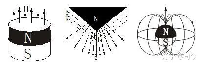

图-25

**4.2、小磁针在磁极磁场空间的受力变化**

以柱形磁体磁极为例，我们来看一下小磁针在此空间的受力变化情况。

我们先将小磁针按图-26-1所示图方式排列成一排，然后将一块条形磁体的N及靠近这排小磁针，就发现小磁针会受磁体磁极力作用而产生排列变化，其中靠磁体磁极边缘的小磁针会产生偏转，并按图-26-2形式重新排列。

  

图-26

这说明小磁针在重新排列变化过程中受到磁铁磁极力的作用，对于小磁针A而言，因小磁针的N、S极轴线与磁体磁极的磁力线平行，故它只受到磁铁磁极的引力作用，这个引力大小会随磁铁磁极到小磁针S极的高度不同而不同，它遵循Fz= kmqm dH/dz的变化规律，（qm为小磁针磁极磁荷量，dH/dz为磁体磁极磁场随空间距离变化的变化率），这个力就称为小磁针在磁极磁场中所受的磁场梯度力。

对于小磁针B而言，由于它的N、S极轴线较原来产生了偏转，故它受到二个力作用，即平行于磁极磁场的磁场梯度力Fz和垂直于磁场的力FL，这二个力的合成就是小磁针S极受到的总力，其中，FL是造成小磁针方式偏转的力。

当然，我们也可以用磁流体来做这个实验更能看清磁性粒子在磁极磁场作用下的排列规律，如图-27所示。

  

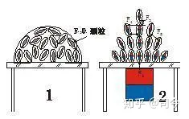

图-27

可见，小磁针在磁体磁极空间可受二种力作用**，**即磁场梯度力（力方向与磁极力线平行）和磁极矩力（力方向与力线垂直）。

**4.3磁极磁场空间的强度变化与磁场梯度**

如图-28所示，在磁极上方的水平面上，磁极磁场强度分布符合高斯平面磁场强度定义，其磁场强度分布存在均匀和非均匀二种状态；即H= qm.cosθ/πR2，(θ为小磁针的主轴磁力线与磁极磁力线之间的夹角，qm为磁场磁极磁荷量)；

  

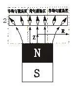

图-28

但在二个高斯场强面之间，存在磁场梯度变化，其变化规律遵循库伦磁场强度定义，即△H=km.qm.cosθ/△z2.

**【参考文献】略**

**【注】：**

1、本文所用图片除作特别说明和自我绘制外，均来自「百度图片」，在此对「百度」网表示感谢！

2、特别声明：如其他媒体、网站或个人从本博转载此文，须保留本博“地址”，否则视为侵权行为。
