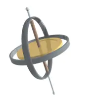
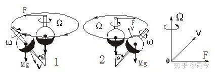
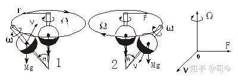
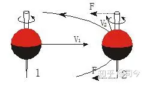

---

date: 2024-05-12 21:57:27

categories: vortex

tags: 
- 无

original_url: https://zhuanlan.zhihu.com/p/73724276

---

# 8陀螺运动基本原理简介 

**司今**（jiewaimuyu@126.com）

陀螺进动分为定点进动和非定点进动二种，且它们产生进动的物理原理都是一样的，即都是自旋轴受持续力矩作用的结果，这在地球引力场中如此，在磁场中也应如此。

**1、陀螺支点进动原理，**

  

图-1 陀螺绕支点进动

自旋陀螺有一个重要特性，那就是它受到外力矩作用时会产生回转效应，即进动，而且进动方向与自旋方向始终保持一致性，如图-1所示。

如我们手持一个自旋陀螺用力向左或右摆动，它们都会产生进动，且进动方向与自旋方向始终保持一致性；图-2为逆时针自旋陀螺受力矩后会产生逆时针进动，图-3为顺时针自旋陀螺受力矩后会产生顺时针进动。

  

图-2

  

图-3

如果我们在进动初始状态对陀螺体质心绘成一个坐标，就可得出这样一个结论：陀螺轴受力F方向与其进动轴Ω方向及进动速度v方向三者之间始终保持相互垂直状态，即具有“三垂性”，如用现在教科书的矢量叉积概念描述就是**Ω**\=**F**×**V**.

“三垂性”是陀螺产生进动必须遵守的**最基本原则**，也是陀螺力学使用矢量叉积的物理本义所在；以此原则为基础，以不变应万变，陀螺的其他运动现象就都可以迎刃而解了。

**2、陀螺质心进动原理**

如图-4所示，在平面上垂直自旋的陀螺，当我们用一个细棒向左或右拨动自旋轴上或下端点时，它会产生绕质心的进动，这种进动有一个特点，那就是陀螺质心始终保持在进动中心轴线上。

  

图-4

如果陀螺还有平动就是陀螺自旋轴的漂移运动，这个运动实质是自旋陀螺质心双自旋的表现，即原自旋速度减慢，转化成了绕质心的进动，如图-5所示。

  

图-5

地球绕太阳运动就可以看做是这种运动状态，从“自旋生磁”角度来讲，地磁轴是它真正的自旋轴，现代观察到所认为的地理自旋轴为进动旋转轴，是一种假自旋轴，如图-6。

  

图-6

以上实验和观测表明，静态自旋陀螺产生进动的原因是陀螺自旋轴受力而产生力矩不平衡造成的，即陀螺进动的本质就是陀螺自旋轴受力矩不相等的结果，质心重力矩提供持续的力矩作用，陀螺产生进动时它的自旋角速度会变小。

**3、陀螺曲线平动原理**

假如我们在自旋陀螺轴上下端距质心等距离处施加相等大小的外力，则陀螺不会产生自旋 轴倾斜的进动，但会产生质心平移的曲线运动。

如图-7所示，自旋轴二端受力F使陀螺产生与v1相垂直的速度v2，如果｜v1｜=｜v2｜则会产生圆周曲线运动，如果｜v1｜＞｜v2｜，则会产生椭圆曲线运动，但无论什么形式的曲线运动其平移速度｜v1｜不会减小，只是速度方向发生改变，即产生了与v1相垂直的v2速度分量；如果这对力偶不消失，它就会产生一个完整的闭合曲线运动轨迹，且F永远与v2方向垂直，即F⊥v2 ，这种力作用也遵守**Ω**\=**F**×**V** “三垂性”原理。

  

图-7

这个实验说明，陀螺产生曲线的原因是由自旋轴二端受平行于速度方向持续力矩约束造成的，这时陀螺自旋角速度ω和曲线速度v值大小同初始态一样不变，只是其v运动速度方向发生了变化。

  

图-8

“陀螺曲线平动原理”也适用于磁陀螺在磁场中的曲线运动，如图-8、图-9所示，磁陀螺在磁场中运动时，由于受中心磁体磁极力的影响正好可以提供这种持续的力矩作用，不论有无重力场存在，自旋磁陀螺只要轴向受力，它都会产生一个与自旋轴、原平动方向垂直的新速度v⊥，只要这个轴力矩持续存在，那么，这个变方向速度就一直存在，就能够形成稳定的曲线运动轨迹。

  

图-9

关于陀螺运动原理的详细论述，敬请参阅司今**《关于陀螺运动及其研究方法的探讨》**一文。

**【参考文献】略**

**【注】：**

1、本文所用图片除作特别说明和自我绘制外，均来自「百度图片」，在此对「百度」网表示感谢！

2、特别声明：如其他媒体、网站或个人从本博转载此文，须保留本博“地址”，否则视为侵权行为。

**上期目录：磁陀螺运动与现代物理学漫谈（7）——说说磁场空间的构成形式及属性**

**下期预告：磁陀螺运动与现代物理学漫谈（9）——磁陀螺在磁场中运动的基本原理**