---

date: 2024-05-12 22:13:46

categories: vortex

tags: 
- 无

original_url: https://zhuanlan.zhihu.com/p/75901052

---

# 磁陀螺运动与现代物理学漫谈（11）——均匀磁场对磁陀螺运动的影响 ——兼谈洛伦兹运动形成的物理机制 

## **磁陀螺运动与现代物理学漫谈（11）——均匀磁场对磁陀螺运动的影响**

## ——兼谈洛伦兹运动形成的物理机制

司 今（jiewaimuyu@126.com）

**【题记】**：洛伦兹力公式不是从物理理论中推导出来的，而是由多次重复实验所得的结论，它只能被当作一个基本公理来应用，因为，直到现代人们还不清楚洛伦兹运动形成的真正物理机制，更不知道洛伦兹力是一种什么力？它从何而来？......

  

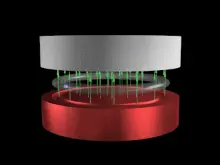

回旋加速器中的洛伦兹运动

我们知道，电子有自旋和自旋磁矩性，即电子可以被看做是一个微观的自旋磁陀螺；那么，如果我们能够从宏观上找出自旋磁陀螺在磁场中运动的一些规律，就可以帮助我们更好地认识和理解微观自旋电子（磁子）在磁场中运动所产生的一些物理现象的本质——这就是我为什么要苦苦研究和精心撰写《磁陀螺运动与现代物理学漫谈》系列文章的根本动机所在，同时也为抛砖引玉，以期让更多物理学者和爱好者们去关注这一“被物理学界冷落和遗忘”的重要领域！

  

带有自旋磁矩的电子

▁▁▁▁▁▁▁▁▁▁▁▁▁▁▁▁▁▁▁▁▁▁▁▁▁▁▁▁▁▁▁▁▁▁▁▁▁▁▁▁

  

我曾做过这样一组磁陀螺运动实验：

如图-1，当装有非金属轴的自旋磁陀螺从倾斜拱槽中向下滚动，进入一个“上下型”均匀偶极磁场**“0梯度面”**空间时，它会产生曲线运动；当磁陀螺运动速度足够小或外磁场足够大时，它甚至可以呈现近似椭圆的运动。

如图-2，如果磁陀螺运动通过的是均匀磁场“非0梯度面”空间，则它不但会作曲线运动，且还会向磁场磁极方向稍稍偏移一点。

  

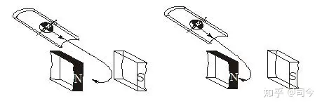

图-1 图-2

这组实验表明，自旋磁陀螺以一定速度通过静态均匀磁场空间时，其运动轨迹会受磁场和磁极影响而产生平面或螺旋曲线运动。

这是在地球引力场下所作的实验，如果将这个实验放到微重力的太空，那将是另一番图景：磁陀螺进入磁场空间后将会产生近乎圆或锥螺旋的曲线运动。

本节所讨论的磁陀螺运动都是在重力场影响可以忽略不计的微重力环境下进行推理、分析的；微观粒子在磁场空间中运动也可以看做是不受重力场影响的运动，因粒子所受重力与其所受的磁场力相比太弱了，可以不予考虑。

**1、** **自旋磁陀螺在均匀磁场中的闭合曲线运动**

**1.1、** **“0梯度面”上的磁陀螺运动**

自由运动的自旋磁陀螺有一个特征，即磁陀螺的平动速度v与其自旋角速度ω是相互垂直的，如图-3所示，它的磁场按法拉第磁力线来描述就存在二部分：（1）沿轴向直线非闭合部分，（2）沿轴向外曲线闭合部分。

当自旋磁陀螺进入磁场空间后，磁场磁极是无法与闭合磁力线部分产生作用的，故磁陀螺在磁场中运动所受的磁场及磁极力主要体现在其自旋磁轴上。

  

图-3 图-4

如图-4所示，“上下型”偶磁极磁场空间的中间都存在一个N、S分界平面，在这个平面上小磁针不会产生向磁场磁极运动的情况，即小磁针二端的N、S极所受二个磁场磁极的梯度力相等，故其质心会在这个平面上保持平衡稳定状态，我们称这个平面为磁场**“0梯度面”**，而在这个平面之上或之下的空间平面则称为磁场**“非0梯度面”**。

对自旋磁陀螺轴而言，当它以一定速度进入磁场空间时，因其自旋磁轴二端会作切割磁力线运动，故会在其中产生“电子洛伦兹运动”式的曲线运动轨迹。

我在《磁陀螺运动与现代物理学漫谈（8）》**\[1\]**中谈到，当给自旋陀螺轴上下等距离处施加相同的外力矩时，陀螺不会产生自旋轴倾斜的进动，而会产生质心平移的曲线运动，且平移速度不减小，只是速度方向发生改变；如果这对力矩永不消失，它实质就会形成稳定的曲线圆周运动，如图-5所示。

  

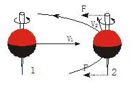

图-5

自旋磁陀螺以一定初速度进入“上下型”均匀磁场时也会产生这样的运动：以均匀磁场“0梯度面”为例，如图-6所示，自旋磁陀螺以平动速度V0进入磁场“0梯度面”空间时，其自旋轴上、下端磁极都会受到磁场磁极力F上H、F下H的影响，且这二个力大小相等、方向相反，并与其平动速度V0方向垂直。由于这二个等值力的作用，磁陀螺质心将会产生二个运动速度分量，即一个是受磁场磁极剪切阻力作用而减小、但运动方向仍保持原速度V0方向的V0′速度，且有ΔV0=V0－V0′；另一个是磁陀螺二磁极作切割磁场力线时所产生的垂直于原速度V0方向的V⊥速度，这二个速度合成就是它在磁场中作曲线运动的速度V.

  

图-6 图-7

从图-7所示的受力分析图中可以看出，磁场对自旋磁陀螺运动产生的阻力**F**阻正是其形成以V作匀速圆周运动的向心力**F**向，且有

V⊥=V0－V0′，V=V0′＋V⊥=V0，V²= (V0′)²＋(V⊥) ²≡V0²；

但这里有个问题，匀速圆周运动速度的二个矢分量值是相等的，即V⊥=V∥，这就要求V0′=ΔV0=V⊥成立，为什么呢？到底V0′=V⊥成不成立呢？欢迎对此问题感兴趣的朋友们给予指点和评判！

通过实验和分析可见，如果将逆时针自旋的磁陀螺射入均匀磁场空间时，则它的自旋轴二端因受磁场磁极引力作用，会因切割磁力线作用而形成沿顺时针方向的曲线运动，**V**与**V⊥**及磁场H方向符合电磁学中「右手判断法则」，且在“0梯度面”上作圆周运动的磁陀螺速度与它进入磁场前的初速度值大小不变，但运动方向会改变。如果从速度矢量合成方面来考虑，则自旋磁陀螺轴受力后产生的速度变化矢量**V⊥**方向始终与切割磁力线力**F**阻垂直，即**F**阻**⊥V⊥**，这与无自旋磁陀螺在磁场中运动受力有根本性区别，但却与圆周运动属性保持一致。

在这个运动中，如果用惠更斯圆周运动公式描述就是qm.B=m.v²/r，因此我们也可以通过测定m、r、v、B值来确定自旋磁陀螺所带磁量的大小。

如果用一个顺时针自旋磁陀螺（上端为N极你、下端为S极）垂直射入上述磁场，则它会在磁场空间产生怎样的运动呢？

为此我们不妨再做一组实验：

如图-8所示，在重力场下当我们给竖直顺时针自旋的磁陀螺轴上端施加一个瞬时力F时，在重力矩作用下，磁陀螺就会产生一个稳定的顺时针进动。

如图-9所示，如果我们在微重力的太空给这个竖直自旋的磁陀螺也施加一个瞬时力F时，则因没有重力矩存在，故陀螺不能形成进动，但会产生二个瞬时速度分量，即V⊥、V∥，它们的速度合成V就是使陀螺产生曲线运动的速度，关于这方面实验可仔细观摩王亚平太空陀螺实验的相关视频予以甄别。

  

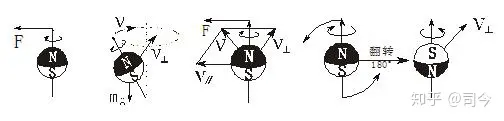

图-8 图-9 图-10

如图-10所示，如果我们给一个垂直自旋的磁陀螺施加一对瞬时力偶时，则磁陀螺轴会产生180°翻转，并会形成一个垂直向内的翻转速度V⊥翻；且磁陀螺的自旋时针方向和自旋轴的N、S极方向也将呈现相反变化。

  

王亚平太空陀螺实验视频及原理\[2\]

以此为据，如果我们将一个N极在上、顺时针自旋的磁陀螺沿均匀磁场“0梯度面”以V0速度射入磁场空间时，如图-11所示，则该磁陀螺在接近磁场空间入口处时因其自旋轴磁极受磁场磁极力影响而产生180°翻转，这就变成S极在上、逆时针自旋的磁陀螺，同时会产生一个V⊥翻方向的速度，这个速度与磁陀螺自旋轴切割磁力线形成的速度V⊥切方向相反，此二者合成向心速度V⊥，而V0＇与V⊥则合成磁陀螺在磁场中作曲线运动的速度V，且有**V**＝**V⊥＋V0＇**，其中**V**⊥＝**V**⊥翻－**V**⊥切，V= V0.

  

图-11

就N极在上、逆时针自旋的磁陀螺而言，它在该磁场空间做切割磁力线曲线运动时，运动针方向与其自旋时针方向也表现出相反性来，且这种运动符合电磁学中的「左手判定法则」，这与正电子在该磁场空间做洛伦兹曲线运动的情形相一致。

这种磁陀螺运动现象说明，自旋磁陀螺在磁场“0梯度面”内运动是最稳定的，因磁陀螺轴上下端所受磁场磁极力都相等，从而保证了其曲线运动速度的不变性，即保证其运动上下空间距离不变和左右绕中心圆点运动半径不变，这就是“为什么行星绕太阳运动时其轨道平面都处于太阳赤道平面上下很小角度？”的原因之一；在太阳自旋体的N、S极磁场中，“0梯度面”就是其赤道面，同样地，带有自旋磁矩的自旋电子在均匀磁场中作洛伦兹曲线运动也有与此类似运动的特性。

**1.2、“ 0梯度面”上电子洛伦兹运动形成的物理机制**

**1.2.1、洛伦兹运动简介**\[3\]

洛伦兹运动是指带电粒子在磁场中受磁场影响所产生的曲线运动，它是1892年荷兰物理学家亨德里克·洛伦兹提出洛伦兹力概念下所产生的运动现象。

洛伦兹力是指运动于磁场中的带电粒子所感受到的作用力。根据洛伦兹力定律，洛伦兹力可以用方程F=qe.v.B表达，其中，F是洛伦兹力，qe是带电粒子电荷量，v是带电粒子速度，B是高斯磁场强度。

  

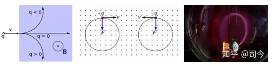

图-12 图-13

如图-12所示，在均匀磁场中，带电粒子的运动轨迹呈圆或局部圆弧线；现代也可以用实验观察到电子在均与磁场中作圆周运动的轨迹，如图-13所示，它是在均匀磁场中，电子射束中电子经过磁场的路径会有紫色光发射出来，这是因电子与玻璃球内气体分子碰撞而产生的现象，从这个现象中可以观察到电子运动轨迹是一个圆。

在非均匀磁场中，带电粒子的运动轨迹虽不是圆，但也表现出连续的曲线轨迹。

如图-14，洛伦兹力方向的判定尊循左手定则，即把左手放入磁场中，让磁感线垂直穿过手掌心，四指指向电流方向，则拇指的方向就是导体或正电荷受力方向（若qe为负电荷，则方向相反）。

  

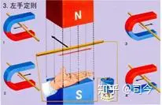

图-14

由于洛伦兹力始终垂直于电荷的速度方向和磁场方向确定的平面，所以它对电荷不作功，不改变运动电荷的速率和动能，只能改变电荷的运动方向使之偏转。

洛伦兹力既适用于宏观电流，也适用于微观电荷粒子，电流元在磁场中所受安培力就是其中运动电荷所受洛伦兹力的宏观表现。导体回路在恒定磁场中运动，使其中磁通量变化而产生的动生电动势也是洛伦兹力的结果，洛伦兹力是产生动生电动势的非静电力。

不过，**值得注意的是：**洛伦兹力公式不是从物理理论中推导出来的，而是由多次重复实验所得的结论，它只能被当作一个基本公理来应用，因为，直到现代人们还不清楚洛伦兹运动形成的真正物理机制，更不知道洛伦兹力是一种什么力？它从何而来？

**1.2.2、洛伦兹运动形成的物理机制**

现代物理学证明，电子有自旋和自旋磁矩存在，也就是说，电子可以被看做是一个微小的自旋磁陀螺，故电子在均匀磁场中作洛伦兹运动与磁陀螺在均匀磁场作曲线运动有一定的相似性.

从磁陀螺在磁场中运动的的情况可以看出，如果把电子看做是个自旋刚体磁陀螺，则自由电子的运动特征应为v⊥ω，即v⊥B自，如图-15所示。

如图-16所示，一个带有自旋磁矩的电子以初速度V0从**“0梯度面”**进入磁场空间后，其自旋轴上下端磁极都会受到磁场磁极引力影响，且这二个力大小相等、方向相反，并与它平动速度V0方向垂直；由于这二个等值力作用，电子质心运动方向将产生二个速度分量，一个是保持原有运动方向的速度V0′，另一个是电子二个磁极切割磁场力线所产生的垂直

于原运动方向的速度V**⊥**，这二个速度的合成就是它在磁场中作圆周曲线运动的速度，即**V= V⊥** **+V0′**，且有V= V0.

  

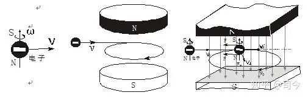

图-15 图-16

可见，在“0梯度面”上作圆周曲线运动的电子速度与它进入磁场前的速度大小不变，但运动方向改变；自旋电子轴受磁场磁极剪切力产生的速度变化方向始终与剪切力相互垂直，即**V⊥⊥F**；在这个运动中，如果用惠更斯圆周运动公式描述，则有qm.B=m.v²/r,由此我们也可以通过测定r、v、B值来确定自旋电子磁量的大小。

由此看来，**如果将电子看做是一个自旋磁陀螺，那么它在磁场中作曲线运动的所谓洛伦兹力就不复存在——洛伦兹力实质就是自旋磁陀螺式的电子磁轴切割磁场磁力线而产生V⊥的另一种描述，是将电子看做是没有自旋性质点粒子（经典粒子）运动的必然结果；理想的洛伦兹圆周运动只能存在于磁场“0梯度面”上。**

如果我们将带有自旋磁场的正电子也可以看做是一个自旋磁陀螺，那么，它在均匀磁场中运动与电子有什么差异呢？

如图-17是自旋磁陀螺翻转180°与电子翻转180°后的对比图，通过与自旋磁陀螺在均匀磁场空间翻转运动的比较中可以看出，电子与正电子其实应该是同一种自旋磁粒子，只是相互之间呈180°翻转后才会表现出不同的洛伦兹曲线运动时针方向。

  

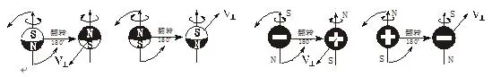

图-17

不过，据现代教科书介绍，电子与正电子的电荷（电性相反）、质量、磁量大小都一样，且自旋方向也相同，但我不知我们定义正电子自旋方向与电子一样的依据是什么？就仅仅因为它们在磁场中作洛伦兹运动时针方向相反吗？

从磁性而言，电子与正电子的磁量、质量可以一样，但自旋时针方向与磁性空间分布应表现出严格的“对称性”，这就为大自然中普遍呈现“超对称”现象找到一个可信的依据。

如图-18所示，如果一个正电子在以V0速度进入均匀磁场空间时，它首先在均匀磁场空间入口处被磁场磁极极化而产生180°翻转，然后以电子态形式在均匀磁场中产生“洛伦兹运动”。

  

图-18 图-19

从磁陀螺在磁场中的运动可以确定，如果将正电子看做是一个自旋磁陀螺，那么，它应是逆时针自旋且自旋轴上端为N极，下端为S极，如图-19所示。

由此可见，量子力学在与经典电磁学的衔接中，由于经典电磁学缺少了对电子自旋和自旋磁矩性的认知和描述，它就必然与量子力学存在一种不可逾越的天然鸿沟！然而，量子力学在对待电子在磁场中作曲线运动的问题上虽然引入了自旋和自旋磁矩，但却忽略了空间磁场对它们运动的影响，这就使得量子力学在解释自旋粒子的“衍射”、“干涉”现象时就不得不引入“波粒二象性”概念，从“波动”和“概率”领域进行诠解 ——但这种解释只会让人更迷惑，同时也深深掩盖了自旋磁量子在磁场空间中运动的物理本质！

因此说，**对电子洛伦兹运动形成的真正物理机制探讨才是协调和解决粒子“波粒二象性”本质问题的根本举措。**

**1.2.3、电子在回旋加速器中的运动（速度增大的洛伦兹运动）**

电子在均匀磁场“0梯度面”上运动时，其洛伦兹运动周期为T=2π.m/qe.B，这是一个与电子运动速度无关的量，且电子自旋轴始终平行于磁场力线。

电子在回旋加速器中运动也是一种“0梯度面”上的洛伦兹运动，如图-20所示；但这种运动因外界电场能量的输入会使电子运动速度增大，这时电子运动周期就不遵循T=2π.m/qe.B规律了，这是为什么？

  

图-20

对此，爱因斯坦给出的解释是：

将电子电荷qe看做是不变量，将电子质量m看做是可变量，则m=m0/√(1-c²/ v²)，有

T=2π.m0.c/qe.B.√(c²-v²)，即v增大T就会变小。

但爱因斯坦动质量是一个让人迷惑不解的概念：电子质量怎么会随速度变化而变化，而电子电量为什么就会不变呢？

对此，现代电磁学给出的解释是：

“有许多事实表明，一个系统中的总电量不因带电体的运动而改变，例如，实验测定速度为v的带电粒子的荷质比符合下述公式：

qe/m=qe.\[√(1-v²/c²)\]/m0.

而质量随速度变化的相对论公式是：

m=m0/√(1-v²/c²).

比较这二个公式，暗示着带电粒子的电量q不随运动速度改变。又如质子所带的正电量与电子所带的负电量非常精确地相等。对于任何一个中性原子，原子核中的质子数与核外的电子数相等，因此未电离的原子核分子内的正电荷与负电荷数量相等，从而中性原子或分子所带电量非常精确地为0.在这一点上，20世纪60年代报导的实验结果精确度已达10^-19乃至10^-23以上.我们知道，原子中的电子和质子是处在不同运动状态下的，例如氢分子内的电子速率有（0.01～0.02）c的数量级，铯原子内K壳层电子的速率至少有0.4c的数量级，而原子核内的质子和中子的速率具有（0.2～0.3）c的数量级，这样的运动并未使原子和分子的电中性产生可观测的偏离，这表明电量不受运动影响，电量是不随参考系的变化而变化的。再如任何物体在加热和冷却时，电子的速度比带正电荷的原子核速度更易受到温度影响，虽然每个电子的速度可能变化不大，但物体中电子的数量极大，如果运动确实对电量有影响的话，它可以在物体上获得可观察的电量；然而事实上，中性物体在任何温度下总是保持宏观上的电中性，实验中从来没有观察到仅仅通过加热或冷却的方式在物体上获得电量的事实……”**\[4\]**

通过上面引述可以发现三个问题：

（1）、我们在没有真正测量过一个运动系统总质量有没有变化的情况下就断然假设电子质量有变化，这是不符合物理研究精神的；再说，qe/m会随电子运动速度的增大而产生变化，并不一定是m变化了，qe为什么就不可以变化呢？

（2）、中性原子运动系统中总电量为0并不能保证电子、质子运动变化时它们的电量不会发生变化。

（3）、电子电量与质子电量严格相等并不能证明它们在运动变化时还会保持其带电量不变。

其实，**T是一个与qe、m都无关的量，它的变化只与电子平动速度v和自旋角速度ω变化有关。**

依据F=qm.H=qe.v.B,可得qm=qe.v. **\[5\]**

（注：麦克斯韦在推理光速及确定光是一种电磁波时也是用的这一关系式，那么，qm.H=qe.v.B能够成立吗？如果不能成立，那么麦克斯韦电磁波理论将如何成立？如果能成立，那又是为什么呢？—详解请参阅司今/**《库伦磁场强H与高斯磁场强B到底有什么异同？》**一文）。

依据qm=m.ω自**\[6\]**可得：qe=qm/v=m.ω自/v，则有T=2π.m.v/qm.B=2π.m.v/mω自B=2πv/ω自.B.

可见，在一个恒均匀磁场中，电子作洛伦兹运动的T是一个与qe、m无关的量，它的大小只与电子的平动速度v和自旋角速度ω变化有关。

在回旋加速器中，由于这种洛伦兹运动有外加电场力作用于电子上，这就构成了一个“三体运动”系统的形式（即自旋电子、电极、磁极构成三体），这时自旋电子运动则遵循P=m.c= m.v+m.v自、E=m.c²=m.v²+ m.v自²守恒（v是电子平动速度，v自是电子自旋速度），即

v=√（c²-v自²）,T=2π.v/ω自.B=2π.r自.√（c²-v自²）/ v自.B=2π.r自.√（c²/ v自²-1）/ v自.B，

因r自（r自.是电子“刚体”自旋半径，ω自.是电子自旋角速度）、B为不变量，当v增大时则v自.会变小，即ω自.变小，这时T就必然会增大——这与爱因斯坦给出的结论相一致，只是数学描述形式不同罢了。

无论外界有无能量输入，自旋电子在磁场中作洛伦兹运动时都遵循 P=m.v+m.ω自、E=m.v²+ m.ω自² 守恒，这是电子在磁场中运动必须遵循的基本规律。

**2、** **均匀磁场中“非0梯度面”上的磁陀螺曲线运动**

**2.1、“非0梯度面”上的磁陀螺曲线线运动**

磁场“非0梯度面”就是处于磁场“0梯度面”空间之上或之下的平面，自旋磁陀螺在这样的磁场空间运动与在“0 梯度面”上的运动就有很大差异，具体分析如下：

如图-21所示，当一个自旋磁陀螺从“0梯度面”之上或下空间进入磁场时，由于磁陀螺自旋轴上下端受磁场N、S极的引力不平衡，则越靠近磁场磁极处磁场强度B会越大，如B1＞B0.

  

图-21 图-22

依据T=2πm/qB则有T1＜T0；依据r=m.v/qe.B则r也减小，依据F梯= km.qm1.qm2.cosθ/z²，（θ为磁陀螺自旋轴与磁力线之间的夹角）则F梯会增大，这样自旋磁陀螺就会形成了一个锥螺旋运动轨迹。

在这个运动中，磁陀螺作锥螺旋运动的速度V螺到底如何变化呢?

因为自旋磁陀螺轴下端所受磁场磁极力比上端大，则这时自旋轴产生的切割磁力线力也就不相等，这就会使自旋轴产生θ角倾斜，由此则产生进动式的平动运动，如图22所示。

如图-23所示，磁陀螺作螺旋运动的瞬间速度V的水平分量仍是V0（这与电子在“0梯度面”上的洛伦兹运动情况相一致），它速度增大的部分来自于V梯，即有V=V0+V梯.

  

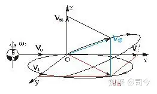

图-23

如图-24所示，磁陀螺在均匀磁场的“非0梯度面” 运动会产生θ角倾斜的进动，这种进动遵循Ω·ω=k守恒，即θ越大（θ2＞θ1＞0），其进动角速度也越大（Ω2＞Ω1），但自旋角速度变小（ω0＞ω1＞ω2），进动角速度来自于自旋角速度的减小。

如图-25所示，如果磁陀螺平动速度V0大，能够穿过磁场空间，则磁场磁极对磁陀螺轴的作用力将逐渐消失，磁陀螺又恢复了自由运动形式，这时磁陀螺的自旋加速度仍是ω0，但其线速度V却大于V0，因V梯参与了V的合成运动，即V= V0+V梯，并且它将以V⊥ω0的姿态进入自由运动状态。

  

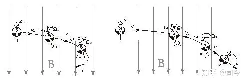

图-24 图-25

**2.2、电子在“非0梯度面”空间的螺旋运动**

**2.2.1、电子初速度v不垂直于B的运动情况**

从电磁学教程中，我们学到带电粒子在均匀磁场中可以产生柱螺旋运动，如图-26所示，当电子被射入的速度v与均匀磁场B不垂直时，则电子就会在该磁场中作这种柱螺旋运动。

  

图-26

“柱螺旋运动”判断仅是从电子在磁场“0梯度面”内运动情况来考虑问题的，并没有从电子有自旋、自旋磁矩及磁场空间存在“非0梯度面”等影响因素方面予以分析；如果从自旋电子带有自旋磁矩性和“非0梯度面”二方面因素来考虑，则因自旋磁轴二端所受磁场磁极力不相等，这时电子自旋磁轴在均匀磁场中运动时就会产生一定倾斜角θ，并且电子在向磁场磁极靠近时，依据H=km.Qm/z²（Qm是磁场磁极磁荷量）,则H是一个逐渐增大量，因此说，这种运动并不会产生标准的柱螺旋运动，而是一种锥螺旋运动形式，如图-27示；如果说可以产生柱螺旋运动，那也只能是在磁场“0梯度面”附近沿磁力线较短距离空间范围内近似符合罢了。

  

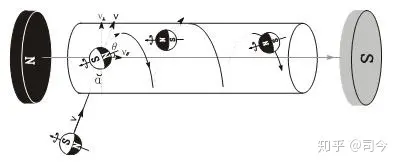

图-27

虽然均匀磁场磁极相对于电子而言不可能质点化，但因按高斯定理规定的**感应磁场强度**B=Φm/S，故B可以看做是磁极磁场磁通量面密度化后的的质点磁荷量大小，我们将这个质点（密度）磁荷量大小规定为Qm(即B=Φm/S=Qm)，这时均匀磁场空间的**库伦磁场强度**H就可以表示为H=km.Qm/z²=km.Φm/S.z²=km.B/z².

如果我们再将电子看做是一个质点粒子，其磁荷量大小是qme，则电子在均匀磁场中所受的磁场梯度力就为:

F⊥=qme·H=km.qme.Qm/z²=km·qme·B/z².

依据F⊥=qme·H=mv⊥/t，H=km·B/z²，则其在z方向运动形成的螺距L为：

L=v·sinα±v⊥·t=v·sinα±qme·H.t²/m=v·sinα±km·qme·B.t²/m.z².

（注：从S极到0梯度面为“-”，从0梯度面极N极到为“+”）。

又因电子自旋磁轴是有方向的，只有自旋轴与磁力线平行时所受的磁场磁极力才为有效梯度力，故电子的有效磁荷量就可以表示为qme有=qme·sinθ，则

L= v·sinα±km·qme·B.t**²**·sinθ/m.z².

由此可见，自旋电子在均匀磁场空间做螺旋运动的螺距L应是一个非等距量，它的变化与v、α、B、T、θ、z都有关联。

这也说明，**从z方向长距离角度来分析，自旋磁电子在均匀磁场中应作锥螺旋运动，而不是柱螺旋运动。**

同理，我们也可以求出不同时刻t的锥螺旋半径r大小，对之读者不妨自己推理一下，我在此就不多费笔墨了。

现代物理学在讨论在电子均匀磁场空间中运动时却忽略了磁场磁极对电子自旋磁轴的影响，即忽略了均匀磁场有“非0梯度面”存在的情况；当电子初速度v不与磁场B垂直时，电子会在不同运动位置点产生磁极梯度力之差。因此，从这个意义上讲，**真正的柱螺旋运动是不存在的，那只是对均匀磁场空间极短距离范围内的一种理想化的近似描述。**

**2.2.2、电子在“非0梯度面”空间的锥螺旋运动**

电子在均匀磁场中作洛伦兹圆周运动是有严格条件限制的：

1、保证空间磁场分布绝对均匀，否则电子会在磁场中作“漂移”曲线运动。

2、保证电子射入磁场的速度V与磁场B方向严格垂直，否则电子会在磁场中作螺旋曲线运动。

3、保证电子射入位置在偶极磁场的中心线上（即0磁场梯度面），否则电子会在磁场中作螺旋曲线运动。

对于不符合电子洛伦兹运动条件的问题曾在回旋加速器制作初期应用中出现过，为了克服这些不利因素影响，现代回旋加速器设备中分别增设了“径向聚焦”和“垂直聚焦”等额外磁场来保证电子在加速器磁场中作正常的洛伦兹运动，从而使电子能够在电场加速下形成稳定的平面渐开线增速运动，如图-28所示。

  

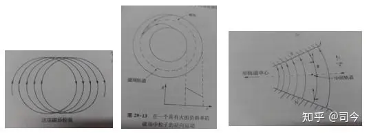

图-28.电子“漂移”.电子径向聚焦.电子垂直聚焦\[7\]

电子在均匀磁场的“非0梯度面”空间是如何形成锥螺旋运动轨迹的呢？

如图-29所示，自旋磁电子以初速度V0并垂直磁力线、分别在B1N、B0、B1S三个空间位置射入时，在B1N、B1S平面，因电子自旋磁轴二端所受磁场磁极的梯度力就不相等，时电子磁轴在均匀磁场中作切割磁力线运动时就会产生一定倾斜角θ，并且电子会向磁场磁极靠近；这样，电子作锥螺旋运动的速度就是由“洛伦兹平面圆运动速度+磁场梯度力速度”合成的，即符合**V=V0+Vz**矢量合成法则。

  

图-29

关于粒子速度增大问题，我们须注意以下几个方面的区别：

（1）、在均匀磁场“非0梯度面”与非均匀磁场中，自旋磁电子都会产生锥螺旋运动，且电子运动速度都会增大，但这不同于回旋加速器电子运动速度增大的情况，因前者没有外界能量输入，是一种“自发式”的锥螺旋速度增大运动，后者有外界能量输入，是一种“强制式”的速度增大运动。

（2）、在施特恩-格拉赫实验中，自旋粒子运动速度也会增大，但这是由倒三角磁场磁极使自旋粒子磁轴产生倾斜而影响其曲线运动速度的结果；同时还要注意，施特恩-格拉赫实验系统也是个没有外界能量输入的系统——详情请参阅“磁陀螺运动与现代物理学漫谈（14）—均匀磁场对磁陀螺运动的影响（2）”一节。

  

**【特别声明】：**

1、本文所用图片除作特别说明和自我绘制外，均来自「百度图片」，在此对「百度」网表示感谢！

2、特别声明：如其他媒体、网站或个人从本博转载此文，须保留本博“地址”，否则视为侵权行为。

说明：本文较原「新浪博客」文有较大修订.

**【参考文献】：略**

  

**【注】：**

\[1\]、磁陀螺运动与现代物理学漫谈（8）——陀螺运动基本原理简介：[http://blog.sina.com.cn/s/blog\_d288bb3b0102vu7g.html](https://link.zhihu.com/?target=http%3A//blog.sina.com.cn/s/blog_d288bb3b0102vu7g.html)

\[2\]、王亚平“太空陀螺运动实验”视频：[http://blog.sina.com.cn/s/blog\_d288bb3b01019ot9.html](https://link.zhihu.com/?target=http%3A//blog.sina.com.cn/s/blog_d288bb3b01019ot9.html)

\[3\]、维基百科/洛伦兹力：[https://zh.wikipedia.org/zh-cn/](https://link.zhihu.com/?target=https%3A//zh.wikipedia.org/zh-cn/)洛伦兹力

\[4\]、赵凯华、陈熙谋/《电磁学》，高等教育出版社，2003.4第1版，P178-179.

\[5\]、【美】Richard P.Olenick,Tom M.Apostol David L.Goodstein/著/李椿，陶如玉译《力学世界》，北京大学出版社2002年2月第1版，P151-152.

\[6\]、司今/《物质自旋与力的形成》，吴水清主编《格物》,2012.8总第51期 ,P53-58.

\[7\]、费恩曼/物理学讲义（2），上海科学技术出版社，2013年4月第1版，P400-401.

  

**上期目录：磁陀螺运动与现代物理学漫谈（10）——磁极磁场对磁陀螺运动的影响**

——兼论磁场中阴极射线偏转及法拉第电磁感应形成的物理机制

**下期预告：磁陀螺运动与现代物理学漫谈（12）——均匀磁场对磁陀螺运动的影响（2）**——兼谈粒子衍射形成的物理机制