---

date: 2024-05-13 22:20:53

categories: vortex

tags: 
- 无

original_url: https://zhuanlan.zhihu.com/p/69880666

---

# 高斯定理的物理意义及在物理学中应用的得失

**司 今**

（广州毅昌科技研究院 广州 510663 E-mail:jiewaimuyu@126.com）

* * *

  

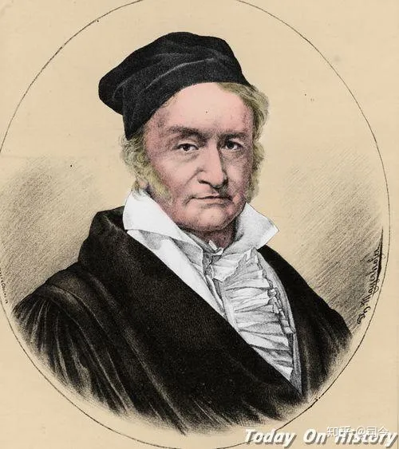

德国数学家-高斯

**摘 要 ：**为了解决库伦电荷定律F=k.q1.q2/R²中平方反比问题，素有数学王子之称的德国数学家高斯创造性的提出了高斯定理，由此拉开了近代“场物理学”寻求库伦电、磁、万有引力三大定律统一的序幕！

高斯定理从本质上讲是一个关于照度描述的几何学定理，但他与法拉第力线及其密度空间分布结合起来去解释库伦电荷力定律，从而将场物理学引领到用几何化描述场的统一数学范式时代。

高斯定理在物理学中应用有二种描述形式：（1）电荷高斯定理（球面密度），（2）磁荷高斯定理（平面密度），但这二种应用形式与物理意义既有共性，也有差别。随着高斯定理在电磁学的成功应用，后人将万有引力定律也纳入到高斯定理应用领域。

运用高斯定理虽可以将场物理学三大定律公式统一起来，但这只是数学形式的统一，不是物理意义的统一，因此，高斯定理在场物理学的应用是有局限性和误导性的。本文正是本着这一思路，尝试性地重新分析、解读高斯定理，并探讨了统一场问题的解决思路与方法。

**关键词：**场物理学 高斯定理 万有引力 电磁力线 力线密度 统一场问题

**中图分类号：** 0441 **文献标识码：A**

* * *

  

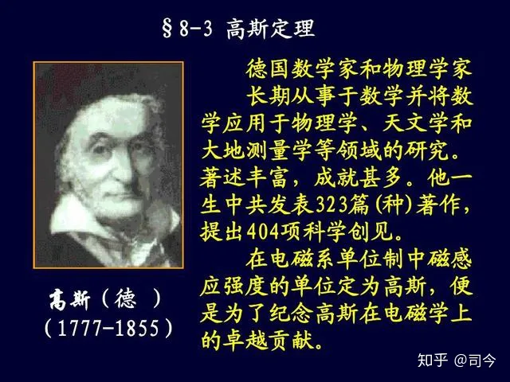

德国数学家-高斯

**1、高斯定理**

高斯定理是受法拉第电荷力线思想影响，用法拉第电荷力线空间分布思维去解决库伦定理中的平方反比规律问题，因此，他首先接受电荷电场球体分布观念，后用荷的球体曲面密度去描述电荷电场；随后，由于磁体磁场分布不呈球形分布状态，无法套用电场高斯定理，于是，高斯又给出了磁场高斯定理；因此，电磁学中高斯定理有电场高斯定理和磁场高斯定理之分，具体描述如下：

**1.1 高斯定理（电场）**\[1\]

高斯定理是表明在闭合曲面内的电荷分布与产生的电场之间的关系：

真空中高斯定律积分形式为：

  

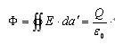

  

其中，E为电场，da＇为闭合曲面A的微分面积（如图-1所示，称为高斯曲面），由曲面向外定义为其方向，Q为闭合曲面内的电荷，ε0为真空电容率，ε0为此处电介质的介电常数（如果是真空的话，其数值为1）。

  

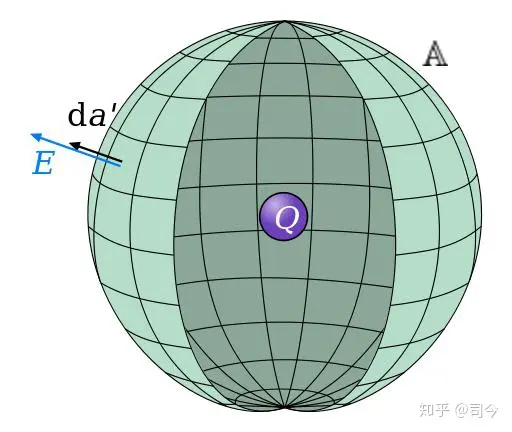

图-1 高斯曲面

其微分形式为：

  

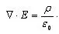

  

其中ρ为电荷密度(单位C/m ³)。

在线性材料中，等式变为：

  

  

其中ε0为材料的电容率。

此方程是卡尔·高斯在1835年提出的，但直到1867年才发布。高斯定律在静电场情况下类比于应用在磁场学的安培定律，而二者都被集中在麦克斯韦方程组中。因为数学上的相似性，高斯定律也可以应用于其它由反平方定律决定的物理量，例如引力或者辐照度。

高斯定理是从库仑定律直接导出的，它完全依赖于电荷间作用力的二次方反比律。把高斯定理应用于处在静电平衡条件下的金属导体，就得到导体内部无净电荷的结论，因而测定导体内部是否有净电荷是检验库仑定律的重要方法。

对于某些对称分布的电场，如均匀带电球的电场，无限大均匀带电面的电场以及无限长均匀带电圆柱的电场，可直接用高斯定理计算它们的电场强度。

**1.2 高斯定理（磁场）**\[2\]

在电磁学里，高斯磁定律阐明，磁场的散度等于零。因此，磁场是一个螺线矢量场。从这事实，可以推断磁单极子不存在。磁的基本实体是磁偶极子，而不是单极磁荷。

图-2是闭合曲面与开放曲面示意图。左边是闭合曲面例子，包括球面、环面和立方体面；穿过这些曲面的磁通量等于零。右边是开放曲面，包括圆盘面、正方形面和半球面；都具有边界（以红色显示），不完全围入三维体积。穿过这些曲面的磁通量不一定等于零。

  

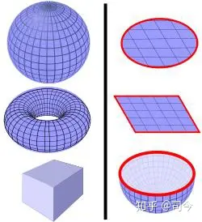

图-2 高斯闭合与开放曲面

高斯磁定律的方程可以写为两种形式：微分形式和积分形式。根据散度定理，这两种形式为等价的。

高斯磁定律的微分形式为▽▪B=0，其中，B是磁场；这是麦克斯韦方程组中的一个方程。

高斯磁定律的积分形式为：

  

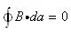

  

其中，S是一个闭合曲面，da是微小面积分（请参阅曲面积分）。

方程的左边项，称为通过闭合曲面的净磁通量。高斯磁定律阐明这净磁通量永远等于零。当然，若将来科学家发现有磁单极子存在，则高斯磁定律就不正确了，那么，这个定律就必须做适当修改，即磁场的散度会与磁荷密度ρm成正比：

  

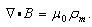

  

.其中，μ0是磁常数。

可见，高斯在处理磁荷磁场力线强度分布时与电荷电场是有很大区别的，具体说就是，在闭合曲面磁力线强度为0的方程，它是构成麦克斯韦电磁波的重要组成部分；而在开放曲面磁力线强度可以不为0，它是解决楞次电磁感应定律的主要数学工具。

如果单极磁子被发现，那么高斯磁定律的磁场分布就与电荷电场分布相雷同了。

高斯磁定理与静电场中的高斯定理相比较，两者有着本质上的区别。在静电场中，由于自然界中存在着独立的电荷，所以电场线有起点和终点，只要闭合面内有净余的正（或负）电荷，穿过闭合面的电通量就不等于零，即静电场是有源场；而在磁场中，由于自然界中没有单独的磁极存在，N极和S极是不能分离的，磁感线都是无头无尾的闭合线，所以通过任何闭合面的磁通量必等于零，是无源场。

随着高斯定理在电磁学中的成功应用，后人将质量万有引力场也纳入了类似负电荷电场分布形态之中，从此也就有了高斯定理在万有引力场中应用的形式。（注意：为什么不用磁体磁场分布方法来处理地球引力场问题呢？）

**2、高斯定理的组成要素**

仔细阅读高斯定理就会发现，高斯定理是由力线、通量、场强和力等要素组成。

**2.1 力线**

英国物理学大师，M.法拉第在1831期间研究电磁感应现象时形成“力线”观念，他用磁力线、电力线来描述磁铁与带电金属球体周围的力分布“状态”，现在我们知道力线其实就代表电、磁体周围场强度分布的强弱。力线思想直接启迪高斯引入力线密度概念去解决电荷周围场强的数学分布规律。常见力线空间分布形式如图组-3所示。

  

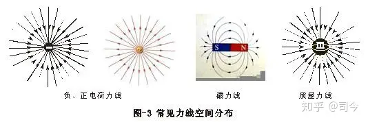

  

**2.2 通量**\[3\]

关于场力学如电磁学、牛顿万有引力理论中，通量（符号：ΦE）是力场的通量，与穿过一个曲面的力场线的数目成正比，是表征力场分布情况的物理量。通常力场中某处面元dS的通量 dΦ 定义为该处场强的大小E与dS在垂直于场强方向的投影，dScosθ的乘积，即dΦE=EdScosθ，式中 θ是 dS 的法线方向n与场强E的夹角。电通量是标量，θ=90°为负值。通过任意闭合曲面的电通量ΦE等于通过构成该曲面的面元的电通量的代数和，如图-4、5所示。

  

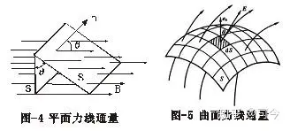

  

对于闭合曲面，通常取它的外法线矢量（指向外部空间）为正向。

**2.3 密度与强场**

高斯定理中的密度思想起源于光的照度，所谓照度就是点光源照射在单位面积上的光通量Φ（照度）是与距离R平方成反比，如图-6所示，在局部球面上，从光源射出的光照射到球面上的面积（S）随远离光源距离(R)的平方成正比，即S=k R²；假如把光束看作是由一定数量的光子组成的光子流，则不同R值时照射面积在扩大，但每一块面积上所包含的光子总数（Φ）是相同的，即Φ=ρ.S=常量，ρ是曲面密度。

  

  

高斯定理把场强定义为力线通量与其垂直面积之比，即

  

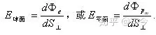

  

实际上，高斯定理中的场强就是单位球表面或圆平面上的“荷”密度：

其中，ε0、μ0是为了将库伦电、磁荷定律中的k、km与高斯定理中的E=Q/S⊥球面或H=Pm/S⊥平面能够统一起来而人为制定出的换算系数，即：

  

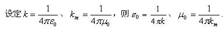

  

.对于牛顿万有引力场，也可用高斯定理来描述：

  

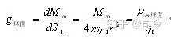

  

其中，η0是为了将万有引力中的G与高斯定理中g=M/S⊥球面能够统一起来而人为制定出的换算系数，就称它为真空质量力导率吧，即设G=1/4πη0，则η0=1/4πG.

当然，有些教科书没有引入η0，而是直接运用下式来计算：

  

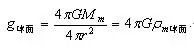

  

**2.4 力**

“场物理学”三大定律中，力的分布均符合“平方反比规律”，但不同的力概念对应着不同的“荷”概念，高斯舍弃了它们荷概念之间的差异，提炼出场概念（荷的面密度）对它们进行数学统一，但这种统一，无法揭示力产生的物理本质。

库伦电荷力公式：

  

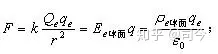

  

库伦磁荷力公式：

  

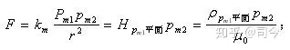

  

万有引力公式：

  

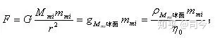

  

高斯定理描述的“场”通式可以写为（L代表荷）：

  

  

库伦定律是通过宏观带电金属球体实验总结出来的规律，如图-7，带电金属小球的电子

分布由于趋肤效应可以均匀地分布在球体表面，法拉第球体电荷力线分布正体现了这种思想；然后，将它推广到单个电子的力线分布上去，这是不严谨的做法，也是现代物理学领域中没有得到验证的概念之一。具体分析，请参阅《法拉第力线的功绩及其误导》\[4\]一文。

  

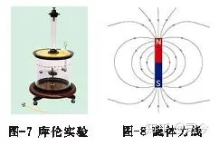

  

法拉第认为，球体电荷力线分布呈球体，高斯吸纳了法拉第的这一思想，因此，他给出高斯定理时对球体电荷电场分布的描述采用的是球曲面；对于力线分布不成球曲面的磁体，如图-8，高斯对其周围的磁场强度分布采用了另一种描述形式——高斯磁场定理；由于磁体磁场是偶极场，它不同于球体电荷电场分布，于是高斯选用了平面:

  

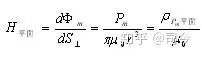

  

以此作为他描述磁体磁场空间分布的数学形式，以与库伦磁荷定律F=km.pm1.pm2/r²相对应，如果用图表示就是图-6、9所示。

  

  

高斯定理是用几何语言对库伦定理进行重新解读，也可以称作是“翻译”，它将非接触力（场力）的描述与空间几何化结合一起，奠定了场物理学的数学基础。那么，通过高斯定理我们能够看出库伦电、磁荷定理有什么物理意义呢？

**3、高斯定理的物理意义**

高斯定理是用几何语言对库伦定理进行重新解读，也可以称作是“翻译”，它将非接触力的描述与空间几何化结合一起，奠定了场物理学的数学基础。那么，通过高斯定理我们能够看出库伦电、磁荷定理有什么物理意义呢？

**3.1 有源性**\[5\]**：**

高斯定理表示，电场强度对任意封闭曲面的通量只取决于该封闭曲面内电荷的代数和，与曲面内电荷的分布情况无关，与封闭曲面外的电荷亦无关。在真空的情况下，∑q是包围在封闭曲面内的自由电荷的代数和。当存在介质时，∑q应理解为包围在封闭曲面内的自由电荷和极化电荷的总和。

高斯定理反映了静电场是有源场这一特性。正电荷是电力线的源头，负电荷是电力线的尾闾。

我们可以具体描述：例如：在两个点电荷+q、-q的电场中，有四个闭合曲面，处于四种不同的位置,如图组-10所示：

  

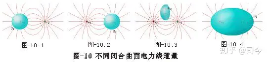

  

图-10.1：闭合面内包围一个正电荷+q，则电通量Φe=q/ε0＞0，表明有电力线从面内穿出，即正电荷发出电力线。

图-10.2：闭合面内包围一个负电荷-q，则电通量Φe=q/ε0＜0，表明电力线从面外穿入面内，终止于负电荷处。

图-10.3：闭合面内没有电荷，则Φe=0意味着有多少电力线穿入就有多少电力线穿出。

图-10.4：闭合面内包围+q和-q，但净电荷为零，则Φe=0，表明有多少电力线进入面内终止于负电荷，就会有相同数目的电力线从面内正电荷发出到达面外。

当然，在高斯磁荷定律中，对磁荷磁场的描述就划归无源性，这是因为：磁力线都是无头无尾的闭合线，所以通过任何闭合面的磁通量必等于零，因此说磁场是无源场；但是，如果从磁场组成的N、S极来看，它也有有源性，只不过“源”与“汇”是在同一个磁体上。

**3.2 对称性：**

任何一种场的理论描述都要与力概念结合，单独描述一个孤立的场是没有意义的，因此，力概念下的任何场都有源、汇性，只不过这种源、汇性对我们定义的不同荷概念就有不同的存在形式，如电荷由于有正、负二种存在状态，因此就有正电荷为源，负电荷为汇之分，磁体是偶极场，就可以规定N极为源，S极为汇。场的源、汇性体现出构成力概念系统中场必须有对称性。

**3.3 守恒性**

场只是荷的空间密度分布的体现，因此不论荷周围空间场如何变化，但荷量是不变的，这就是我们常说的电荷、磁荷、质量守恒规律的物理意义。

**3.4 量子化性**

物体外空间力强度分布与力线面密度成正比，不管力线代表什么，它都说明场是一个可以量化描述的量，从现代物理学力传递因子理论来讲，每根力线就可以代表传递力的传递粒子，如W、 Z粒子、光子等，密度就可以表示物体空间场传递粒子密度分布。

高斯定理带给我们的物理思路是“场是一种密度”，密度的基本对象是“荷”，它具有量子性，即基本度量单位性，那么，由基本单位“荷”组成的宏观物体所形成的场也就具有了可量子化性，用高斯定理描述它们的通式为：

  

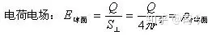

  

  

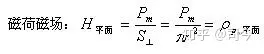

  

  

  

其中，e、pm、m就分别代表组成Q、Pm、M的最小单位量。

**3.5 统一性**

高斯定理是从库伦平方反比定律中推导出来的，它对任何形式的平方反比规律都使用，因此是一个关于场平方反比规律分布的“统一”数学范式，从而也可以看出，不论什么场，它们的强度空间分布数学规律都一样，只是场所对应的“荷”概念不同罢了。因此说，场具有统一性，至于如何从物理意义上将不同“荷”所表现的场进行统一？请参阅《物质自旋与力的形成》\[6\]一文。

不过，这里要声明一点：从高斯定理对待电荷与磁荷的问题上可以看出，高斯定理对场的描述存在分裂性，他认为电荷有二元性，对磁荷则认为有一元性，这也决定了他对电、磁场的描述必须采用二种不同的数学范式，从而延续了法拉第的物质二元论思想，场载体—“荷”的一元性或二元性是决定统一场理论研究方法与思路的基础问题，因此必须给予明确。

**3.6 无关性**

高斯定律反应的是中心体对外空间所表现出的一种与力有关的场物理效应，这种效应与测试体的质量或荷量大小无关。这说明场是一个相对独立量，是物质基本属性之一，它同质量、荷量一样，都是物质组成不可分割的一部分，但它的大小取决于物质基本组成量及空间范围大小。

**4 高斯定理在物理学中的应用**

**4.1 电场高斯定理的应用**\[7\]

电场高斯定理一个重要的应用是用来计算带电体周围电场强度。实际上，只有在场强分布具有一定的对称性时，才能比较方便应用高斯定理求出场强。具体步骤如下：

（1）进行对称性分析，即由电荷分布的对称性，分析场强分布的对称性，判断能否用高斯定理来求电场强度的分布（常见的对称性有球对称性、轴对称性、面对称性等）；

（2）根据场强分布的特点，作适当的高斯面，要求：①待求场强的场点应在此高斯面上，②穿过该高斯面的电通量容易计算。

一般地，高斯面各面元的法线矢量n与E˜平行或垂直，n与E˜平行时，它的大小要处处相等，使得E˜能提到积分号外面；

（3）计算电通量

  

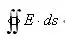

  

与高斯面内所包围的电荷代数和，最后由高斯定理求出场强。

应该指出，在某些情况下（对称），应用高斯定理是比较简单的，但一般情况下，以点电荷场强公式和叠加原理以相互补充，还有其它的方法，应根据具体情况选用。

利用高斯定理，可简洁地求得具有对称性的带电体场源（如球型、圆柱形、无限长和无限大平板型等）的空间场强分布，计算的关键在于选取合适的闭合曲面——高斯面。

**4.2 磁场高斯定理的应用**

由于磁体磁场分布不同于电荷电场分布，因此，高斯磁定理的应用也不同于电场高斯定理， 我的研究是，沿用高斯磁定理思路，我们可以将磁铁周围的磁力线分布用如图-9表示出来，即有：

  

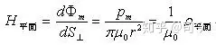

  

我在《物质自旋与力的形成》\[8\]一文中给出的磁场描述是：

  

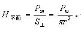

  

其实，这就是高斯定理的磁场数学描述形式，不过，我对pm赋予了一定的物理意义，并给出了它能够量化的数学形式，即：

  

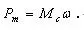

  

这就使高斯磁定理不再仅仅局限在数学概念上，而是使它有了真实的物理意义，即高斯磁场的本质就是物质自旋运动所产生的“荷”pm效应在其周围空间的分布状态；从而也可看出，磁场不具有实体物质性，它是物体自旋所产生的一种物理效应，它随物体运动而运动、随物体静止而静止，因此说，宇宙中没有脱离实体物质的磁场，也没有不存在磁场的物质。

  

  

如图-11所示，这是高斯磁定理为了解决楞次电磁感应定律而特意追加的局部面积磁力线强度描述的方法。后人把它推广到载流线圈在磁场中的运动上，从数学原理上解决了发动机、电动机电流与磁场定量描述问题。

球面密度与平面密度从理论上来讲都是同一种密度，只不过在球面密度里，先用微分

  

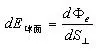

  

将每一小块面积处理成与力线垂直、后用积分积出球面面积；因为微分面ds是一种平面概念，对球面积进行微分处理时，小块面积要与力线垂直，这与用平面密度去处理法拉第力线密度思想是一致的。

**5、高斯定理的历史功绩**

**5.1** 高斯定理为库伦电、磁荷公式提供了一个统一的数学描述范式，它不但解决了电磁学中关于场的数学描述问题，而且还将万有引力也纳入了这种描述形式，从而奠定了经典场物理学统一的描述数学基础。

**5.2** 静电场的高斯定理可以推广到非静态场中去，不论对于随时间变化的电场是动态场还是静态电场，高斯定理都是成立的，它是麦克斯韦方程组的组成部分。

麦克斯韦方程组实质上是由二个不同静态荷粒子与动态粒子场方程组成的：

  

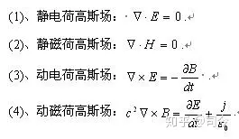

  

**5.3** 高斯定理将力平方反比规律几何化的思路为爱因斯坦提供了一种用几何场描述力的先例，从而影响爱因斯坦分别建立狭义相对论（球曲面力线分布）和广义相对论（任意曲面）。

**5.4** 高斯定理的思路为流体力线、曲面光学、空间几何学等发展奠定了数学理论基础。

**5.5** 从高斯定理中可以看出场的本质，场不是物质，而是物质存在的一种物理效应，它随物质运动而运动，随物质静止而静止。

世界上“没有不存在物质的场，也没有不存在场的物质”，这与哲学对物质、运动的看法一样：“没有不存在运动的物质，也没有脱离物质的运动”。

场之所以被认为是物质，那是因为它始终伴随物质而生而动，但当我们专注场存在时却常忘记了生它的物质存在；法拉第、高斯给出的场概念都离不开“荷”，这本身就说明了场首先是由物质“荷”存在而决定的，“荷”的存在是场产生之源，如果没有“荷”存在何来法拉第、高斯的场概念？

麦克斯韦电磁波理论认为，电磁波就是无粒子参与的纯电、磁场交变的运动产物，这从本质上就与法拉第、高斯对电、磁场定义相违背，从而将场物理学引入到一个“无中生有”的时代。

当然，麦克斯韦的“违背”是有物理背景的，那就是为了摆脱机械波、以太思想的影响，但他就没有意识到任何粒子运动都是带有自旋场的运动，任何波的感知都是要与带物质空间的场发生相互影响作用的。

**6、高斯定理的缺失和误导**

高斯定理不是从物理学概念出发得出的，而是为了解决库伦定理中的平方反比形式而引入的几何数学描述形式，它本身不是对物理学中力形成物理机制的描述，因此，在应用它来解决力形成的物理机制问题时，就必然会暴露出一些不足和误导。

**6.1 高斯定理在物理学中应用的缺失**

**6.1.1 没有对库伦磁荷定律给出明晰论述**

高斯定理虽然对库伦磁荷磁场分布问题作了阐述，但不够明晰，具体表现是：对于闭合空间内磁荷所形成的磁场描述为0，这是不真实的，对之不能再用闭合球面去描述场，而应用闭合平面予以描述可能更真实，更便于运用。

**6.1.2 没有描述运动荷时场的分布情况**

高斯定理与库伦定理一样，都是对静态荷物理量的相关描述，没有涉及荷运动情况论述，但我们研究的对象经常是运动的荷而不是静态的荷；在运动状态下，荷的力与场分布还遵循库伦定理与高斯定理吗？现代物理学已证明，单个电子运动时，电场分布呈现区域性，那么再用目前的球面高斯定理去描述它们的场还会是真实、有效的吗？况且，运动中，我们所定义的电子电量是否表现为常量还有待于验证。

  

高速运动电子的电场强度分布具有非均匀性

爱因斯坦可以把粒子质量看作是随运动速度变化而变化的量，为什么我们不可以将电子电量也看作是随运动速度变化而变化的量呢？

**6.1.3 阻碍不同荷场之间的转换**

从高斯定理应用中可以看出，电荷、磁荷、质量荷所形成的场分布数学描述式几乎一样，不同的是引力系数与荷的物理量纲而已，因此，从高斯定理中我们无法看出不同荷场之间存在联系和差异的物理本质；物理学要研究的不仅仅是力，还要厘清荷与场是如何产生的、通过某种转化如何将它们统一？等物理本质问题；但从高斯定理思路角度来看是没有办法去作这些方面工作的，同时受它的影响，人们也不敢去做这方面的研究，因此，从某种意义上讲，高斯定理不但束缚了物理学三大定律统一的思路，且阻碍了统一场的脚步。

**6.2 高斯定理在应用中的误导**

**6.2.1. 违背了牛顿力学质点思想**

高斯定理违背了牛顿力学中“质点”思想，同时，与库伦定律“点电荷”思想也衔接得不够充分，因为高斯定理中场的面密度与二个点电荷间连线是垂直的，按此场曲面分布思想是不能解决二个质点间引力问题的。

  

  

如图-12所示，M与m之间的场强密度是按水平面计算、不是按垂直面计算的，如果按垂直面计算，则球曲面对应的m要求必须有空间大小，即体积，那么m就不能再被看作是质点了；按法拉第给出的二个异性电荷力线，图-13所示，如果用高斯定理球曲面力线分布思想看问题，那么，我们在计算二者之间的库伦力时，就须计入它们各自的体表面积，这就与库伦定律中点电荷思想相违背，即与牛顿质点思想相违背。实际上，我们应用库伦定律计算二个宏观带电金属球电场力时，并没有应用二个球表面积密度，而是将它们当作质点来对待进行计算的。

  

  

法拉第电荷力线，对于单体荷场来说是球形开放的，而对于二个异体场来说是收敛的，如图-13，即从“源”出发，向“汇”集结，高斯定理如何去体现它们的质点性呢？

**6.2.2 将场物理学引领到几何数学领域去研究**

高斯定理虽然从数学上可以统一描述“三大场”，但这种描述也带来了可怕的误导，具体说就是：它将场物理学中关于力的问题引领到了几何数学领域，从而开启了不讲物理机制而用数学方式研究物理学的先河；从量子力学到广义相对论，从弦理论到虫洞概念等无不充斥着几何数学的烙印，这让人们迷失了关于物理机制探索的方向；直到现在，主流科学界还抱住这一思想去探索已经迷路的物理学，真实“成也萧何，败也萧何”！

仔细研读我们场物理学产生、发展的历史和思路，特别是对法拉第力线、高斯定理、麦克斯韦方程等认真研究，就会发现：自从高斯用面密度（曲面或平面）来描述场强度之后，物理学关于场的描述就统一在了高斯定理所给定的数学范式中，但高斯定理只是一种几何数学，他不可能去真正揭示“荷”与场产生、变化的本质，但爱因斯坦恰恰就继承了高斯将“场几何化”的思路、去建立他的所谓“统一场”方程，这种“统一场”方程既不能揭示“荷量”大小与运动的关系，也不能描述各“荷”之间转换的物理机制，更无法描述“荷”运动变化与其场强分布变化的关系，他仅仅是将牛顿的质量场进行黎曼几何化的产物，由此建立的方程有什么太大的物理意义呢？他的统一场方程只能算是用黎曼几何对牛顿万有引力定律进行重新解读或翻译而已，是牛顿万有引力场几何化的再延续，他根本不能兼容库伦电、磁荷定律，也根本谈不上“广义”的含义，更不可能构成物理学“统一场”的物理范式！

**6.2.3 关于F=ke.q1.q2/r²规律几何化方法的讨论**

我们知道，球表面积与球半径分布呈现4π=S/r²规律，高斯定理就是将球心设定为某一“荷”概念量，如质量、电荷量、磁荷量等，将这些量视作是不变量的M，然后将它们密度化，即

  

  

这就是高斯场，其本质就是将中心荷量面密度化，是一种关于荷在S空间上密度分布大小的度量，也可以说是一种与力有关的荷密度分布场。

对库伦定理作中力平方反比分布规律的数学“翻译”可以有多种形式，如：

  

  

高斯定理不论使用曲面还是平面，他只不过是从几何角度去重新解读库伦的电、磁荷定律罢了，没有什么实质性的物理意义。他不可能揭示场是如何产生的？它与场源体的哪些运动参量有关？等物理本质问题，故用高斯定理只能理解场的分布状态却不能看出场产生的真正物理机制。

因此，我与从事统一场研究的物理学者马海飞老师讨论时曾问：

我仔细研读过老师您的质量场理论，我觉得您就是在用高斯定理将场几何化的思路对牛顿万有引力定律作再次解读或翻译，所不同的是，您认为这种质量场可以随物体运动而运动而已。我认为这种方法不可能回答“质量为什么会产生出力？”这一本质问题，更不可能将库仑定律也纳入您的质量场体系；将场几何化是高斯与爱因斯坦所采取的共同思路，但这不是您所提倡的“物理学研究必须是对‘物理机制’的探索”，而是将物理机制问题再次引入几何数学的做法！

我们知道：牛顿万有引力定律F=GMm/R²，按高斯定理“翻译”就是：

F=(4πGM/4πR²)×m=4πG×D×m.

D就是周围球面空间的曲面密度，这与您推出的“D=M/(4πr2)、F=GmmD、g=GmD.”有什么区别呢？如果您的“D”不是代表中心体质量M在以R为半径的球空间外的曲面密度，那么您对它赋予了什么新物理意义呢？

**7、统一场问题的解决思路与方法**

**7.1 统一场问题的解决思路**

“统一场”问题实质就是将牛顿万有引力、库伦电荷、库伦磁荷这三大定律用统一的物理公式表达出来的问题；自这三大定律形成之时，人们就萌生了“统一”的想法，法拉第是第一个真正开始思考、践行统一场问题的开拓者，他首先给这三个定律注入了“场”概念、然后用力线思想形象描述了其空间分布形态；后来，高斯从“通量”概念出发，建立了场的统一数学描述范式，给这三大定律统一注入了活力；麦克斯韦追随法拉第、高斯思想，建立了电、磁场相互转换、统一的方程组；爱因斯坦则用黎曼几何学拓展了高斯定理，想从场的曲面空间几何分布变化中找出统一场方程，但不成功；量子力学则另辟途径，在微观领域中，将量子化思想与经典力学结合、运用复杂的数学工具将它们柔和在一起，对微观粒子运动的统一描述作了较成功的尝试；至今，场统一地脚步没有停止，先后出现了色动量子力学、弱电统一理论、圈粒子理论、弦理论等。

纵观物理学统一史，我们可以发现，目前，“统一”遇到了严重障碍，具体表现就是量子力学与电磁学、万有引力、相对论不能自洽、融合，究其原因有说不完的话题，但落到实处就是ke、km与G在各自领域中均被当作常量来对待，它们无法形成一定的相互转换机制。

对此，我的思考是：高斯定理为我们提供了场统一的数学基础，只要我们能在此基础上找出与产生力相关的物理量（即荷，如质量荷、电荷、磁荷等）能够相互转换，就可以为高斯定理注入新的物理意义，从而也就能够将这三大定律给予物理意义上的统一描述了。

爱因斯坦相对论认为，质量可分为动质量与静质量，而对他这一理论验证的最给力实验是布歇尔实验\[8\]，对此实验，他认为，电子运动速度增大，电子的总质量就会变大，其依据是电子的荷质比η=e/m会随着电子运动速度的增大而变小。

这是他把电子电量看作是常量得出的结论；如果我们把电子质量看作是常量，电子电量会随电子运动速度的增大而变小，则我们同样也能解释“电子荷质比随着电子运动速度的增大而变小”这一实验结果。

**我们用数学分析就是：**

  

  

  

  

  

  

我们知道，质量、电量、磁量等都是在牛顿力概念下定义出来的量，对它们的定义都应包括二个方面含义：

（1）、表示物体或“荷”组成的基本粒子量多少，对不同“荷”概念就要为它制定一个用于度量的基本量单位，这就是“荷”组成的基本粒子概念，如电子，质量是me=9.1×10^-31kg、电量是e=1.602×10^-19C、磁量(用磁矩表示)是μeB=9.274×10^-24J/T等，用它们就可以去度量一个物体的质量、电荷量、磁荷量中所含的电子个数多少。

（2）、表示外力对物体或“荷”改变难易程度的度量，即它们所具有的惯性大小的度量。据此可按“荷量”惯性定义内涵不同，分为质量惯性、电量惯性、磁量惯性等。

从上面荷定义的共同含义中可以看出，质量、磁量、电量都是与力有关的量，荷载体是由基本荷粒子组成，说明它们都有量子性。但在同一个公式中，如果出现二个以上的荷，则只可能将它们都定义为常量或其中一个定义为常量，不可能将它们都定义为变量，因为二个量之间的转换必须要有一个“比较基”存在，至于选哪一种荷为“比较基”，不能根据我们的主观需要而定，而应根据物质运动变化中基本组成粒子量化的难易、精确度而定。例如，爱因斯坦将电子电量定为“比较基”，才会有动质量存在，但我们别忘记了物理实验，现代物理学证明，电子在不同运动速度下其电量电场、磁量磁场的分布空间强度是有方位变化的\[10\]，但我们没有看到运动电子质量场分布会有变化。

牛顿力学是所有物理学的基础不能动摇，对待它的质量定义更应如此，因此我们不能舍本求末，将质量随意地视为变量，而将难以精确测定的电子电量定义为常量。我们用不同方法或仪器去测量同一物体质量不会不同，但如果用不同方法或仪器去测量同一充电金属球上的电量能保证它们测定值完全一样吗？

**7.2 统一场问题的解决方法**

我们物理学是按不同荷定义对应不同力内涵的思路来研究、探索大自然中物质运动、变化规律的，据此，我们将大自然中力的表现划分为四种，它们分别对应不同的荷概念，即质量荷、电荷、磁荷、核荷，因此，只有将四种荷统一，四种力才有可能统一起来。

但从法拉第力线对粒子场的描述中可以看出，法拉第对粒子的认识是一种二元论思想，如电荷有正负之分，粒子有电荷和磁荷之分，在这二种粒子没有统一之前，法拉第想完成他的大统一大业是不可能的，也就是说，电与磁要想真正统一的关键是在于电荷与磁荷的真正统一；同样，万有引力与库伦力要想真正统一，关键也是在于电荷与质量的真正统一，当然，这种统一不是高斯定理所给出的关于它们场几何化纯数学描述形式的统一。

爱因斯坦延续高斯定理通过对场几何化思路、去翻译牛顿万有引力定律定律，尝试性地创建他的统一场理论——广义相对论，结果不成功，究其原因关键在于：高斯将库伦定理中电、磁荷力场几何化时，并没有真正解决法拉第的二元粒子统一问题，即高斯定理只是一种场的几何数学描述的统一范式，不是对粒子荷、场真正物理意义下的统一，故这种范式无法支撑爱氏去建立他的所谓“大统一”方程。

爱因斯坦统一方程实质就是对牛顿万有引力定律中质量场球面分布的黎曼几何化的再翻译或称解读，故他的方程只适用于像万有引力类的人宏观天体，对微观粒子领域则没有什么实际意义，因为它的方程实质就是牛顿万有引力定律的黎曼几何化后的描述形成，特别是他在统一方程中引入G这一常量项，更限制了它的描述与应用范围。因此，今天的物理学之所以会出现二强分立，即宏观问题用广义相对论、微观问题用量子力学，实际上还是万有引力与库伦力二个分立公式相对独立应用的延续。

量子力学本质上讲还是属于经典电磁学范畴，它在延续库伦电荷力定律外，同时又吸纳了开普勒运动、陀螺运动、机械波运动和迷人心智的几率概念，并附带突出了库伦磁荷力和自旋磁荷（用磁矩表现出来）等观念来综合处理自旋粒子运动问题。

牛顿万有引力定律、库伦电荷力定律、库伦磁荷力定律是统领场物理学的最基本的三大定律，而这三大定律都是将研究对象看做是质点来对待的，同时，将他们进行数学描述形式的统一是高斯定理，在这个统一描述范式中，不论“荷”以什么概念形式出现（如质量、电荷、磁荷等），例如图-14所示，一个充满电子的金属小球的电荷力线成球体分布(每个力线其实可以表示基本荷单位量)，将其进行几何化处理成电子面密度，同样，磁荷体、质量体也可以类似的处理成磁子、基本粒子质量的面密度。

  

  

因此，只要将不同定义的“荷”体用法拉第力线描述后，就可以得出不同荷概念下力描述的统一范式，如万有引力、库伦电、磁荷力用高斯定理统一描述的数学式是：

  

  

其中，P1、P2代表三种荷的任意一种，S⊥代表法拉第力线穿过的面积，它可以是曲面、也可以是平面。

要想将三大定律真正统一起来，必须要看清m、q、pm的真正含义：我们用万有引力定律、库伦电荷定律、库伦磁荷定律将力人为的划分开来，结果在场物理学中才有质量、电荷、磁荷概念出现，这说明荷的本质是力的体现，力的不同划分才出现不同的荷概念，其本质都是与力描述有关的量；同时，它们在高斯定理下又都具有守恒性（质量守恒、电荷守恒、磁荷守恒），这说明m、q、pm不仅代表荷“组成量的多少”，还具有“场”性（即与力有关的惯性），因此，要想将m、q、pm统一，必须先将E、B、g给予统一，当然，这种统一不是按高斯定理的思路，需另辟途径。

我的做法是：如果将它们的“荷”与物体自旋角速度ω结合起来，则ke、kmε、G都是与物体自旋角速度有关的量，而与“荷”定义概念的内涵无关，因此，它们之间可以通过单位换算进行统一，进而形成一种力概念，即自旋磁场力。

我在《物质自旋与力的形成》一文中，依照动量P=mv思想，将物体自旋也看作是一种质点运动，可将它定义为Pm=mω，再将万有引力与它结合，通过运算、分析、比较得出：Pm=mω实质就是物体自旋的自旋磁荷。

在质点意义下：

依据Pm=mω，可以将m与pm统一起来，自旋角速度ω是将它们联系起来的桥梁。

依据F=qv.B=pm.B=q.E，可得pm=qv、E=v.B，可将pm、q统一起来，平动速度v是将它们联系起来的桥梁。

依据Pm=mω、pm=qv，可得m=qv/ω，可将m、q统一起来，平动速度与自旋角速度ω是将它们联系起来的桥梁。

这样就可以将m、q、pm三种“荷”统一起来了，其统一的内在联系如图-15所示。

  

图-15

将B=ΦM/S⊥与B=km.pm/R²结合，则可得出：

  

  

说明磁通量Φm和磁荷pm是同一概念，π.km是Φm与pm之间的单位换算系数。

依据库伦磁荷力公式F=km.pm1.pm2/r²可得：

  

  

我在《物质自旋与力的形成》一文中给出公式

  

  

将它与库伦磁荷力公式F=km.pm1.pm2/r²结合，则有.

  

  

因此可得.

  

  

说明在我给出的公式F=pm1.pm2/πr²中，pm就是中心磁体的磁通量Φm的含义，它与库伦磁荷公式中的pm1之间的换算关系正是:

  

  

.因pm2是“测试体”，与中心磁场大小无关，因此不存在pm2与pm2换算问题，直接用库伦磁荷力公式中的pm2进行计算就可以了。

因Pm=mω，则有：

  

  

又因pm=qv，则有:

  

  

其中ke=v1.v2/π.

如果把电荷力与磁荷力看作是同一种力的结果（考虑自旋电子在被测试时，其自旋磁轴方向具有旋转性的特点，那么，当我们测试单电子电磁力属性时，为什么不可以看作是一种磁力在起作用呢？），即有:

  

  

.因pm=qv，可得ke=v1.v2.km；麦克斯韦在推导所谓的光速c时给出的结论是：

  

  

.即有ke=c².km，结合ke=v1.v2.km，就会得c²=v1.v2，这说明v1或v2必定会有一个是超光速c，为什么会出现此现象呢？

原来，ke与km就像Φm与pm之间一样存在单位换算问题，如果将ke=v1.v2/π与ke=c².km结合，就可得：

  

  

因km =1.00×10^-7 N•s²/C²，故v1v2＝π.km.c²＝9×10^16×3.14×1.00×10^-7＝2.826×10^10.这样，对于二个运动电荷而言，只要v1或v2不大于1.062×10^2 m/s就不会出现v1或v2超光速问题了。

假如二根平行导线中通入电流时电子的运动速度相等，这时，它们在导线内的运动速度应是：ve1=ve2=1.6811×10^5 m/s.

不过，这里要注意：

  

  

这就意味着ke=v1.v2/π是将中心磁体的磁量（Pm）大小看作是磁通量Φm得出的结果，Pm就不再是库伦磁荷力公式中的pm了；因为，对于中心磁荷体而言，高斯磁场定理B=Φm/S中，Φm描述的是中心磁体磁荷量大小，S是包围中心磁荷体的面积，B是中心磁荷体在其周围空间所形成的磁场强度分布。

由此可见，**麦克斯韦所推出的c值，并不是真正物理意义上的光速，它只不过与光速数值有巧合罢了；如果以此认为麦克斯韦证明了“光也是一种电磁波”，那也只能算是他对光认识的一种“曲解”之举；光与麦克斯韦电磁波概念应存在本质区别！**

具有论述请以后参阅《关于光与麦克斯韦电磁波本质区别问题的探讨》一文。

麦克斯韦推出的c=√ke/km=3×10^8 m/s，对于像氢原子中自旋电子与自旋氢核二个磁荷体来说（如图-16），其本质就是c²＝v1.v2/π.km，这里v1、v2都是以地球上一点为参照基的速度。

  

图-16

已知：km =1.00×10^-7 N•s^2/C²、c=3×10^8 m/s、v地自=4.65×10²m/s、ve=2.188×10^6m/s；

由此可得，如图-15所示，氢原子核相对地球上一点为参照基的运动速度（实质也是氢原子运动速度）就是：

vp=π.km.c²/ve＝9×10^16×3.14×1×10^-7/2.188×10^6＝1.292×10^4 m/s .

**它与地球的第二宇宙速度v=1.12×10^4m/s基本一致，说明这个速度就是氢原子在地球上作“布朗运动”时的“逃逸速度”，在高空中运用同步卫星应该可以测出这个值。\[3\]**

  

  

其中r（自）为自旋电子半径，它是常量，k1、k2也为常数，故有：

  

  

  

  

.因G=ω1.ω2/π，故有：

  

  

.这说明ke与G成反比，在ke=c²km或ke=v1.v2.km中，说明ke与km成正比关系；这就是G、ke、km之间的内在转换关系。

**7、总结**

高斯定理密度分布实质是球体表面积与球半径成平方反比规律在物理学中的应用，即中心物质向其周围空间扩散状态、程度的描述，是对扩散密度分布的几何化翻译。

现在物理学中关于引力场的描述都是在沿用高斯定理制定的场几何化思路，即将力源体周围空间假象成有力线分布，然后对其进行空间几何化，从而将力与物体力线存在空间结合起来，将场物理学中力的问题转换成了几何问题。但这种描述方式无助于人们揭示“场”产生的真正物理机制及关于场统一问题的解决；可以说，目前，我们对场物理学论述和认识是模糊、混乱的，这也是目前物理学深陷困境的根源所在。

高斯定理是场物理学的数学基础，通过它可以将库伦电、磁荷定律、牛顿万有引力定律进行统一描述，但这不意味着高斯定理统一了以上场物理学的三大定律；因此运用、理解高斯定理必须将它与统一场的物理内涵本质区分开来。

统一场问题是高斯定理的表现形式，也是物理学追求的最高目标，但研究、认识统一场问题必须抛开高斯定理的数学思维影响；认清“三种荷”与“三大定律”（牛顿万有引力定律、库伦电荷定理、库伦磁荷定理）的关系，从荷概念及其形成的本质入手才能解决它们的统一问题。

  

我的思考在路上

**这就是我对统一场问题探讨的新思路，希望能得到研究统一场问题的物理学者们的关注！**

* * *

**参考资料：**

〔1〕高斯定理(电场)：维基百科

〔2〕高斯定理(磁场)：维基百科

〔3〕通量：百度百科，[http://baike.baidu.com/view](https://link.zhihu.com/?target=http%3A//baike.baidu.com/view)

〔4〕司今/《法拉第力线的功绩及其误导》，北相《卓越论坛》 第22期

[http://blog.sina.com.cn/s/blog\_49905be30102epef.html](https://link.zhihu.com/?target=http%3A//blog.sina.com.cn/s/blog_49905be30102epef.html)

〔5〕高斯定理讨论，[http://jpkc.tjpu.edu.cn/2003/wl/pcai/p03/ch01/part2/fabc/fabc3.htm](https://link.zhihu.com/?target=http%3A//jpkc.tjpu.edu.cn/2003/wl/pcai/p03/ch01/part2/fabc/fabc3.htm)

〔6〕司今/《物质自旋与力的形成》，吴水清主编《格物》2012.8总第51期P53-58页

〔7〕《 简析高斯定理在电场中的应用》，[http://wenku.baidu.com/view](https://link.zhihu.com/?target=http%3A//wenku.baidu.com/view)

〔8〕赵凯华，陈熙谋/著《电磁学》，高等教育出版社2003年4月第1版,P130-131

〔9〕司今/《关于陀螺运动及其研究方法的讨论》，中国预印本网站：

〔10〕赵凯华，陈熙谋/著《电磁学》，高等教育出版社200版,P183年4月第15-187

* * *

**司 今：**男，1966年10月出生，皖蚌埠市人，机械工程师，主要从事理论物理学研究，著有《关于地球椭圆轨道和自旋变化成因的探讨》、《物质自旋与力的形成》、《量子力学磁矩的含义》、《法拉第力线的功绩及其误导》、《关于陀螺运动及其研究方法的讨论》、《波粒二象性的本质》等多篇论文发表。

**通讯地址：**广州市萝岗区科学城南翔三路 广州毅昌科技公司

**E-mail:**jiewaimuyu@126.com 电话：13825126113

* * *

**上期目录：电磁理论反思录(1)**—法拉第力线的历史功绩及其误导

**下期预告：电磁理论反思录(3)**—麦克斯韦推理“光是电磁波”过程中的缺陷