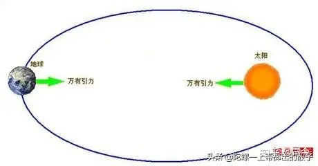
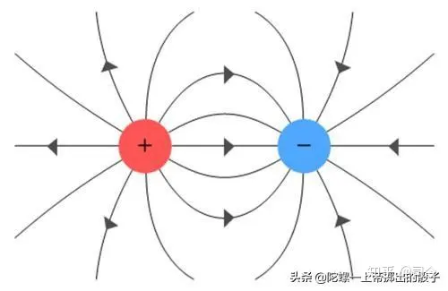
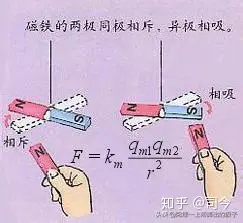
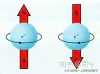
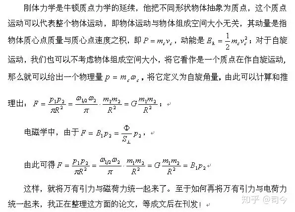
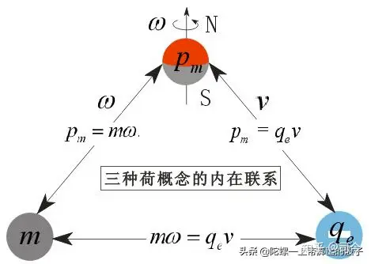

---

date: 2024-05-13 22:23:54

categories: vortex

tags: 
- 无

original_url: https://zhuanlan.zhihu.com/p/94613994

---

# 物理学中的场是什么？它是如何产生的？

司 今(jiewaimuyu@126.com)

  

  

“场”是今后物理学研究和发展的首要灵魂，但我们目前关于“场”理论就有好多种，如牛顿的质量场、库伦的电荷场、库伦的磁荷场、爱因斯坦的空间弯曲场、现代量子力学的量子场等等，这说明我们对场的认识还是比较混乱和模糊的。

那么，场是什么？它是如何形成的？我们该如何理解和正确描述它？......这将是摆在每个有志物理学探索的人必须要认真对待的问题。

  

  

就目前物理学困惑根源而言，应是近代物理学和现代物理学对“场”的认识、描述不够深刻和准确，即不知道“场”的真正物理意义是什么的必然结果。

  

  

对此，我们认为，场就是物质运动（包括平动和自旋）在其周围空间所产生的一种物理效应，它不是物质，但与其运动密切相关！

  

  

纵观物理学知识构架可以发现，牛顿力学是现代物理学的基础，但牛顿力学却缺失了对平动与自旋的内在联系及自旋所产生的物理效应（自旋磁场）的深入探究。如果现代物理学仍按牛顿力学思路去探索，那么人们将永远都不会弄明白“惯性质量”的真正起源和物理含义是什么？

  

  

就目前而言，只有真正明弄白牛顿惯性质量的物理起源及含义，才能真正理解万有引力的起源和含义及其他形式的场所蕴含的物理含义。

其实，牛顿惯性质量的含义应包括二方面：

(1)、物体所含的基本粒子数多少，即摩尔数多少；

(2)、物体整体自旋所产生的自旋磁量及其基本组成粒子自旋藕合所产生的磁量共同构成整个物体的磁量大小。

这说明，牛顿惯性质量是与其旋转磁场有关的概念，离开了场，就没有所谓的惯性存在。

对此，我们认为，牛顿万有引力的本质就是物质间的自旋磁场力，它与电磁力有共同的起源，而且二者本质是通一的。

  

  

因此，我们可以说，大到宇宙、太阳系，小到原子等，它们都有共同的物理模型—旋转+磁场，它们也都遵循同样的物理规律；那么，这一规律是什么呢？它们之间的相互作用力是万有引力、库伦力还是磁荷力？

仔细分析可以发现：万有引力公式同库伦电荷、磁荷力公式很“雷同”，这说明它们都揭示了物理学中最核心的问题—“场”，同时它们也都对场的数学描述形式给出了共同答案，即遵守B∝1/R²规律（B代表任何场）；至于如何解读B∝1/R²，则仁者见仁、智者见智了。

质量可以看作是质荷，它同电荷、磁荷一样，都是用于描述场而人为定义出的物理量，只不过定义的对象不同吧了。因选择的定义物理量对象不同，它们之间如要想统一就必存在一个转化系数，对此，我们的统一思路是：

  

  

如果将三种荷概念都放到自旋上，我们就可以发现，它们之间存在可统一性；如此以来，如果我们将静态的牛顿万有引力建立在动态质量场上，那么，牛顿万有引力与库伦的电、磁荷力是可以统一的，而且它们所描述的场的物理本质也是一致的。

  

