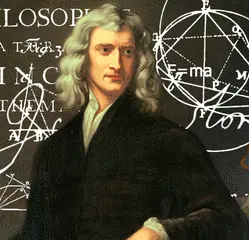
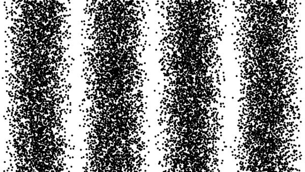
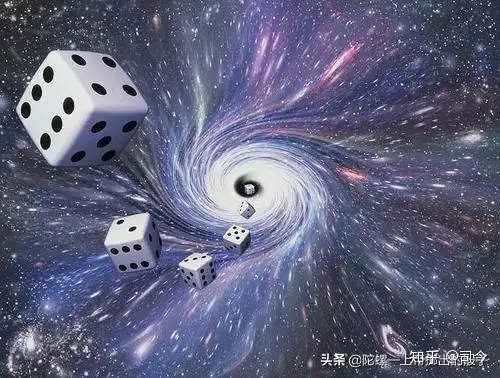
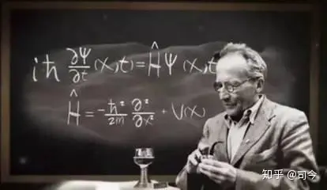
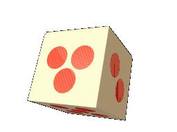
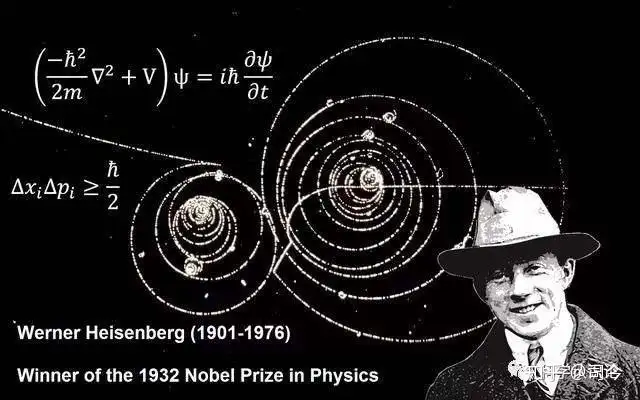
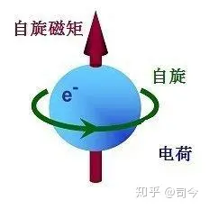
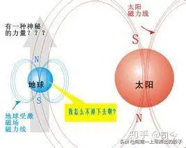
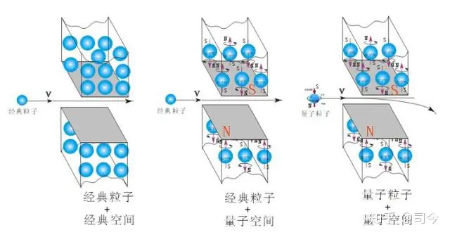
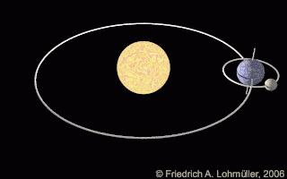

---

date: 2024-05-13 22:26:50

categories: default

tags: 
- 无

original_url: https://zhuanlan.zhihu.com/p/99219633

---

# “爱因斯坦——玻尔之争“留给我们的思考是什么？

司 今（jiewaimuyu@126.com）

  

  

经典物理学在微观领域研究方面曾有二条发展路线，一条是以牛顿力学、经典电磁学为基础的确定论路线，它通过对微观粒子的质量、电量、动能、动量等要素来研究单个或多个粒子在空间运动的物理规律；另一条是以热力学、混沌学为依托的非确定论，它通过对某系统中大量微观粒子的概率统计、微扰等要素的研究来描述粒子运动所表现出的宏观物理特性。

  

  

量子力学正是秉承了经典热力学的研究路线，将概率引入到微观粒子运动的研究之中，其中普朗克的黑体辐射方程、德布罗伊的物质波公式，薛定谔的波函数等都是将大量微观粒子运动的宏观表现进行概率化处理，是将经典统计物理学作进一步延伸的结果；当然，这些延伸还是吸纳了确定论的一些东西，是将概率论与确定论融合成了“新概率论”，其中，“波粒二象性”正是这种物理融合缔造的最直接产物。

  

  

那么，对微观粒子运动的研究是用牛顿等的确定论好，还是热力学的概率论好呢？对此，量子力学创建初期物理精英们的争论可谓是深刻、激烈的，其中“爱因斯坦与玻尔之争“最具有代表意义！

那么，爱因斯坦与玻尔到底在争论什么呢？

  

  

我们知道，爱因斯坦是物理确定论的代表，玻尔则是物理概率论的代表，他们俩争论的主题自然是物理研究是用确定论好还是概率论好的问题；对此，我们这里不妨引述《上帝真的掷骰子吗？》一书中描述的争论片段：

  

  

爱因斯坦认为：“对于任何一个系统，只要我有足够的初始信息，赋予我足够的运算能力，我就能够推算出这个系统的一切历史，从它最初怎样开始运动，一直到它在遥远的未来的命运，一切都不是秘密......哪怕是骰子也一样，只要告诉我骰子的大小、质量、质地、初速度、高度、角度、空气阻力，桌子的质地、摩擦系数，告诉我一切所需的情报，那么，只要我拥有足够的运算能力，我都可以毫不迟疑地预先告诉你，这个骰子将会掷出几点来”。

  

  

对此，玻尔阵营中的大将玻恩说：“就算我把电子的初始状态测量的精确无比，就算我拥有最强大的计算机可以计算一切环境对电子的影响，即便如此，我们也不能预言电子最后准确的位置。这种不确定性不是因为我们计算能力不足而引起的，它是深藏在物理定律本身内部的一种属性”。

  

  

海森堡则补充说，”测不准原理“在微观世界具有普适性，因为微观世界是场的世界，是微扰普遍存在的世界。

......，......，......

  

  

可见，他们争论的本质就在于微观世界粒子运动是由确定论来支配还是由非确定的概率论来支配？

如果说微观世界粒子运动是由非确定的概率论来支配的，那么宏观物理世界的确定论在微观领域也就失去了意义，即微观世界与宏观世界将遵循二种不同的物理法则。

但这可能吗？

  

  

对此，我们的思考是：量子力学对微观世界概率表象描述的背后一定隐藏了某些我们物理学目前还未发现的新的物理“确定论”规律！

那么，这个规律应该是什么呢？我们隐约地感觉到：是场，是旋转的场！

  

  

我们知道，自旋及自旋磁矩是量子力学的灵魂，而薛定谔方程里恰恰不包这些含要素！如果我们能够将薛定谔方程改造成包含自旋及自旋磁矩要素的内容，那么，我们就将会从新的物理确定论角度看到微观世界的本来面目，同时，也会将微观与宏观的物理法则纳入到了统一之中！

  

  

我们相信，这一时刻是真实存在的，并将会在不远的时间内到来！微观世界”确定论“的曙光必将会开启新的物理篇章！

  

