---

date: 2024-05-13 22:40:56

categories: default

tags: 
- 无

original_url: https://zhuanlan.zhihu.com/p/103998291

---

# 洛伦兹力到底是一种什么力？电子自旋磁矩或许能够给出答案！

  

司今（jiewaimuyu@126.com）

  

  

洛伦兹运动就是指运动电荷在磁场中受洛伦兹力作用而产生的一种曲线运动；但洛伦兹力及其公式不是从物理理论中推导出来的，而是由多次重复实验所得的结论，它只能被当作一个基本公理来应用，因为，直到现代人们还不清楚洛伦兹运动形成的真正物理机制，更不知道洛伦兹力到底是一种什么力？它从何而来呢？......

  

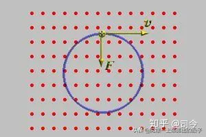

  
  
  

经典电磁学认为，洛伦兹力与安培力同源，那么，安培力又是一种什么力的？它又是如何形成的呢？现在看来，要想真正解决这个问题，就必须从电子的本质属性——自旋磁矩入手了！

  

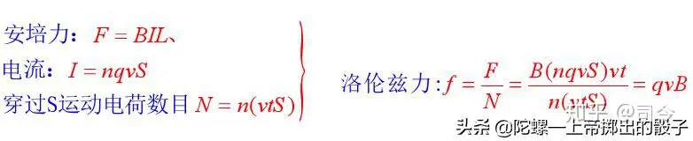

  
  
  

我们知道，电子自旋能够产生很大的磁矩，那么，电子进入磁场中后为什么只表现出洛伦兹运动，而没有表现出外界磁场对电子自旋磁矩的作用？即运动电子的自旋磁矩在外磁场中为什么没有现出来？

  

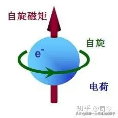

  
  
  

难道洛伦兹运动形成的真正物理机制就隐藏在运动电子的自旋磁矩中？也就是说，洛伦兹力的形成与电子的自旋磁矩在磁场中的运动表现相关联？......

  

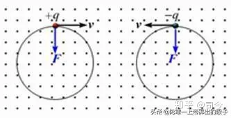

  
  
  

如果真是这样，那么洛伦兹力就不存在，取而代之应是带有自旋磁矩的电子在磁场中运动所表现出的切割磁力线的轨道磁矩效应，这种轨道磁矩效应与电子绕原子核所表现的轨道磁矩效应相雷同。

  

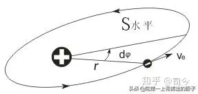

  
  
  

只不过切割磁力线的轨道磁矩效应并不是有心力的作用，而是电子自旋磁矩的磁轴受外磁场磁极力的影响而产生的一种类似于剪切了的效应，这种力的另一种定量表现可以通过电子在磁场中作曲线运动的所谓向心力描述出来，即mv²/r=qe.v.B=qm.B.

  

  
  
  

就其本而言，电子在磁场中所受的“剪切力”等同于自旋磁陀螺在磁场中运动所受磁场磁极力作用而产生相应的曲线运动一样，这种运动可以在宏观条件下是实验出来的。

  

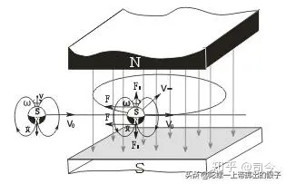

  
  
  

但是，现代物理学在研究外磁场对电子自旋磁矩的影响时，只考虑外磁场对电子自旋磁矩轴方向的影响变化，而没有考虑当电子自旋轴方向发生变化时，因电子有自旋性，其平动方向也会产生相应变化的情况，这种变化在宏观磁陀螺运动实验中就会显示出来。

  

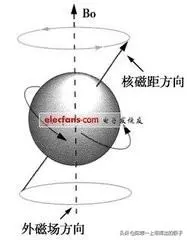

  
  
  

对此，我们可以用宏观自旋磁陀螺做外磁场磁对自旋磁陀螺运动产生的影响实验：

1、在自旋磁陀螺轴上方放一块磁体，自旋磁陀螺的自旋轴就会产生向外磁场方向的倾斜，这时自旋磁陀螺将会产生绕外磁场磁极的近动效应。

  

  
  
  

2、在自旋磁陀螺左侧或右侧方放一块磁体，自旋磁陀螺的自旋轴也会发生倾斜，且会产生绕磁体轴倾斜的公转近动。

  

  

通过这些实验，我们可以发现，外加磁体的磁场方向不仅会影响自旋磁陀螺的自旋轴方向，还会影响其平动速度方向，更进一步讲，还会影响磁陀螺自旋角速度的大小。

  

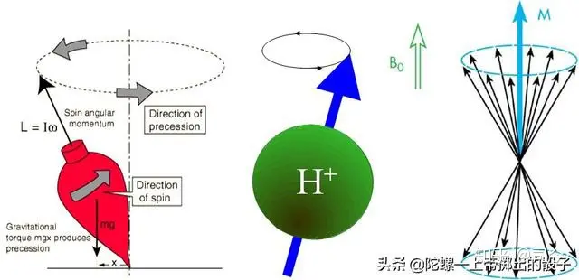

  
  
  

如果我们把电子看作是一个小小的自旋磁陀螺，它在磁场中的运动变化应该与宏观磁陀螺的运动规律相一致，如此以来，我们就可以解决洛伦兹运动形成的物理机制及洛伦兹力的本质等问题了，同时还可以将经典力学、经典电磁学与量子力学相衔接，使经典力学、经典电磁学更有了生命力！

  

  
  
  

而且，通过磁陀螺运动的实验与分析，我们还可以看出，地球绕太阳运动也可以看作是类似于电子绕原子核的运动，并且地球也有轨道磁矩与自旋磁矩存在；

  

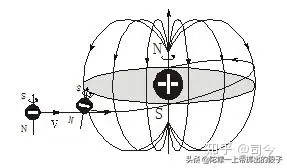

  
  
  

同时可以看出，地球自旋磁轴倾斜的形成应与太阳的自旋磁轴影响有关，具体分析请参阅司今《磁陀螺运动漫谈（15）—单体偶磁场对磁陀螺运动的影响（2）—兼谈太阳与原子系形成的动态原理及AB效应形成的物理机制》一文。

  

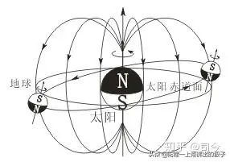

  
  
  

我们通过引入电子自旋磁矩可以解释洛伦兹运动现象，这说明电子的量子现象是大自然对洛仑兹问题最明晰的回答，而没有考虑电子量子属性的经典电磁学必然不可能找出洛伦兹运动形成的真正物理机制，也不可能知道洛伦兹力从何而来，它们只能从实验经验出发，给出不知所以然的经验描述形式。

  

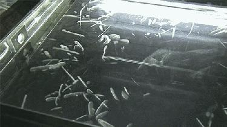