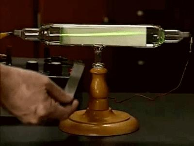
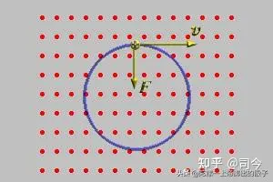
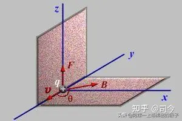
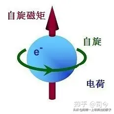
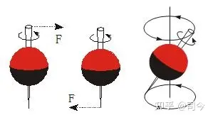
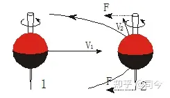
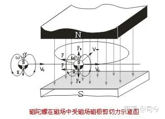
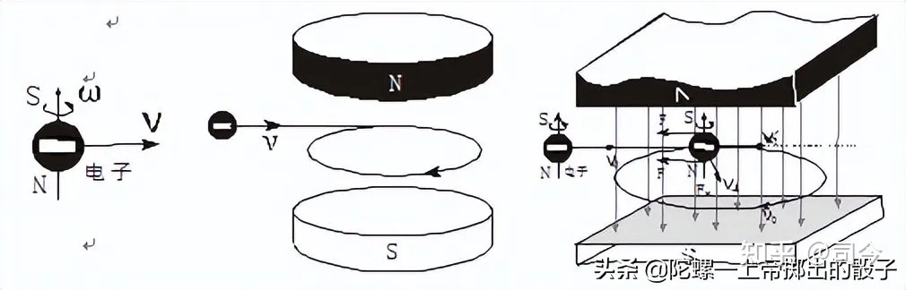
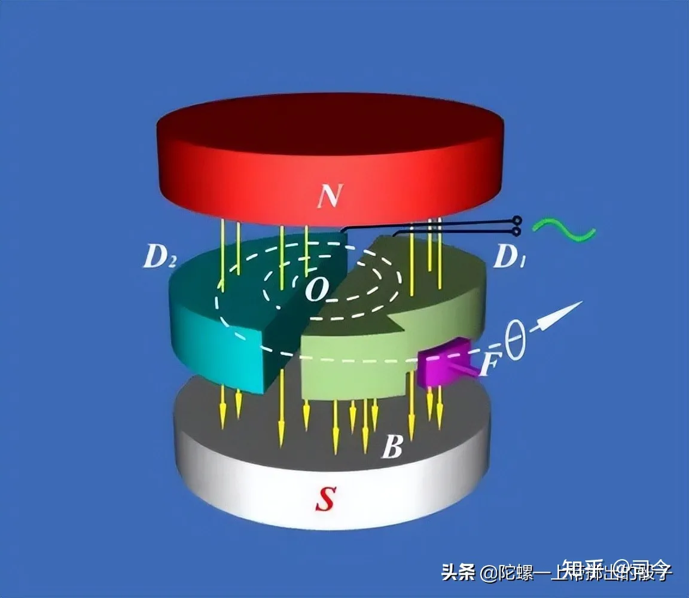
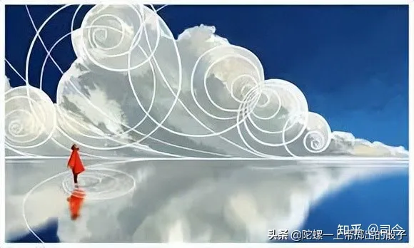

---

date: 2024-05-13 22:43:02

categories: default

tags: 
- 无

original_url: https://zhuanlan.zhihu.com/p/510369004

---

# 新发现：从电子自旋角度来看，洛伦兹力并不存在！

**【题记】：**量子现象应该是经典电磁学中非均匀磁场下的洛伦兹运动现象的延伸，但到目前为止，我们对洛伦兹运动行成的物理机制的物理分析却是“盲区”……

  

回旋加速器动态图

## **新发现：从电子自旋角度来看，洛伦兹力并不存在！**

司今（jiewaimuyu@126.com）

洛伦兹力是指运动电荷在磁场中所受的力，它是荷兰物理学家H·A·洛伦兹于1895年建立经典电子论时**作为基本假定而提出的**，他认为运动电荷产生磁场和磁场对运动电荷有作用力，这一假设观点后被大量实验结果所证实；例如，从阴极发射出来的电子束，在阴极和阳极间的高电压作用下，轰击到长条形的荧光屏上激发出荧光，可以在示波器上显示出电子束运动的径迹，实验表明，在没有外磁场时，电子束是沿直线前进的，如果把射线管放在蹄形磁铁的两极间，如图-1所示，荧光屏上显示的电子束运动的径迹就发生了弯曲，这表明，运动电荷确实受到了磁场作用力，这个力就被称做洛伦兹力。

  

图-1.阴极射线在磁场中偏转

按照目前物理学给出的解释就是运动电子通过磁场时会产生切割磁力线的运动，故会产生与电子运动方向相垂直的洛伦兹力，其物理原理如图-2所示。

  

图-2.电子在磁场中作切割磁力线的曲线运动

那么，这里就产生了一个困惑：电子运动为什么会切割磁力线？它切割磁力线为什么运动方向会产生变化？如果说运动电子作切割磁力线作曲线运动时会产生洛伦兹力，那么，这个洛伦兹力到底是什么力？......

  

图-3.洛伦兹力F⊥B⊥v

自从1895年洛伦兹假设这个力存在以来，到现在也没有人能够给出它到底是个什么力！也就是说，到目前为止，洛伦兹力仍停留于假设中，它的施力物是什么，它是怎么产生的，至今还是无解，即如图-3所示，为什么洛伦兹力F与磁场B、电子运动速度v三者相互垂直？

纵观物理学，宏观物体运动能够产生F⊥B⊥v这种形式的运动，只有自旋的磁陀螺在磁场中运动才会是这样，那么，电子能够像一个自旋磁陀螺吗？现代物理学实验证明，电子确实可以看做是一个小自旋磁陀螺，如-4所示。

  

图-4.电子自旋磁矩

如此说来，只要我们弄清了自旋磁陀螺在磁场中运动的规律，就可以找出洛伦兹力到底是一种什么力了。

  

图-5.陀螺轴受外力矩作用产生进动

我们可以首先用一个普通陀螺作实验，如图-5所示，在平面上垂直自旋的陀螺，当我们用一个细棒向左或右拨动自旋轴上或下端点时，它会产生绕质心的进动，这种进动有一个特点，那就是陀螺质心始终保持在进动中心轴线上，如图-6所示。

  

图-6.陀螺质心进动

假如我们在自旋陀螺轴上下端距质心等距离处施加相等大小的外力，则陀螺不会产生自旋 轴倾斜的进动，但会产生质心平移的曲线运动，如图-7所示，这时就有F⊥v2情况出现。

  

图-7.陀螺轴上下受外力矩作用产生曲线运动

如果我们把上述普通陀螺换成磁陀螺，并把它放到磁场中再作实验，如图-8所示，我们就会发现，磁陀螺在磁场中运动时，其二磁极由于受磁体磁极吸引力的影响，它的自旋轴就会受到外磁场施加的力矩作用，也就是说，自旋磁陀螺轴在其运动方向上就会受到与其v方向垂直的力作用，这就如图-7所描述的那样，自旋磁陀螺在磁场中就会产生F⊥B⊥v的运动，这与电子在磁场中的运动形式雷同。

  

图-8.自旋磁陀螺轴二端受磁场磁极力矩作用产生曲线运动

现在，我们把审视目光再回到电子在磁场中运动的问题上来，电子有自旋磁矩，它就像一个小自旋磁陀螺，这一结论已被现代物理学实验所证实并被主流物理学所接受，那么，从图-8的分析中我们可以看出，电子运动通过磁场空间时，其自旋磁轴的二端也会受到外磁场二磁极的力矩作用而使它产生F⊥B⊥v形式的曲线运动，这就是洛伦兹描述的运动情况，如图-9所示。

  

图-9.电子自旋磁轴二端受外磁场磁极力矩作用产生曲线运动

  

**如此看来，如果将电子看做是一个自旋磁陀螺，那么它在磁场中作曲线运动的所谓洛伦兹力就不复存在，因为使运动电子在磁场中产生曲线运动的力是电子自旋磁轴二端受到空间磁场磁极引力作用的结果，即外磁场磁极对其自旋轴产生了力矩作用，才使其运动方向发生改变，从而产生F⊥B⊥v形式的陀螺运动现象；这说明使电子在磁场中作曲线运动的力是外磁场与电子自旋磁轴之间的磁力，这个力与外磁场B方向是平行的，并不是与B垂直的，如此说来，电子在磁场中作曲线运动的所谓洛伦兹力确实不存在，因为洛伦兹力是与外磁场垂直的，是因电子在磁场中有作曲线现象而假想出来的一种力！**

  

  

其实，现代物理学在探讨洛伦兹运动问题时，还是以十九世纪前的眼光来看问题，曾没有将电子的自旋磁矩性融入到洛伦兹运动问题的探究中，这是物理学发展中的一大遗憾，我们期待着这一遗憾在今后的探索中能够弥补上来，也好**为洛伦兹力的问题找到一个完美的答案！**

  

期待