---

date: 2024-05-13 22:44:54

categories: default

tags: 
- 无

original_url: https://zhuanlan.zhihu.com/p/510373638

---

# 新发现：核外电子轨道分布与行星轨道分布规律具有一致性！

## **新发现：核外电子轨道分布与行星轨道分布规律具有一致性！**

司今（jiewaimuyu@126.com）

  

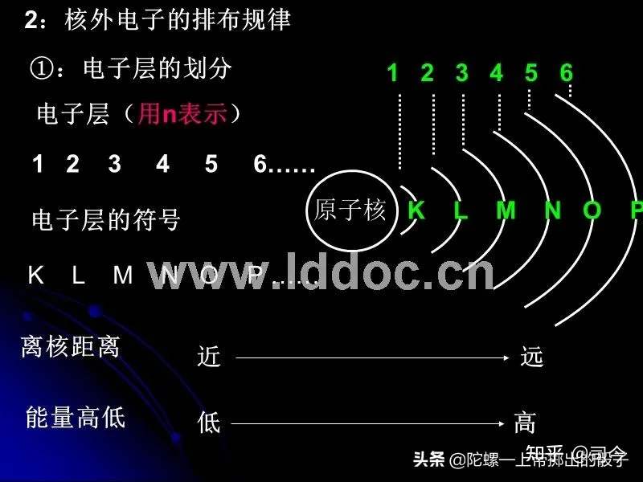

核外电子轨道分布

在半经典量子理论中，多电子原子中的电子轨道分布遵循玻尔的轨道能级理论，即核外电子能级轨道半径分布规律为：

  

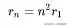

  

如果将原子核外电子分布轨道半径规律改写成以轨道周长λ来描述的形式，则有：

  

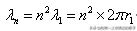

  

可见，不同稳定轨道周长之间按n=n²×r1规律拓展的本意是，电子第一轨道周长是λ1=2πr1，第二轨道周长就是第一轨道周长的4倍，即λ2=4×2πr1，第三轨道周长就是第一轨道周长的9倍，即λ3=9×2πr1……以此类推，第n轨道周长就是第一轨道周长的n²倍，即λn=n×2πr1，n∈\[1、2、3、4…….\]，现将这种轨道周长按n²倍式拓展形式绘成图，如图-1所示。

  

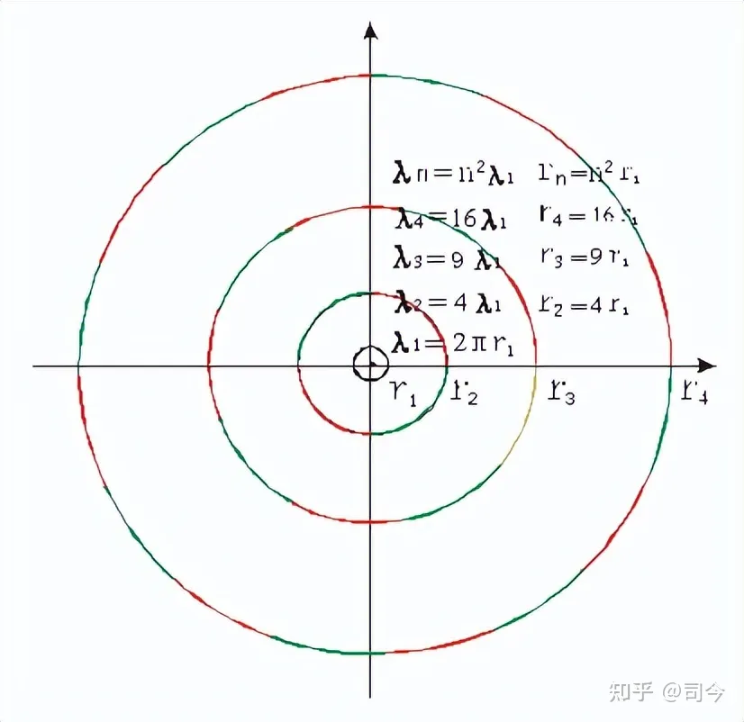

图-1 . n^2 轨道拓展形式

我们从图-1中还可以看出，玻尔电子稳定轨道周长按第一轨道周长n²倍拓展时，轨道周长拓展倍数不完全具有对称，即有奇数不对称情况出现，这就违反了埃米·诺特对称与守恒及拉格朗日最小作用量原理，这种不具有完全对称性的根源来自于玻尔的轨道角动量量子化假设条件，即他将电子核外轨道角动量规定为L=nh/2π后，其轨道周长拓展必然就**不全具有对称性，**即存在奇数轨道周长拓展的形式，这也是半经典量子力学存在局限性的原因之一。

  

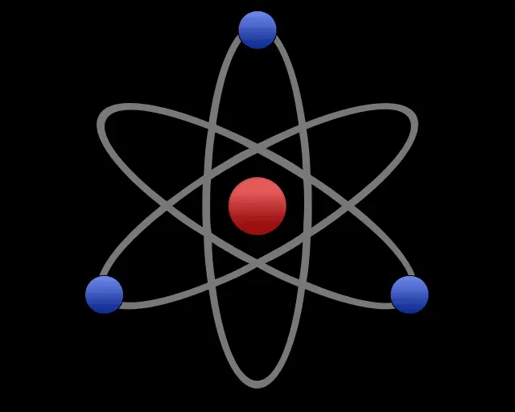

核外电子运动

我们知道，现代原子模型起源于卢瑟福的原子行星结构模型，也就是说太阳系行星分布模型与原子核外电子分布有相通之处，但现行物理理论认为，行星在太阳系中的分布规律与原子的电子分布规律不同的，这是为什么？难到真的是不一样？

  

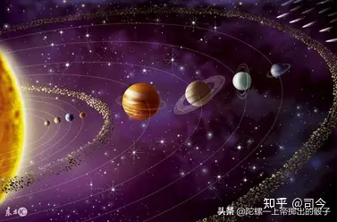

行星轨道分布

早在1766年德国的一位中学教师戴维·提丢斯（Johann Daniel Titius，1729~1796）发现了一个关于太阳系中行星轨道分布的简单几何分布规则，即Ｒ＝ａ＋ｂc^n ；后来柏林天文台的台长波得（Johann Elert Bode）归纳成了一个经验公式来表示，即

  

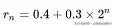

  

式中Rn是以天文单位表示的第n颗行星离太阳的平均距离，n是离太阳由近及远的次序（但水星n=－∞为例外）。

1781年发现的天王星正符合n=8的位置上 ，因而促使人们去寻找n=5的天体，1801年果然发现了小行星，但这个公式物理意义仍不明确，因为在1846年发现的海王星、1930年发现的冥王星与该公式计算得距离偏离很大，故许多人至今持否定态度，认为充其量不过是帮助记忆的经验式。随着研究的深入，已提出了许多种行星距离公式，更常用的形式为an+1∶an=β（β为与行星质量有关的常数，而且在一些卫星系统中，规则卫星也同样存在着类似关系，因此，该定则的物理意义还有待进一步探讨。

  

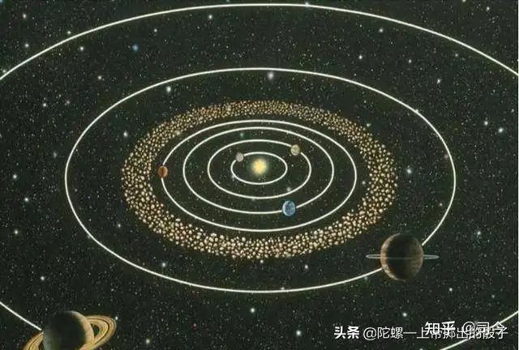

行星及小行星带轨道分布

其实，仔细分析公式rn=0.4+0.3×2^n的拓展规律（n∈\[0、1、2、3、4……\]）就可以发现，这种分布完全符合周长λ拓展呈对称性原则，即其他行星轨道周长是以最内层行星轨道周长的2^n倍形式向外拓展的，用公式描述就是

  

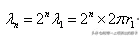

  

将这种描述绘图就如图-2所示。

  

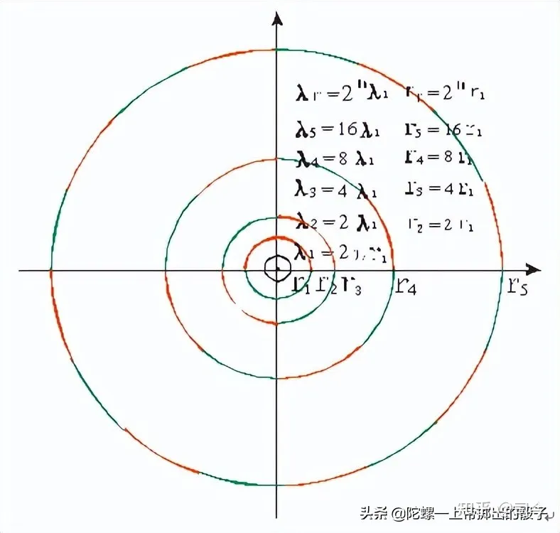

图-2 . 2^n轨道拓展形式

原子中电子轨道分布情况，我们是看不见摸不着的，对它轨道半径或周长的n²倍拓展形式只存在于理论推理中，而太阳系行星轨道半径或周长的2^n形式拓展形式是我们看得见摸得着的，而且也完全符合埃米·诺特对称与守恒及拉格朗日最小作用量原理，结合玻尔轨道能级理论的局限性，由此，我们可不可以做一个大胆推理：**原子核外的电子分布也应该符合2^n倍拓展形式**，这样微观与宏观世界的运动规律就是一样的了，宇宙中也就不存在二套不能兼容的支配规律，也就是说微观与宏观的运动规律也就具有了统一性。

  

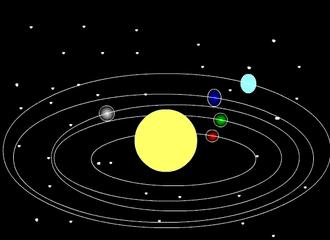

太阳系行星运动