---

date: 2024-05-13 22:47:53

categories: default

tags: 
- 无

original_url: https://zhuanlan.zhihu.com/p/140516559

---

# 圆周运动的动能到底是E=mv²/2还是E=mv²？

司 今  
（广州毅昌科技研究院 广州 510663 E-mail:jiewaimuyu@126.com）  
  

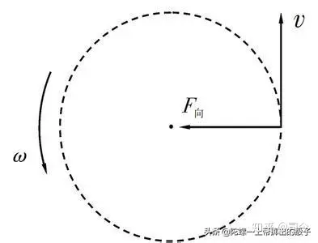

  
摘 要 ：动能是物理学的重要概念之一，如果不理解或不明白动能定义的物理意义，就无法真正理解以实验为基础的现代物理学,更无法破解目前物理学的“困惑”难题。动能定义起源于伽利略的机械能守恒思想，而这一思想建立的自然基础是自由落体运动，但这种运动与圆周运动有很大区别；那么，用自由落体运动定义出的动能概念适合描述圆周运动吗？本文带着这种疑问，尝试性地探讨了圆周运动动能该如何定义与修正问题。  
关键词：动能、势能，自由落体运动，能量守恒，圆周运动  
中图分类号：0412 文献标识码：A  
  
1、关于动能定义的争论与质疑  
“从伽利略时代开始，围绕动能定义的争论就激烈进行着，伽利略在他的著作中使用过动量一词，不过他有时也使用物体运动之力的说法，这个力正比于质量和速度的乘积。笛卡尔继承了伽利略的说法，把物体的大小（质量）和速度乘积定义为运动质量，即，并提出了宇宙间运动质量的总和不变原理。1686年莱布尼兹公开向笛卡尔提出挑战，他通过计算得到，伽利略所说的足以使下落物体回到同一高度的力，应该用mv²来度量，并把这种力称为活力。后来，科里奥利又将活力改为mv²/2，这就是我们今天所说的动能”。\[1\]  
对莱布尼兹与科里奥利的动能定义，我们可以用自由落体运动作如下分析、比较：  

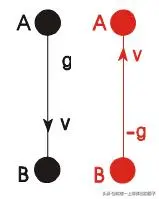

图-1  
如图-1所示，黑球在地球引力场g中从A点沿引力线方向运动到B点，其动能变化为E(k)=mv²/2，势能变化为E(p)=mgh，这就是科里奥利的动能含义；但它没有再从B点返回到A点（如图-1红球），可见这不是一个闭合运动，其运动总能量变化∑△E=E(k)+E(p)=0，符合动、势能守恒。  
假如红球在地球引力场g中从A运动到B点，其动能变化为E(k)=mv²/2，接着红球又回到了A点，其动能变化也为E(k)=mv²/2；由于动能、势能是标量，球从A到B、再从B到A的总动能变化量就为∑E(k)=mv²，而势能变化则为∑E(p)=2mgh，这就是莱布尼兹的动能含义。  
从上面分析可见，二位先哲给出的动能定义都有道理，但描述的运动空间状态却不同，一个描述的是开放空间动能变化量，另一个描述的是闭合空间动能变化量。  
那么，我们的物理学为什么要采用科里奥利的动能定义来描述物质运动能量变化呢？  
对这个问题质疑自古不断，较典型的要算是英国Essex大学物理学B.K里德雷教授，他曾指出：“质量对速度的依赖迫使我们用新眼光看过去的动能概念。我们从来不曾真的理解为什么动能在任何时候都是那个特别的量，mv²/2，为什么不是mv²或mv²/3或别的什么呢？......我们过去的动能概念错了！”。\[2\]  
这是他就爱因斯坦相对论中质能守恒思想作此番论述的。  
我们姑且不论他对动能概念质疑的观点对错，单就他提出的动能为什么要用mv²/2来定义，“为什么不是mv²或mv²/3或别的什么呢？”，这个问题本身在当代物理学中就有革命性的意义。  
2、动能定义分析  
“动能是机械能的一种，当质点以速度v运动时，相应的动能为E(k)=mv²/2，m是质点的质量。对于质点组，每个质点的质量和速度可以不同，因而  

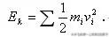

  
对于连续分布的物体有  

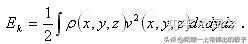

  
其中ρ是物体的密度，它一般是坐标空间的函数”\[3\]。  
这就是我们今天对动能的完整定义。  
动能定义的思想基础是能量守恒，它起源于伽利略的「物体运动学」（从几何角度描述和研究物体位置随时间变化的规律，不涉及物体本身的物理性质和加在物体上力的问题，即没有探究物体运动产生的原因，牛顿力学才给出运动产生的原因）。  
伽利略是近代物理学的奠基者，没有他对物体运动的研究，就不可能有开普勒的行星运动学和牛顿力学诞生，因此，只有从伽利略的「物体运动学」入手，才可能真正理解和看清我们今天所沿用的动能真正含义是什么？其应用范围在哪里？  
伽利略「物体运动学」体系主要包括：  
（1）、速度、加速度概念。  
（2）、相对性原理和惯性原理。  
（3）、自由落体运动。  
（4）、抛物线运动等；  
其中，惯性原理是他理论体系的基础，它体现了物体运动中能量变化与守恒思想，而我们今天的动能定义正是建立在这一思想基础之上的。  
伽利略为了说明和证明他的惯性原理，他用滴漏水壶滴漏的水滴间隔作计时器，巧妙记录了斜面滚球运动与时间和高度的变化关系。  

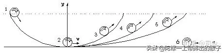

图-2  
如图-2所示：先把球放在1的位置上，然后自然放开，球m会沿斜面槽运动，当其运动到2时，它获得的速度最大，然后球可沿3、4、5、6斜面槽运动，在3、4、5的运动态中，球总会达到同一高度y时、速度才会变为0；而在6的运动中，如果没有受到外力或其他物体影响，它会一直以v速沿直线匀速运动下去，这就是伽利略所说的惯性定律：物体保持静止或继续以恒定的速率沿直线运动，除非受到外界的作用。这里要注意，启动物体趋于以恒定速率沿直线运动而不是沿曲线运动，否则，这个匀速运动就不可能持续下去。  
动能定义就是为了确立一个以v速运动的物体，当它的速度由v变成0时所具有的做功能力大小；现在物理教科书上都是这样解释动能变化大小的：  

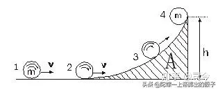

图-3  
如图-3所示，当一个以v速运动的物体遇到光滑斜面A时，它会沿斜面A作上升运动，直到其速度v变成0为止它才会静止下来，在这里使物体速度由v变成0的原因是地球引力场g的作用。  
可见，我们的动能定义与地球引力场有直接关系，同时也与“功”概念有联系。我们说功、能或动、势能守恒都是指不同状态下的一种能量转化守恒，即我们用力使一个静止小球产生v运动（这个速度为瞬时速度），小球当遇到光滑曲面A时，则动能就会转化成地球引力场势能，在这个转化中有  

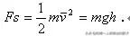

  
v˜是小球从h=0、t=0处计为始点开始、到h≠0t≠0处的平均速度，即有  

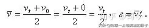

  
可见，速度、速率与平均速度在伽利略的自由落体运动中含义是不同的；速度就是描述物体位置变化快慢程度和方向的物理量，是一个状态矢量，速度又可以分为平均速度与瞬时速度；速率就是物体运动通过的实际路程与通过该路程所用的时间之比，速率是标量，它只反映物体运动速度变化大小而不反映物体运动方向。  
对莱布尼兹所说“足以使下落物体回到同一高度的力，应该用mv²来度量，并把这种力称为活力”的含义可以用图-4表示，那就是：  

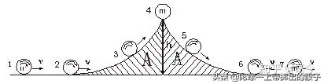

图-4  
小球在1处以v匀速直线运动，经过2、3、4、5、6的变化后又回到1的运动状态；这时，小球1的动能与7的动能没有变化，都可以用mv²来度量；当然也可以用mv²/2来度量，但二者度量的含义是不同的：  
用E(k)=mv²来度量，表示小球从1到7的变化过程是一个“回到同一高度”的运动变化过程，这里考虑的是引力场影响的合力为0下的一种运动变化过程，可将这个过程称为物体“闭合运动”。  
用E(k)=mv²/2来度量，表示小球在1时的运动动能定为E(k)=mv²/2，那么，它到7状态时，虽仍是E(k)=mv²/2，但我们定义动能时，是在小球没有“回到同一高度“状态下定义出来的，因此，用E(k)=mv²/2就没有办法包含小球“回到同一高度”这一运动过程，因此，对这种运动过程，用E(k)=mv²来定义小球运动动能是比较合适的，因动能是标量。  
3、自由落体运动  
自由落体定律是伽利略物理思想的重要组成部分，它的意义不仅仅在于挑战、推翻亚里士多德的唯现象落体理论，而且开创了速度、速率、加速度等物理学概念新局面，使物理学描述有了自己的独特语言；同时也揭示了自由落体运动的物理本质，即场力的存在。这与后来的牛顿万有引力定律、库仑定律、高斯定理思想不谋而合，对此内容的具体论述，请参阅《自由落体运动、圆周运动及量子力学能级分布刍议》一文。\[4\]  
历史上，不仅仅是伽利略在研究自由落体运动，还有达芬奇、艾伯特、奥雷姆等也对自由落体运动作过比较系统的研究，只不过物理界在选择“最适合的自由落体定律”时，伽利略的方案“中标”罢了。  
特别值得一提的是，我们现在所运用的落体定律公式：h=gt²/2并不是伽利略给出的，而是奥雷姆的结论。  
如图-5所示，是用相机摄下的小球下落时相机频闪记录的照片，图左边就是伽利略对自由落体运动的数学描述，图右边是奥雷姆对自由落体运动的数学描述。  

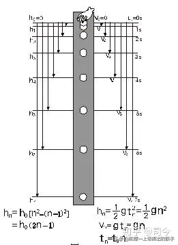

图-5  
伽利略给出的自由落体定律是：在相继相等的时间间隔内，物体下落的平均速率正比于顺序的奇数，即第1秒下落距离为1个长度单位h1，第2秒为1+3、第3秒为1+3+5、第4秒为1+3+5+7…第n秒为1+3+5+7…+（2n-1）个长度单位，可见，物体下落的距离与第1秒制定的长度单位构成一个奇数数列；因奇数数列1+3+5+7+…+(2n-1)=n²，说明一段时间内，物体下落的距离就是  

  
n是自然数.  
奥雷姆给出的自由落体定律是：当物体下落时的记录间隔时间为1秒，则时间序列就可以用自然数n来表示，当t=1时，h1=g/2,则在一段时间内，物体下落的距离就是  

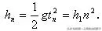

  
可见，伽利略的自由落体定律与奥雷姆的自由落体定律结论是等效的。  
上述分析表明，自由落体运动有二种描述方法：  
1\. 奥雷姆法  

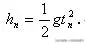

  
他是用时间t与加速度g来确定物体总下落距离的。  
2\. 伽利略法  

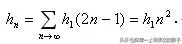

  
他是用第1秒的下落距离与奇数来确定物体总下落距离的。  
在奥莱姆的自由落体运动中有h=gt²/2，按照伽利略对速率和加速度的定义v=gt，则有  

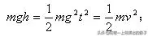

  
正是遵循这一思想，现在物理学才将E(p)=mgh定义为在地球引力场g下的势能，将E(k)=mv²/2定义为m下落运动的动能，且m在地球引力场中下落运动遵守动、势能守恒。  
由此可见，奥莱姆与伽利略的自由落体定律都是动能E(k)=mv²/2定义的反过程；但伽利略的速率、速度思想有更深层次的物理意义，它是牛顿和莱布尼兹微分学的基础起点。  
当然，伽利略与奥莱姆的自由落体定律也都存在一定误区：  
在不同高度上，他们都将g看作是常量，物体下落就是一种匀变“速度”运动，故有  

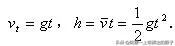

  
但实际上，g是常量的观点与牛顿万有引力原理g=GM/r²是相抵触的，因为，在牛顿万有引力场中g是变量，它是距离的二阶导数，即  

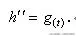

  
只有再对g(t)进行第三次求导则它才是常量，即  

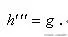

  
故可将万有引力场中的加速度称为匀变“加速度”运动。  
在宏观短距离空间并允许一定误差存在下，伽利略、奥莱姆的自由落体定律可近似成立，但对于宏观长距离空间，如地-太系空间，g在不同r上就不可能再作常量来对待了。  
可见，伽利略、奥莱姆的匀变“速度”落体运动不同于牛顿的匀变“加速度”落体运动，因此说，伽利略、奥莱姆的自由落体运动不适宜精确描述牛顿万有引力场下的物体落体运动。  
4、圆周运动动能  
圆周运动是一个闭合的曲线运动；从惠更斯圆周运动公式F=mv²/r中可以看出，圆周运动存在的充分且必要条件是：  

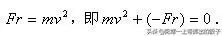

  
但我们定义的动能E(k)=mv²/2是一种非闭合线性运动，下面以自由落体运动动能形成的机制来讨论我们现在动能定义合不合适描述圆周运动动能问题？  
物理学中的动能概念是按物体受力方向上的速度平方与质量积之半，即E(k)=mv²/2定义出来的，如图-1-1所示，黑球在地球引力场g中从A点沿引力线方向运动到B点，其动能变化E(k)=mv²/2，势能变化E(p)=mgh，但它没有再从B点返回到A点（图-1-2红球），可见它不是闭合运动，运动总能量变化∑ΔE=Ek＋Ep=0，符合动势能守恒。如果它从B点又回到了A点，则势能变化为0，因动能是标量，故该运动的总动能应为mv²/2+mv²/2=mv²，这就构成了一个的闭合运动形式。  

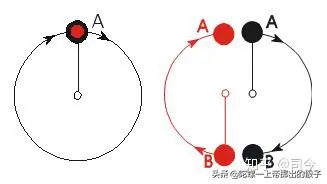

图-6  
圆周运动是一个闭合曲线运动，即势能变化为0，如图-6所示：在向心力形成的势能场中，黑球从A点出发，运动一个周期后又回到A点（红球），这就如同一个从A点下落又返回到同A点的闭合落体运动一样，其动能应为E(k)=mv²，势能E(p)=Fr=﹣mv²，且∑ΔE=Ek＋Ep=0.  
现在，我们物理学按E(k)=mv²/2来定义圆周运动动能，它就相当于图-6黑球从A点运动到B点后就不运动了，其动、势能为Ep=Fr/2=Ek=mv²/2的关系，但我们却将E(k)=mv²/2认为是闭合圆周的动能，而将Ep=Fr=mv²看作是其势能，这样定义出的闭合圆周运动能够符合动、势能守恒条件吗？  

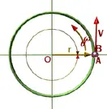

  
在曲线运动中，如物体从t0时刻在A点、t时刻到B点（图-6），没有形成闭合圆周空间，那就谈不上圆周运动能量守恒问题，因为空间不闭合就不存在闭合空间的守恒量，如动量和角动量都是矢量，故它们的守恒也将不存在。  
可见，我们在圆周运动的动势能定义上是存在模糊且错误的。  
圆周运动的动、势能守恒应有两个方面的含义：  
〔1〕、对质点自身而言，它每一时刻的运动都遵循∑ΔE=Ek＋Ep=0守恒。  
〔2〕、对质点作闭合空间运动而言，它每一个运动周期也存在∑ΔE=Ek＋Ep=0守恒，否则这个空间运动就不是闭合的空间运动。  

  
圆周运动问题实质就是绕体在有心力场中作曲线运动的问题，因此，研究有心力场中物体运动就必须抛弃原来的直线不闭合的动势能定义思想，用闭合曲线运动来重新审视圆周运动的动、势能定义才能从根本上认清和解决物体或粒子的自旋、公旋及其它曲线运动问题。  

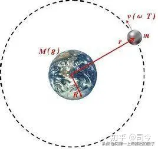

  
由此可见，用E(k)=mv²/2或用E(k)=mv²来定义动能的含义将不同，从物体运动轨迹而论，有了闭合与不闭合区分，而不同的动能定义就会体现出物体运动空间轨迹的开放与闭合性的差异。  
4.1 、圆周运动与自由落体运动的区别  
圆周运动与自由落体运动存在的运动状态是不同的，下面将牛顿力定义与自由落体运动、圆周运动受力情况放在一起进行分析、比较：  

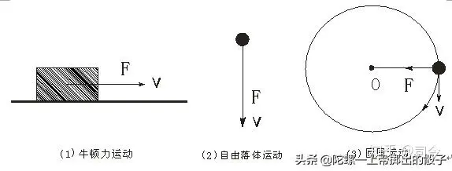

图-7  
（1）、图-7-1所示，牛顿用于定义力概念的数学表达式是F=mdv/dt，它是指在dt内使物体m产生dv速度变化时，外界所给予物体的作用能力大小，即称为力；物体受力方向与v方向是一致，它是用于描述物体作直线运动时速度变化与力关系的数学描述公式。  
（2）、图-7-2所示，自由落体运动中物体受力大小与速度变化的数学表达式为F=mg，v=gt，这里力与时间无关，在g为常量下，物体受力大小量不变，物体受力方向与下落速度v方向一致。  
（3）、图-7-3所示，圆周运动受力大小与速度变化的数学表达式为F=mv²/r，这里v是常量，力与时间无关，在v、r一定下，力也是常量，但物体受力方向与其运动速度v方向并不一致，而是成垂直关系。  
由此可见，牛顿定义的力F=mdv/dt与自由落体运动的力F=mg思想是统一的，但在圆周运动中的力就不同于它们了；这时，我们不禁要问：用E(k)=mv²/2动能定义来描述这样的圆周运动动能合适吗？  
4.2、 圆周运动动能与目前动能定义的冲突  
现在物理学将E(p)=mgh定义为m在地球引力场g下的势能，将E(k)=mv²/2定义为m运动动能，且m在地球引力场中物体下落运动遵守动、势能守恒。  
那么，如果用我们现在的动、势能定义来描述圆周运动能量问题，则有：  
mv²/2+（-mgr）=0，即mv²=2mgr，由此可得F=2mgr=mv²/r.  
这就不符合圆周运动公式F=ma= mv²/r的形式。  
要使mv²/2+（-mgr）=0符合式F=ma= mv²/r形式，只有令∑E=mv²/2+（-mgr）=-mv²/2，则有∑E=mv²/2+（-mgr）≠0，这就违反了圆周运动形成的必要且充分条件。  
按目前的圆周运动动能、势能定义为∑E=mv²/2+mgr，这是将物体圆周运动与中心体的场影响联系到一起的做法，是用二个物体组成一个系统的论观点来处理绕体运动的动能问题。  
如果用F.r=mv²来描述圆周运动动能，就可以将F.r与mv²看做是二个相对独立的运动能量状态，一个是m以mv²的自由运动状态，另一个是以中心M引力场对m所形成的势能状态，但这二个能量状态是相对独立的，因为M体在其周围空间形成引力场g方向与m运动速度方向处于垂直状态时，它虽对m施以力效应，但只能改变m的运动速度方向，却改变不了m运动速度大小。  
其实，惠更斯圆周运动公式F.r=mv²/r中也是将m看成是一个孤立的动运状态，不过这种运动状态要符合F.r=mv²条件，其中F.r就是使物体产生圆周运动的外在限制条件，mv²就是m在F.r的条件约束下的运动动能状态，从圆周运动存在的充分且必要条件F.r=mv²中可以看出，用现在动能定义描述圆周运动只能以∑E=mv²+（-2mgr）=0的形式出现，但其本质还是∑E=mv²=Fr.  
可见，我们目前对圆周运动动能定义是建立在二个物体产生力系统下的定义，如果将绕体m视作一个单体运动来看待，即不考虑另一个物体引力场影响，单就绕体m作圆周运动而言，它的总能量应是E=mv²，它保持这种匀速运动状态的限制条件是在引力场势能F.r约束下的运动状态。  
在物理学中，我们研究粒子自由运动时，即不存在引力场影响的运动，这时，粒子的自由运动动能应该是mv²，而不是mv²/2；因为mv²/2是在引力场为g下定义出来的，是粒子在非自由状态下的运动，如果用mv²/2来描述自由粒子运动，这就与粒子自由运动概念相矛盾了。  
因此说，我们引入和运用E(k=)mv²/2动能定义来描述圆周运动动能问题是存在失误的；因为，在匀速圆周运动中，v大小是不变的，能量是标量，在该系统中动、势转化必须遵守能量守恒规律，即Fr=mgr=mv²，即∑E=mv²+Ep=0才符合伽利略的惯性原理思想。  
伽利略惯性原理所要陈述的就是运动物体在没有引力场影响或引力场影响合力为0的自由运动状态，如：在光滑平面上或在太空中作匀速运动的物体。如果不考虑重力加速度或向心加速度，单就物体个体运动状态而论，圆周运动是符合伽利略惯性原理的，这说明圆周运动也是一种惯性运动，不过是一种匀速曲线惯性运动罢了。  
4.3 、物理学对现在圆周运动动能定义的隐形修正  
牛顿在推出万有引力公式时，是直接应用圆周运动公式来进行的，这就避免了我们动能定义mv²/2的纠缠，即  

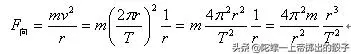

  
依据开普勒第三定律k=r³/T²，可得：  

  
令4π²k=GM，则有  

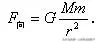

  
同样，玻尔在制定他的电子绕原子核运动分布轨道时，用的是角动量公式J=mvr，这也就避开了动能E(k)=mv²/2定义的干扰，因此，也算是一种变相抛弃吧。  
爱因斯坦在他的质能方程△E=mc²中，似乎看到了我们动能定义的局限与误导性，但在广义相对论中又回到了这种错误上来。  
德布罗意则由动量  

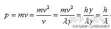

  
直接推出德布罗意波长  

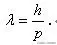

  
德布罗意波长的动能表达式为  

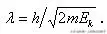

  
这实质是用∑E=2E(k)=mv²=hγ来代替E(k)=mv²/2，也是对现有动能定义E(k)=mv²/2运用在圆周运动上所作的变相否定或说隐形修正吧。  

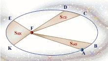

  
5、小结  
5.1、用E(k)=mv²/2或E(p)=mv²来定义动能就有不同的物理含义，从物体运动轨迹而论，E(k)=mv²/2描述的是一种开放运动，E(p)=mv²描述的是一种闭合运动；可见，选择不同的动能定义能够体现物体运动空间轨迹是开放还是闭合的。  
5.2、圆周运动是一个闭合曲线运动，其运动动能用E(k)=mv²定义比较客观、合适。  
5.3、圆周运动实质是绕体在有心力或有心力场作用下产生的闭合运动；因此，研究有心力或有心力场中物体曲线运动动能问题，必须抛弃原来的“开放”运动动能定义思想，用“闭合”运动思想来重新审视圆周运动动能定义问题，才能从根本上认清和解决物体或粒子在自旋、公转时动、势能守恒与角动量守恒问题。  
因此，修正圆周运动动能概念，有非常重大的物理意义！  
在此，希望学术界能够给予关注与重视！

  
  
【参考文献】：  
\[1\].赵凯华，罗蔚茵/著《力学》，高等教育出版社1995年7月第1版，P45.  
\[2\].【英】B•K•里德雷/著《时间、空间和万物》湖南科学技术出版社2002年1月1版，P101  
\[3\].徐龙道等/著《物理学词典》，科学出版社2004年5月第1版，P13.  
\[4\].司今/《自由落体运动、圆周运动及量子力学能级分布刍议》,中国预印本网：  
\[5\].【美】Richard P.Olenick,Tom M.Apostol,David L.Goodstein/ 著《力学世界》；李椿、陶如玉/译 北京大学出版社 2002年2月第1版.  
\[6\].赵凯华，罗蔚茵/著《量子物理》，高等教育出版社2008年1月第2版.  
  
司 今：男，1966年10月出生，皖蚌埠市人，机械工程师，主要从事理论物理学研究，著有《关于地球椭圆轨道和自旋变化成因的探讨》、《物质自旋与力的形成》、《高斯定理的物理意义及其在场物理学中应用的得失》、《量子力学磁矩的含义》等多篇论文发表。  
通讯地址：广州市萝岗区科学城南翔三路 广州毅昌科技公司  
E-mail:jiewaimuyu@126.com 电话：13825126113
