---

date: 2024-05-13 22:50:23

categories: default

tags: 
- 无

original_url: https://zhuanlan.zhihu.com/p/104111782

---

# 20世纪初，“原子模型”进化中的“春秋战国”黄金时代

司今（jiewaimuyu@126.com）

  

  

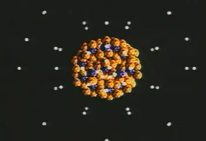

  

微观世界是一个“**看不见，摸不着**”的世界，但它与人们的生活息息相关，为了探索这一世界的科学奥秘，1803年，英国自然科学家约翰·道尔顿首先提出了原子概念，并指出宏观物质是由微观原子构成的，而且原子是实心球体且不能再分的最小粒子，这就是微观科学史上提出的第一个“原子模型”，但其弊端是可想而知的，于是渐渐被人们遗忘了一百多年。

但随着电磁学与热力学等微观科学的发展，人们迫切想为微观基石—原子，找出一个新的理论模型，以适应这些科学的发展要求。

20世纪初，为了描述原子的真实模样，于是，物理学家们在短短的30年间，竟提出了十多种模型“原子模型”，这真可谓是“原子模型”创建的“春秋战国”黄金时代！

  

  

尘埃落定，“原子模型”最终被定格在了薛定谔的“电子云”模型上；又近一百年过去了，回首当时物理学家们提出“原子模型”的思想基础和验证、淘汰过程，让我们领略到了微观世界探索的艰难与乐趣，同时也为我们今后微观物理学的新探索提供了一些有益的启迪！

  

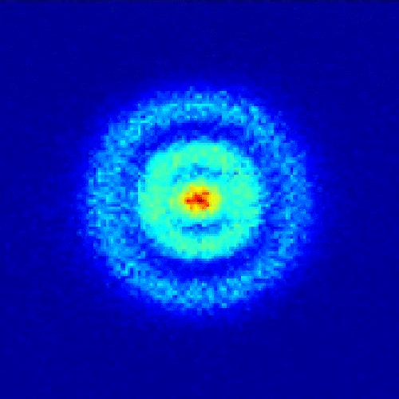

  

————————————

**1901年，法国物理学家佩兰提出了“行星结构原子模”。**

  

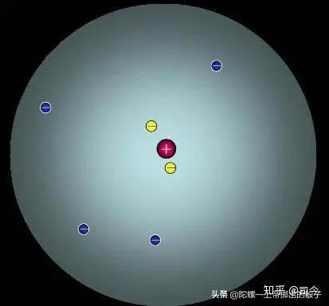

  

他认为，原子中心是一些带正电的粒子，外围是一些绕转着的电子，电子绕转的周期对应于原子发射的光谱线频率，最外层电子被抛出时就会发射阴极射线；他是通过做阴极射线实验和对伦琴当时发现的X射线进行初步研究得出的，他认为原子类似于微型太阳系的“行星结构原子模”，这个模型对后来卢瑟福提出的“太阳系行星模型”产生了深远的影响。

1926年，佩兰获得了诺贝尔物理学奖。

————————————

**1902年，德国物理学家勒纳德提出了“中性微粒动力子模型”。**

勒纳德早期的实验观察表明，阴极射线能通过真空管内铝窗而至管外；根据这种观察，他在1903年以吸收实验证明高速阴极射线能通过数千个原子；按照当时盛行的半唯物主义者的看法，原子内大部分体积是空无所有的空间，而刚性物质大约仅为其全部的10－9（即十万万分之一），于是，勒纳德设想“刚性物质”是散处于原子内部空间里的若干阳电和阴电的合成体，即被后人称为“中性微粒动力子模型”。

1905年，勒纳德获得了诺贝尔物理学奖。

————————————

**1902年，英国著名物理学家开尔文提出了“实心带电球原子模型”。**

开尔文认为，若是把原子看成是均匀带正电的球体，里面埋藏着带负电的电子，正常状态下原子体处于静电平衡，这个模型后来由J.J.汤姆孙加以发展，提出了被后人称为“葡萄干蛋糕原子模型”。

————————————

**1904年，英国物理学家汤姆逊提出了“葡萄干蛋糕原子模型”。**

  

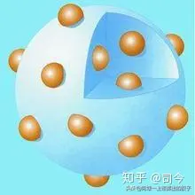

  

汤姆逊受开尔文的“实心带电球原子模型”的启发，结合自己已发现电子存在的事实，他提出了“葡萄干蛋糕原子模型”。

他认为，原子中均匀分布着一定数量的正电荷，并且在这个球形胶冻状的颗粒上镶嵌着一定数量的电子，但是原子作为一个整体是电中性的，其中包含的正电荷数目和负电荷数目相等的；也就是说，原子是一个均匀的阳电球，若干阴性电子在这个球体内运行。他按照迈耶尔关于浮置磁体平衡的研究证明得出，如果电子数目不超过某一限度，则这些运行电子就会构成一个稳定的环必，如果电子数目超过这一限度，则将分成两个稳定的环，以此类推至多环出现。

这样，随着电子的增多，就会形成结构上呈周期的相似性，门捷列耶夫周期表中物理性质和化学性质的重复再现，或许可以得到解释。

这个模型不仅能解释原子为什么是电中性的，电子在原子里是怎样分布的，而且还能解释阴极射线现象和金属在紫外线照射下能发出电子的现象，而且根据这个模型还能估算出原子的大小约10-8厘米，这是件了不起的事情，正由于汤姆逊模型能解释当时很多的实验事实，所以很容易被许多物理学家所接受。

1906年，汤姆孙获得了诺贝尔物理奖。

————————————

**1904年，日本物理学家长冈半太郎提出了“土星结构原子模型”。**

  

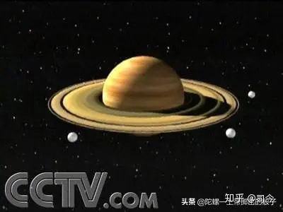

  

1903年12月5日，日本物理学家长冈半太郎在东京数学物理学会上口头发表，并于1904年分别在日、英、德的杂志上刊登了《说明线状和带状光谱及放射性现象的原子内的电子运动》的论文，他在这篇论文中批评了汤姆生的“葡萄干蛋糕原子模型”的不合理性；他认为，汤姆生的原子模型不能够让正、负电相互渗透运动，于是，他提出了一种他称之为“土星结构原子模型”，即一个大质量的带正电的球，外围有一圈等间隔分布着的电子以同样的角速度做圆周运动；而且电子的径向振动能够发射线光谱，垂直于环面的振动则发射带光谱，环上的电子飞出的是β射线，中心球的正电粒子飞出的是α射线。

这个模型比后来英国物理学家卢瑟福在1911年提出的"原子行星模型"整整早了7年，但值得一提的是：7年以后，卢瑟福公布了他那著名的“太阳系原子模型”，其核心思想与长冈半太郎的却极为相似，但卢瑟福在关于他的原子模型首次报告中却对长冈半太郎只字未提。

  

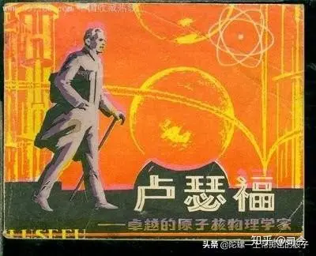

  

1911年， 卢瑟福在给长冈半太郎的信中(1911年3月20日)说，他早就知道有这么一个土星模型，"你将会看到我所采纳的原子模型结构与你在几年前的一篇论文里提到的结构有些相似。虽然那个时候我还没有查阅到你的文章，但是我记得你确实写过这方面的文章。" 也是这一年，卢瑟福在他的《哲学杂志》专论里第一次提到了长冈半太郎的早期工作。直到40年以后，在庆祝日本获得第一个诺贝尔奖的时候，长冈半太郎还很奇怪为什么在论文发表之后长达7年的时间里，卢瑟福都没有看到他关于土星模型的专论呢? 实际上，剑桥附近的许多科学家都没有对长冈半太郎模型给予重视。1911年3月11 日的信里，布拉格曾要卢瑟福查阅长冈半太郎的论文，但卢瑟福认为，这不过是一个"小日本"的工作，不值得重视，于是就忽略掉了。

  

  

从这段历史记载中可以看出，当时西方科学界对东方科学界研究成果审视中的傲慢与偏见，但日本人卧薪尝胆，终于在近十几年得到了全面“翻身”，他们连续获得十几个诺贝尔奖就是最好的反击！

————————————

**1908年，瑞士科学家里兹（Leeds）提出“磁原子模型”。**

1908年，里兹提出原子光谱的组合原理，同时也指出：从已知光谱规律来看，这些规律仅仅涉及频率v，而不涉及v2，可见电子所受作用力不是与其位移成正比，而是与其速度成正比。根据电磁理论，这种情况正好与电荷在电磁场中运动的情况相当。由此他提出一个假说，光谱线的频率决定于磁场作用力。他提出的这个方程与氢光谱的巴耳末公式完全对称。

里兹根据电磁理论，进一步推测分子磁棒是由圆柱形的电子沿轴旋转； 有趣的是，他比乌伦贝克和高斯密特的自旋电子概念还早17年！里兹还推导出了光谱的一些性质，与实验结果很符合，并由此提出了“磁原子模型”。

这个原子模型虽然在一定程度上都能解释当时的一些实验事实，但不能解释以后出现的很多新的实验结果，所以并没有得到进一步的发展。

————————————

**1911年，卢瑟福提出了“太阳系模型”（又称“有核原子模型”）。**

  

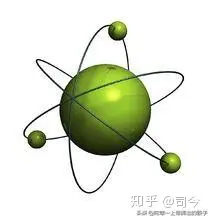

  

1910年，卢瑟福在让他的助手马斯登做用α粒子去轰击金箔的实验中发现，利用汤姆逊原子模型不能解释α粒子散射，卢瑟福经过仔细的计算和比较，发现只有假设正电荷都集中在一个很小的区域内，α粒子穿过单个原子时，才有可能发生大角度的散射。也就是说，原子的正电荷必须集中在原子中心的一个很小的核内。

  

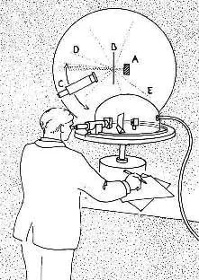

  

在这个假设的基础上，卢瑟福提出的原子模型像一个太阳系，带正电的原子核像太阳，带负电的电子像绕着太阳转的行星。在这个“太阳系”，支配它们之间的作用力是电磁相互作用力。他解释说，原子中带正电的物质集中在一个很小的核心上，而且原子质量的绝大部分也集中在这个很小的核心上。当α粒子正对着原子核心射来时，就有可能被反弹回去。这就圆满地解释了α粒子的大角度散射。卢瑟福发表了一篇著名的论文《物质对α和β粒子的散射及原理结构》。

  

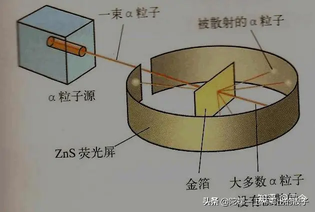

  

卢瑟福的理论开拓了研究原子结构的新途径，为原子科学的发展立下了不朽的功勋。然而，在当时很长的一段时间内，卢瑟福的理论遭到物理学家们的冷遇。卢瑟福原子模型存在的致命弱点是正负电荷之间的电场力无法满足稳定性的要求，即无法解释电子是如何稳定地待在核外。1904年长岗半太郎提出的土星模型就是因为无法克服稳定性的困难而未获成功。

  

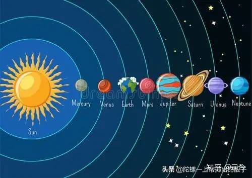

  

因此，当卢瑟福又提出有核原子模型时，很多科学家都把它看作是一种猜想，或者是形形色色的模型中的一种而已，而忽视了卢瑟福提出模型所依据的坚实的实验基础。

卢瑟福具有非凡的洞察力，因而常常能够抓住本质作出科学的预见。同时，他又有十分严谨的科学态度，他从实验事实出发作出应该作出的结论。卢瑟福认为自己提出的模型还很不完善，有待进一步的研究和发展。他在论文的一开头就声明：“在现阶段，不必考虑所提原子的稳定性，因为显然这将取决于原子的细微结构和带电组成部分的运动。”当年他在给朋友的信中也说：“希望在一、二年内能对原子构造说出一些更明确的见解。”

1908年，卢瑟福获得了诺贝尔化学奖。

————————————

**1910年，奥地利物理学家哈斯（A.E.Haas）提出了“量子假说原子模型”。**

哈斯在研究黑体辐射时很早就注意到了量子论，他读过J.J.汤姆生专门讨论原子结构的书《电与物质》和维恩的文章；维恩在文章中提到：能量元也许“可以从原子性质中推导出来，这些论著促使哈斯运用量子公式来阐述原子结构模型，即“量子假说原子模型”。

哈斯的论文发表于1910年，他在汤姆生模型的基础上，设想电子在原子内部以振荡频率v旋转，运用普通力学公式计算原子的能量；他得出近似结果，认为hv与原子的总能量大概相等，这个结果虽然十分粗略，但却是将量子假说运用于原子结构的最初尝试。

哈斯的文章受到了洛仑兹的注意，后来，洛仑兹曾把哈斯的工作介绍到1911年的第一届索尔威会议上，引起了与会者的兴趣，大家对这个问题还进行了一番讨论。

————————————

**1912年，英国物理学家尼科尔松（J．W．Nicholson）提出了“量子化原子模型”。**

尼科尔松（J．W．Nicholson）是英国颇有名气的数学和天文物理学家，擅长于星光光谱和日冕光谱的研究。1911—1912年间，他发表了一系列关于天体光谱的论文，其中也讨论到原子模型。他认为恒星和太阳这样高温的物体，原子应具有特殊的状态，这时电子的能量会高到电子环的半径远大于原子的半径。他认为对这种状态卢瑟福的有核模型和汤姆生的实心带电球模型可看成是一致的。他假设天体中除了氢和氦以外，还有两种最简单的元素，叫 Nebulium和Protofuorine，它们的原子分别具有4e和5e的电子。这些电子组成环。他从力学原理计算系统的能量，发射能量与振动频率之间有一确定的比值，这使他想到可以把原子看成普朗克振子，即“量子化原子模型”。

他说：“由于这一类原子系统的能量的可变部分与mnα2ω2成正比 （其中m是电子质量，n是电子数，a是电子环半径，ω是振动角频率），E/频率=mnfα2ω或mnav，即等于电子绕核旋转的总角动量。所以，如果普朗克常数，像索末菲所主张的那样，有原子意义，也就意味着当电子离开或返回时，原子的角动量只能以一分立值来增减。”

这正是玻尔后来在原子理论中得到的一条重要结论，玻尔在他的第一篇论文中还特地提到尼科尔松。不过，尼科尔松只是照搬普朗克的振子概念，认为辐射的光频率就是振子的振动频率，也就是说，原子以什么频率振动，就以什么频率发射，于是不得不对光谱系的分立值武断地解释为：“一个谱系的各条谱线也许不是由同一个原子发出，而是由不同的原子，其内在的角动量由于辐射或其它原因而受到阻滞，因此与标准值相差某些分立值。例如，氢原子就可能有好几类，这几类的化学性质甚至重量都相等，只是内部运动不同而已。”

他这样解释分立的线光谱，当然不可能成功。

————————————

**1913年，丹麦物理学家玻尔提出了“玻尔原子模型”（轨道跃迁原子模型）。**

  

  

1913年初，玻尔任曼彻斯特大学物理学教时，在朋友的建议下，开始研究原子结构，通过对光谱学资料的考察，写出了《论原子构造和分子构造》的长篇论著，提出了量子不连续性，成功地解释了氢原子和类氢原子的结构和性质。提出了原子结构的玻尔模型。按照这一模型电子环绕原子核作轨道运动，外层轨道比内层轨道可以容纳更多的电子；较外层轨道的电子数决定了元素的化学性质。如果外层轨道的电子落入内层轨道，将释放出一个带固定能量的光子。

  

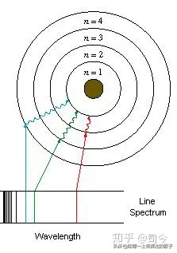

  

玻尔的原子理论给出这样的原子图像：电子在一些特定的可能轨道上绕核作圆周运动，离核愈远能量愈高；可能的轨道由电子的角动量必须是 h/2π的整数倍决定；当电子在这些可能的轨道上运动时原子不发射也不吸收能量，只有当电子从一个轨道跃迁到另一个轨道时原子才发射或吸收能量，而且发射或吸收的辐射是单频的，辐射的频率和能量之间关系由 E＝hν给出。玻尔的理论成功地说明了原子的稳定性和氢原子光谱线规律。

玻尔的理论大大扩展了量子论的影响，加速了量子论的发展。

1922年，玻尔获得了诺贝尔物理学奖。

但值得一提的是：1947年，丹麦政府为了表彰玻尔的功绩，封他为“骑象勋爵”；按照惯例，爵士徽章上应镌刻授奖人的族徽，于是玻尔亲自设计了自己的族徽，并且采用了太极图的元素，还在族徽上方刻下一句拉丁文箴言：Contraria Sunt Complementa（对立即互补），由此可见，玻尔对太极图的认同和重视程度，可见一斑。

  

  

那么，玻尔为什么会想到用中国的太极图元素来设计他的“骑象勋爵”呢？原来，1937年，玻尔收到中国理论物理学家周培源的邀请来到中国访问和讲学，据说当时的玻尔想看京剧，周培源就陪玻尔看了《封神演义》；当玻尔看到姜子牙出示号令，指挥天下英豪及各路神仙时，打出一面带有太极图的令旗，顿时指着上面的太极图大加赞叹，自称他的基本粒子原理、波粒二象性等原理均可用太极图作为基本模式来阐释。

  

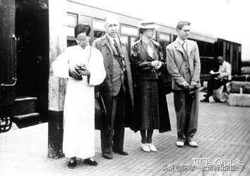

  

太极图被称为“中华第一图”，其形状如阴阳两鱼互纠在一起，两条阴阳鱼又各有一个对方的小点，形象表达了对立又互补的阴阳理论，可以说和玻尔的互补理论非常相似了。

提起阴阳理论、太极图，国人们普遍觉得它是一种玄幻、飘渺的东西，没啥实际用处，甚至会把它和封建迷信划等号，大家更愿意相信科学。

  

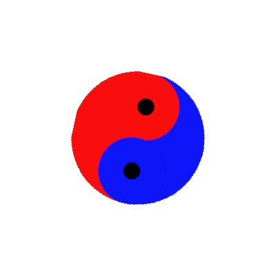

  

然而当人们不断钻研、探索，想要跳出封建迷信的禁锢，却发现当科学发展到了至高至深的地方，居然又回到了阴阳理论，这个祖先们早在几千年前就已经悟出了的真理。

1922年，玻尔获得了诺贝尔物理学奖。

————————————

**1916年，德国物理学家索末菲（Arnold Sommerfeld）提出了“索末菲椭圆轨道原子模型”。**

  

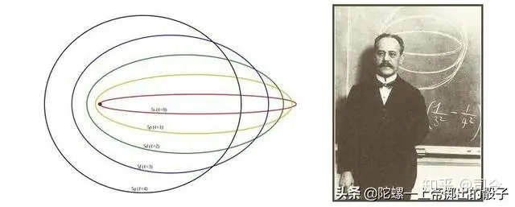

  

1906年起，索末菲任慕尼黑大学理论物理学教授，他在慕尼黑大学工作期间做了最重要的研究工作，提出用椭圆轨道代替玻尔原子的圆轨道，引入轨道的空间量子化等概念，成功地解释了氢原子光谱和重元素 X 射线谱的精细结构以及正常塞曼效应等。

  

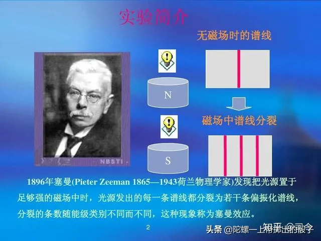

  

索末菲认为，玻尔的原子理论仅考虑氢原子中电子绕核作圆轨道运动，没有考虑电子绕核做椭圆轨道运动的情况；他认为，平面椭圆轨道应有两个自由度，需要两个量子化条件，空间椭圆轨道则需要3个量子化条件；索末菲推广了玻尔的量子化条件，得出氢原子系统的能量是量子化的，仍由主量子数n确定，与玻尔理论结果相同，而氢原子的角动量由角量子数确定，相同主量子数不同椭圆轨道上的角动量不同，且是量子化的，椭圆形状也是量子化的；在三维情形下，椭圆轨道以及角动量的空间取向也是量子化的。索末菲还进而考虑电子在椭圆轨道上运动速度变化引起的相对效应，得出氢原子能级的精细结构，与实验结果相符。

  

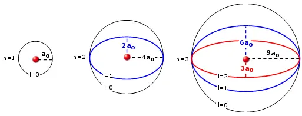

  

人们往往把索末菲的这种原子模型叫做”玻尔-索末菲原子模型“（又称”索末菲椭圆轨道模型“）。

但索末菲理论属于前期量子论，其中仍保留了电子运动轨道的概念，不同于后来发展起来的量子力学概念，而且某些结果的细节也与实际不符，这为以后薛定谔的”电子云模型“埋下了伏笔。

————————————

**1924年，美籍奥地利物理学家泡利提出了电子“不相容原子模型”。**

  

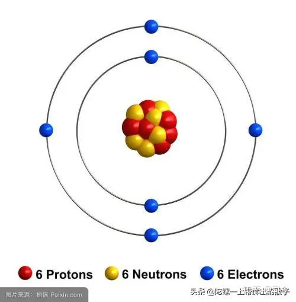

  

1924年，沃尔夫冈·泡利首先引入他称为是「双值量子自由度」，与最外壳层的电子有关。这使他可以形式化地表述泡利不相容原理，即没有两个电子可以在同一时间共享相同的量子态——这其实蕴藏了电子自旋的二重态形式。

泡利的「自由度」的物理解释最初是未知的。拉尔夫·克罗尼格是泡利的一位实验助手，于1925年初提出它是由电子的自转产生的。当泡利听到这个想法时，他予以严厉的批驳，他指出为了产生足够的角动量，电子的假想表面必须以超过光速运动，这将违反相对论；很大程度上由于泡利的批评，克罗尼格决定不发表他的想法，由此痛失电子自旋首发权，着实遗憾！

1945年， 泡利获得了诺贝尔物理学奖。

————————————

**1925年，荷兰物理学家乌伦贝克与古兹密特提出电子自旋后，由此派生了“太阳系自旋原子模型”。**

  

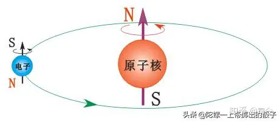

  

1925年，乌伦贝克与古兹密特受到泡利不相容原理的启发，分析原子光谱的一些实验结果，提出电子具有内禀运动--自旋，并且有与电子自旋相联系的自旋磁矩。将这种认识运用到原子模型中，于是就有了“太阳系原子模型”的新形式，即“太阳系自旋原子模型”，这一模型使泡利的“不相容原子模型”更具体化，也更接近太阳系行星运动的实际情况。

————————————

**1926年，奥地利学者薛定谔提出了原子的“电子云模型”。**

  

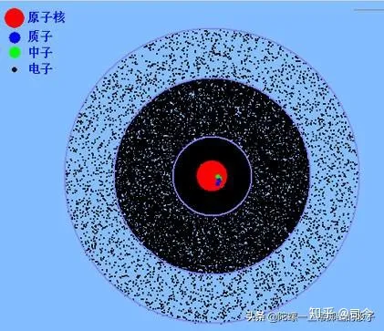

  

薛定谔在德布罗意关系式的基础上，对电子的运动做了适当的数学处理，提出了二阶偏微分的的著名的薛定谔方程式。这个方程式的解的模的平方，如果用三维坐标以图形表示的话，就是电子云，于是有了原子的“电子云模型”。

  

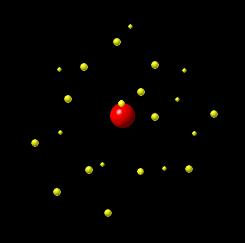

  

1933年，薛定谔获得了诺贝尔物理学奖。

  

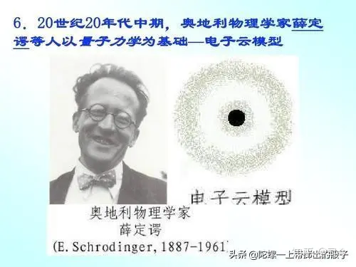

  

————————————

**1932年，英国实验物理学家B.查德威克给出的“质-中-电原子模型”。**

  

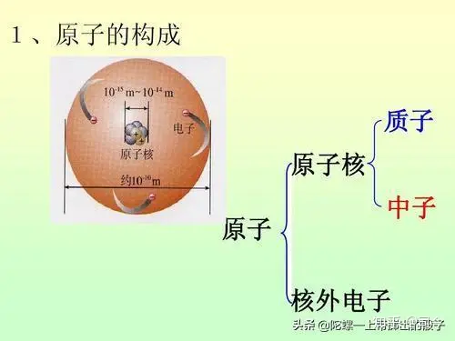

  

1932年，查德威克用a粒子轰击的实验中证实了原子核中中子的存在，于是有了“质子-中子-电子”的原子模型，这个模型极大地完善了原子有核模型的物理内涵。

  

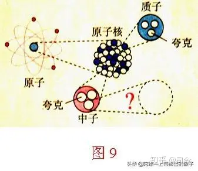

  

1935年，B.查德威获得了诺贝尔物理学奖。

————————————

至此，现代物理学的原子模型就定格在这里了：原子由电子、中子、质子组成，其中质子、中子构成原子核，电子绕原子核运动，且电子有自旋和自旋磁矩性，并在核外按能级分布，在不同的能级轨道上它们运动的空间位置呈几率态分布......

  

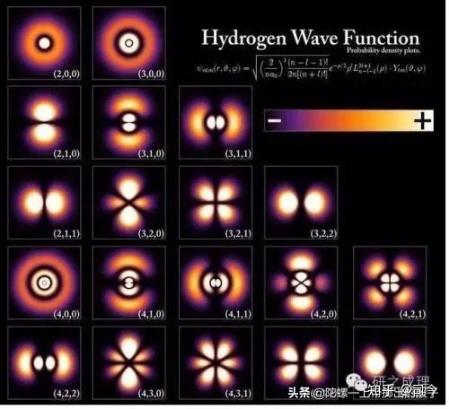

  

————————————

**总结与展望**

“原子模型”的春秋战国烟云过去了近一百年，但这场物理“硝烟”留给后人的思考与启迪却是久远和深邃的！

我们知道，微观世界是一个“看不见、摸不着”的世界，人们认识它只有靠“猜测”，至于这种“猜测”是否合理，只能依靠实验去检验和验证它了；对此，前中国科学技术大学校长朱时清院士说过：物理学已步入“禅境”，我想他所说的这个“禅境”应该是指理论物理研究中那份“猜”的情怀吧！

  

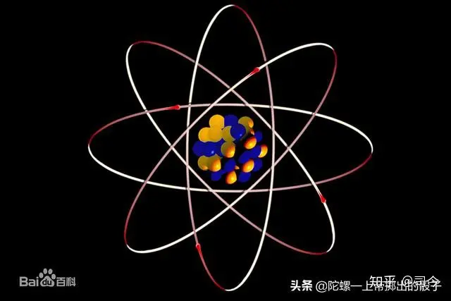

  

说实在的，在“原子模型”的探索历程中，行星结构模型出现的最多，也是比较靠谱的；至于量子力学最终定格的薛定谔“电子云模型”，我认为它是存在一定“瑕疵”的，比如电子自旋及其自旋磁矩在薛定谔“电子云模型”中就无法体现出来，原子核的自旋磁矩效应也不复存在，而且电子云（电子的运动几率）出现的物理机制还无法理清......

  

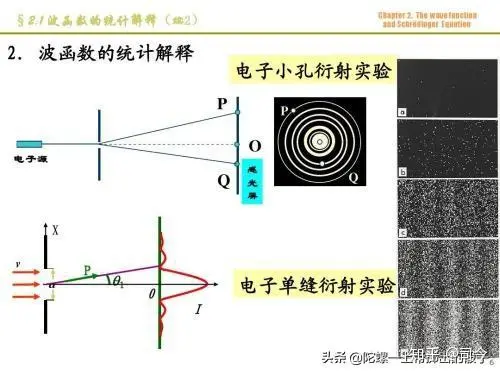

  

电子1/2自旋到底是物理真实还是量子力学规则下的“失真”描述？单缝衍射与双缝干涉中的“几率波”性分布是如何演化而来的？自然界中到底存在不存在最小粒子结构？等等，微观世界的一系列“困惑”在等待着我们去“猜测”和验证。

  

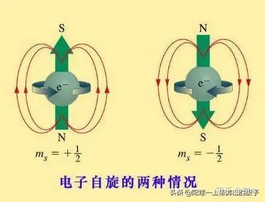

  

纵观目前的物理理论，无论是微观世界的还是宏观世界的物理理论，它们都包含了很多“猜”的成分，而且这些理论都不能“认真”地去碰它们，否则它们就会“崩塌”而碎——这就是今天我们物理理论所面临的真实困境，这种困境也将预示着下一个新的物理理论大整合时代的到来，我想，这种到来场面也不会逊色于20世纪初那场轰轰烈烈创建“原子模型”的“春秋战国”盛况吧！

  

  

————————————

主要参考文献：

1、中国科学院高能物理研究所：行星结构原子模型[http://www.ihep.cas.cn/kxcb/kpcg/gnwl/gnwl\_yzmx/201012/t20101230\_3052348.html](https://link.zhihu.com/?target=http%3A//www.ihep.cas.cn/kxcb/kpcg/gnwl/gnwl_yzmx/201012/t20101230_3052348.html)

2、原子结构\_百度百科 [https://baike.baidu.com/item/%E5%8E%9F%E5%AD%90%E7%BB%93%E6%9E%84/482307?fr=aladdin](https://link.zhihu.com/?target=https%3A//baike.baidu.com/item/%25E5%258E%259F%25E5%25AD%2590%25E7%25BB%2593%25E6%259E%2584/482307%3Ffr%3Daladdin)