# 电子自旋”趣事系列

收录自知乎 司今 磁陀螺运动 专栏：[地址](https://www.zhihu.com/column/c_170476226)

## 电子自旋超光速是如何计算的？

在量子力学发展史中，曾经发生过一桩很有趣的探索故事，那就是关于电子自旋概念引入的问题。

斯特恩—革拉赫实验证明，电子运动通过非均匀磁场时会表现出自旋与磁矩性，也就是说，运动电子像一个非常小的自旋磁陀螺；1921年，康普顿在关于X射线研究中曾萌生过这个念头，但他没有坚持自己的看法。

1925年秋，二个“无知”的物理系学生—古兹米特和乌伦贝克，受泡利不相容原理启发，将泡利电子的第四个量子数定为电子的自旋，他们写成论文交给物理学家Ehrenfest修改，Ehrenfest提醒他们：

1、如果将电子看作是带有面电荷的转动小球，那么，它产生的磁矩公式前要加一个因子2，即gs =2，这就是量子力学后来引入的郎德因子。

2、建议他们去询问一下威望极高的物理学家洛伦兹。

当二位年轻人满怀希望地找到洛伦兹后，发现：洛伦兹并不赞同电子像一个小磁陀螺一样运动的看法，因为，他通过一系列计算发现，如果电子像小磁陀螺自旋，则它的表面转动速度要比光速大很多倍，这就违反了当时公认的“光速是物质运动的极限速度”的结论。

他们只好带着沮丧返回，并急匆匆去找Ehrenfest要回论文稿，而Ehrenfest却告诉他们“我早寄出去了，你们都还年轻，允许你们干点蠢事。”

正是Ehrenfest的疏忽与宽容，才成就了电子自旋概念的横空出世。

论文发表后，自然遭到很多知名物理学者的反对，但由于电子自旋假设可以很好地从物理机制上解释斯特恩—革拉赫实验及反常塞曼效应等实验现象，最终还是被物理学界所接纳，并成为经典量子力学的重要组成部分。

我介绍这段关于电子自旋假设确立的曲折经历就是想告诉大家：回顾历史，了解电子自旋概念的来龙去脉，对深入思考、理解量子力学会很有帮助；同时也提醒挚爱科学探索的朋友们：做科学研究要有自己的观点、要坚持自己的观点，不要被“经典”束缚，更不要迷信权威！

**那么，关于电子自旋表面速度超光速，是如何计算得来的呢？**

我这里简略介绍几种计算方法，仅供大家参考：

**1、 普朗克常数法**

v是电子自旋时其表面的线速度，M为电子的质量，M=9.1×1031kg，R为电子的半径，最大不会超过1014m，取R=1014m，代入上式中，可求得：

1/2h=ωʃr2dm=2ωm r2/5,v=5h/4mr,v=1.45×1010 m/s.

**查询：**[http://wenku.baidu.com/view/342e97126edb6f1aff001f19.html]

**2、角动量法**

mvr/2=h/2π,v≈10c=3×109m/s .

**查询：**[http://wenku.baidu.com/view/c2f982244b35eefdc8d3332c.html]

**3、转动惯量法**

自旋角动量L是h/2π的数量级，也就是10^（-34），L=J(转动惯量)\*w(角速度)，电子模型为球体，J=2.5mr^2，w=v/r，所以L=2.5mrv，m数量级为10^(-31)，r数量级为10^(-16)，故v数量级为10^（13），以上均为国际单位制，可见表面速度远大于10^(8)数量级。

**查询：**[http://wenku.baidu.com/view/26a3ad0bbb68a98271fefa64.html]

**4、精细结构常数法**

L~pr~h，r=e^2/mc^2为经典电子半径，带入可知v~c/α，α=1/137为精细结构常数，也就是说v~137c

**查询：**[http://emuch.net/html/201111/3777032.html]

## 克罗尼格痛失电子自旋首发权 

克罗尼格(Ralph Kronig)是一位美国哥伦比亚大学的博士生，他早先就有了电子自旋设想，但一直未发表；1925年1月，他去德国物理学家朗德的实验室访问，但恰巧泡利也在此访问，于是克罗尼格见到就向他提起了自己的电子自旋设想。  

当泡利听到克罗尼格的想法，随即给了他一顿批判，且毫不留情面，并严厉地指出，如果电子存在自旋，那么为了产生足够的角动量，电子假想赤道表面的线速度将超过光速，这是相对论所不容许的。  

遭此当头一棒的克罗尼格，一下对自己关于电子自旋的研究失去了信心，致使克罗尼格没有敢发表他那开创性的论文。  

但半年后，两位荷兰物理学家姆尔·高斯密特(Samuel Goudsmit)与乔治·乌伦贝克发表了关于电子自旋的文章，并引起了物理学界的巨大反响。  

当克罗尼格看到这篇文章时，悔恨不已，对泡利的那盆冷水耿耿于怀，克罗尼格对电子自旋的研究，实际上要比乌仑贝克和古兹米特研究更早、更深入，但是他现在已经失去了首发权。  

克罗尼格是哥本哈根诠释的支持者，这件事很快让波尔知道了，于是波尔鼓励克罗尼格把他的研究发表出来，以至于在电子自旋史册上留下一笔，克罗尼格的论文最终于1926年4月发表在《Nature》杂志上），但此时已失去他应有的光环，实在让人遗憾！  

后来，泡利虽然接受了电子自旋观点，但他给克罗尼格造成的伤害是无法弥补的！  

通过”泡利—克罗尼格“事件，让我们看到，所谓科学权威，往往扮演着阻碍科学创新的角色；要想创新，就绝对不要迷信权威！ 

## 泡利对电子自旋研究的贡献 

在电子自旋发现史中，沃尔夫冈·泡利扮演的角色不可低估。  

1924年，沃尔夫冈·泡利首先引入了他称为是“双值量子自由度”(two-valued quantum degree of freedom)概念，它与最外壳层的电子有关，这可以使他形式化地表述“泡利不相容原理”，即没有两个电子可以在同一时间共享相同的量子态。  

但当时人们对与泡利的“双值量子自由度”物理含义是什么？答案却是未知的。  
1925年G.E.乌伦贝克和S.A.古兹密特受“泡利不相容原理”启发，分析原子光谱的一些实验结果，提出电子自旋概念，并与电子自旋磁矩相联系，由此解释了原子光谱的精细结构及反常塞曼效应 。  

泡利对电子自旋假设开始是非常反感甚至是憎恶的，就在乌伦贝克和S.A.古兹密特发表电子自旋论文的半年之前，美国哥伦比亚大学的博士生克罗尼格(Ralph Kronig)将他对电子自旋的设想告诉了泡利，当即就遭到泡利的严厉批评，这导致克罗尼格迟迟没有发表他的关于电子自旋方面的论文，因此痛失了电子自旋首发权。  

当泡利得知G.E.乌伦贝克和S.A.古兹密特发表关于电子自旋方面的论文并引起物理界轰动时，他随即发表文章对乌仑贝克和古兹米特的论文进行批判，并且他还试图说服波尔不要接受电子自旋观点，因为泡利始终认为，自旋电子就是经典世界的旋转，表面线速度超过光速是他无法接受的。  

后来，在波尔等人的反复沟通下，泡利最终还是接受了电子自旋概念；他在1926年3月12日给波尔的回信中写道："我现在别无选择，只能无条件接受，……我深深地表示抱歉，因为我自己的愚蠢，给您添加了麻烦……"。  

再后来，泡利不但接受了自旋概念，还提出了关于电子自旋描述的“泡利矩阵”，并于1945年因提出的“泡利不相容原理”而获得物理学诺贝尔奖。  

从泡利对待电子自旋问题上可以看出，泡利在其中所扮演的角色无可替代，因G.E.乌伦贝克和S.A.古兹密特发表的电子自旋论文就是受到他的“泡利不相容原理”启发而来的，但其中也充满戏剧性；泡利从反对到拥护，并建立泡利矩阵来完善非相对论的电子自旋理论都起到了画龙点睛的作用！  

从中我们也可以看出，老一辈科学们的胸怀和担当是值得后人学习和敬仰的；同时也说明，科学没有权威，只有真理才是权威，才会永放光芒！  

## 只劣质香烟成就斯特恩-格拉赫实验成功

斯特恩–革拉赫实验是原子物理学和量子力学的基础实验之一，也是近代物理学史上最有价值的实验之一，它不仅首次证实原子在磁场中取向量子化，即原子角动量量子化的分布性，而且也是直接证明了电子自旋及其自旋磁矩存在的关键性实验之一。  

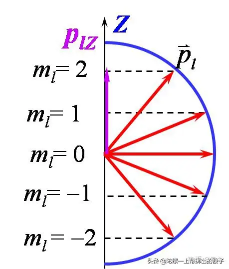

  
这个实验最初构想是建立在拉莫尔进动经典理论和玻尔 -索末菲旧量子理论相结合的基础上，但是实验结果却为新量子理论的发展提供了理论引导—肯定了物理世界从经典理论向量子理论发展的正确性。  

对斯特恩来说，导致斯特恩-盖拉赫实验的最直接的原因是玻尔模型中空间量子化的一个尚未观察到的性质，即玻尔模型要求氢原子气体应该是双折射的，因为电子在垂直于场方向的平面内有转动。 

他认识到，根据玻尔模型空间量子化应该只是两重的，因为轨道角动量的投影被限定为hˆ，这个两重的特征使得利用原子束的磁偏转来验证空间量子化成为可能。尽管原子束的速度分布会使模糊条纹，但在足够大的磁场梯度下，两个取向相反分量的劈裂会大于原子束的宽度。与此相对照, 经典力学预言原子磁体虽然会在磁场中进动但仍然保持随机取向，因此磁偏转会导致束的加宽但不会劈裂。因此，斯特恩认为他预想中的实验"如果成功的话，将毫不置疑地在量子理论和经典观点之间作出抉择。  

1920年斯特恩就曾用银原子束作实验证明了麦克斯韦速率统计的正确性，他由此设想，如果再用银原子束通过磁场空间作实验，能不能看到空间量子化存在现象呢？  

第二天早上，他醒来挺早，但那天实在太冷，所以他就"躺在床上思考，有了做这个实验的想法。"  

于是，斯特恩急忙起床，赶到玻恩那里，将他的实验设想告诉了玻恩，但却被玻恩当头浇了一盆冷水；玻恩在其自傳里写到："很长一段时间后我才认真考虑那个主意。我始终认为空间量子化（阿诺德·索末菲提出的）只是一种对你根本不明白的某个事物的形式表达。但要象斯特恩那样逐字逐句地琢磨，这可是他的主意。我试图说服斯特恩那里面（指空间量子化）没什么意义，但他告诉我说值得一试。"  

也许是天意吧，年轻的斯特恩的实验激情并没有被玻恩的那盆冷水所浇灭，他最终还是静下心来坚持做他的实验。  
很幸运的是，斯特恩发现盖拉赫急切想加入他的行动—盖拉赫那时还不知道什么是空间量子化。  

尽管斯特恩做了精心的设计和可行性计算，实验还是花了一年多的时间才完成。在最终定型的设备中，一束银原子束（由在炉子中加热到1000摄氏度得到的金属蒸汽通过喷流过程形成的）用两个0.03毫米宽的狭缝准直后导入3.5厘米长的偏转磁场内，磁场强度约为.1 Tesla，梯度为10 Tesla/cm。所实现的银原子束的劈裂仅为0.2毫米。相应的，准直狭缝或磁铁多于0.01毫米的偏差都可能使实验的努力付诸东流。设备的使用寿命只有几个小时。所以，最后收集板上得到的银的镀层非常薄，肉眼根本看不见。斯特恩这样描述早先的一段插曲：给真空系统充气后，盖拉赫卸掉了用于收集银原子束的法兰。但是，他连一点银镀层的痕迹都看不到，就把法兰递给了我。我凑近法兰仔细观察，盖拉赫就站在我身后。奇怪的是，束斑的痕迹渐渐显现出来。后来我们知道是怎么回事了。我那时相当于一个助教，收入不多，抽不起好烟，净抽劣质烟卷。劣质烟含硫，我呼出的气息慢慢地把收集板上的银变成了黑色的硫化银所以就可见了。这就象是冲洗相片。  

与此同时，斯特恩当上了罗斯托克大学的理论物理教授。1922年初，他和盖拉赫约定在哥廷根会面, 评估当时实验的形势并决定放弃。可是，一场铁路罢工拖延了盖拉赫回法兰克福的形成, 他又有了一整天来检查所有的实验细节。他决定继续下去，改进装置后，不久就清楚的观察到原子束分裂成两束。盖拉赫给斯特恩发了一封简短的电报"玻尔是对的。"斯特恩回忆说他当时的惊讶和激动是无法形容的。盖拉赫也给玻尔发了一封印有原子束分裂照片和贺词的明信片。 

通过改进实验和仔细分析，斯特恩和盖拉赫甚至能够确定银原子的磁矩正是一个玻尔磁子，误差为10%。这一对空间量子化的直观演示迅速被接受为量子理论具有说服力的证据。但是，这一发现却是一把双刃剑。爱因思坦和爱伦菲斯特以及其他人努力想弄明白原子磁体是如何在外场中采取一定的预置的取向的。因为原子和外场的相互作用能是取向的函数，束流中的原子低密度不足以引起能量交换，则依随机取向进入磁场的原子是如何发生分裂的问题依然悬而未决。类似的，磁双折射的缺失变成了一个更加难解的谜。盖拉赫1922年到罗斯托克后曾在钠蒸汽里观察磁双折射，和其他人一样，他的努力全白费了。  

这些难题，还有其它的比如反常塞曼效应之类的难题，要等到多年后量子力学发展到加进了电子自旋理论才得以解决。量子力学的发展让玻尔模型显得过时，但却增加了空间量子化的内涵和重要性。斯特恩-盖拉赫实验与旧理论的皆大欢喜的相符不过是个幸运的巧合。银原子的轨道角动量实际上是零, 而不是玻尔模型所假定的h/2π。其磁矩源自大小为h/4π的电子自旋角动量，因此在磁场中分裂成两束。因为其托马斯(Thomas)因子是2（这一点是1926年才弄清楚的），所以银原子的磁矩大约是一个玻尔磁子。大自然就是这样表演了一出造化弄人的把戏。  

还有一个不寻常的历史之谜尚未揭开。考虑到斯特恩-盖拉赫实验1922年引起的广泛兴趣，则在自旋理论1925年被提出后应该很快会用自旋的概念重新加以解释。实际情形是，直到1927年弗莱塞(Fraser)发现银、氢和钠原子的轨道角动量为零，斯特恩-盖拉赫实验才被归因于自旋。现今的课本都说斯特恩-盖拉赫实验验证了电子自旋, 但却未指出两位勇敢的科学家根本就不知道他们发现的是自旋。  

如果说斯特恩 -盖拉赫实验原理是建立在拉莫尔理论和旧量子理论的基础上，是对经典力学的否定，是量子力学的理论引导；那么塞曼效应与反常塞曼效应则应该是量子力学的事实体现；反常塞曼效应不断鞭策着斯特恩 -盖拉赫实验结果逐渐趋于正确的理论解释；塞曼效应及反常塞曼效应和斯特恩- 盖拉赫实验均是电子自旋实际存在的直接证据。  

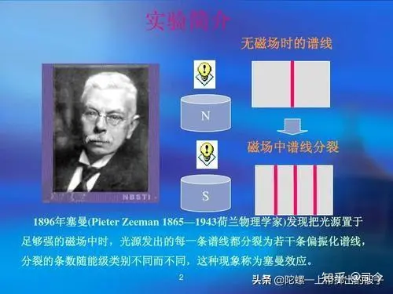

斯特恩本是想通过用“斯特恩 -盖拉赫实验”来验证玻尔- 索末菲理论经典量子力学理论的，但却误打误撞地证明了角动量空间取向量子化，而且也深刻揭示了电子自旋及自旋磁矩的存在；自此实验成功后，角动量空间取向量子化的取代了空洞的经典空间量子化概念，同时也给电子自旋假设提供了实验验证，量子论也从玻尔的经典时代迈向了薛定谔与狄拉克的新量子时代。  

斯特恩—格拉赫实验这段曲折故事告诉我们，基础物理学研究要甘于做“冷板凳”，要有坚韧不拔的品质，同时意外碰巧的正确组合往往也是一个很重要的因素。  

由此，我有时会想，物理学的很多成功或许是天意，牛顿的苹果、赫兹的电火花、普朗克的“内插法”等等，无不是“天赐良机”；我甚至更觉得，现代物理学的停滞与困境又何尝不可以视作是下一次物理学革命开启的“天意”之楔呢？ 

## 电子1/2自旋是如何得来的？ 

电子自旋概念的出现是经典量子力学与现代量子力学的分水岭，其重要意义不言而喻，但它也是现代量子力学最难理解和最难想象的概念之一。

在经典物理学中，自旋本是一个很好理解的物理概念，就是物体绕自身对此轴产生旋转的运动现象；如陀螺旋转、行星自旋等，这些都是能够看得见摸得着的实体运动；但在量子力学中，对电子自旋描述却出现了“玄而又玄”的描述：

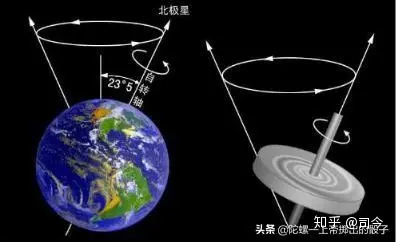

现代量子力学认为，自旋是电子的基本性质之一，就像电子的质量、电荷等物理量一样，也是描述微观粒子固有属性的物理量，它是电子内禀运动或电子内禀运动量子数的简称，是由粒子内禀角动量引起的内禀运动现象。

因此，对电子的自旋不能用经典力学中的自旋去理解，因为经典概念中的自转是物体对于其质心的旋转，比如地球每日的自转是顺着一个通过地心的极轴所作的转动，但现代物理学对电子半径及形状还没有定论，而且，如果把电子自旋看成绕轴的旋转，依据电子经典半径值去计算，则它的面速度会超光速二个数量级，这就违反了爱因斯坦光速最大原理。

按量子力学原理和相关实验推断：

1、电子自旋为1/2自旋，即它须旋转2圈才会回到原来的状态，因而定义电子自旋为1/2的粒子。

2、电子自旋有磁偶极矩，这就如同经典电动力学中转动的带电物体，这个磁矩可以通过多种实验手段观察，例如，在施特恩-格拉赫实验中由于银原子受到不均匀磁场的影响而产生偏转，从而推断出电子有自旋和磁矩，且为1/2自旋。

一个电子，电量为q，质量为m，自旋角动量为S，则其内禀自旋磁矩μs为μs=g.eS/2m，其中g为无量纲量，称朗得因子，且g=2。

3、电子自旋只能处于两种自旋态，即上旋或下旋。

**那么，电子1/2自旋是如何推理出来的呢？**

我们知道，波尔经典量子力学在描述电子在外磁场中运动是有主次顺序的，即先确定电子在核外运动的能级轨道数：n（n∈﹛1、2、3….﹜；再定义出电子在此能级轨道上运动的角动量l，且l=n-1，即l∈﹛0、1、2、3….﹜；由于角动量是个矢量，它有方向性，因此外磁场方向就会产生一个投影分量，即Lm，用它可以描述轨道角动量在空间中的位置方向，角动量从本质上讲就是电子轨道磁矩ml，因此我们可以用ml在外磁场方向的投影分量来取得Lm，由于角动量有顺逆旋转的对称性，因此就有ml=2n+1种存在可能，即ml∈﹛0、±1、±2、±3….﹜。

在施特恩-格拉赫实验中，银原子束通过施特恩-格拉赫磁场空间后分成上下二种角动量轨道运动形式，依据量子力学角动量轨道量子数简并理论，则有L=2l+1=2，那么，银原子通过该磁场空间时的轨道角动量就是l=1/2，但量子力学明明规定轨道角动量l∈﹛0、1、2、3……﹜的正整数，因此，用经典量子理论中的轨道角动量就没有办法解释这一现象的出现。

那么，究竟是什么因素造成银原子束分裂成上下二条线呢？

于是，人们想到了银原子核外的轨道电子，电子难道有自旋和自旋磁矩存在吗？假如电子有自旋和自旋磁矩存在，那么银原子通过斯特恩-格拉赫磁场空间时出现的轨道L=2的现象就应该是由它引起的。

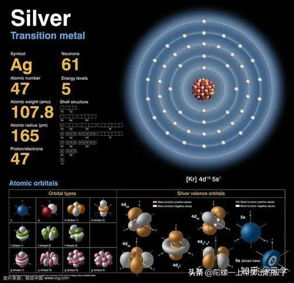

我们知道，银原子核外只有一个未成对电子，因此，能够使银原子束产生分裂的因素只有这一个电子的自旋磁矩在起作用，因为其他电子在银原子核外都是成对的，它们的自旋磁矩与轨道磁矩的矢量和应该为0。

如果真是这个未成对电子引起银原子束分裂成二条，那么，这个电子的自旋角动量那就只能是ls=1/2，这样才能符合L=2，即L=2×ls+1=2，其中ls=1/2是电子的自旋角动量。

但这里还存在一个问题：

若按电子轨道的玻尔磁矩μl=﹣el/2me计算它的磁矩，就应是μs=μB/2，但实体恩-格拉赫实验表明，银原子的裂矩为1μB（玻尔磁矩），，因此还不得不承认，对电子的自旋自由度而言，磁矩与角动量之比大一倍，即用s代表电子的自旋角动量，μs代表电子的自旋磁矩，则有μs=﹣2μB.s/hˆ.

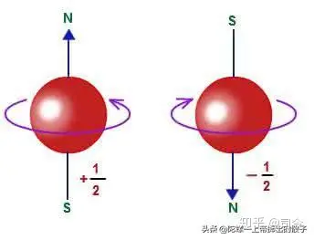

那么，我们该如何解读电子ls=1/2这种自旋状态呢？

量子力学给出的答案是：

电子存在1/2自旋形式，即电子自旋720°才能算旋转一周，对此，这样的自旋形态在宏观自然界还真的没有见过，于是，量子力学就说：电子自旋是电子的“内禀”属性，它与自然界中的地球自旋形式不同，是一种量子效应的自旋！

由此可见，电子自旋与自旋磁矩不是由什么物理理论推理出来的，而是类比电子的轨道磁矩而人为规定出来的，这种规定由于受到电子轨道磁矩影响才会提出1/2自旋概念；也就是说，电子1/2自旋概念是顺应量子力学原理而给出的结论，而在宏观自然界中，不按量子力学理论推算或观测到的物体根本就不可能存在1/2自旋形态，真实情况也确实如此！

## 电子自旋是怎样在狄拉克方程中显现出来的？ 

电子自旋概念是为了解释斯特恩=格拉赫实验、塞曼效应、反常塞曼效应等物理实验现象而人为引入的概念，它的得来没有一定的物理原理或方程给予支持，如量子力学的支柱方程——薛定谔方程就不包含自旋要素。

在量子力学飞速发展的那个年代，年轻的A.M.狄拉克受克莱因-戈登方程及薛定谔方程的启发，于1928年提出电子的相对论波动方程，即狄拉克方程，在这个方程中就闪现出了电子自旋和自旋磁矩的踪影（这说明它对电子自旋的来源描述还是不太清晰），这是量子力学又一里程碑的成就。

那么，狄拉克方程是怎么得来的？它又是如何体现出电子自旋存在的呢？

我这里不妨引述一下赵凯华老师编写的《量子力学》里的内容：

以自由运动电子为例，非相对论中的动能与动量的关系是E=m²v²/2m=p²/2m.

将动量写作三维空间分量的形式来描述就是

E=（px²+py²+pz²）/2m.

将其中的动能与动量换算成算符描述就是

E=ih′ə/dt，px=﹣ih′ə/dx，py=﹣ih′ə/dy，pz=﹣ih′ə/dz.

将它运用到波函数ψ上就得出自由电子运动的薛定谔方程，即

ih′əψ/dt=﹣h′²/2m×(ə²/dx²+ə²/dy²+ə²/dz²)ψ.

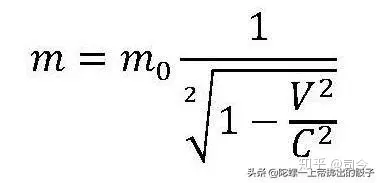

在爱因斯坦相对论中，动能与动量的关系是

E²=p²c²+mc²c²=c²\[(px²+py²+pz²)+mc²\].

如果我们将E=ih′ə/dt，px=﹣ih′ə/dx，py=﹣ih′ə/dy，pz=﹣ih′ə/dz运用到这个方程中，就会得出

h′²ə²ψ/dt²=c²\[h′²(ə²/dx²+ə²/dy²+ə²/dz²﹣mc²)\]ψ.

这个方程是包含时间t的二阶偏导，决定未来波函数ψ演化的初始条件中，除给出ψ(t=0)外，还需给出其一阶时间导数（əψ/dt）t=0来。可以证明，此方程无法保证概率密度恒正，这是物理上不能接受的。

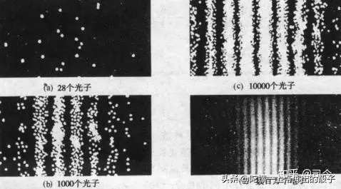

于是，狄拉克想到了将E²=c²\[(px²+py²+pz²)+mc²\]中的(px²+py²+pz²)+mc²项看作是一种全平方的形式，即

令(px²+py²+pz²)+mc²=（αx•px+αy•py+αz•pz+β）²，则有αi=1,αi•αj+αj•αi=0,β²=m²c²,αi•β+β•αi=0.

显然，服从乘法交换律的普通系数是不能满足以上方程式的；那么，为什么它们不是矩阵呢？正是沿着这一思路，狄拉克终于得出了相对论性的电子自由运动的波动运动，即

(ə/cdt+αx•ə/dx+αy•ə/dy+αz•ə/dz+imc/h＇•β)•ψ=0.

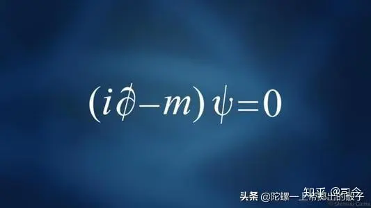

这个方程的波函数ψ是具有四个分量的列矩阵，即ψ=〔ψ1，ψ2，ψ3，ψ4〕，这四个分量的物理意义是：ψ1和ψ2是正能量的本征值，ψ3与ψ4是负能量的本征值；此外，ψ1和ψ2分别代表电子自旋z分量等于±1/2的本征态，ψ3与ψ4也是如此；而且，从这个方程还可以导出电子的自旋量子数为1/2，电子自旋磁矩与自旋角动量之比的朗德g因子为轨道角动量情形时朗德g因子的2倍等，并从中预言了正电子的存在。

纵观狄拉克方程的推理过程可以看出，狄拉克的“神笔”不但刻画出了电子1/2自旋，而且还勾勒出了一个与电子相孪生兄弟一样的正电子来。

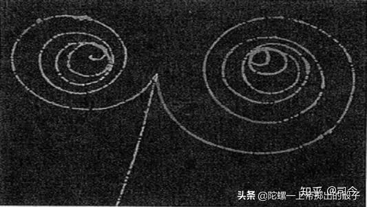

虽然狄拉克方程对电子自旋的描述不够具体和明显，但也总算为电子自旋从唯象假设到理论演变找到了一条道路；同时，我们也可以看出，狄拉克的电子自旋是建立在电子运动中其总动量（角动量）守恒下的一种相对论效应；也就是说，对电子运动动量的描述要包括其平动动量与自旋动量二个方面，其中自旋动量可以产生自旋磁矩。

由此，我们可以结合宏观刚体平面平行运动中的动量描述，即P=mv平+mv自，其中“mv平”就是自旋刚体的平动动量，“mv自”就是自旋刚体的自旋动量，这个总动量在运动中是守恒的。

如果以此去审视狄拉克方程，其描述的物理精髓不也正是刚体平面平行运动中总动量（角动量）守恒的微观体现吗？

而我致力思考的“自旋场理论”，也正是想从这种守恒中寻找出宏观与微观的差异与统一，但愿今生能够完成她！

## 自旋磁矩给物理学带来的光明与黑暗

线圈磁矩

磁矩，本是经典电磁学用于描述通电线圈在均匀外磁场中产生转动能力大小的物理量，量子力学为了解释施特恩-格拉赫实验也引入了磁矩概念，并将这种概念分列为二种：1、轨道磁矩，2、自旋磁矩。

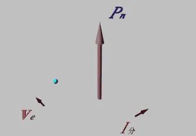

电子轨道磁矩

量子力学轨道磁矩本质是经典电磁学中安培分子电流观点的翻版，这种思路与圆圈导线通电会产生磁场的思想是一致的。

原子核自旋磁矩

对于自旋磁矩如何产生的？量子力学没有过多的理论论述，只是强行规定为粒子自旋所固有的一种物理属性，它同粒子质量、电荷属性一样，是与生俱来的的，即具有内禀性；并通过“量子力学法则”将它们分为0、1、2、1/2、2/3等多种自旋形态，这是量子力学理论中的一个硬伤！

电子自旋磁矩

但不管怎么说，自旋磁矩是一个被现代物理实验所证实存在的物理量，它不仅成功地解释了塞曼效应、反常塞曼效应及施特恩-格拉赫实验等问题，还像一个“物理小天使”，给量子力学后来的完善、发展与应用带来了一片光明！

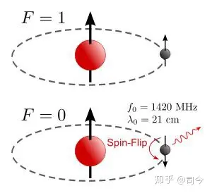

轨道磁矩

后来的原子理论，超导理论、核磁共振、手机定位、数据储存等无不展现出自旋磁矩的风采，方兴未艾的自旋电子学、纳米材料学等正将自旋磁矩的威力引向更光明的未来！

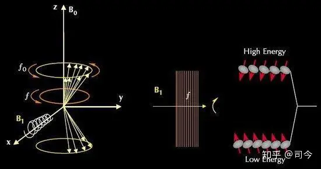

自旋磁粒子与核磁共振

可以这么说，粒子自旋磁矩的发现与证实，不仅是一场微观物理学革命，也是物理学发展史中的一个伟大发现，它的发现同牛顿质量引力、库伦电、磁荷引力一样伟大，但因磁与电有说不清道不明的纠葛，故这种发现科学价值被世人低估了。

氢原子核自旋磁矩

其实，自旋磁矩发现的意义是远远超过万有引力、库伦定理的，因为它从本质上揭示了场的起源与运动的关系，同时也将星空与微观世界更紧密地结合到了一起，量子力学的一些法则在星空中也可以使用，因为行星与粒子都有自旋磁矩性，它比以前的二种力学理论对宏观与微观的真实性描述会更准确些！

地球自旋磁矩

不过，我们在享受自旋磁矩给现代物理学带来光明与温暖的同时，也应看到现代物理学家们的努力与失败，欢心与沮丧，特别是对自旋磁矩产生原因的诠解上至今没有一个满意答案；从物理理论的继承性方面来说，自旋磁矩确实给目前的物理学带来了黑暗！

电子自旋磁矩

为什么这么说？下面我们以电子自旋磁矩为例来说明目前物理学所面临的窘境：

1、如果说电子是一个有空间大小的粒子，依据磁矩同安培分子电流观点相一致的原理，则电子内部就应该有比电子更小的带电粒子组成，它们在电子体空间内绕中心点旋转才会产生电子自旋磁矩，但目前物理学实验证明并没有发现电子有内部组成结构的迹象，而且现代物理学也没有能够真正测量到电子半径到底有多大？据李政道教授的实验估算，电子半径应在10^-22m以下，甚至他还倾向认为电子是一个点粒子（没有空间大小的粒子点）。

安培分子电流理论

2、如果我们将电子看作是一个点粒子，依据安培分子电流观点定义出来的磁矩就没有办法描述自旋磁矩产生的物理机制问题。

粒子的自旋磁矩到底是该描述成点自旋还是体自旋？这不仅引发了一场物理学革命，同时也会引发一场数学革命，李群代数的出现正是这个结果，但物理学方面到现在还没有取得实质性的突破！

飞向量子力学的小天使

面对电子自旋磁矩给目前物理学带来的难题与尴尬，我们不得不承认，自旋磁矩是一个“双面天使”，它给微观物理学带来光明的同时，也带来了乌云！

黑暗也是下一个黎明到来的前哨，对自旋磁矩起源问题，我们是不是可以换个角度去作尝试思考：

黎明曙光

1、可能电子半径极小，只是目前我们现代的实验条件测不出来罢了，宇宙中有比电子更小的带电粒子存在——这是一种比较“得人心”的解释，但由此也给物理学曾经否定的以太论点燃了希望之火。

2、既然安培分子电流观点对描述电子自旋磁矩无效，那么会不会还存在另一种自旋生磁规律没有被我们发现呢？

以上思考到底哪一种方向将是可行的？我们拭目以待吧！

### 【附录】：自旋磁矩

自旋磁矩，是指材料内部电子的循轨运动和自旋运动都可以看作是一个闭合的环形电流，因而必然产生磁矩，电子自旋运动产生的磁矩称为自旋磁矩。 

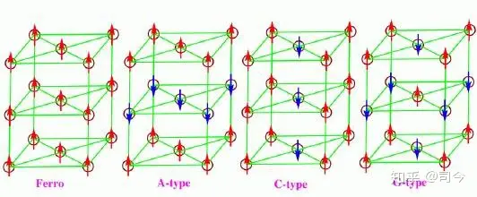

材料中的自旋粒子

自旋是基本粒子或原子核的固有角动量，它与轨道角动量不同，即使粒子处于静止时也存在。任何粒子的自旋在空间中的方向也不是任意的，它在空间一个确定方向(如磁场方向)上的投影，必须是h/2π(h为普朗克常数)的整数或半整数倍。

水和空气在稳定状态下，由于地磁场的同极磁化作用，分子的自旋磁矩不能够冲破首尾相连的分子链。稳定状态或直线运动状态一旦破坏，分子链荡然无存。

**概念介绍**

水和空气在稳定状态下，由于地磁场的同极磁化作用，分子的自旋磁矩不能够冲破首尾相连的分子链。稳定状态或直线运动状态一旦破坏，分子链荡然无存。

根据能量守恒与物质不灭原则，旋风和台风并不是无缘无故的正常维持，它即有内因又有外因，内因是斥磁性物质分子内部电子轨迹不闭合，近似的电流环每旋转一周，电流环近似平面与地磁场方向垂直一次，切割一次地磁场磁力线，产生分子的自旋磁矩，这即是分子的自旋电动势。外因是有初始旋转速度和初始能量，依靠分子的自旋电动势，切割磁力线，消耗磁场物质产生能量并输出能量，维持台风或旋风的正常旋转。

龙卷风

实际上，斥磁性物质就如同一台上满发条的摆钟，要想使其走动，只需轻轻一推，摆钟即可正常走动，越摆越大，直到幅度最大为止。有学者认为人造台风只需将旋转风的风力加强到十级或略高，即可自动加强到最大风力，形成台风。

**磁矩**

磁矩是描述载流线圈或微观粒子磁性的物理量。平面载流线圈的磁矩定义为m=iSn式中i电流强度；S为线圈面积；n为与电流方向成右手螺旋关系的单位矢量。在均匀外磁场中，平面载流线圈所受合力为零而所受力矩不为零，该力矩使线圈的磁矩m转向外磁场B的方向；在均匀径向分布外磁场中，平面载流线圈受力矩偏转。许多电机和电学仪表的工作原理即基于此。

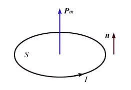

轨道磁矩

**定义**

在原子中，电子因绕原子核运动而具有轨道磁矩；电子因自旋具有自旋磁矩；原子核、质子、中子以及其他基本粒子也都具有各自的自旋磁矩。这些对研究原子能级的精细结构，磁场中的塞曼效应以及磁共振等有重要意义，也表明各种基本粒子具有复杂的结构。

分子的磁矩就是电子轨道磁矩以及电子和核的自旋磁矩构成的(μ=μs+μl=gsps+glpl)，磁介质的磁化就是外磁场对分子磁矩作用的结果。

古地球磁矩的变化

粒子的内禀属性。每种粒子都有确定的内禀磁矩。自旋为s的点粒子的磁矩μ由μ=g(e/2m)p给出，式中e和m分别是该粒子的电荷和质量，g是一个数值因子，p为自旋角动量。自旋为零的粒子磁矩为零。自旋为1/2的粒子，g=2；自旋为1的粒子，g=1；自旋为3/2的粒子，g=2/3。理论上普遍给出g=1/s。

1/2自旋粒子

粒子磁矩可通过实验测定。但实验测定结果并不与此相符，其间差别称为反常磁矩。对于自旋均为1/2的电子、μ子、质子和中子，精确测定其g因子分别为

电子 gl2=1.001159652193（10）

μ子 gl2=1.001165923（8）

质子 gl2=2.792847386（63）

中子 gl2=－1.91304275（45）

粒子反常磁矩的来源有二：一是量子电动力学的辐射修正，电子、μ子属于这种情形，即使是点粒子，粒子产生的电磁场对其自身的作用导致自旋磁矩的微小变化，这一改变可以严格地用量子电动力学精确计算，结果与实验测定符合得很好；另一是由于粒子有内部结构和强相互作用的影响，质子和中子属于这种情形，质子和中子的反常磁矩用于分析其内部结构。 

**各类磁矩**

**载流回路磁矩**

在一个载流回路中，磁矩大小是电流乘以回路面积：u=I\*S；其中，u为磁矩，I 为电流，S 为面积。

磁矩方向则为电流绕行方向右手定则所决定的方向。

载流回路在磁场中所受力矩M与磁矩的关系为：M=u×B 其中，B 为磁感应强度。

**基本粒子磁矩**

许多基本粒子(例如电子)都有内禀磁矩，这种磁矩和经典物理的磁矩不同，必须使用量子力学来解释它，

核自旋与核磁矩

核自旋与核磁矩和粒子的自旋有关。而这种内禀磁矩即是许多在宏观之下磁力的来源，许多的物理现象也和此有关。这些内禀磁矩是量子化的，也就是它有最小的基本单位，常常称为“磁子”(magneton)或磁元，例如电子自旋磁矩的矢量绝对值即和玻尔磁子成比例关系：μs=-gs.μB.s/h＇.

其中μs为电子自旋磁矩，电子自旋g因子gs是一项比例常数，μB为玻尔磁子，s为电子的自旋角动量。 

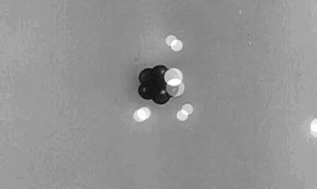

## 量子力学对电子自旋磁矩描述的困境与突破 

量子力学中的电子自旋可谓是“神来之笔”，它没有任何理论作支撑，开始仅仅是为了解释塞曼效应、斯特恩-格拉赫实验等物理现象而人为假设的概念，这一概念既没有出现在薛定谔方程中，也与所谓的“波粒二象性”没有什么关联性，其以独特的形式鹤立于量子力学中。

同时，量子力学对电子自旋及自旋磁矩的解释，着实给人们留下了诸多困惑。

量子力学认为，自旋是粒子所具有的内禀性质，由粒子内禀角动量所引起的一种固有运动，其运算规则类似于经典力学的角动量，并因此产生一个自旋磁场，即表现为自旋磁矩；也就是说，自旋是由粒子内禀角动量引起的一种运动，自旋角动量会产生磁场效应。

自旋磁矩是电子的基本性质之一，就像电子的质量、电荷等物理量一样，是描述微观粒子固有物理属性的量；但对电子的自旋不能用经典力学中的自旋去理解，因为经典概念中的自转是物体相对于其质心的旋转，比如地球自转是顺着一个通过地心的极轴所作的转动......

对此描述，我真有点头晕。

“内禀性”是什么？中文解释是“存在但并不彰显，或不为人知”，英文则把静止时不为零的量称做intrinsic量（内禀量一词的定义从英文解释就知道了,就是内在的,本质的量）,而intrinsic量的运动效应产生的量称为induced量（诱导量）。

量子力学用“内禀性”来解释电子的自旋与自旋磁矩的存在现象，就等于说电子生下来就具有这些特性，自旋、自旋磁矩同电荷、质量一样，都是用于描述电子的基本物理量，但如果你要问：电子这种奇怪的自旋运动究竟是怎么产生的？它的运作原理是什么？那对不起，不知道！如果你再问：电子自旋是如何产生的？你得到的答案也一定是不知道！而且他们还可能会规劝你：不需要刻意地去追问为什么，你只要乖乖地会计算会运用就行了。

纵观量子力学，它在承认电子具有自旋磁矩的同时又否定了电子的自转，在否定电子自转的同时又说电子存在自旋运动，即说电子自旋同时又说电子自旋不是自转；不仅如此，量子力学还认为，电子自旋为1/2自旋，即自旋了720°才算转一圈——这更让人对电子的自旋彻底地无法理解了。

可见，量子力学对自旋及自旋磁矩的“内禀性”解释只能增加人们对量子力学的神秘感，并不能为寻找粒子自旋磁性的起源带来任何裨益！

其实，熟悉量子力学的人都知道，用量子理论是根本不可能解决粒子自旋和自旋磁矩起因的，因为量子论一方面承认粒子自旋，但不承认粒子有半径大小，因为有了半径大小，其自旋就会超光速，另一方面，量子理论又用自旋角动量来描述自旋磁矩大小——这就奇怪了，角动量是一个与空间大小有关的量，即有半径大小，这与它所说的粒子是个没有空间大小的点粒子岂不矛盾？

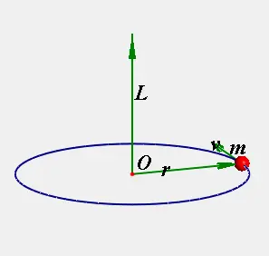

再说，量子力学计算电子自旋会超光速，那是用电子经典半径计算得出的结论，而电子真实的半径大小到现在我们还没有测量出来；量子力学以此来否定电子半径的存在应是不合理的，电子的半径可能比我们预想的要小得多。

同时，电子自旋所产生的自旋磁矩用μs=－2μBs/h来描述也是值得榷商的议题，因为电子是基本粒子，其没有内部组成结构，那它的自旋角动量s是指什么东西在绕什么旋转呢？要知道角动量是指J=mvr，这个m又是指谁的质量呢？

如果认为电子有空间大小，依据磁矩安培分子电流观点和电子轨道磁矩描述理论，则电子内部就应该有内部组成结构，即有比电子更小的带电粒子在其内部绕核或轴旋转，但目前物理学实验并没有发现电子有内部结构的迹象；如果认为它是点粒子，则就不应该用自旋角动量来定义和描述电子的自旋磁矩。

由此看来，用现有的安培分子电流观点去解释电子自旋磁矩问题是存在困难的，这一困境里包含了二种可能：

（1）、电子半径极小，我们现代实验条件测不出来，而且有比电子更小的带电粒子存在；

（2）、安培分子电流观点对描述电子自旋磁矩无效，那就应该还存在另一种自旋生磁机制，那么这个自旋生磁机制应该是什么呢？

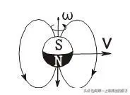

同时也说明，我们对微观世界的粒子属性及其运动效应了解得还是很少很少，其中还可能蕴藏了新的支配微观世界运动的物理原理，到我们现在还没有挖掘出来！

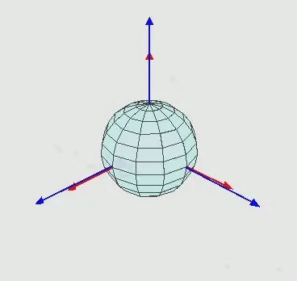

现在，首要面对的是：对粒子自旋及自旋磁矩的描述到底该看作是“点自旋”还是“体自旋”？

我相信，对这一问题的讨论不仅可能引发一场物理学的新革命，同时也可能会引发一场数学的新革命，李群代数对“点自旋”及其磁矩的描述已开了个好头，但他用坐标旋转思路最终还是没能取得实质性的突破！

对此，我的设想是：

电子电荷自旋或电子质量自旋会生磁，可以用自旋磁量qm=eω或qm=mω予以定量，这样描述出的粒子自旋磁量大小就与其旋转空间半径r大小无关了。

但这种描述究竟合不合理呢？我在思考.......

## 试用电子自旋磁矩性解释洛伦兹运动现象 

我们知道，洛伦兹力公式不是从物理理论中推导出来的，而是由多次重复实验所得的结论，它只能被当作一个基本公理来应用，因为，直到现代人们还不清楚洛伦兹运动形成的真正物理机制，更不知道洛伦兹力是一种什么力？它从何而来？......

现代量子力学告诉我们，电子有自旋和自旋磁矩性，即电子可以被看做是一个微观的自旋磁陀螺；那么，如果我们能够从宏观上找出自旋磁陀螺在磁场中运动的一些规律，就可以帮助我们更好地认识和理解微观自旋电子（磁子）在磁场中运动所产生的一些物理现象的本质。

带有自旋磁矩的电子

为此，我曾做过这样一组磁陀螺运动实验：

如图-1，当装有非金属轴的自旋磁陀螺从倾斜拱槽中向下滚动，进入一个“上下型”均匀偶极磁场**“0梯度面”**空间时，它会产生曲线运动；当磁陀螺运动速度足够小或外磁场足够大时，它甚至可以呈现近似椭圆的运动。

如图-2，如果磁陀螺运动通过的是均匀磁场“非0梯度面”空间，则它不但会作曲线运动，且还会向磁场磁极方向稍稍偏移一点。

图-1 图-2

这组实验表明，自旋磁陀螺以一定速度通过静态均匀磁场空间时，其运动轨迹会受磁场和磁极影响而产生平面或螺旋曲线运动。

这是在地球引力场下所作的实验，如果将这个实验放到微重力的太空，那将是另一番图景：磁陀螺进入磁场空间后将会产生近乎圆或锥螺旋的曲线运动。

本节所讨论的磁陀螺运动都是在重力场影响可以忽略不计的微重力环境下进行推理、分析的；微观粒子在磁场空间中运动也可以看做是不受重力场影响的运动，因粒子所受重力与其所受的磁场力相比太弱了，可以不予考虑。

**1、** **自旋磁陀螺在均匀磁场中的闭合曲线运动**

**1.1、 “0梯度面”上的磁陀螺运动**

自由运动的自旋磁陀螺有一个特征，即磁陀螺的平动速度v与其自旋角速度ω是相互垂直的，如图-3所示，它的磁场按法拉第磁力线来描述就存在二部分：（1）沿轴向直线非闭合部分，（2）沿轴向外曲线闭合部分。

当自旋磁陀螺进入磁场空间后，磁场磁极是无法与闭合磁力线部分产生作用的，故磁陀螺在磁场中运动所受的磁场及磁极力主要体现在其自旋磁轴上。

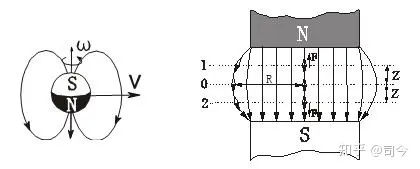

图-3 图-4

如图-4所示，“上下型”偶磁极磁场空间的中间都存在一个N、S分界平面，在这个平面上小磁针不会产生向磁场磁极运动的情况，即小磁针二端的N、S极所受二个磁场磁极的梯度力相等，故其质心会在这个平面上保持平衡稳定状态，我们称这个平面为磁场**“0梯度面”**，而在这个平面之上或之下的空间平面则称为磁场**“非0梯度面”**。

对自旋磁陀螺轴而言，当它以一定速度进入磁场空间时，因其自旋磁轴二端会作切割磁力线运动，故会在其中产生“电子洛伦兹运动”式的曲线运动轨迹。

我在《磁陀螺运动与现代物理学漫谈（8）》中谈到，当给自旋陀螺轴上下等距离处施加相同的外力矩时，陀螺不会产生自旋轴倾斜的进动，而会产生质心平移的曲线运动，且平移速度不减小，只是速度方向发生改变；如果这对力矩永不消失，它实质就会形成稳定的曲线圆周运动，如图-5所示。

图-5

自旋磁陀螺以一定初速度进入“上下型”均匀磁场时也会产生这样的运动：以均匀磁场“0梯度面”为例，如图-6所示，自旋磁陀螺以平动速度V0进入磁场“0梯度面”空间时，其自旋轴上、下端磁极都会受到磁场磁极力F上H、F下H的影响，且这二个力大小相等、方向相反，并与其平动速度V0方向垂直。由于这二个等值力的作用，磁陀螺质心将会产生二个运动速度分量，即一个是受磁场磁极剪切阻力作用而减小、但运动方向仍保持原速度V0方向的V0′速度，且有ΔV0=V0－V0′；另一个是磁陀螺二磁极作切割磁场力线时所产生的垂直于原速度V0方向的V⊥速度，这二个速度合成就是它在磁场中作曲线运动的速度V.

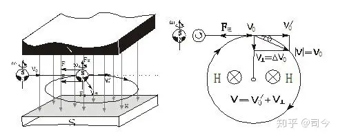

图-6 图-7

从图-7所示的受力分析图中可以看出，磁场对自旋磁陀螺运动产生的阻力**F**阻正是其形成以V作匀速圆周运动的向心力**F**向，且有

V⊥=V0－V0′，V=V0′＋V⊥=V0，V²= (V0′)²＋(V⊥) ²≡V0²；

但这里有个问题，匀速圆周运动速度的二个矢分量值是相等的，即V⊥=V∥，这就要求V0′=ΔV0=V⊥成立，为什么呢？到底V0′=V⊥成不成立呢？欢迎对此问题感兴趣的朋友们给予指点和评判！

通过实验和分析可见，如果将逆时针自旋的磁陀螺射入均匀磁场空间时，则它的自旋轴二端因受磁场磁极引力作用，会因切割磁力线作用而形成沿顺时针方向的曲线运动，**V**与**V⊥**及磁场H方向符合电磁学中「右手判断法则」，且在“0梯度面”上作圆周运动的磁陀螺速度与它进入磁场前的初速度值大小不变，但运动方向会改变。如果从速度矢量合成方面来考虑，则自旋磁陀螺轴受力后产生的速度变化矢量**V⊥**方向始终与切割磁力线力**F**阻垂直，即**F**阻**⊥V⊥**，这与无自旋磁陀螺在磁场中运动受力有根本性区别，但却与圆周运动属性保持一致。

在这个运动中，如果用惠更斯圆周运动公式描述就是qm.B=m.v²/r，因此我们也可以通过测定m、r、v、B值来确定自旋磁陀螺所带磁量的大小。

如果用一个顺时针自旋磁陀螺（上端为N极你、下端为S极）垂直射入上述磁场，则它会在磁场空间产生怎样的运动呢？

为此我们不妨再做一组实验：

如图-8所示，在重力场下当我们给竖直顺时针自旋的磁陀螺轴上端施加一个瞬时力F时，在重力矩作用下，磁陀螺就会产生一个稳定的顺时针进动。

如图-9所示，如果我们在微重力的太空给这个竖直自旋的磁陀螺也施加一个瞬时力F时，则因没有重力矩存在，故陀螺不能形成进动，但会产生二个瞬时速度分量，即V⊥、V∥，它们的速度合成V就是使陀螺产生曲线运动的速度，关于这方面实验可仔细观摩王亚平太空陀螺实验的相关视频予以甄别。

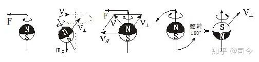

图-8 图-9 图-10

如图-10所示，如果我们给一个垂直自旋的磁陀螺施加一对瞬时力偶时，则磁陀螺轴会产生180°翻转，并会形成一个垂直向内的翻转速度V⊥翻；且磁陀螺的自旋时针方向和自旋轴的N、S极方向也将呈现相反变化。

以此为据，如果我们将一个N极在上、顺时针自旋的磁陀螺沿均匀磁场“0梯度面”以V0速度射入磁场空间时，如图-11所示，则该磁陀螺在接近磁场空间入口处时因其自旋轴磁极受磁场磁极力影响而产生180°翻转，这就变成S极在上、逆时针自旋的磁陀螺，同时会产生一个V⊥翻方向的速度，这个速度与磁陀螺自旋轴切割磁力线形成的速度V⊥切方向相反，此二者合成向心速度V⊥，而V0＇与V⊥则合成磁陀螺在磁场中作曲线运动的速度V，且有V＝V⊥＋V0＇，其中V⊥＝V⊥翻－V⊥切，V= V0.

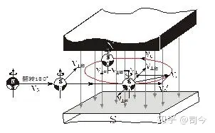

图-11

就N极在上、逆时针自旋的磁陀螺而言，它在该磁场空间做切割磁力线曲线运动时，运动针方向与其自旋时针方向也表现出相反性来，且这种运动符合电磁学中的「左手判定法则」，这与正电子在该磁场空间做洛伦兹曲线运动的情形相一致。

这种磁陀螺运动现象说明，自旋磁陀螺在磁场“0梯度面”内运动是最稳定的，因磁陀螺轴上下端所受磁场磁极力都相等，从而保证了其曲线运动速度的不变性，即保证其运动上下空间距离不变和左右绕中心圆点运动半径不变，这就是“为什么行星绕太阳运动时其轨道平面都处于太阳赤道平面上下很小角度？”的原因之一；在太阳自旋体的N、S极磁场中，“0梯度面”就是其赤道面，同样地，带有自旋磁矩的自旋电子在均匀磁场中作洛伦兹曲线运动也有与此类似运动的特性。

**1.2、“ 0梯度面”上电子洛伦兹运动形成的物理机制**

**1.2.1、洛伦兹运动简介**

洛伦兹运动是指带电粒子在磁场中受磁场影响所产生的曲线运动，它是1892年荷兰物理学家亨德里克·洛伦兹提出洛伦兹力概念下所产生的运动现象。

洛伦兹力是指运动于磁场中的带电粒子所感受到的作用力。根据洛伦兹力定律，洛伦兹力可以用方程F=qe.v.B表达，其中，F是洛伦兹力，qe是带电粒子电荷量，v是带电粒子速度，B是高斯磁场强度。

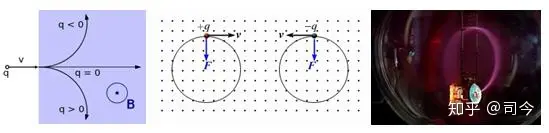

图-12 图-13

如图-12所示，在均匀磁场中，带电粒子的运动轨迹呈圆或局部圆弧线；现代也可以用实验观察到电子在均与磁场中作圆周运动的轨迹，如图-13所示，它是在均匀磁场中，电子射束中电子经过磁场的路径会有紫色光发射出来，这是因电子与玻璃球内气体分子碰撞而产生的现象，从这个现象中可以观察到电子运动轨迹是一个圆。

在非均匀磁场中，带电粒子的运动轨迹虽不是圆，但也表现出连续的曲线轨迹。

如图-14，洛伦兹力方向的判定尊循左手定则，即把左手放入磁场中，让磁感线垂直穿过手掌心，四指指向电流方向，则拇指的方向就是导体或正电荷受力方向（若qe为负电荷，则方向相反）。

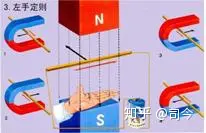

图-14

由于洛伦兹力始终垂直于电荷的速度方向和磁场方向确定的平面，所以它对电荷不作功，不改变运动电荷的速率和动能，只能改变电荷的运动方向使之偏转。

洛伦兹力既适用于宏观电流，也适用于微观电荷粒子，电流元在磁场中所受安培力就是其中运动电荷所受洛伦兹力的宏观表现。导体回路在恒定磁场中运动，使其中磁通量变化而产生的动生电动势也是洛伦兹力的结果，洛伦兹力是产生动生电动势的非静电力。

不过，**值得注意的是：**洛伦兹力公式不是从物理理论中推导出来的，而是由多次重复实验所得的结论，它只能被当作一个基本公理来应用，因为，直到现代人们还不清楚洛伦兹运动形成的真正物理机制，更不知道洛伦兹力是一种什么力？它从何而来？

**1.2.2、洛伦兹运动形成的物理机制**

现代物理学证明，电子有自旋和自旋磁矩存在，也就是说，电子可以被看做是一个微小的自旋磁陀螺，故电子在均匀磁场中作洛伦兹运动与磁陀螺在均匀磁场作曲线运动有一定的相似性.

从磁陀螺在磁场中运动的的情况可以看出，如果把电子看做是个自旋刚体磁陀螺，则自由电子的运动特征应为v⊥ω，即v⊥B自，如图-15所示。

如图-16所示，一个带有自旋磁矩的电子以初速度V0从**“0梯度面”**进入磁场空间后，其自旋轴上下端磁极都会受到磁场磁极引力影响，且这二个力大小相等、方向相反，并与它平动速度V0方向垂直；由于这二个等值力作用，电子质心运动方向将产生二个速度分量，一个是保持原有运动方向的速度V0′，另一个是电子二个磁极切割磁场力线所产生的垂直

于原运动方向的速度V**⊥**，这二个速度的合成就是它在磁场中作圆周曲线运动的速度，即**V= V⊥** **+V0′**，且有V= V0.

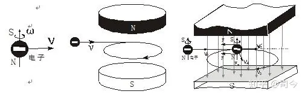

图-15 图-16

可见，在“0梯度面”上作圆周曲线运动的电子速度与它进入磁场前的速度大小不变，但运动方向改变；自旋电子轴受磁场磁极剪切力产生的速度变化方向始终与剪切力相互垂直，即**V⊥⊥F**；在这个运动中，如果用惠更斯圆周运动公式描述，则有qm.B=m.v²/r,由此我们也可以通过测定r、v、B值来确定自旋电子磁量的大小。

由此看来，**如果将电子看做是一个自旋磁陀螺，那么它在磁场中作曲线运动的所谓洛伦兹力就不复存在——洛伦兹力实质就是自旋磁陀螺式的电子磁轴切割磁场磁力线而产生V⊥的另一种描述，是将电子看做是没有自旋性质点粒子（经典粒子）运动的必然结果；理想的洛伦兹圆周运动只能存在于磁场“0梯度面”上。**

如果我们将带有自旋磁场的正电子也可以看做是一个自旋磁陀螺，那么，它在均匀磁场中运动与电子有什么差异呢？

如图-17是自旋磁陀螺翻转180°与电子翻转180°后的对比图，通过与自旋磁陀螺在均匀磁场空间翻转运动的比较中可以看出，电子与正电子其实应该是同一种自旋磁粒子，只是相互之间呈180°翻转后才会表现出不同的洛伦兹曲线运动时针方向。

图-17

不过，据现代教科书介绍，电子与正电子的电荷（电性相反）、质量、磁量大小都一样，且自旋方向也相同，但我不知我们定义正电子自旋方向与电子一样的依据是什么？就仅仅因为它们在磁场中作洛伦兹运动时针方向相反吗？

从磁性而言，电子与正电子的磁量、质量可以一样，但自旋时针方向与磁性空间分布应表现出严格的“对称性”，这就为大自然中普遍呈现“超对称”现象找到一个可信的依据。

如图-18所示，如果一个正电子在以V0速度进入均匀磁场空间时，它首先在均匀磁场空间入口处被磁场磁极极化而产生180°翻转，然后以电子态形式在均匀磁场中产生“洛伦兹运动”。

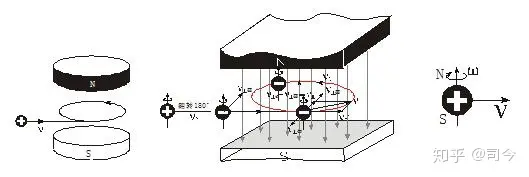

图-18 图-19

从磁陀螺在磁场中的运动可以确定，如果将正电子看做是一个自旋磁陀螺，那么，它应是逆时针自旋且自旋轴上端为N极，下端为S极，如图-19所示。

由此可见，量子力学在与经典电磁学的衔接中，由于经典电磁学缺少了对电子自旋和自旋磁矩性的认知和描述，它就必然与量子力学存在一种不可逾越的天然鸿沟！然而，量子力学在对待电子在磁场中作曲线运动的问题上虽然引入了自旋和自旋磁矩，但却忽略了空间磁场对它们运动的影响，这就使得量子力学在解释自旋粒子的“衍射”、“干涉”现象时就不得不引入“波粒二象性”概念，从“波动”和“概率”领域进行诠解 ——但这种解释只会让人更迷惑，同时也深深掩盖了自旋磁量子在磁场空间中运动的物理本质！

因此说，**对电子洛伦兹运动形成的真正物理机制探讨才是协调和解决粒子“波粒二象性”本质问题的根本举措。**

**1.2.3、电子在回旋加速器中的运动（速度增大的洛伦兹运动）**

电子在均匀磁场“0梯度面”上运动时，其洛伦兹运动周期为T=2π.m/qe.B，这是一个与电子运动速度无关的量，且电子自旋轴始终平行于磁场力线。

电子在回旋加速器中运动也是一种“0梯度面”上的洛伦兹运动，如图-20所示；但这种运动因外界电场能量的输入会使电子运动速度增大，这时电子运动周期就不遵循T=2π.m/qe.B规律了，这是为什么？

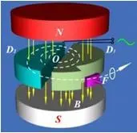

图-20

对此，爱因斯坦给出的解释是：

将电子电荷qe看做是不变量，将电子质量m看做是可变量，则m=m0/√(1-c²/ v²)，有

T=2π.m0.c/qe.B.√(c²-v²)，即v增大T就会变小。

但爱因斯坦动质量是一个让人迷惑不解的概念：电子质量怎么会随速度变化而变化，而电子电量为什么就会不变呢？

对此，现代电磁学给出的解释是：

“有许多事实表明，一个系统中的总电量不因带电体的运动而改变，例如，实验测定速度为v的带电粒子的荷质比符合下述公式：

qe/m=qe.\[√(1-v²/c²)\]/m0.

而质量随速度变化的相对论公式是：

m=m0/√(1-v²/c²).

比较这二个公式，暗示着带电粒子的电量q不随运动速度改变。又如质子所带的正电量与电子所带的负电量非常精确地相等。对于任何一个中性原子，原子核中的质子数与核外的电子数相等，因此未电离的原子核分子内的正电荷与负电荷数量相等，从而中性原子或分子所带电量非常精确地为0.在这一点上，20世纪60年代报导的实验结果精确度已达10^-19乃至10^-23以上.我们知道，原子中的电子和质子是处在不同运动状态下的，例如氢分子内的电子速率有（0.01～0.02）c的数量级，铯原子内K壳层电子的速率至少有0.4c的数量级，而原子核内的质子和中子的速率具有（0.2～0.3）c的数量级，这样的运动并未使原子和分子的电中性产生可观测的偏离，这表明电量不受运动影响，电量是不随参考系的变化而变化的。再如任何物体在加热和冷却时，电子的速度比带正电荷的原子核速度更易受到温度影响，虽然每个电子的速度可能变化不大，但物体中电子的数量极大，如果运动确实对电量有影响的话，它可以在物体上获得可观察的电量；然而事实上，中性物体在任何温度下总是保持宏观上的电中性，实验中从来没有观察到仅仅通过加热或冷却的方式在物体上获得电量的事实……”**\[4\]**

通过上面引述可以发现三个问题：

（1）、我们在没有真正测量过一个运动系统总质量有没有变化的情况下就断然假设电子质量有变化，这是不符合物理研究精神的；再说，qe/m会随电子运动速度的增大而产生变化，并不一定是m变化了，qe为什么就不可以变化呢？

（2）、中性原子运动系统中总电量为0并不能保证电子、质子运动变化时它们的电量不会发生变化。

（3）、电子电量与质子电量严格相等并不能证明它们在运动变化时还会保持其带电量不变。

其实，**T是一个与qe、m都无关的量，它的变化只与电子平动速度v和自旋角速度ω变化有关。**

依据F=qm.H=qe.v.B,可得qm=qe.v. **\[5\]**

（注：麦克斯韦在推理光速及确定光是一种电磁波时也是用的这一关系式，那么，qm.H=qe.v.B能够成立吗？如果不能成立，那么麦克斯韦电磁波理论将如何成立？如果能成立，那又是为什么呢？—详解请参阅司今/**《库伦磁场强H与高斯磁场强B到底有什么异同？》**一文）。

依据qm=m.ω自**\[6\]**可得：qe=qm/v=m.ω自/v，则有T=2π.m.v/qm.B=2π.m.v/mω自B=2πv/ω自.B.

可见，在一个恒均匀磁场中，电子作洛伦兹运动的T是一个与qe、m无关的量，它的大小只与电子的平动速度v和自旋角速度ω变化有关。

在回旋加速器中，由于这种洛伦兹运动有外加电场力作用于电子上，这就构成了一个“三体运动”系统的形式（即自旋电子、电极、磁极构成三体），这时自旋电子运动则遵循P=m.c= m.v+m.v自、E=m.c²=m.v²+ m.v自²守恒（v是电子平动速度，v自是电子自旋速度），即

v=√（c²-v自²）,T=2π.v/ω自.B=2π.r自.√（c²-v自²）/ v自.B=2π.r自.√（c²/ v自²-1）/ v自.B，

因r自（r自.是电子“刚体”自旋半径，ω自.是电子自旋角速度）、B为不变量，当v增大时则v自.会变小，即ω自.变小，这时T就必然会增大——这与爱因斯坦给出的结论相一致，只是数学描述形式不同罢了。

无论外界有无能量输入，自旋电子在磁场中作洛伦兹运动时都遵循 P=m.v+m.ω自、E=m.v²+ m.ω自² 守恒，这是电子在磁场中运动必须遵循的基本规律。

**2、** **均匀磁场中“非0梯度面”上的磁陀螺曲线运动**

**2.1、“非0梯度面”上的磁陀螺曲线线运动**

磁场“非0梯度面”就是处于磁场“0梯度面”空间之上或之下的平面，自旋磁陀螺在这样的磁场空间运动与在“0 梯度面”上的运动就有很大差异，具体分析如下：

如图-21所示，当一个自旋磁陀螺从“0梯度面”之上或下空间进入磁场时，由于磁陀螺自旋轴上下端受磁场N、S极的引力不平衡，则越靠近磁场磁极处磁场强度B会越大，如B1＞B0.

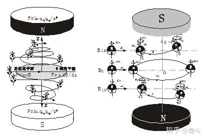

图-21 图-22

依据T=2πm/qB则有T1＜T0；依据r=m.v/qe.B则r也减小，依据F梯= km.qm1.qm2.cosθ/z²，（θ为磁陀螺自旋轴与磁力线之间的夹角）则F梯会增大，这样自旋磁陀螺就会形成了一个锥螺旋运动轨迹。

在这个运动中，磁陀螺作锥螺旋运动的速度V螺到底如何变化呢?

因为自旋磁陀螺轴下端所受磁场磁极力比上端大，则这时自旋轴产生的切割磁力线力也就不相等，这就会使自旋轴产生θ角倾斜，由此则产生进动式的平动运动，如图22所示。

如图-23所示，磁陀螺作螺旋运动的瞬间速度V的水平分量仍是V0（这与电子在“0梯度面”上的洛伦兹运动情况相一致），它速度增大的部分来自于V梯，即有V=V0+V梯.

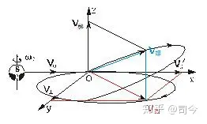

图-23

如图-24所示，磁陀螺在均匀磁场的“非0梯度面” 运动会产生θ角倾斜的进动，这种进动遵循Ω·ω=k守恒，即θ越大（θ2＞θ1＞0），其进动角速度也越大（Ω2＞Ω1），但自旋角速度变小（ω0＞ω1＞ω2），进动角速度来自于自旋角速度的减小。

如图-25所示，如果磁陀螺平动速度V0大，能够穿过磁场空间，则磁场磁极对磁陀螺轴的作用力将逐渐消失，磁陀螺又恢复了自由运动形式，这时磁陀螺的自旋加速度仍是ω0，但其线速度V却大于V0，因V梯参与了V的合成运动，即V= V0+V梯，并且它将以V⊥ω0的姿态进入自由运动状态。

图-24 图-25

**2.2、电子在“非0梯度面”空间的螺旋运动**

**2.2.1、电子初速度v不垂直于B的运动情况**

从电磁学教程中，我们学到带电粒子在均匀磁场中可以产生柱螺旋运动，如图-26所示，当电子被射入的速度v与均匀磁场B不垂直时，则电子就会在该磁场中作这种柱螺旋运动。

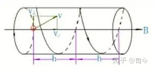

图-26

“柱螺旋运动”判断仅是从电子在磁场“0梯度面”内运动情况来考虑问题的，并没有从电子有自旋、自旋磁矩及磁场空间存在“非0梯度面”等影响因素方面予以分析；如果从自旋电子带有自旋磁矩性和“非0梯度面”二方面因素来考虑，则因自旋磁轴二端所受磁场磁极力不相等，这时电子自旋磁轴在均匀磁场中运动时就会产生一定倾斜角θ，并且电子在向磁场磁极靠近时，依据H=km.Qm/z²（Qm是磁场磁极磁荷量）,则H是一个逐渐增大量，因此说，这种运动并不会产生标准的柱螺旋运动，而是一种锥螺旋运动形式，如图-27示；如果说可以产生柱螺旋运动，那也只能是在磁场“0梯度面”附近沿磁力线较短距离空间范围内近似符合罢了。

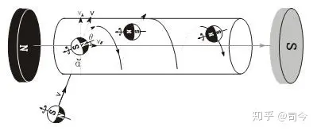

图-27

虽然均匀磁场磁极相对于电子而言不可能质点化，但因按高斯定理规定的**感应磁场强度**B=Φm/S，故B可以看做是磁极磁场磁通量面密度化后的的质点磁荷量大小，我们将这个质点（密度）磁荷量大小规定为Qm(即B=Φm/S=Qm)，这时均匀磁场空间的**库伦磁场强度**H就可以表示为H=km.Qm/z²=km.Φm/S.z²=km.B/z².

如果我们再将电子看做是一个质点粒子，其磁荷量大小是qme，则电子在均匀磁场中所受的磁场梯度力就为:

F⊥=qme·H=km.qme.Qm/z²=km·qme·B/z².

依据F⊥=qme·H=mv⊥/t，H=km·B/z²，则其在z方向运动形成的螺距L为：

L=v·sinα±v⊥·t=v·sinα±qme·H.t²/m=v·sinα±km·qme·B.t²/m.z².

（注：从S极到0梯度面为“-”，从0梯度面极N极到为“+”）。

又因电子自旋磁轴是有方向的，只有自旋轴与磁力线平行时所受的磁场磁极力才为有效梯度力，故电子的有效磁荷量就可以表示为qme有=qme·sinθ，则

L= v·sinα±km·qme·B.t**²**·sinθ/m.z².

由此可见，自旋电子在均匀磁场空间做螺旋运动的螺距L应是一个非等距量，它的变化与v、α、B、T、θ、z都有关联。

这也说明，**从z方向长距离角度来分析，自旋磁电子在均匀磁场中应作锥螺旋运动，而不是柱螺旋运动。**

同理，我们也可以求出不同时刻t的锥螺旋半径r大小，对之读者不妨自己推理一下，我在此就不多费笔墨了。

现代物理学在讨论在电子均匀磁场空间中运动时却忽略了磁场磁极对电子自旋磁轴的影响，即忽略了均匀磁场有“非0梯度面”存在的情况；当电子初速度v不与磁场B垂直时，电子会在不同运动位置点产生磁极梯度力之差。因此，从这个意义上讲，**真正的柱螺旋运动是不存在的，那只是对均匀磁场空间极短距离范围内的一种理想化的近似描述。**

**2.2.2、电子在“非0梯度面”空间的锥螺旋运动**

电子在均匀磁场中作洛伦兹圆周运动是有严格条件限制的：

1、保证空间磁场分布绝对均匀，否则电子会在磁场中作“漂移”曲线运动。

2、保证电子射入磁场的速度V与磁场B方向严格垂直，否则电子会在磁场中作螺旋曲线运动。

3、保证电子射入位置在偶极磁场的中心线上（即0磁场梯度面），否则电子会在磁场中作螺旋曲线运动。

对于不符合电子洛伦兹运动条件的问题曾在回旋加速器制作初期应用中出现过，为了克服这些不利因素影响，现代回旋加速器设备中分别增设了“径向聚焦”和“垂直聚焦”等额外磁场来保证电子在加速器磁场中作正常的洛伦兹运动，从而使电子能够在电场加速下形成稳定的平面渐开线增速运动，如图-28所示。

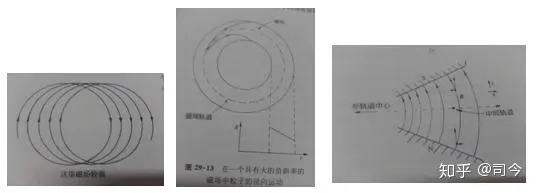

图-28.电子“漂移”.电子径向聚焦.电子垂直聚焦

电子在均匀磁场的“非0梯度面”空间是如何形成锥螺旋运动轨迹的呢？

如图-29所示，自旋磁电子以初速度V0并垂直磁力线、分别在B1N、B0、B1S三个空间位置射入时，在B1N、B1S平面，因电子自旋磁轴二端所受磁场磁极的梯度力就不相等，时电子磁轴在均匀磁场中作切割磁力线运动时就会产生一定倾斜角θ，并且电子会向磁场磁极靠近；这样，电子作锥螺旋运动的速度就是由“洛伦兹平面圆运动速度+磁场梯度力速度”合成的，即符合**V=V0+Vz**矢量合成法则。

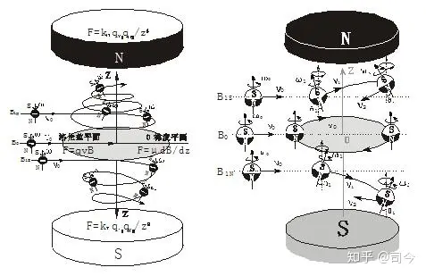

图-29

关于粒子速度增大问题，我们须注意以下几个方面的区别：

（1）、在均匀磁场“非0梯度面”与非均匀磁场中，自旋磁电子都会产生锥螺旋运动，且电子运动速度都会增大，但这不同于回旋加速器电子运动速度增大的情况，因前者没有外界能量输入，是一种“自发式”的锥螺旋速度增大运动，后者有外界能量输入，是一种“强制式”的速度增大运动。

（2）、在施特恩-格拉赫实验中，自旋粒子运动速度也会增大，但这是由倒三角磁场磁极使自旋粒子磁轴产生倾斜而影响其曲线运动速度的结果；同时还要注意，施特恩-格拉赫实验系统也是个没有外界能量输入的系统。

## 爱因斯坦在磁矩与自旋研究方面的贡献

在那场揭开“电子自旋”奥秘的微观物理学革命中，以“相对论”著称的爱因斯坦在这方面的研究工作似乎被人遗忘了；其实，爱因斯坦在揭示基本粒子的磁场、角动量和自旋之间的关系中还是做出了一定贡献的，如“爱因斯坦－德哈斯效应”就是一例，但这在量子力学自旋发展史中却很难看到这方面的记述。

大约在1915年至1916年期间，爱因斯坦与荷兰物理学家德哈斯合作，就进行了一连串的实验，他们想验证，磁性材料中的磁性是不是来源于材料中带电粒子的轨道运动？

被物理学称为“爱因斯坦－德哈斯实验”的思想起源于经典电磁学中的安培分子电流观点；安培认为，磁性材料的磁性来自于材料内部分子不断做圆形轨道运动的电流，从而产生微小的磁偶极矩，这些偶极矩矢量合就使材料显示出磁性来。

对此，爱因斯坦设想，假如原子尺度下的磁矩来源于电子绕原子核作圆周运动的结果，那么，这样的轨道运动就必然会表现出一定的角动量。

爱因斯坦和德哈斯一起曾推导出原子磁矩与电子的轨道角动量成正比，即μ=el/2m.

在当时，电子的荷质比是已知的，他们根据荷质比推算出他们实验所要测量的对应值为：

e/2m≈8.8×10^10C.kg^﹣1.

这个值后来被量子力学称为旋磁比，用符合表示就是γ=e/2m，它表示出了磁矩与角动量之间的比例关系，但量子力学中的γ要比爱因斯坦-德哈斯计算出的γ要小一倍。

为此，爱因斯坦和德哈斯设计出了如下图所示的实验装置。

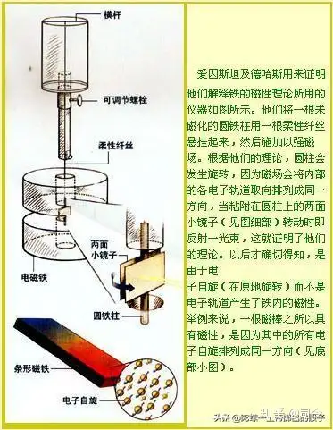

他们的实验装置原理是这样的，假设有一根圆柱形的铁棒，用一根细线吊起来，铁棒原本的磁矩方向应该向上（磁矩方向向上，则其轨道角动量方向向下），若我们在铁棒下方放置一块磁体磁场，使铁棒中的磁矩方向变为往下，那么，电子作轨道运动的角动量方向也就会跟着翻转而指向上方。

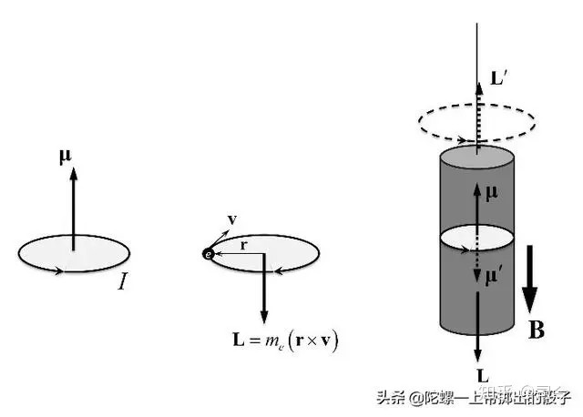

依据角动量守恒原理，整个系统就会产生一个反方向的角动量，所以铁棒就会沿着顺时针方向转动，我们就可以测量出该转动量大小，以此就可以计算出角动量变化的大小，进而就可以计算出铁棒中原子的磁旋比来。

用这个实验，愛因斯坦和德哈斯最后测量出來的結果和他们的理论计算几乎完全吻合；也就是说，他们的这个实验的确证实了磁矩起源于一个真实可以测的角动量。

但爱因斯坦-德哈斯实验测量出来的磁旋比只有后来量子力学计算出的值的一半，这是为什么？

这是因为铁棒里的磁矩来源应该主要是电子的自旋磁矩，而非电子的轨道磁矩，若考虑电子自旋磁矩，则铁棒的磁旋比应该是γ≈1.76×10^11C.kg^﹣1 。

但不管怎么说，爱因斯坦-德哈斯实验对促进当时的量子力学磁矩论的发展，还是起到巨大推动作用的，通过这个实验，也为后来爱因斯坦能够迅速接受乌伦贝克与高斯密特提出的电子自旋及其自旋磁矩假设提供了必要的心理准备。

而且后来，为了缓解广义相对论与宇宙加速膨胀、狄拉克电子自旋理论等之间的矛盾，爱因斯坦与法国数学家埃利.嘉当合作，提出了包含自旋要素的“爱因斯坦-嘉当理论”。这个理论比爱因斯坦先前提出的广义相对论更加接近真理的引力理论。

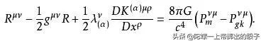

现在，利用“爱因斯坦-嘉当理论”可以在不引入暗能量的情形下解释飞船轨道异常和宇宙加速膨胀，也可以说明星系暗物质的分布情况，还可以消除与狄拉克电子自旋理论之间的矛盾；同时，“爱因斯坦-嘉当理论”还预言：磁化物质之间除了有磁场作用力外，还应存在附加的“自旋-自旋”之间的作用力——那就是二个自旋磁矩之间的磁作用效应。