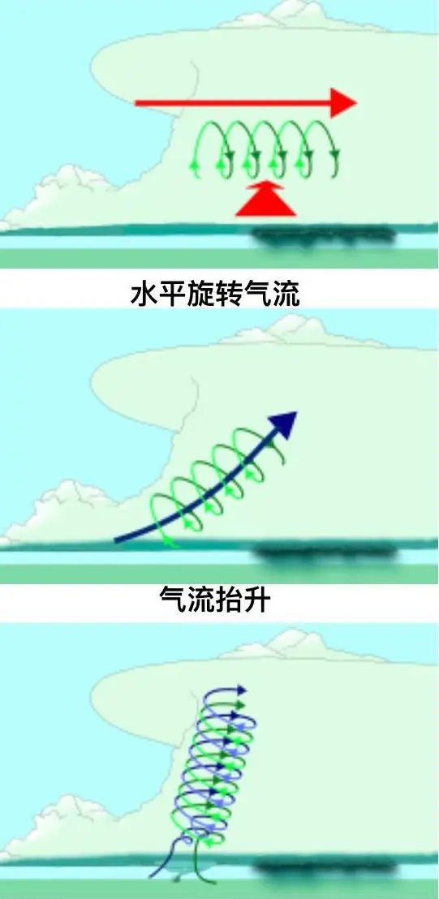
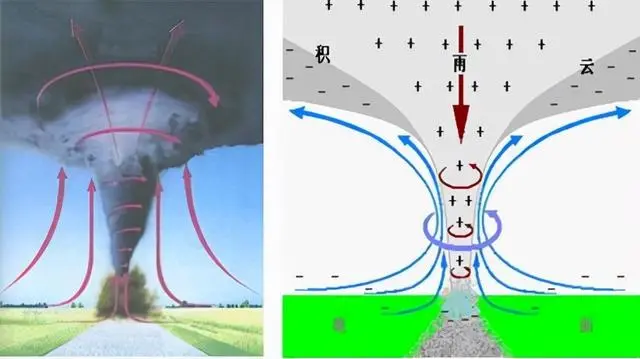

# 龙卷风

- 龙卷风中心气压低
- 龙卷风心为下沉气流，四壁为极强的上升气流

一般情况下，积雨云的水平尺度需要达到几十到上百公里，垂直高度至少要达到十几公里，才有可能会形成龙卷风。

强烈的上升气流与各方向的切变风相互作用，使得气流中部开始旋转，并向上下扩展，形成柱状空气涡旋。其旋转直径逐渐变小，旋转速度越来越快，空气涡旋越来越猛烈。当涡旋慢慢向下扩展到地面时，使地面上产生强大的负压，这就是极具摧毁力的龙卷风。

龙卷风是一种强烈的，小范围的空气涡旋，是在强烈不稳定天气条件下，由空气强烈对流产生的，通常是由雷暴云伸展至地面的漏斗状云产生的强烈旋风，龙卷风中心气压低，中心风力可达100到200米每秒以上，具有极大的破坏力。

龙卷风的形成与强雷暴云中强烈的升降气流有关。当升降气流之间形成很强切变时，就会发生强烈的水平轴的涡旋，涡旋越转越细越快，产生一个漩涡型的上升气流，并开始向下伸展，形成龙卷核心。当向下发展的涡旋到达地面高度时，地面气压急剧下降，风速急剧上升，形成了完整的龙卷风。龙卷风心为下沉气流，四壁为极强的上升气流。

在强对流天气中，由于与在垂直方向上速度和方向均有切变的风相互作用，上升气流在对流层的中部开始旋转，形成中尺度气旋。

之后它就会在上升气流作用下开始伸展，由水平变成垂直于地面，并变细变强，之后因为地球自转等因素，形成龙卷风。

在龙卷风内部，气压要比龙卷风外部要低10%左右，此时龙卷风内部和外部因为压强差的原因，导致龙卷风外部高气压会流向内部低气压，由此产生推力。

也正是因为如此，当龙卷风接触到地面的树木，建筑物，以及汽车等，就会被吸入空中。

