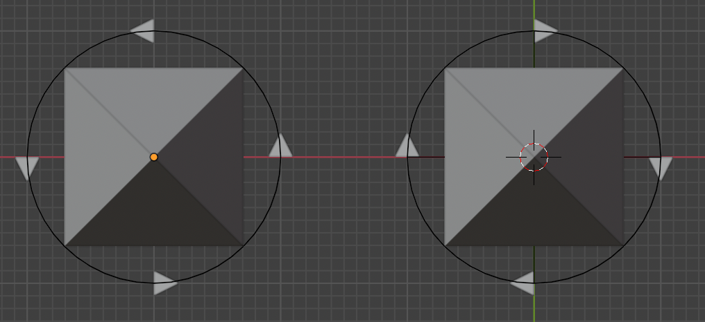
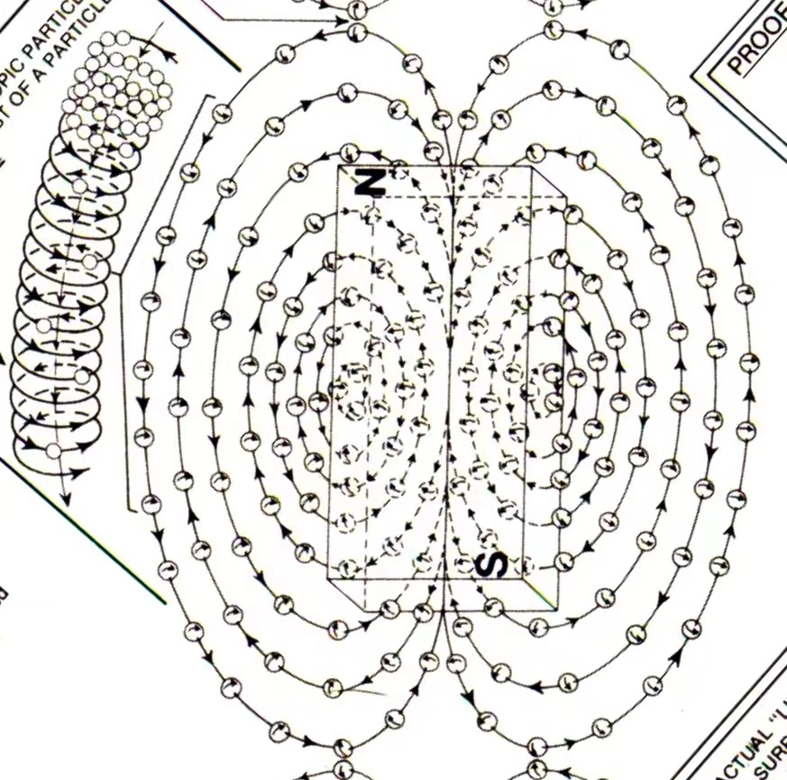

# 涡旋电磁场基础

磁感线是闭合曲线。磁铁周围的磁感线都是从N极出来进入S极，在磁体内部磁感线从S极到N极。

待确认问题：

- 玄子为什么会形成相吸的关系？难道玄子是自玄的小磁铁？
- 磁场形成的原因？什么样的物质结构形成的磁场结构？

## 玄子

无极：一个球，在没有平移运行和旋转的情况下，是无极的，因为从任何一个方向看，都是相同的。

极化：球在以中轴旋转时，在不同的方向看就会不同，这就是极化，有了南北之分。

虽然不同角度看，球的转动方向是不同的，但球还是一个球，不是两个球。

这里把自旋的球叫玄子，玄同旋，是更中国化的概念，玄这个字的象形也很通神。

自旋的玄子如果有方向移动，就会有两种类型。

这里以锥型顶点为玄子前进方向，以从迎向玄子方向看，可以有正旋和逆之分。

吸斥关系：

- 正玄同向：互斥
- 逆玄同向：互斥
- 正玄异向：相吸
- 逆玄异向：相吸
- 异玄同向：相吸
- 异玄异向：互斥

## 磁场

磁场特性：
1. 磁场中物质不受力
2. 磁场在磁体外从一极流向另一极
3. 磁场导致磁体同极相斥异极相吸

如果磁场由玄子组成，那一定是玄子的对向流动，因为如果是单向一定会对物体产生力的作用。

对向玄子流不能相吸，因为磁场在磁体外存在，如果相吸就不会在磁体外形成场了，会在磁体内形成。

**所以磁场是异玄异向玄子流。**

在磁铁的N极有正玄子流出，S极有逆玄子流出。这样定义是为了匹配后续电场方向。

## 磁生电

为什么切割磁感线会产生电流？

受陀螺效应，在玄子轴向受力时，会产生垂直方向进动，玄子进动形成异玄同向玄子流，同导线切割磁感线电流方向。

从而断定，电场为异玄同向玄子流。电荷受电场作用形成电流。

右手定则。右手平展，使大拇指与其余四指垂直，并且都跟手掌在一个平面内。把右手放入磁场中，若磁力线垂直进入手心（当磁感线为直线时，相当于手心面向N极），大拇指指向导线运动方向，则四指所指方向为导线中感应电流的方向。

## 电场对磁体的作用

电场为异玄同向玄子流，电场宏观对磁体不起作用。

以磁体N极迎向电场方向为例，逆玄子流会通过磁体从S发射而出，正玄子流会和N极发射的正玄子流对冲。

结果是NS极玄子流不同类型密度有差异，但总体密度相同。

这里认为物质都是由玄子组成，所有物质现象都是玄子的相互作用现象，力的作用是通过产生玄子密度差导致物质发生空间移动。

## 电场对电荷的作用

正负电荷为何在电场中受力且受力相反？

这里假定正负电荷是自玄相反的小磁体，电场对电荷的作用可用自玄进动解释。

基础知识：
- 电场为异玄同向玄子流
- 磁体N极入逆玄子流，出正玄子流
- 磁体S极入正玄子流，出逆玄子流

磁体自玄只有有两种情况：
- 磁体正玄：从N极看正玄，从S极看逆玄
- 磁体逆玄：从N极看逆玄，从S极看正玄

磁体自玄对电场玄子流的进动作用，磁体不分NS极：
- 磁体正玄：电场正玄子流聚集磁体端点，逆玄子流远离磁体端点
- 磁体逆玄：电场正玄子流远离磁体端点，逆玄子流聚集磁体端点

不论电场“冲向”磁体N还是S极，正玄磁体会顺电场方向运动。逆玄磁体会反电场方向运动。

这现象产生的原因在于磁体玄转导致磁体两极产生了玄子密度差，磁体会向低密度区域移动。

## 电荷产生电场

