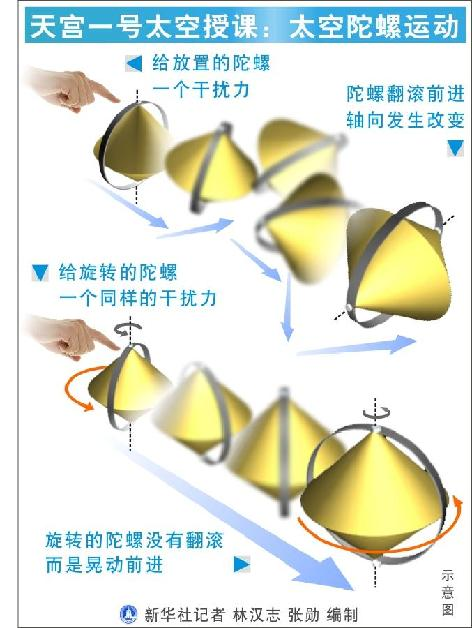

# 太空陀螺运动探索（1）——角动量守恒

天宫一号太空授课：太空陀螺运动实验过程：王亚平取出一个红黄相间的陀螺悬放在空中。用手轻推陀螺顶部，陀螺翻滚着飞向远处。紧接着，她又取出一个一模一样的陀螺，让它旋转起来，悬浮在半空中，再用手轻轻一推，旋转的陀螺不再翻滚，而是保持着固定的轴向向前飞去。

专家解读：转动的陀螺具有定轴性，定轴性遵守角动量守恒原理——在没有外力矩作用的情况下，物体的角动量会保持恒定。航天员瞬时施加的干扰力不能产生持续的力矩，由于角动量守恒，旋转陀螺的旋转轴就不会发生很大改变。而这一点在地面上之所以很难实现，并不是因为角动量守恒定理不成立，而是因为陀螺与地面摩擦产生的干扰力矩等因素改变了陀螺的角动量，使其旋转速度逐渐降低，不能很好地保持旋转方向。

利用角动量守恒定律，我们可以实现卫星的定向控制。基于陀螺指向稳定性特点制成的陀螺仪，还被广泛用于不同领域各种平台的稳定控制。雪铁龙Ｃ６轿车上就安装了测量车身纵向和横向摆动的陀螺传感器，可以实现车身稳定度的控制。

