---

title: 挑战现代物理学磁理论的几个“民科”实验_网易订阅

date: 2024-05-13 21:32:14

categories: vortex

tags: 
- 无

original_url: https://www.163.com/dy/article/D82DPEUG0521ILUV.html

---

# 挑战现代物理学磁理论的几个“民科”实验_网易订阅

挑战现代物理学磁理论的几个“民科”实验  

  

奥斯特实验

实验是物理学建立的基础，一个物理学新理论的发现或开创也往往都是从解读一些物理实验现象开始的；如，电磁学的创立与发展就是基于二个重要实验发现开始的，即奥斯特实验（导线电流的磁效应）和法拉第电磁感应实验（变化磁场的电效应），正是这二个实验将原来互相独立的电学与磁学统一到了一起，再加上麦克斯韦关于变化电场产生磁场的假设，奠定了现代电磁学的整个理论体系，并由此发展了对现代文明起重大影响的电工和电子技术。

  

电磁感应实验

再如，量子力学理论的建立也是从黑体辐射与光电效应实验而开始的，黑体辐射奠定了微观能量不连续性及波动性，光电效应则证实了光的粒子性，由此，拉开了经典量子力学创立的序幕......

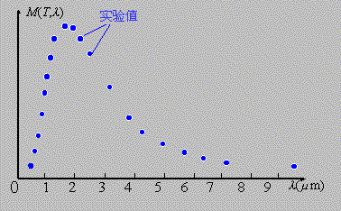  

黑体辐射研究

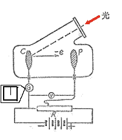  

光电效应

就目前物理学成就而言，电磁学理论可以说是被运用最广泛、理论最严谨、最成熟的学科，但其中还是留下了许多迷团，特别是在磁学领域，磁现象看似简单，但简单的东西往往最深奥，也最能体现宇宙客观规律的本质，如量子力学在发展电磁学的磁理论时，'迫不得已“又补充了自旋生磁理论（即自旋磁矩理论），但这好像还是留下让人回味与迷惑的空间，如，这些带有自旋磁矩的粒子磁性是如何产生的？这些自旋磁粒子在磁场空间中运动将遵守什么物理原理？......

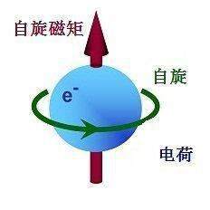  

自旋磁电子

宇宙空间到处都有自旋星系、恒星、行星存在，它们也都表现出不同强弱与个性的“自我”磁场，也可以说，宇宙空间到处弥漫着磁场，人类与万物都生活在磁的海洋里......因此说，对旋转与磁问题的再深入研究很有必要！

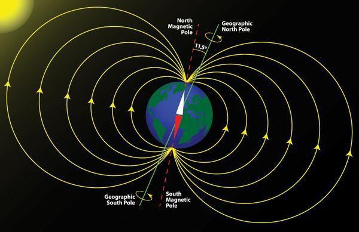  

自旋磁地球

对于宏观星体或星系磁场及微观自旋粒子磁场，我们遥不可及，只能靠间接方式去推理或“禅悟”，但对与我们生活相伴的实实在在的磁体磁场而言，我们还是可以用试验去触摸它的”内心世界“的。

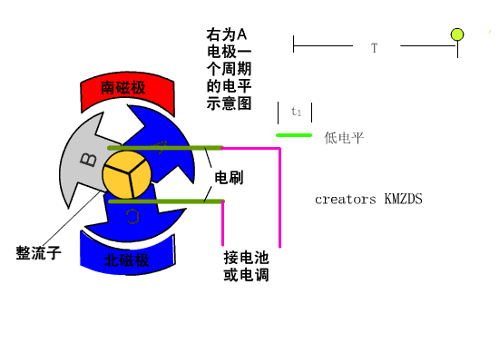  

电动机原理

磁，与你我生活时刻相伴，它简单而又复杂的秉性给我们的生活增添了乐趣与思考空间，看看这些不拘常理的“民间人士”搞出的一些”磁怪现象“也是一种享受，但因他们属于”民科“阶层，故很难引起物理学界的关注；为此，我这里就罗列出几个有代表性并”违反现行磁物理学原理“的怪磁实验案例，供大家欣赏的同时，也别忘了实践一下”仰望天空“去思考的乐趣！

不是说物理学新思想、新理论往往是从解读一些物理现象开始的吗？——或许我们从中也可以参悟出一个开拓磁学新领域的新想法呢？

——我期待着大家的睿思与灵光闪现......

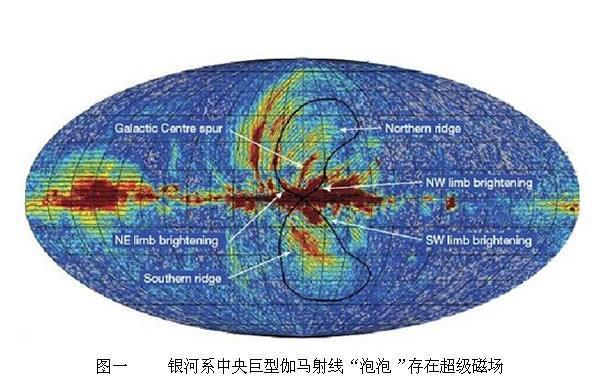  

银河系磁场

1、杨燕自旋磁陀螺实验——二个磁体为什么会表现出同极相吸、异极相斥？

  

梁发库老师的实验

中学时代的杨燕，当时作为一位业余科学爱好者发现了一个关于《自旋磁陀螺的反向倾斜和公转》的奇异现象,多方求教而不得其解，于1992年在《自然杂志》上公诸于众，供大家探讨。

四年之后，齐齐哈尔大学教授梁发库从磁力矩、重力矩、摩擦力等角度对这个问题进行了探讨，依据他《对自旋磁陀螺反向倾斜和公转运动的讨论》一文论述，杨燕实验现象貌似解决了，但其实这里还蕴藏了更丰富的内容，就像杨燕老师在她文章中提出的那样，如果支持面没有摩擦力这种运动现象还会出现吗？如果放到微重力的太空作此实验将会怎样？......

  

太阳系运动

我们知道，在太空中一个水滴可以绕一个带电塑料棒作跳跃式的饶璇运动，那么对于一个自旋小磁陀螺在太空中会绕一块柱型磁铁作什么运动呢？

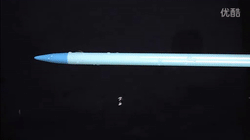  

太空静电-水珠实验

同时，我们还应该在联想一下地球绕太阳运动，地球自旋并有磁轴，太阳也是一个带有偶磁极的自旋恒星体，它们的绕动与自旋磁陀螺绕自旋磁体的运动及其相似——太阳自旋磁轴与地球自旋磁轴也呈现异极相斥现象！

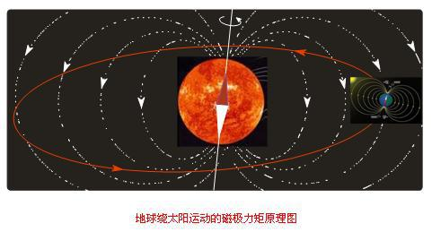  

地球-太阳自旋磁轴呈现异极相斥现象

同时，微观世界中，原子核有自己的自旋磁矩，带有自旋磁矩的电子绕核运动与地太系、自旋磁陀螺的绕动不也很类似吗？

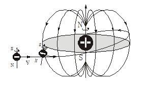  

自旋磁电子绕磁核运动

【附录】《自旋磁陀螺的反向倾斜和公转》

自旋磁陀螺的反向倾斜和公转

杨 燕

在中学时代我对电磁学很感兴趣，发现凸圆底的小磁铁被另一磁铁排斥时竟会高速自旋，就想进一步做实验。如果在磁铁中央穿一根轴，先使它自旋，然后把另一磁铁靠近它，会发生什么现象？

我在图磁盘中央钻了一个洞，穿上非铁磁性的铝轴，并将铝轴两端锉尖。这样就制 成了一个磁陀螺，其一端为N极，另一端为S极，再在支撑板面中央钻孔，使之可放入条形磁铁，并可使条形磁铁上下移动(见图-1， 图(a)中N极刚露出支撑板面上方，图(b)中S极刚露出支撑板面下方)。

  

图-1

使磁陀螺在支撑板面上稳定自旋，没有发 现磁陀螺移动。再在支撑板面中央的孔内放入条形磁铁，奇怪的现象发生了:磁陀螺马上就绕着条形磁铁公转.更奇怪的是：磁陀螺公转时，发生倾斜，倾斜方向竟然与条形磁铁的磁力作用方向相反--同性相吸，异性相斥！此外，磁陀螺自转方向改变时其公转方向也随着改变，但反向倾斜的特性不变。

自旋磁陀螺在外磁场中反向倾斜的现象很奇异，我请教了许多电磁学和力学的老师(包括大学教授)，他们都表示难以解释。

公转现象目前也解释不清楚。用量子力学和经典电动力学计算,都不符合。

图1 (a) 中磁陀螺受的对陀螺质心的重力矩与磁力矩作用相反，据其公转方向得磁力矩大于重力矩。图1（b）中两个磁陀螺的公转方向与图1(a) 中的相同，可是倾斜方向的改变使重力矩与磁力矩都和图1(a) 中的分别相反，据其公转方向得重力矩大于磁力矩，与前一结论矛盾。

图1(a)、（b）中左边的两个磁陀螺的自旋方向和公转方向均与右边的分别相反，但倾斜方向都相同。

当外磁场较强且磁陀螺离条形磁铁较近时，公转时无进动，轨迹是标准的圆周。当外磁场较弱或磁陀螺离条形磁铁较远时，重力矩使磁陀螺进动，公转时出现进动花纹。所以，公转可能只由磁场间的相互作用引起，重力矩只能使陀螺进动，不参与对公转的作用。

要解释自旋磁陀螺的反向倾斜和公转这两个现象，还必须做进一步的实验。下面笔者提出3个实验方案，以求与读者共同探讨。

(1)、把回转罗盘仪的转盘改为强磁的，轴与支架改为非铁磁性材料的(如铜)，由于它的磁转盘能在任何方向上自由转动，所以相应于磁陀螺的反向倾斜，磁转盘可能在外磁场中反向转动180。

(2)、将磁性超导体悬浮于平面磁体上方，在磁斥力与重力平衡处，它的磁极本来就与外磁力线反向。若它自旋后开始发生公转，则说明自旋磁陀螺的公转无须支撑面，这就排除了摩擦力的因素。

(3)、太空中无重力，也无支撑面和摩擦力，那末自旋磁性休的反向转动和公转是否也能发生？

注：本文择自：1992年《自然杂志》15卷4期P304页。

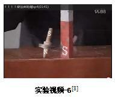  

2、罗来·哈里根的磁陀螺悬浮实验——自旋磁体为什么可以表现出稳定的悬浮性而不自旋磁体就做不到呢？

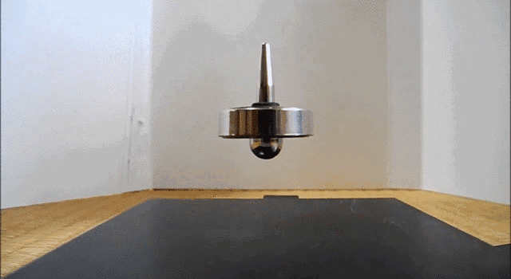  

悬浮磁陀螺

人类有史以来就知道磁铁拥有神奇的力量。两块磁铁不但能相吸亦能相斥。斥力之大足以把重物托起。因此几千年来人们一直在尝试着用磁铁的斥力来抵抗地球重力，把物体浮在空中。

可也怪了，人们试了几千年，却从来没有成功过。

时间到了十九世纪时，科学有了突飞猛进的发展。对磁场的描述也从感性进步到 理性。一组麦克斯韦方程就把电磁场描述的准确精致。比麦克斯韦方程还早一些的时侯有一位数学家叫山姆·恩绍 ，于１８４２年写了一篇论文，用数学方法证明静态磁悬浮不可能实现。这就是著名的恩绍大定理，后来被写进大学物理教程。大一的学生刚入道就会学到恩绍大定理。大二学到麦克斯韦方程发表后，对恩绍定理又有了新的理解，用麦氏方程的 语言来讲，磁力线是不发散的，在空间中没有极小植，这样磁场的斥力在空间就无稳定点。磁铁的斥力虽然能把重物托在空中却不能稳定，就好象用铅笔尖不能把铅 笔稳定地站在桌上。

恩绍大定理虽然给出了科学的证明，却没能挡住后人的好奇心和继续尝试。一方面是许多人没学过物理，根本不知道什么恩绍大定理（比 如炉匠）；另一些人虽然知不行却不信邪，静态磁悬毕竟太引诱人了。但是如果某个物理学家在实验室里摆弄磁悬浮，常常会招来同事们一片讥笑，被认为在做蠢 事。

可时间到了二十世纪九十年代，美国市场上居然出现了一种叫莱维托的玩具，能把一个磁铁陀螺稳稳的浮在半空， 时间达几分钟之久，直到陀螺因空气阻力逐渐减慢速度而跌落。

终于成功了，它是由一位名不见 经传的民间发明家罗来·哈里根做出来的，虽然其专利权被当时的有名物理学家华·霍思和他的儿子窃为己有，但也无法掩盖“科学白丁”罗莱.哈里根先生的聪明睿智和探索光辉......

对此，我们一定感到奇怪，既然恩绍已经用数学方法严格地证明了静态磁悬是不可能的，为什么还会有磁悬陀螺的成功？这岂不违反基本的 科学原理吗？仔细的分析认为，磁悬陀螺并不违反恩绍定理。磁悬陀螺用的是旋转磁体，玩过陀螺的朋友都知道旋转的陀螺利用一种特殊的力量——“进动”来保持 稳定。虽然磁场不能稳定地托起静态的陀螺，但陀螺旋转时，不稳定的偏斜使陀螺出现绕轴旋转的进动，并通过进动使陀螺转回稳定点，进而飞升漂浮于磁场之上。

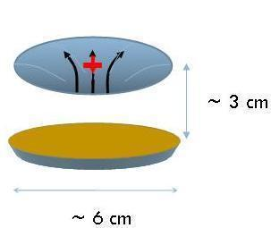  

磁陀螺悬浮原理

１９９７年，纽约州罗切斯特大学的钟斯及合作者在美国应用物理杂志上发表一篇文章，详 细阐述了磁悬陀螺的稳定条件及其转速，重量的关系。他们的分析进一步证明民间发明家们确实身手不凡：陀螺在磁体上几十毫米的空中浮动，但稳定区域只有４毫 米左右宽，陀螺必须呆在这一看不见摸不着的狭小区域中才能稳定。不仅如此，陀螺的重量必须精确到１％左右，轻则飞出，重则落地。加之陀螺的稳定还随环境温 度变化，必须随时调整。使用者还要学会在磁体强烈的斥力下把陀螺转到一定的转速，快了慢了都不能稳定。从这点看，哈里根是位世外高人，只有上帝才知 道他们怎么能在无数的失败中找出这么多条件的最佳组合；相比之下科学家们倒像是照葫芦画瓢的粗人，只会按部就班地写公式。

我必须坦白，自己也玩过静止磁悬浮，在体验失败与成功的过程中，我深深体会到，天才的发明家与跟随的模仿者的能力竟有百分之九十九不相上下，唯一不同只是那灵机一闪的第一推动。

没有这灵机一闪百年来多 少受过正规教育的物理学家受到恩绍定理的影响而无所建树。著名的计算机科学家斯洛德·格瑞在一本科普杂志中写到“为什么那么多科学家在这么长的时间内（对静态磁悬）这个问题毫无建树呢？这正表明负面思维是威力强大的”。如果你在书中学到某些事是不可能的，你多半会不再多想。只有那些不信邪的人，先认为这可以实现，然后再找理论漏洞，突 破就是这样产生的。

  

磁陀螺与底座磁体磁场分布

我作为一个生物学家和科学界中的过来人，要提醒那些跃跃欲试，准备不信邪的年轻人和民间科学家。违反常理的研究代价极大且大 多都要失败的。突变的生物大多数是要死去的，在亿万次失败的突变事件中，个把成功者脱颖而出。正是这些成功者，使生物进化出了眼睛，翅膀和大脑，统治了世 界。但你要想做违反常理的事，要准备好一辈子一事无成，当个失败的垫底数字。唯一的捷径是遍读关于这个问题的所有文献，用前人的知识教训武装自己。现在网 络发达，鼠标一点信息扑面而来，没上过大学也能成为专家。

最后再提一下科学界里的其他高人。恩绍定理能容忍的另两个例外是超导磁悬和反磁磁悬。超导磁悬虽能托 起日本大相朴运动员，但已不新鲜，反磁磁悬却还有点意思。大多数物质的反磁性都太弱了，不足以抵抗重力。但利用很强的磁铁还是可以实现普通物体的反磁磁 悬。１９９７年挪威科学家安德·根姆，那明根大学，用强磁场浮起了一只青蛙。然而无论他如何强辨这项工作的意义，还是难逃于２０００年获得搞笑诺贝尔奖。但科学界里也有象哈里根和谢夫先生那样真正的高人。九十年代中，爱尔兰的几位科学家想出了一种巧妙的方法，用普通磁体承担重力而只用物质 的反磁性来维持稳定。这样用一般物体的反磁性虽弱，但就已足够维持几克重物的磁悬稳定。比如，用人手指的反磁性就足以使一块小磁铁悬浮在空中。这种“手指 磁悬”非常巧妙且有轰动的新闻效果。让他们在科技界的顶级杂志自然上发表了这篇文章。

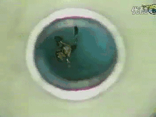  

青蛙悬浮实验

这些惊人的故事就发生在前几年，说不定下一个大轰动就是您的巧妙发明。

注：本文节选自”新浪博客“：http://blog.sina.com.cn/s/blog\_4e19f2cf010009mi.html

读完此文，我除了与本文作者有同感外，还在想一个关键问题，即我们研究磁陀螺运动不能完全套用现行的陀螺运动理论，因为磁陀螺是有磁场属性的，当它绕磁中心体运动时，就必须要考虑磁中心体磁极对磁陀螺的影响；因此，在太空微重力环境下再重新考察磁陀螺的悬浮运动很有必要。

  

王亚平太空陀螺实验

3、西瑞尔的磁致旋转实验——一个被判违反热力学第二定律的磁实验现象为什么会存在呢？

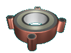  

西瑞尔效应

3.1、西瑞尔效应

西瑞尔效应源于五六十年代，英国人西瑞尔先生发现了旋转磁场的异常效应，称之为西瑞尔效应（Searl Effect）。 90年代，俄国人重复了西瑞尔的实验，证实西瑞尔效应的存在。

按照西瑞尔(Searl)的描述，经过特殊方式磁化的磁铁A,B,C, 按照图1的方式摆放。当给与A一个初始推动力（红色箭头），A运动到1位置时，B开始自发加速运动。经过图3、4最终达到图5位置。

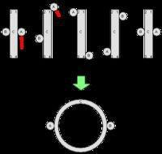  

西瑞尔效应

将磁铁C置换为一个圆环型磁铁，就成为一个简单的西瑞尔效应引擎(Searl Effect Generator)。按照Searl描述，此时，磁体A，B将不断自发加速运动，最后整个装置会脱离地球引力，腾空而去。

除了前面说的反引力效应外，西瑞尔效应还包括：

（1）、装置周围空气电离化

（2）、装置周围温度降低

由于效应中摩擦较小，不需输入便可维持较长时间的运转，因而被一些人称为永动机。

3.2、西瑞尔电机

西瑞尔电机是依据西瑞尔效应而设计制造出来的，据说它可以无源产生强大的磁场和电力输出，并可产生升力，以此基础制造出发电设备和飞行器。

机器结构

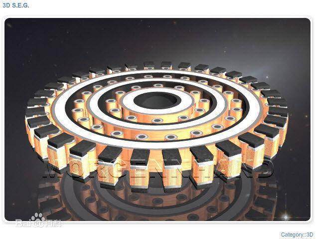  

西瑞尔电机结构

这个设备由1-3个圆环和1-66个（或更多）转子嵌套组成。

圆环和转子是相似的4层结构，由内到外依次是金属钕-聚四氟塑料（特氟龙）-永磁体-铜。

每个圆环是4层不同材料的环嵌套合成。

每个小转子由8段相同的薄铁饼吸合叠加，共32个部件组成。

转子靠磁力吸附在大转子上，转子围绕大环高速旋转后，他们之间会产生磁悬浮间隙，做无摩擦滑动，因此设备没有磨损件，寿命可达数十年以上。

设备的产出大于输入，一经初期的启动后，即可持续运行，理论上来说是不需要常规输入的永动设备。

为了收集电能和控制转速，可以在外围加上感应线圈。线圈工作时的磁场可以对转子产生作用力，影响转子速度，让机器启动或停止。 转子经过线圈，就会产生感应电，以此方法收集输出电流。

工作原理

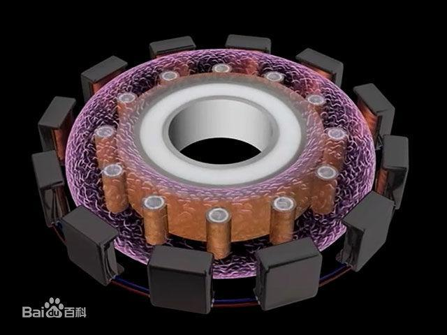  

西瑞尔电机原理

发明人解释的简要原理是金属钕射出电子，经过特氟龙层的缓冲，被外围磁场引导，导致转子不断做功或能源输出。

机器运动产生的效应

机器会产生所谓的“西瑞尔效应”：机器中心温度会明显下降到零下几十度、产生强大的磁场（磁墙）、周围的家用电器会自动开机、机器会自重会减轻甚至飞穿屋顶、发出奇异的光等。

2004年，俄国高温物理研究所的研究员仿制了瑟尔效应机（MEC），系大环转动而转子固定的单层瑟尔原理机，出现了类似的各种瑟尔效应，比如：中心降温数十度、持续输出电力7千瓦、数十立方米的强磁场（磁墙）、重量明显减轻、发光等。

2011年，美国航空航天局（NASA）科学家带领的启明星能源箱项目，成功仿制了俄国MEC，也宣称出现了类似的瑟尔效应。

这些现象似乎很难让人相信和理解，没有明确的物理学理论能解释该设备的原理和产生的一些列现象，有待更多研究和探索。

  

西瑞尔电机转动

注：上述内容参考【百度百科】：“西瑞尔效应”；【互动百科】：”瑟尔效应发电机“。

我的思考

西瑞尔效应已被多国证明了的并不是不可重复的“伪科学”，而且民间也有大量样机出现，这就让我感到好奇了：这个实验为什么没有引起物理学界的关注和重视？

在没有搞清楚这种效应里的磁力是如何产生的，又是如何运作的？这个效应的作用会不会导致物质的其他变化？等一些细节问题之前，物理学界为什么就匆匆忙忙地给它打上”第二类永动机“封条？......

从现代磁学理论角度看，西瑞尔确实难以理解，这说明我们目前磁学理论可能存在某些缺失或缺陷，或者说，对于磁旋转领域我们可能存在盲点或者说我们认识的还不够全面与深刻；但同样是旋转磁运动现象，我们为什么可以容忍粒子“自旋磁矩”存在，而不可以对西瑞尔效应给予“宽容”和关注呢？

从静磁学角度来看，磁滚筒旋转的内因应与中心磁体存在磁场强度梯度分布有关，同时由于我们预先施加了一个移动滚筒的外力，才造成滚筒绕中心磁体转动，而且这种转动由于摩擦力很小，故可以保证它们转动很长时间，但这并不违反能量守恒定律，我们为什么还要给它带上“第二类永动机”的枷锁呢？物理学界如此态度对待西瑞尔效应是不是有点违背科学探索精神呢？

反观民间热情，对此现象似乎也有理论突破点，如刊登在《发明与创新》杂志2005年第六期上的《对热力学第二定律的再思考》一文就提出，热力学第二定律在引力场中不成立，即引力场中空气温度会自发存在一定的温度梯度。

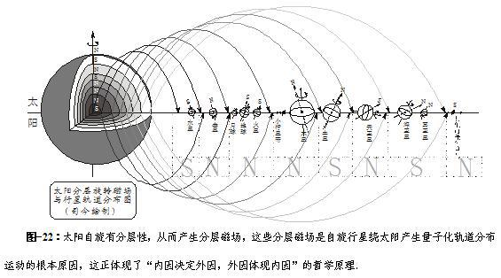  

太阳分层磁场与行星轨道分布

如果这种探索是对的，那么，在西瑞尔的磁引力场空间，中心体磁场的分层分布性也应存在，关于这种猜想，我们也可以从太阳系中行星轨道分布形态图看出一点端倪来，即由于太阳自旋有分层性，故在其周围空间就会产生分层磁场，各个带有自旋磁场的行星就会按太阳分层磁场分布空间的N、S极不同和场强差异去找出它们合适的稳定运动轨道。

而且，对于微观原子世界，电子的核外轨道分布也何尝不能去这样思考一下呢？

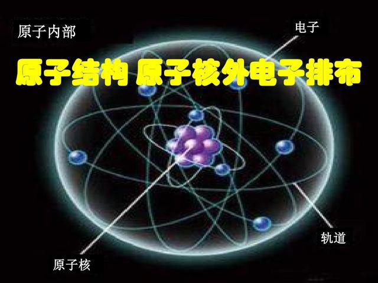  

原子核外电子轨道分布

物理真相大部分都埋在磁里，但对磁的认识我们熟悉而又陌生，我们熟悉它与我们息息相关，我们陌生它看不见摸不着，同时更陌生于它现行理论所产生的重重阻隔而不敢越雷池一步——这正是我们对待磁现象认识的缺陷和不公之处，这种态度必将会阻碍我们奔向宏观宇宙与微观世界磁海洋深处探索的脚步......

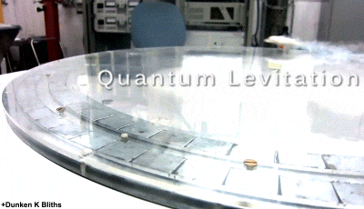  

超导磁悬浮