---

title: 原子轨道与轨道杂化理论

date: 2023-12-03 23:26:48

categories: /free/pte

tags: 
  - pte

original_url: https://zhuanlan.zhihu.com/p/591143453

---

# 原子轨道与轨道杂化理论

[轨道杂化理论](https://www.zhihu.com/search?q=%E8%BD%A8%E9%81%93%E6%9D%82%E5%8C%96%E7%90%86%E8%AE%BA&search_source=Entity&hybrid_search_source=Entity&hybrid_search_extra=%7B%22sourceType%22%3A%22answer%22%2C%22sourceId%22%3A242251644%7D)有两部分，一是轨道，二是杂化，理解杂化之前，先理解轨道，理解了轨道，杂化就好理解了。

**轨道**指的是围绕着[原子运动](https://www.zhihu.com/search?q=%E5%8E%9F%E5%AD%90%E8%BF%90%E5%8A%A8&search_source=Entity&hybrid_search_source=Entity&hybrid_search_extra=%7B%22sourceType%22%3A%22answer%22%2C%22sourceId%22%3A242251644%7D)的**电子运行的轨道**，更准确地说是电子出现在外空间某个地方的概率，有s、p、d、f、g、h等，再往后的轨道属于我未知的领域。

*   **每个轨道上，最多能够容纳两个电子**，运动方向相反（修正，此处应该为“相同”，感谢评论区指出）。轨道上有一个电子的时候不稳定，有两个电子的时候稳定。大概是拨浪鼓的样子。
*   s轨道有1个，p轨道有3个，d轨道有5个，f轨道有7个，g轨道有9个，h轨道有11个，以此类推。
*   在原子核外面的**电子是分层的**，每层可容纳的电子数最多是2n²，就是第一层最多2个，第二层最多8个，第三层最多18个。**原子外面的电子并不是像下图那样绕着一个球运动，而是按照轨道的方式运动。**
*   补注：为什么容纳电子数是2n²呢？因为：

1.  第1层外层只有1个s轨道，轨道总数量为1=1²，最大可容纳电子数为2\*1²=2；
2.  第2层外层有1个s轨道和3个p轨道，可容纳的轨道数为1+3=4=2²，最大可容纳电子数为2\*2²=8；
3.  第3层外层有1个s轨道、3个p轨道和5个d轨道，可容纳的轨道数为1+3+5=9=3²，最大可容纳电子数为2\*3²=18；
4.  可推导第n层电子层，可容纳的最多轨道数为n²，可容纳的最多电子数为2n²

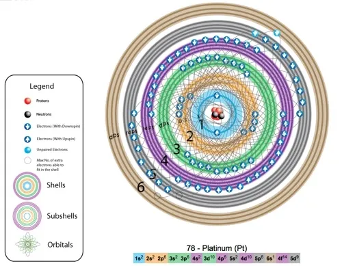

铂元素的电子层简图

*   每一层电子，都先有s轨道，再有p轨道，再有d轨道，就是说第一层的两个电子形成了一个稳定的s轨道，第二层又从[s轨道](https://www.zhihu.com/search?q=s%E8%BD%A8%E9%81%93&search_source=Entity&hybrid_search_source=Entity&hybrid_search_extra=%7B%22sourceType%22%3A%22answer%22%2C%22sourceId%22%3A242251644%7D)开始，电子填满了才会有p轨道。
*   **轨道杂化，只发生在最外层的轨道！里面已经填满了的轨道是稳定的不用管的。**
*   第一层的电子最多有两颗，是s轨道，对应的分别是氢和氦。

**氢**是1s1，原子外面有一个电子在s轨道上，不稳定，需要形成氢气或者和其他元素反应成为稳定的物质。  
**氦**是1s2，原子外面有两个电子在s轨道上，稳定。  
1s轨道如下：  

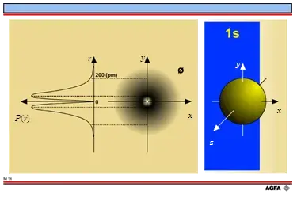

*   第二层电子有最多八颗，**第二层电子在第一层的s轨道外面，先由两颗电子形成一个第二层的s轨道，满了之后再形成p轨道。**

锂是2s1，原子外面先有一个层的s轨道，第一层s轨道外面再套一个s轨道，上面只有一个电子，不稳定。  
铍是2s2，原子外面先有一个层的s轨道，第一层s轨道外面再套一个s轨道，上面有两个电子，稳定。  
**2s轨道**如下，圆环套圆环：  

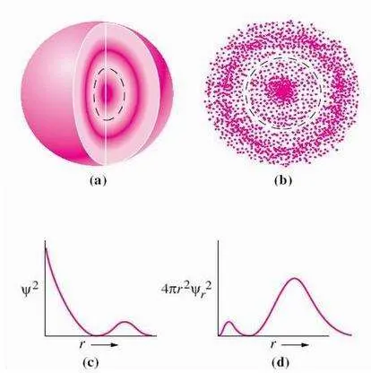

*   **第二层的s轨道排满了之后，后面的六颗电子就按照p轨道运动**

p轨道有三个，分别在[xyz轴](https://www.zhihu.com/search?q=xyz%E8%BD%B4&search_source=Entity&hybrid_search_source=Entity&hybrid_search_extra=%7B%22sourceType%22%3A%22answer%22%2C%22sourceId%22%3A242251644%7D)上

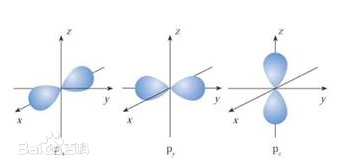

完整的三个p轨道合在一起是这样子的，**对应的元素是氖**（第一层一个s轨道，第二层一个s轨道，三个[p轨道](https://www.zhihu.com/search?q=p%E8%BD%A8%E9%81%93&search_source=Entity&hybrid_search_source=Entity&hybrid_search_extra=%7B%22sourceType%22%3A%22answer%22%2C%22sourceId%22%3A242251644%7D)）。

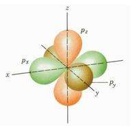

*   以此类推，各个元素具体的轨道可以看[元素周期表](https://www.zhihu.com/search?q=%E5%85%83%E7%B4%A0%E5%91%A8%E6%9C%9F%E8%A1%A8&search_source=Entity&hybrid_search_source=Entity&hybrid_search_extra=%7B%22sourceType%22%3A%22answer%22%2C%22sourceId%22%3A242251644%7D)。

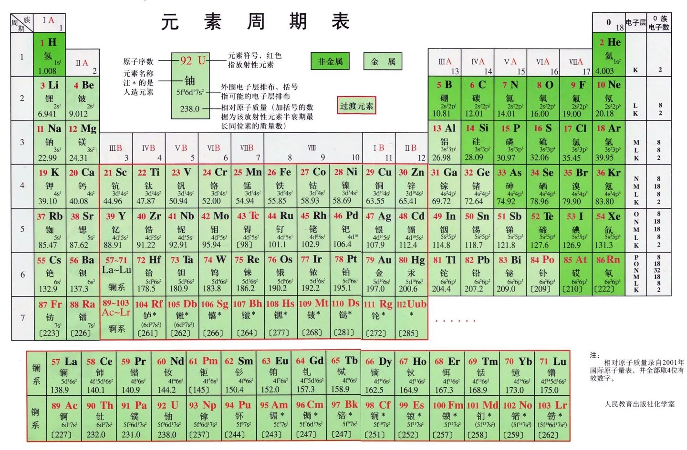

*   再接下来是属于课余知识的**d轨道**，长这样

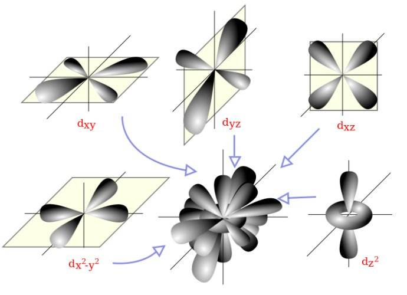

*   [f轨道](https://www.zhihu.com/search?q=f%E8%BD%A8%E9%81%93&search_source=Entity&hybrid_search_source=Entity&hybrid_search_extra=%7B%22sourceType%22%3A%22answer%22%2C%22sourceId%22%3A242251644%7D)，长这样，鬼知道它们合在一起之后会乱成什么样子

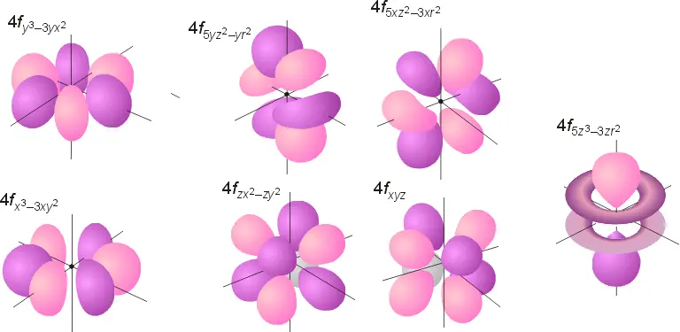

*   [g轨道](https://www.zhihu.com/search?q=g%E8%BD%A8%E9%81%93&search_source=Entity&hybrid_search_source=Entity&hybrid_search_extra=%7B%22sourceType%22%3A%22answer%22%2C%22sourceId%22%3A242251644%7D)，长这样，分别是5g、6g、7g的轨道

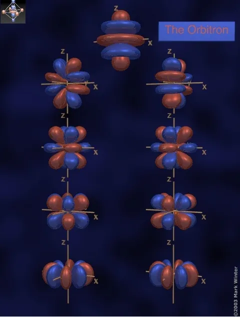

5g轨道

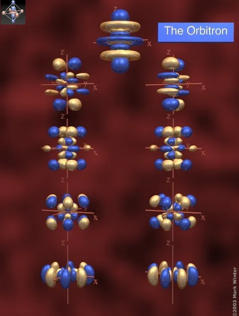

6g轨道

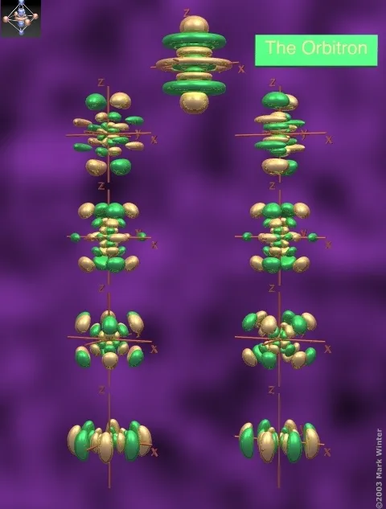

7g轨道

*   **杂化，就是原子受到外部因素影响（如碳和氢、氧和氢反应），外层的不同轨道（s、p轨道）互相影响，从不稳定的应激状态变成稳定状态，重新组合成新的轨道的过程**。sp杂化轨道学得最多用得最多，也被讨论得最多。有没有其他轨道之间的杂化？我估计是有的，我估计也是很复杂的。
*   什么元素容易发生杂化？有s轨道又有p轨道的，但是又不完整容易吸引外部氢元素的，所以碳氮氧都容易发生sp杂化。（氟会不会杂化我暂时不太确定，等其他高人解答吧）
*   sp杂化，就是球形的s轨道和哑铃型的p轨道合体变成**一大一小的新的轨道**。下图是一个s轨道和一个p轨道得到两个[sp1杂化轨道](https://www.zhihu.com/search?q=sp1%E6%9D%82%E5%8C%96%E8%BD%A8%E9%81%93&search_source=Entity&hybrid_search_source=Entity&hybrid_search_extra=%7B%22sourceType%22%3A%22answer%22%2C%22sourceId%22%3A242251644%7D)，右边的图中相对的一大一小两半是一个轨道。

*   碳的外层电子轨道是2s2 2p2，一个s轨道，一个p轨道，两个空的p轨道，可以发生sp1、sp2、sp3、杂化

**sp1杂化**，最常见的是[乙炔](https://www.zhihu.com/search?q=%E4%B9%99%E7%82%94&search_source=Entity&hybrid_search_source=Entity&hybrid_search_extra=%7B%22sourceType%22%3A%22answer%22%2C%22sourceId%22%3A242251644%7D)，一个碳原子sp1杂化是一个s轨道和一个p轨道杂化，得到两个成180°的sp1轨道，另外两个p轨道不杂化。注意，这里的四个轨道上分别都只有一颗电子，也就是说都不稳定。  

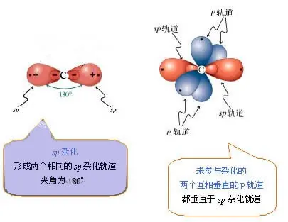

怎样才能稳定呢？两个sp1杂化的碳原子合体，再加两个氢原子，形成[乙炔C2H2](https://www.zhihu.com/search?q=%E4%B9%99%E7%82%94C2H2&search_source=Entity&hybrid_search_source=Entity&hybrid_search_extra=%7B%22sourceType%22%3A%22answer%22%2C%22sourceId%22%3A242251644%7D)。其中：  

1.  **“碳原子中的一个sp1杂化轨道的一个电子”**和**“另一个碳原子中的一个sp1杂化轨道上的一个电子”**形成一对稳定的电子；
2.  **“碳原子另外的sp1杂化轨道的电子”**和**“氢原子的电子”**形成一对稳定的电子；
3.  **“碳原子两个p轨道上的电子”**分别和**“另一个原子中的两个p轨道上的电子”**形成两对稳定的电子；同时，这两对p轨道还进一步形成两个[π-π共轭](https://www.zhihu.com/search?q=%CF%80-%CF%80%E5%85%B1%E8%BD%AD&search_source=Entity&hybrid_search_source=Entity&hybrid_search_extra=%7B%22sourceType%22%3A%22answer%22%2C%22sourceId%22%3A242251644%7D)。  
    

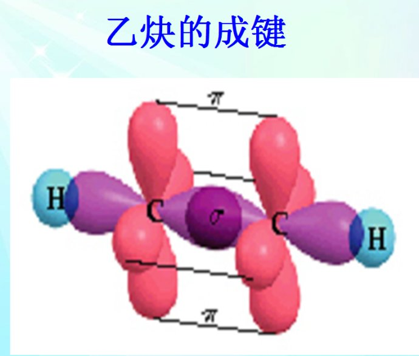

  
**sp2杂化**，最常见的是乙烯，一个碳原子sp2杂化是一个s轨道和两个p轨道杂化，得到三个sp2杂化轨道，一个p轨道不杂化。三个[sp2杂化轨道](https://www.zhihu.com/search?q=sp2%E6%9D%82%E5%8C%96%E8%BD%A8%E9%81%93&search_source=Entity&hybrid_search_source=Entity&hybrid_search_extra=%7B%22sourceType%22%3A%22answer%22%2C%22sourceId%22%3A242251644%7D)在一个平面上，成120℃夹角。  

同样，这里的每个轨道上也只有一颗电子，也是不稳定的，需要两个碳原子和四个氢原子组成C2H4才稳定。p轨道也同样会形成共轭。  

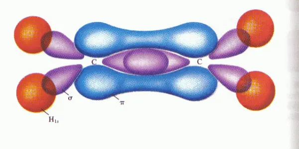

  
**sp3杂化**，最常见的是甲烷，一个碳原子sp3杂化是一个s轨道和三个p轨道杂化，得到四个sp3杂化轨道。四个sp3杂化轨道在一个正四面体的四个方向上。  

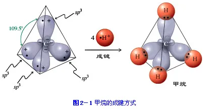

*   氮的外层[电子轨道](https://www.zhihu.com/search?q=%E7%94%B5%E5%AD%90%E8%BD%A8%E9%81%93&search_source=Entity&hybrid_search_source=Entity&hybrid_search_extra=%7B%22sourceType%22%3A%22answer%22%2C%22sourceId%22%3A242251644%7D)是2s2 2p3，一个s轨道，一个p轨道，一个不完整的p轨道，一个空的p轨道；氧的外层电子轨道是2s2 2p4，一个s轨道，两个p轨道，一个空的p轨道。它们具体怎么杂化我也不太清楚，可以在课后问问化学老师。
*     
    最后放个大[Grand Orbital Table](https://link.zhihu.com/?target=http%3A//www.orbitals.com/orb/orbtable.htm)

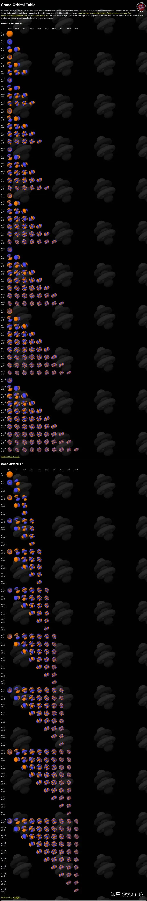