---

title: 能量治疗仪器MWO(多波振荡器)

date: 2023-12-02 22:13:53

categories: /free

tags: 
  - mwo

original_url: https://mp.weixin.qq.com/s/XarATTksr0_qIFgbxFPjjw

---

# 能量治疗仪器MWO(多波振荡器)

  

（本文根据多家海外研究团体的相关资料整理而成。）  

**MWO是多波振荡器**

MWO是多波振荡器（Multi-wave oscillator）的简称，由俄裔科学家乔治.拉科夫斯基(Georges Lakhovsky)发明，所以，又常称为Lakhovsky多波振荡器。  

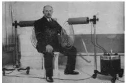

拉科夫斯基从1894 年，在法国修读物理、土木工程及医学。

第一次世界大战后，他开始研究不同振频的电磁波对身体健康的影响。

拉科夫斯基认为，宇宙中的每个原子都有一个频率，无论是一粒沙子、一片钢铁，还是植物、动物、人体的每个细胞，都以特定的频率或振幅产生共振或振动。

疾病的发展本质上，是宿主细胞的共振与病原微生物的共振之间的斗争，如果致病细胞的振荡占了上风，就会导致疾病。

拉科夫斯基发现，患有疾病的人或植物，如果可以增加健康细胞振荡的幅度，这种增加将压倒和抑制致病细胞产生的振荡，从而导致体内的致病细胞死亡。

1924年12月初，拉科夫斯基在巴黎的一间医院，用植物做实验，成功治好了植物的癌症，证明了他的理论。  

他首先设法让10棵天竺葵都染上癌症，30天后，所有天竺葵都出现了肿瘤。

他从10株受感染的天竺葵中选了一株，将一根粗铜线做成一个直径约30厘米的环形开口线圈，绕在这一株天竺葵的中心，并用硬橡胶桩固定住。

铜线圈充当天线或调谐线圈，收集和集中来自极高频率宇宙射线的振荡能量。

线圈的直径决定了要捕捉的频率范围，他发现30厘米的线圈捕捉到了植物细胞共振频率范围内的频率，这种捕获的能量加强了植物细胞的细胞核自然产生的共振，使得这一株天竺葵能够压倒癌细胞的振荡并摧毁癌症。

肿瘤在不到3周的时间内脱落，到了2个月的时候，这一株天竺葵开始茁壮成长。而没有铜圈的其它9棵天竺葵，因为癌症，在30天内全部死亡。

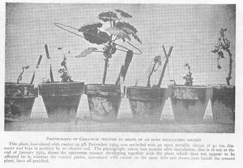

该照片拍摄于癌症接种后的第8周，其它在同一天接种了癌症的对照植物，已经全部死亡。

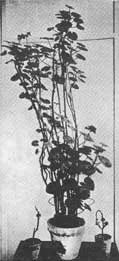

这株天竺葵留着原来的线圈，3年后，长成了一个非常健壮的标本。

这说明：振荡回路的射频辐射只影响了植物的患病部分，而不会影响植物健康的部分。

其后几年，拉科夫斯基继续他的研究，并在多家私人诊所接治病人。  

1929~1930年，拉科夫斯基在好友尼古拉·特斯拉（Nikola Tesla）的支持和帮助下，升级研发了「多波振荡器」（Multi-wave oscillator，简称MWO）。

（一定要给大家隆重介绍一下尼古拉·特斯拉，这位伟大的物理学家、电气工程师和发明家，被誉为“创造出二十世纪的人”。

他是现代交流电系统的发明人，是电力得以普及的重要推动者之一；在电磁场领域有着多项革命性发明，他的多项相关专利以及电磁学的理论研究工作是现代无线通信和无线电的基石。  

特斯拉的梦想就是给世界提供用之不竭的能源。美国“特斯拉汽车”的品牌命名，就是为了纪念尼古拉·特斯拉对人类做出的巨大贡献。）

1931 年，「多频振荡器」MWO在美国取得专利。

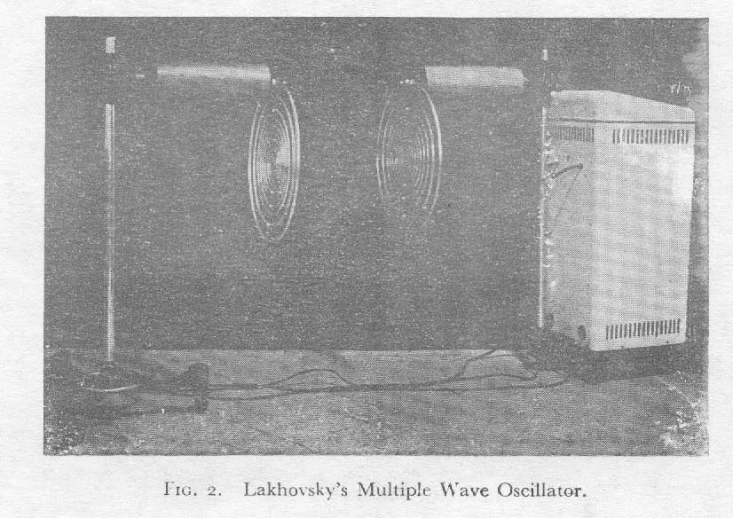

1931 年开始，拉科夫斯基在巴黎多家医院，使用MWO，成功治好许多癌症和其他疾病。

癌症病人每星期只需要使用MWO一次，连续使用四星期就能够痊愈，他在11年间成功地医治好了98%的癌症病人。

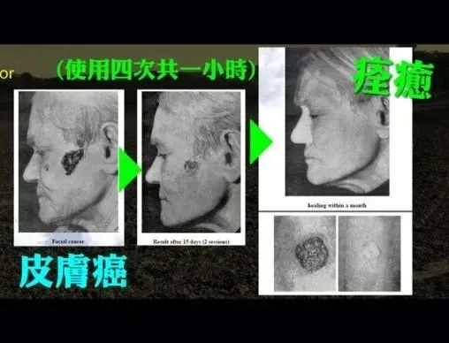

那些医院分别是Saint Louis Hospital、Valde-Grace Hospital、Calvary Hospital以及Necker Hospital。

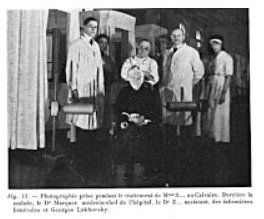

**MWO的基本原理**  

1929年，拉科夫斯基以法文写了一本书，名为《生命的秘密：电子、辐射及你的身体》，阐释了有关MWO的理论和运作原理。

这里简单介绍MWO的最基本原理：

人类细胞需要有一个约-70至-90mV的电压能量，才可以正常健康地运作，当细胞因为不同原因而电压下降，降至-50mV就会生病，再下降到-15mV就会死亡。

拉科夫斯基发现，细胞核的DNA是呈丝状的绕圈，其实就等同于是一个能够接收电波的天线。

所以，MWO利用天线接受大气里面或人工所发出的高频电压电波，与身体的细胞产生共振，为细胞充电，恢复细胞-70至-90mV的正常运作电压，就可以令身体回复健康，自愈各种疾病。

天空每日都会有闪电，天空中的闪电，会完整地将最低至最高的频率制造出来，充满在空气之中，既然我们身边已经存在这些频率，只要再加上一条拥有人类细胞所需要的波频的多波长天线，来接收这个频率，就可以应用在身体上了：

当身体细胞里犹如天线的DNA，遇到附近出现相同频率的共振能量，就能够像音叉一样产生共振，提升细胞的能量，让细胞电压上升到-90mV，从而可以恢复正常的健康状态。

拉科夫斯基最初只是使用一个30厘米的铜环作为MWO天线，后来拉科夫斯基发现，可以用多个铜线环，同时戴在人(或动物)的腰部、颈部、肘部、手腕、膝盖或脚踝上。

这些简单的线圈，就可以增强人体细胞的力量，增强免疫反应，从而对付入侵的病原体，在足够的时间后，疼痛症状会得到很大的缓解。

当时，当这些“拉科夫斯基线圈”获得成功的消息传播开来时，许多欧洲人都想要得到自己的线圈，他们经常要排队等上好几个月才能得到。

为了提升效能，1930年，在好友尼古拉·特斯拉的帮助下，利用特斯拉发明的特斯拉线圈（Tesla Coil）制造高达十多万伏特的电压，令MWO的天线产生跳火，如此，MWO的能量就可以比以前多达一百万倍。所以，即使癌症，也只需要四星期就可以痊愈。

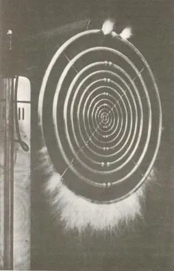

MWO传输一个完整的谐波频谱，使人体内的每个细胞都能接收到合适的频率并与之共振，从而恢复每个细胞原来的共振频率振动——这可能是青春的频率。  

从下面这张已经几十年前的老照片，我们可以清楚地看到这位皮肤癌患者下巴、颈部的皱纹，越来越少。

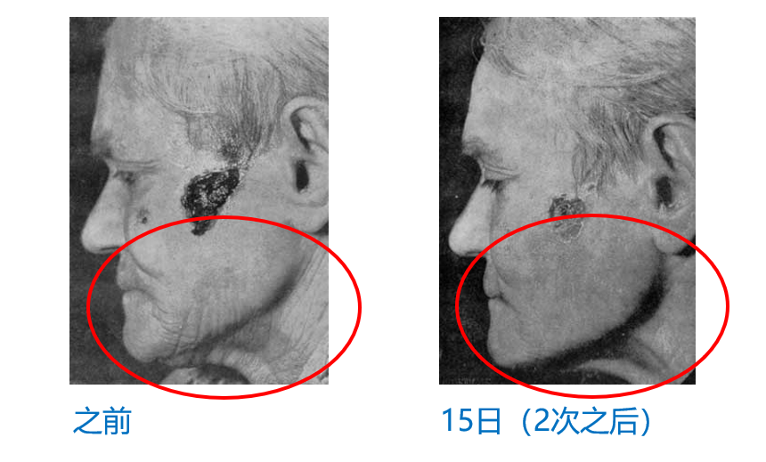

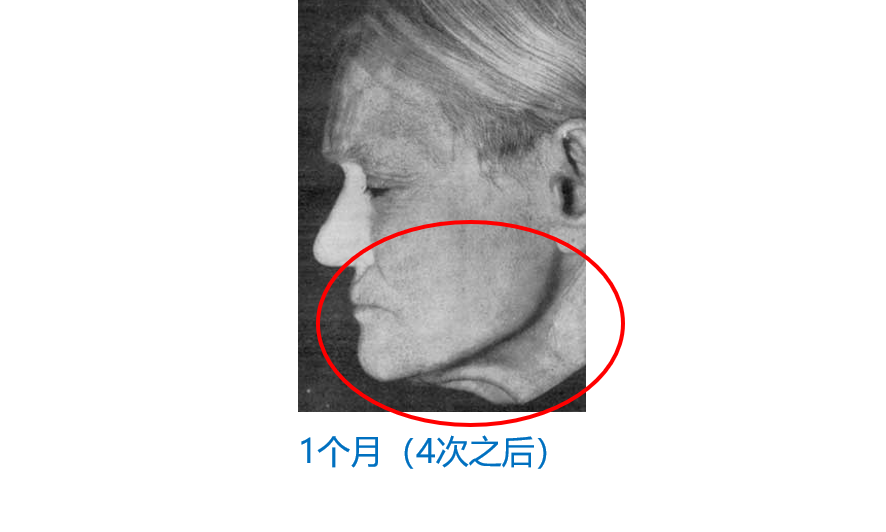

1941年，因二战的战火蔓延至法国，拉科夫斯基为了逃避纳粹统治，移居到美国纽约，在当地一家医院继续进行MWO的临床研究。他曾与布鲁克林一位著名的泌尿科医生进行了为期七周的临床试验，获得了显著的结果。

可惜的是，1942年，拉科夫斯基在一次神秘车祸中死亡，他在纽约被一辆房车撞倒，本来只是轻伤，却被车上的人强行带到当地医院，数天后神秘死亡，他在纽约医院的所有MWO机器都被人搬走，病人被告知这种疗法不再有效。

似乎是有隐藏的手在起作用，MWO的显著疗效被美国医疗当局忽视了，他们仍然专注于通过手术或药物治愈。

从此，MWO似乎在美国消失了，但在欧洲还一直有医生使用MWO。

1951年，MWO的专利到期，现属于公共领域。近二三十年来，随着能量医学在欧美的兴起，MWO重新得到了越来越多人的重视，在法国、德国和意大利的一些医院中都有使用，也出现了各种改进型的MWO设备。

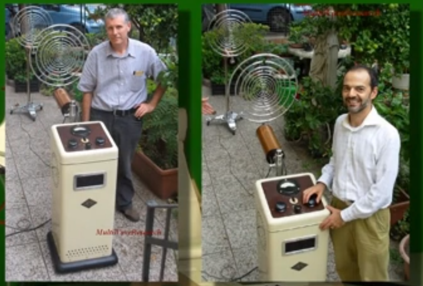  

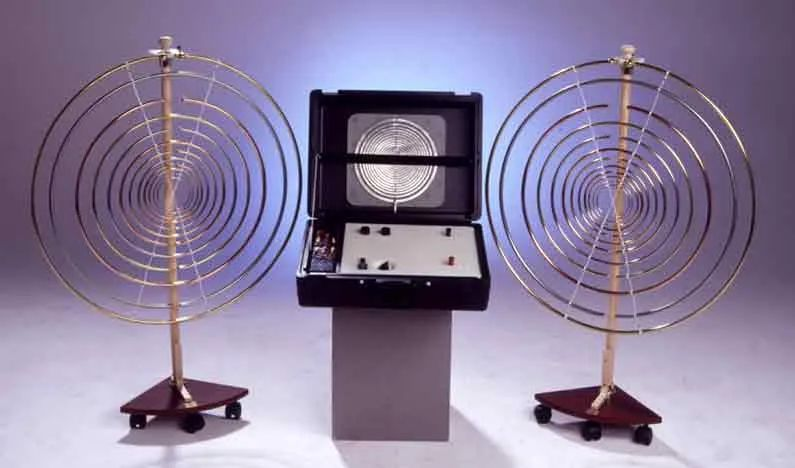

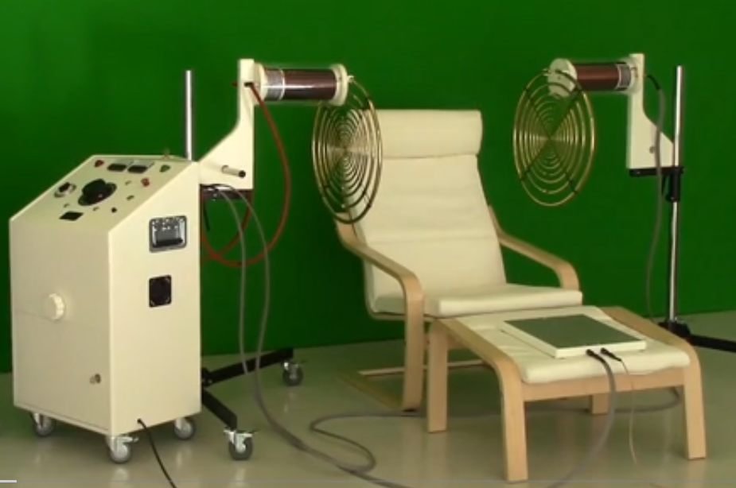

**偏振光盘**

还有一些团队,基于MWO的原理，开发出了各种便携版的能量产品，偏振光盘就是其中之一。

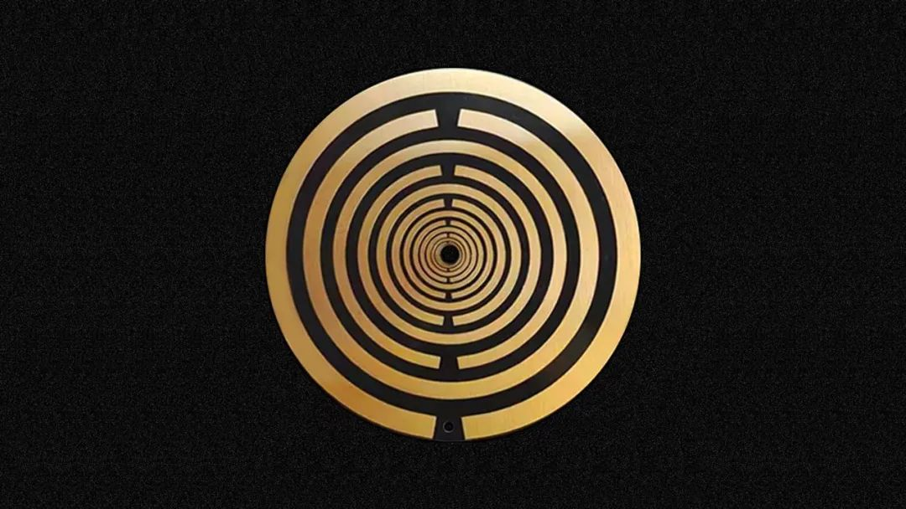

偏振光盘是一个小圆盘，无需任何电源，可增加生物体内生命能量的流入，可在短时间内驱动人体中的电流，从而激发人体的自愈功能。  

来自用户的实践表明，偏振光盘可以有助于我们解决各种疼痛和健康问题。

明天，我们再接着聊一聊偏振光盘的使用方法~~
