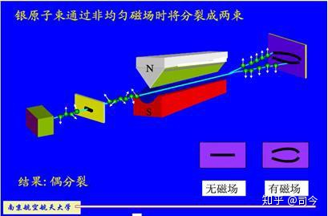
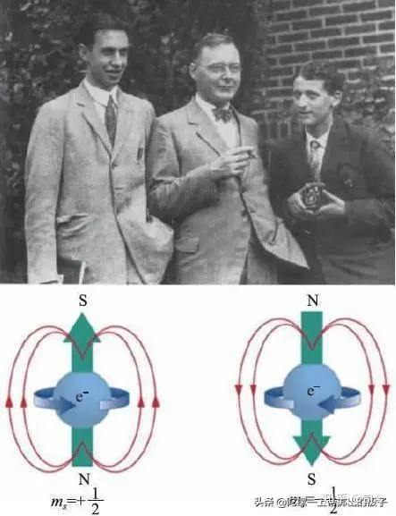
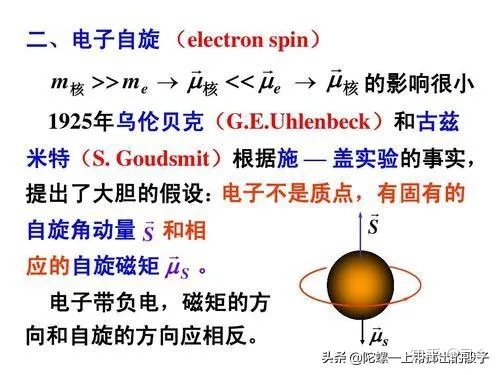

---

title: “电子自旋”趣事（1）——电子自旋超光速是如何计算的？ - 知乎

date: 2024-05-13 22:31:05

categories: default

tags: 
- 无

original_url: https://zhuanlan.zhihu.com/p/102772440

---

# “电子自旋”趣事（1）——电子自旋超光速是如何计算的？ - 知乎

## **“电子自旋”趣事（1）——电子自旋超光速是如何计算的？**

司今（jiewaimuyu@126.com）

  

  

在量子力学发展史中，曾经发生过一桩很有趣的探索故事，那就是关于电子自旋概念引入的问题。

斯特恩—革拉赫实验证明，电子运动通过非均匀磁场时会表现出自旋与磁矩性，也就是说，运动电子像一个非常小的自旋磁陀螺；1921年，康普顿在关于X射线研究中曾萌生过这个念头，但他没有坚持自己的看法。

  

  

1925年秋，二个“无知”的物理系学生—古兹米特和乌伦贝克，受泡利不相容原理启发，将泡利电子的第四个量子数定为电子的自旋，他们写成论文交给物理学家Ehrenfest修改，Ehrenfest提醒他们：

1、如果将电子看作是带有面电荷的转动小球，那么，它产生的磁矩公式前要加一个因子2，即gs =2，这就是量子力学后来引入的郎德因子。

  

  

2、建议他们去询问一下威望极高的物理学家洛伦兹。

当二位年轻人满怀希望地找到洛伦兹后，发现：洛伦兹并不赞同电子像一个小磁陀螺一样运动的看法，因为，他通过一系列计算发现，如果电子像小磁陀螺自旋，则它的表面转动速度要比光速大很多倍，这就违反了当时公认的“光速是物质运动的极限速度”的结论。

  

  

他们只好带着沮丧返回，并急匆匆去找Ehrenfest要回论文稿，而Ehrenfest却告诉他们“我早寄出去了，你们都还年轻，允许你们干点蠢事。”

正是Ehrenfest的疏忽与宽容，才成就了电子自旋概念的横空出世。

论文发表后，自然遭到很多知名物理学者的反对，但由于电子自旋假设可以很好地从物理机制上解释斯特恩—革拉赫实验及反常塞曼效应等实验现象，最终还是被物理学界所接纳，并成为经典量子力学的重要组成部分。

  

  

我介绍这段关于电子自旋假设确立的曲折经历就是想告诉大家：回顾历史，了解电子自旋概念的来龙去脉，对深入思考、理解量子力学会很有帮助；同时也提醒挚爱科学探索的朋友们：做科学研究要有自己的观点、要坚持自己的观点，不要被“经典”束缚，更不要迷信权威！

**那么，关于电子自旋表面速度超光速，是如何计算得来的呢？**

我这里简略介绍几种计算方法，仅供大家参考：

**1、 普朗克常数法**

v是电子自旋时其表面的线速度，M为电子的质量，M=9.1×1031kg，R为电子的半径，最大不会超过1014m，取R=1014m，代入上式中，可求得：

1/2h=ωʃr2dm=2ωm r2/5,v=5h/4mr,v=1.45×1010 m/s.

**查询：**[http://wenku.baidu.com/view/342e97126edb6f1aff001f19.html](https://link.zhihu.com/?target=http%3A//wenku.baidu.com/view/342e97126edb6f1aff001f19.html)

**2、角动量法**

mvr/2=h/2π,v≈10c=3×109m/s .

**查询：**[http://wenku.baidu.com/view/c2f982244b35eefdc8d3332c.html](https://link.zhihu.com/?target=http%3A//wenku.baidu.com/view/c2f982244b35eefdc8d3332c.html)

**3、转动惯量法**

自旋角动量L是h/2π的数量级，也就是10^（-34），L=J(转动惯量)\*w(角速度)，电子模型为球体，J=2.5mr^2，w=v/r，所以L=2.5mrv，m数量级为10^(-31)，r数量级为10^(-16)，故v数量级为10^（13），以上均为国际单位制，可见表面速度远大于10^(8)数量级。

**查询：**[http://wenku.baidu.com/view/26a3ad0bbb68a98271fefa64.html](https://link.zhihu.com/?target=http%3A//wenku.baidu.com/view/26a3ad0bbb68a98271fefa64.html)

**4、精细结构常数法**

L~pr~h，r=e^2/mc^2为经典电子半径，带入可知v~c/α，α=1/137为精细结构常数，也就是说v~137c

**查询：**[http://emuch.net/html/201111/3777032.html](https://link.zhihu.com/?target=http%3A//emuch.net/html/201111/3777032.html)