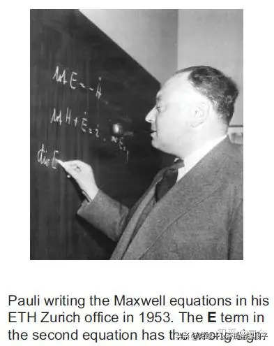
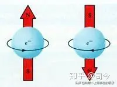
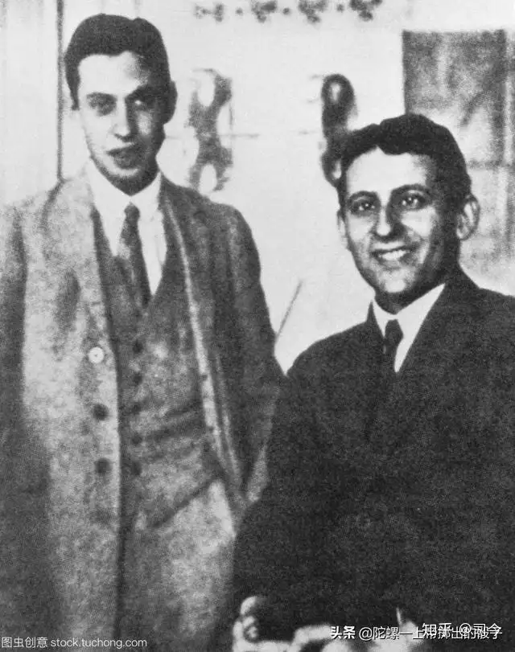
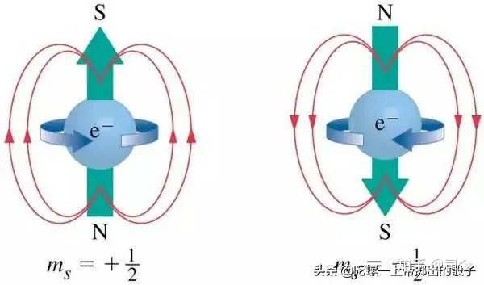

---

title: “电子自旋”趣事（2）——克罗尼格痛失电子自旋首发权 - 知乎

date: 2024-05-13 22:31:32

categories: default

tags: 
- 无

original_url: https://zhuanlan.zhihu.com/p/102772961

---

# “电子自旋”趣事（2）——克罗尼格痛失电子自旋首发权 - 知乎

## “电子自旋”趣事（2）——克罗尼格痛失电子自旋首发权  
  
司今（jiewaimuyu@126.com）  
  

  
克罗尼格(Ralph Kronig)是一位美国哥伦比亚大学的博士生，他早先就有了电子自旋设想，但一直未发表；1925年1月，他去德国物理学家朗德的实验室访问，但恰巧泡利也在此访问，于是克罗尼格见到就向他提起了自己的电子自旋设想。  

  
当泡利听到克罗尼格的想法，随即给了他一顿批判，且毫不留情面，并严厉地指出，如果电子存在自旋，那么为了产生足够的角动量，电子假想赤道表面的线速度将超过光速，这是相对论所不容许的。  
遭此当头一棒的克罗尼格，一下对自己关于电子自旋的研究失去了信心，致使克罗尼格没有敢发表他那开创性的论文。  

  
但半年后，两位荷兰物理学家姆尔·高斯密特(Samuel Goudsmit)与乔治·乌伦贝克发表了关于电子自旋的文章，并引起了物理学界的巨大反响。  
当克罗尼格看到这篇文章时，悔恨不已，对泡利的那盆冷水耿耿于怀，克罗尼格对电子自旋的研究，实际上要比乌仑贝克和古兹米特研究更早、更深入，但是他现在已经失去了首发权。  

  
克罗尼格是哥本哈根诠释的支持者，这件事很快让波尔知道了，于是波尔鼓励克罗尼格把他的研究发表出来，以至于在电子自旋史册上留下一笔，克罗尼格的论文最终于1926年4月发表在《Nature》杂志上），但此时已失去他应有的光环，实在让人遗憾！  

  
后来，泡利虽然接受了电子自旋观点，但他给克罗尼格造成的伤害是无法弥补的！  
通过”泡利—克罗尼格“事件，让我们看到，所谓科学权威，往往扮演着阻碍科学创新的角色；要想创新，就绝对不要迷信权威！  

