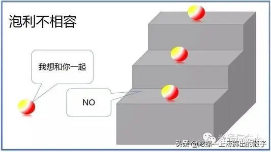
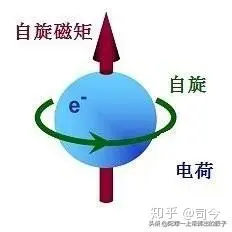
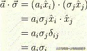
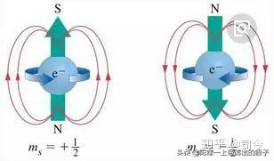
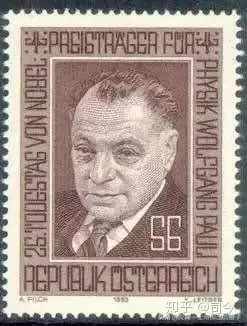

---

title: “电子自旋”趣事（3）——泡利对电子自旋研究的贡献 - 知乎

date: 2024-05-13 22:31:59

categories: default

tags: 
- 无

original_url: https://zhuanlan.zhihu.com/p/102773549

---

# “电子自旋”趣事（3）——泡利对电子自旋研究的贡献 - 知乎

## “电子自旋”趣事（3）——泡利对电子自旋研究的贡献

司今（jiewaimuyu@126.com）  
  

  
在电子自旋发现史中，沃尔夫冈·泡利扮演的角色不可低估。  
1924年，沃尔夫冈·泡利首先引入了他称为是“双值量子自由度”(two-valued quantum degree of freedom)概念，它与最外壳层的电子有关，这可以使他形式化地表述“泡利不相容原理”，即没有两个电子可以在同一时间共享相同的量子态。  

  
但当时人们对与泡利的“双值量子自由度”物理含义是什么？答案却是未知的。  
1925年G.E.乌伦贝克和S.A.古兹密特受“泡利不相容原理”启发，分析原子光谱的一些实验结果，提出电子自旋概念，并与电子自旋磁矩相联系，由此解释了原子光谱的精细结构及反常塞曼效应 。  

  
泡利对电子自旋假设开始是非常反感甚至是憎恶的，就在乌伦贝克和S.A.古兹密特发表电子自旋论文的半年之前，美国哥伦比亚大学的博士生克罗尼格(Ralph Kronig)将他对电子自旋的设想告诉了泡利，当即就遭到泡利的严厉批评，这导致克罗尼格迟迟没有发表他的关于电子自旋方面的论文，因此痛失了电子自旋首发权。  

  
当泡利得知G.E.乌伦贝克和S.A.古兹密特发表关于电子自旋方面的论文并引起物理界轰动时，他随即发表文章对乌仑贝克和古兹米特的论文进行批判，并且他还试图说服波尔不要接受电子自旋观点，因为泡利始终认为，自旋电子就是经典世界的旋转，表面线速度超过光速是他无法接受的。  
后来，在波尔等人的反复沟通下，泡利最终还是接受了电子自旋概念；他在1926年3月12日给波尔的回信中写道："我现在别无选择，只能无条件接受，……我深深地表示抱歉，因为我自己的愚蠢，给您添加了麻烦……"。  

  
再后来，泡利不但接受了自旋概念，还提出了关于电子自旋描述的“泡利矩阵”，并于1945年因提出的“泡利不相容原理”而获得物理学诺贝尔奖。  
从泡利对待电子自旋问题上可以看出，泡利在其中所扮演的角色无可替代，因G.E.乌伦贝克和S.A.古兹密特发表的电子自旋论文就是受到他的“泡利不相容原理”启发而来的，但其中也充满戏剧性；泡利从反对到拥护，并建立泡利矩阵来完善非相对论的电子自旋理论都起到了画龙点睛的作用！  

  
从中我们也可以看出，老一辈科学们的胸怀和担当是值得后人学习和敬仰的；同时也说明，科学没有权威，只有真理才是权威，才会永放光芒！  

