---

title: “电子自旋”趣事（4）—一只劣质香烟成就斯特恩-格拉赫实验成功 - 知乎

date: 2024-05-13 22:32:51

categories: default

tags: 
- 无

original_url: https://zhuanlan.zhihu.com/p/102773875

---

# “电子自旋”趣事（4）—一只劣质香烟成就斯特恩-格拉赫实验成功 - 知乎

## “电子自旋”趣事（4）—一只劣质香烟成就斯特恩-格拉赫实验成功

司 今（jiewaimuyu@126.com）  
  

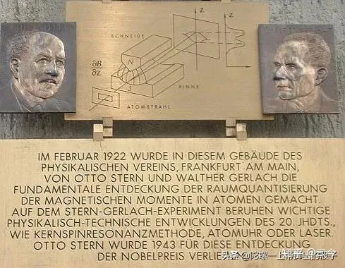

  
斯特恩–革拉赫实验是原子物理学和量子力学的基础实验之一，也是近代物理学史上最有价值的实验之一，它不仅首次证实原子在磁场中取向量子化，即原子角动量量子化的分布性，而且也是直接证明了电子自旋及其自旋磁矩存在的关键性实验之一。  

  
这个实验最初构想是建立在拉莫尔进动经典理论和玻尔 -索末菲旧量子理论相结合的基础上，但是实验结果却为新量子理论的发展提供了理论引导—肯定了物理世界从经典理论向量子理论发展的正确性。  

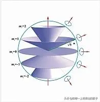

  
对斯特恩来说，导致斯特恩-盖拉赫实验的最直接的原因是玻尔模型中空间量子化的一个尚未观察到的性质，即玻尔模型要求氢原子气体应该是双折射的，因为电子在垂直于场方向的平面内有转动。  

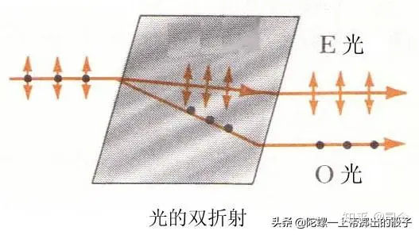

  
他认识到，根据玻尔模型空间量子化应该只是两重的，因为轨道角动量的投影被限定为hˆ，这个两重的特征使得利用原子束的磁偏转来验证空间量子化成为可能。尽管原子束的速度分布会使模糊条纹，但在足够大的磁场梯度下，两个取向相反分量的劈裂会大于原子束的宽度。与此相对照, 经典力学预言原子磁体虽然会在磁场中进动但仍然保持随机取向，因此磁偏转会导致束的加宽但不会劈裂。因此，斯特恩认为他预想中的实验"如果成功的话，将毫不置疑地在量子理论和经典观点之间作出抉择。  

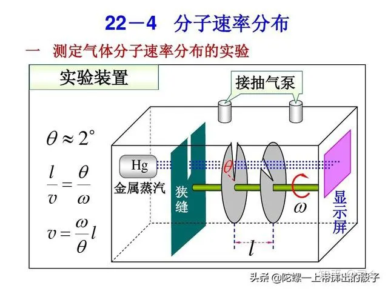

  
1920年斯特恩就曾用银原子束作实验证明了麦克斯韦速率统计的正确性，他由此设想，如果再用银原子束通过磁场空间作实验，能不能看到空间量子化存在现象呢？  
第二天早上，他醒来挺早，但那天实在太冷，所以他就"躺在床上思考，有了做这个实验的想法。"  
于是，斯特恩急忙起床，赶到玻恩那里，将他的实验设想告诉了玻恩，但却被玻恩当头浇了一盆冷水；玻恩在其自傳里写到："很长一段时间后我才认真考虑那个主意。我始终认为空间量子化（阿诺德·索末菲提出的）只是一种对你根本不明白的某个事物的形式表达。但要象斯特恩那样逐字逐句地琢磨，这可是他的主意。我试图说服斯特恩那里面（指空间量子化）没什么意义，但他告诉我说值得一试。"  

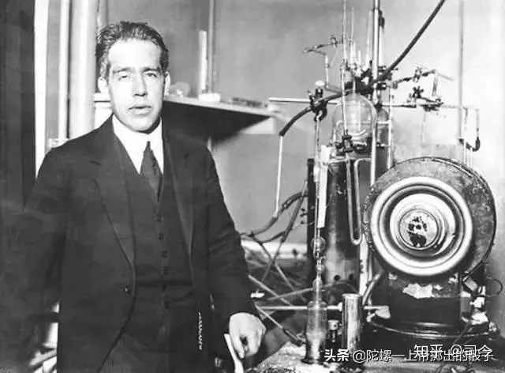

  
也许是天意吧，年轻的斯特恩的实验激情并没有被玻恩的那盆冷水所浇灭，他最终还是静下心来坚持做他的实验。  
很幸运的是，斯特恩发现盖拉赫急切想加入他的行动—盖拉赫那时还不知道什么是空间量子化。  

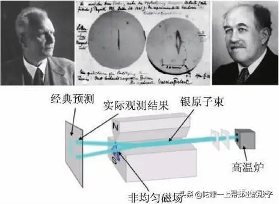

  
尽管斯特恩做了精心的设计和可行性计算，实验还是花了一年多的时间才完成。在最终定型的设备中，一束银原子束（由在炉子中加热到1000摄氏度得到的金属蒸汽通过喷流过程形成的）用两个0.03毫米宽的狭缝准直后导入3.5厘米长的偏转磁场内，磁场强度约为.1 Tesla，梯度为10 Tesla/cm。所实现的银原子束的劈裂仅为0.2毫米。相应的，准直狭缝或磁铁多于0.01毫米的偏差都可能使实验的努力付诸东流。设备的使用寿命只有几个小时。所以，最后收集板上得到的银的镀层非常薄，肉眼根本看不见。斯特恩这样描述早先的一段插曲：给真空系统充气后，盖拉赫卸掉了用于收集银原子束的法兰。但是，他连一点银镀层的痕迹都看不到，就把法兰递给了我。我凑近法兰仔细观察，盖拉赫就站在我身后。奇怪的是，束斑的痕迹渐渐显现出来。后来我们知道是怎么回事了。我那时相当于一个助教，收入不多，抽不起好烟，净抽劣质烟卷。劣质烟含硫，我呼出的气息慢慢地把收集板上的银变成了黑色的硫化银所以就可见了。这就象是冲洗相片。  

  
尽管两人继续在实验室里喷云吐雾。意想不到的困难仍是不断出现。几个月的努力了无收获，斯特恩关于空间量子化的态度也在摈弃和坚信之间摇摆。盖拉赫还遭遇许多持怀疑态度的同事，其中包括德拜。德拜说"你肯定不相信原子的空间取向是物理实在，那只是电子的时刻表。"  
另一个障碍是那时开始困扰德国的财政紧张。玻恩不停地筹集资金支持斯特恩-盖拉赫实验。他利用当时人们对爱因思坦和相对论的兴趣在"大学最大的讲堂里开设讲座…收入场费的…这样筹集的钱让我们支撑了好几个月，但随着通货膨胀越来越严重…必须找到其它财源。"玻恩以开玩笑的口吻向他的一个动身到纽约旅行的朋友提到了他的窘境。难以置信的是，几个星期后他收到一张明信片，告诉他可以给古德曼(Goodman)写信，告知人家他的地址。玻恩后来回忆"起初我觉得这是另一个玩笑，但细想想我觉得应该试一试…一封措辞恭敬的信发了出去，不久收到一封热情洋溢的回信和一张几百美元的支票…古德曼的支票挽救了我们的实验实验进行得非常顺利。"古德曼, Goldman Sachs 投资行和Woolworth Co商行的创始人，祖籍法兰克福。  

  
与此同时，斯特恩当上了罗斯托克大学的理论物理教授。1922年初，他和盖拉赫约定在哥廷根会面, 评估当时实验的形势并决定放弃。可是，一场铁路罢工拖延了盖拉赫回法兰克福的形成, 他又有了一整天来检查所有的实验细节。他决定继续下去，改进装置后，不久就清楚的观察到原子束分裂成两束。盖拉赫给斯特恩发了一封简短的电报"玻尔是对的。"斯特恩回忆说他当时的惊讶和激动是无法形容的。盖拉赫也给玻尔发了一封印有原子束分裂照片和贺词的明信片。  

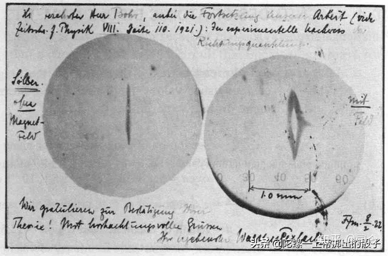

  
通过改进实验和仔细分析，斯特恩和盖拉赫甚至能够确定银原子的磁矩正是一个玻尔磁子，误差为10%。这一对空间量子化的直观演示迅速被接受为量子理论具有说服力的证据。但是，这一发现却是一把双刃剑。爱因思坦和爱伦菲斯特以及其他人努力想弄明白原子磁体是如何在外场中采取一定的预置的取向的。因为原子和外场的相互作用能是取向的函数，束流中的原子低密度不足以引起能量交换，则依随机取向进入磁场的原子是如何发生分裂的问题依然悬而未决。类似的，磁双折射的缺失变成了一个更加难解的谜。盖拉赫1922年到罗斯托克后曾在钠蒸汽里观察磁双折射，和其他人一样，他的努力全白费了。  

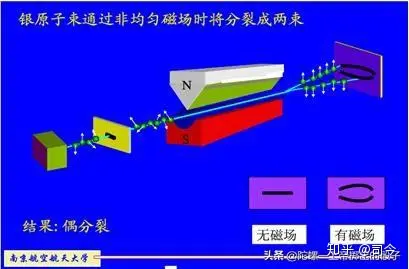

  
这些难题，还有其它的比如反常塞曼效应之类的难题，要等到多年后量子力学发展到加进了电子自旋理论才得以解决。量子力学的发展让玻尔模型显得过时，但却增加了空间量子化的内涵和重要性。斯特恩-盖拉赫实验与旧理论的皆大欢喜的相符不过是个幸运的巧合。银原子的轨道角动量实际上是零, 而不是玻尔模型所假定的h/2π。其磁矩源自大小为h/4π的电子自旋角动量，因此在磁场中分裂成两束。因为其托马斯(Thomas)因子是2（这一点是1926年才弄清楚的），所以银原子的磁矩大约是一个玻尔磁子。大自然就是这样表演了一出造化弄人的把戏。  

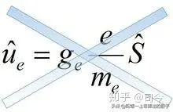

  
还有一个不寻常的历史之谜尚未揭开。考虑到斯特恩-盖拉赫实验1922年引起的广泛兴趣，则在自旋理论1925年被提出后应该很快会用自旋的概念重新加以解释。实际情形是，直到1927年弗莱塞(Fraser)发现银、氢和钠原子的轨道角动量为零，斯特恩-盖拉赫实验才被归因于自旋。现今的课本都说斯特恩-盖拉赫实验验证了电子自旋, 但却未指出两位勇敢的科学家根本就不知道他们发现的是自旋。  

  
如果说斯特恩 -盖拉赫实验原理是建立在拉莫尔理论和旧量子理论的基础上，是对经典力学的否定，是量子力学的理论引导；那么塞曼效应与反常塞曼效应则应该是量子力学的事实体现；反常塞曼效应不断鞭策着斯特恩 -盖拉赫实验结果逐渐趋于正确的理论解释；塞曼效应及反常塞曼效应和斯特恩- 盖拉赫实验均是电子自旋实际存在的直接证据。  

  
斯特恩本是想通过用“斯特恩 -盖拉赫实验”来验证玻尔- 索末菲理论经典量子力学理论的，但却误打误撞地证明了角动量空间取向量子化，而且也深刻揭示了电子自旋及自旋磁矩的存在；自此实验成功后，角动量空间取向量子化的取代了空洞的经典空间量子化概念，同时也给电子自旋假设提供了实验验证，量子论也从玻尔的经典时代迈向了薛定谔与狄拉克的新量子时代。  

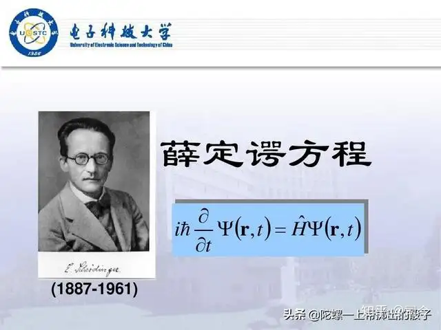

  
斯特恩—格拉赫实验这段曲折故事告诉我们，基础物理学研究要甘于做“冷板凳”，要有坚韧不拔的品质，同时意外碰巧的正确组合往往也是一个很重要的因素。  

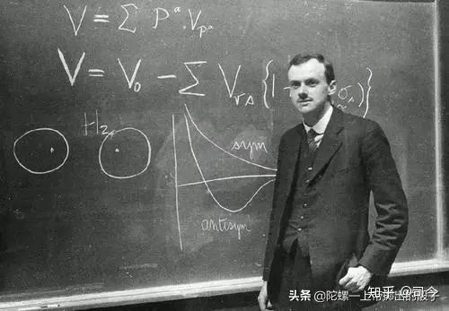

  
由此，我有时会想，物理学的很多成功或许是天意，牛顿的苹果、赫兹的电火花、普朗克的“内插法”等等，无不是“天赐良机”；我甚至更觉得，现代物理学的停滞与困境又何尝不可以视作是下一次物理学革命开启的“天意”之楔呢？  

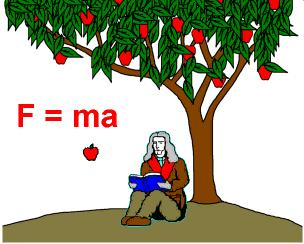

  
——————————————————————————————————————————  
**【参考资料】：**  
1、《斯特恩与格拉赫：一只劣质香烟是如何帮助重新规划原子物理的》：中国科学院物理研究所，曹则贤译。  
2、百度百科：斯特恩-格拉赫实验