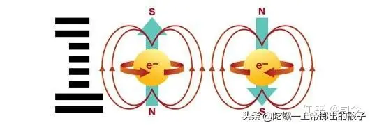
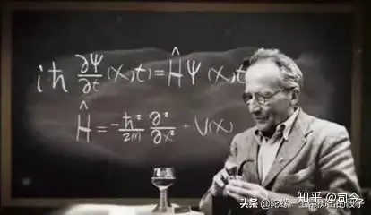
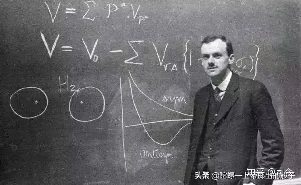

---

title: “电子自旋”趣事（6）——电子自旋是怎样在狄拉克方程中显现出来的？ - 知乎

date: 2024-05-13 22:33:31

categories: default

tags: 
- 无

original_url: https://zhuanlan.zhihu.com/p/102774504

---

# “电子自旋”趣事（6）——电子自旋是怎样在狄拉克方程中显现出来的？ - 知乎

## “电子自旋”趣事（6）——电子自旋是怎样在狄拉克方程中显现出来的？

司今（jiewaimuyu@126.com）

  

  

电子自旋概念是为了解释斯特恩=格拉赫实验、塞曼效应、反常塞曼效应等物理实验现象而人为引入的概念，它的得来没有一定的物理原理或方程给予支持，如量子力学的支柱方程——薛定谔方程就不包含自旋要素。

  

  

在量子力学飞速发展的那个年代，年轻的A.M.狄拉克受克莱因-戈登方程及薛定谔方程的启发，于1928年提出电子的相对论波动方程，即狄拉克方程，在这个方程中就闪现出了电子自旋和自旋磁矩的踪影（这说明它对电子自旋的来源描述还是不太清晰），这是量子力学又一里程碑的成就。

  

  

那么，狄拉克方程是怎么得来的？它又是如何体现出电子自旋存在的呢？

我这里不妨引述一下赵凯华老师编写的《量子力学》里的内容：

  

  

以自由运动电子为例，非相对论中的动能与动量的关系是E=m²v²/2m=p²/2m.

将动量写作三维空间分量的形式来描述就是

E=（px²+py²+pz²）/2m.

将其中的动能与动量换算成算符描述就是

E=ih′ə/dt，px=﹣ih′ə/dx，py=﹣ih′ə/dy，pz=﹣ih′ə/dz.

将它运用到波函数ψ上就得出自由电子运动的薛定谔方程，即

ih′əψ/dt=﹣h′²/2m×(ə²/dx²+ə²/dy²+ə²/dz²)ψ.

  

  

在爱因斯坦相对论中，动能与动量的关系是

E²=p²c²+mc²c²=c²\[(px²+py²+pz²)+mc²\].

如果我们将E=ih′ə/dt，px=﹣ih′ə/dx，py=﹣ih′ə/dy，pz=﹣ih′ə/dz运用到这个方程中，就会得出

h′²ə²ψ/dt²=c²\[h′²(ə²/dx²+ə²/dy²+ə²/dz²﹣mc²)\]ψ.

这个方程是包含时间t的二阶偏导，决定未来波函数ψ演化的初始条件中，除给出ψ(t=0)外，还需给出其一阶时间导数（əψ/dt）t=0来。可以证明，此方程无法保证概率密度恒正，这是物理上不能接受的。

  

  

于是，狄拉克想到了将E²=c²\[(px²+py²+pz²)+mc²\]中的(px²+py²+pz²)+mc²项看作是一种全平方的形式，即

令(px²+py²+pz²)+mc²=（αx•px+αy•py+αz•pz+β）²，则有αi=1,αi•αj+αj•αi=0,β²=m²c²,αi•β+β•αi=0.

显然，服从乘法交换律的普通系数是不能满足以上方程式的；那么，为什么它们不是矩阵呢？正是沿着这一思路，狄拉克终于得出了相对论性的电子自由运动的波动运动，即

(ə/cdt+αx•ə/dx+αy•ə/dy+αz•ə/dz+imc/h＇•β)•ψ=0.

  

  

这个方程的波函数ψ是具有四个分量的列矩阵，即ψ=〔ψ1，ψ2，ψ3，ψ4〕，这四个分量的物理意义是：ψ1和ψ2是正能量的本征值，ψ3与ψ4是负能量的本征值；此外，ψ1和ψ2分别代表电子自旋z分量等于±1/2的本征态，ψ3与ψ4也是如此；而且，从这个方程还可以导出电子的自旋量子数为1/2，电子自旋磁矩与自旋角动量之比的朗德g因子为轨道角动量情形时朗德g因子的2倍等，并从中预言了正电子的存在。

  

  

纵观狄拉克方程的推理过程可以看出，狄拉克的“神笔”不但刻画出了电子1/2自旋，而且还勾勒出了一个与电子相孪生兄弟一样的正电子来。

  

  

虽然狄拉克方程对电子自旋的描述不够具体和明显，但也总算为电子自旋从唯象假设到理论演变找到了一条道路；同时，我们也可以看出，狄拉克的电子自旋是建立在电子运动中其总动量（角动量）守恒下的一种相对论效应；也就是说，对电子运动动量的描述要包括其平动动量与自旋动量二个方面，其中自旋动量可以产生自旋磁矩。

  

  

由此，我们可以结合宏观刚体平面平行运动中的动量描述，即P=mv平+mv自，其中“mv平”就是自旋刚体的平动动量，“mv自”就是自旋刚体的自旋动量，这个总动量在运动中是守恒的。

  

  

如果以此去审视狄拉克方程，其描述的物理精髓不也正是刚体平面平行运动中总动量（角动量）守恒的微观体现吗？

  

  

而我致力思考的“自旋场理论”，也正是想从这种守恒中寻找出宏观与微观的差异与统一，但愿今生能够完成她！

  

