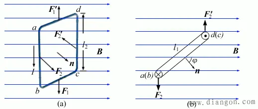
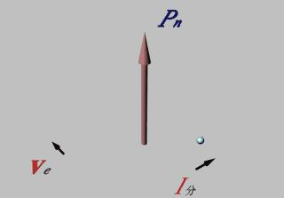
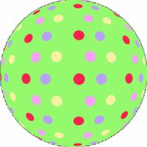
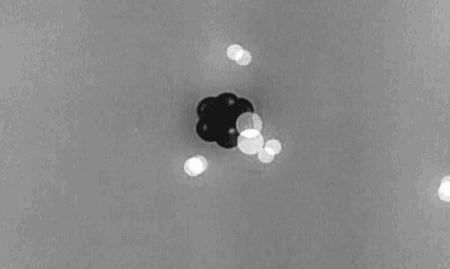

---

title: “电子自旋”趣事（7）——自旋磁矩给物理学带来的光明与黑暗 - 知乎

date: 2024-05-13 22:33:56

categories: default

tags: 
- 无

original_url: https://zhuanlan.zhihu.com/p/102774647

---

# “电子自旋”趣事（7）——自旋磁矩给物理学带来的光明与黑暗 - 知乎

## “电子自旋”趣事（7）——自旋磁矩给物理学带来的光明与黑暗

司今（jiewaimuyu@126.com)

  

线圈磁矩

磁矩，本是经典电磁学用于描述通电线圈在均匀外磁场中产生转动能力大小的物理量，量子力学为了解释施特恩-格拉赫实验也引入了磁矩概念，并将这种概念分列为二种：1、轨道磁矩，2、自旋磁矩。

  

电子轨道磁矩

量子力学轨道磁矩本质是经典电磁学中安培分子电流观点的翻版，这种思路与圆圈导线通电会产生磁场的思想是一致的。

  

原子核自旋磁矩

对于自旋磁矩如何产生的？量子力学没有过多的理论论述，只是强行规定为粒子自旋所固有的一种物理属性，它同粒子质量、电荷属性一样，是与生俱来的的，即具有内禀性；并通过“量子力学法则”将它们分为0、1、2、1/2、2/3等多种自旋形态，这是量子力学理论中的一个硬伤！

  

电子自旋磁矩

但不管怎么说，自旋磁矩是一个被现代物理实验所证实存在的物理量，它不仅成功地解释了塞曼效应、反常塞曼效应及施特恩-格拉赫实验等问题，还像一个“物理小天使”，给量子力学后来的完善、发展与应用带来了一片光明！

  

轨道磁矩

后来的原子理论，超导理论、核磁共振、手机定位、数据储存等无不展现出自旋磁矩的风采，方兴未艾的自旋电子学、纳米材料学等正将自旋磁矩的威力引向更光明的未来！

  

自旋磁粒子与核磁共振

可以这么说，粒子自旋磁矩的发现与证实，不仅是一场微观物理学革命，也是物理学发展史中的一个伟大发现，它的发现同牛顿质量引力、库伦电、磁荷引力一样伟大，但因磁与电有说不清道不明的纠葛，故这种发现科学价值被世人低估了。

  

氢原子核自旋磁矩

其实，自旋磁矩发现的意义是远远超过万有引力、库伦定理的，因为它从本质上揭示了场的起源与运动的关系，同时也将星空与微观世界更紧密地结合到了一起，量子力学的一些法则在星空中也可以使用，因为行星与粒子都有自旋磁矩性，它比以前的二种力学理论对宏观与微观的真实性描述会更准确些！

  

地球自旋磁矩

不过，我们在享受自旋磁矩给现代物理学带来光明与温暖的同时，也应看到现代物理学家们的努力与失败，欢心与沮丧，特别是对自旋磁矩产生原因的诠解上至今没有一个满意答案；从物理理论的继承性方面来说，自旋磁矩确实给目前的物理学带来了黑暗！

  

电子自旋磁矩

为什么这么说？下面我们以电子自旋磁矩为例来说明目前物理学所面临的窘境：

1、如果说电子是一个有空间大小的粒子，依据磁矩同安培分子电流观点相一致的原理，则电子内部就应该有比电子更小的带电粒子组成，它们在电子体空间内绕中心点旋转才会产生电子自旋磁矩，但目前物理学实验证明并没有发现电子有内部组成结构的迹象，而且现代物理学也没有能够真正测量到电子半径到底有多大？据李政道教授的实验估算，电子半径应在10^-22m以下，甚至他还倾向认为电子是一个点粒子（没有空间大小的粒子点）。

  

安培分子电流理论

2、如果我们将电子看作是一个点粒子，依据安培分子电流观点定义出来的磁矩就没有办法描述自旋磁矩产生的物理机制问题。

粒子的自旋磁矩到底是该描述成点自旋还是体自旋？这不仅引发了一场物理学革命，同时也会引发一场数学革命，李群代数的出现正是这个结果，但物理学方面到现在还没有取得实质性的突破！

  

飞向量子力学的小天使

面对电子自旋磁矩给目前物理学带来的难题与尴尬，我们不得不承认，自旋磁矩是一个“双面天使”，它给微观物理学带来光明的同时，也带来了乌云！

黑暗也是下一个黎明到来的前哨，对自旋磁矩起源问题，我们是不是可以换个角度去作尝试思考：

  

黎明曙光

1、可能电子半径极小，只是目前我们现代的实验条件测不出来罢了，宇宙中有比电子更小的带电粒子存在——这是一种比较“得人心”的解释，但由此也给物理学曾经否定的以太论点燃了希望之火。

2、既然安培分子电流观点对描述电子自旋磁矩无效，那么会不会还存在另一种自旋生磁规律没有被我们发现呢？

以上思考到底哪一种方向将是可行的？我们拭目以待吧！

  

刚体旋转

  

**▁▁▁▁▁▁▁▁▁▁▁▁▁▁▁▁▁▁▁▁▁▁▁▁▁▁▁▁▁▁▁▁▁▁▁▁▁**

## 【附录】：自旋磁矩

自旋磁矩，是指材料内部电子的循轨运动和自旋运动都可以看作是一个闭合的环形电流，因而必然产生磁矩，电子自旋运动产生的磁矩称为自旋磁矩。 \[1\]

  

材料中的自旋粒子

自旋是基本粒子或原子核的固有角动量，它与轨道角动量不同，即使粒子处于静止时也存在。任何粒子的自旋在空间中的方向也不是任意的，它在空间一个确定方向(如磁场方向)上的投影，必须是h/2π(h为普朗克常数)的整数或半整数倍。

水和空气在稳定状态下，由于地磁场的同极磁化作用，分子的自旋磁矩不能够冲破首尾相连的分子链。稳定状态或直线运动状态一旦破坏，分子链荡然无存。

**概念介绍**

水和空气在稳定状态下，由于地磁场的同极磁化作用，分子的自旋磁矩不能够冲破首尾相连的分子链。稳定状态或直线运动状态一旦破坏，分子链荡然无存。

根据能量守恒与物质不灭原则，旋风和台风并不是无缘无故的正常维持，它即有内因又有外因，内因是斥磁性物质分子内部电子轨迹不闭合，近似的电流环每旋转一周，电流环近似平面与地磁场方向垂直一次，切割一次地磁场磁力线，产生分子的自旋磁矩，这即是分子的自旋电动势。外因是有初始旋转速度和初始能量，依靠分子的自旋电动势，切割磁力线，消耗磁场物质产生能量并输出能量，维持台风或旋风的正常旋转。

  

龙卷风

实际上，斥磁性物质就如同一台上满发条的摆钟，要想使其走动，只需轻轻一推，摆钟即可正常走动，越摆越大，直到幅度最大为止。有学者认为人造台风只需将旋转风的风力加强到十级或略高，即可自动加强到最大风力，形成台风。 \[2\]

**磁矩**

磁矩是描述载流线圈或微观粒子磁性的物理量。平面载流线圈的磁矩定义为m=iSn式中i电流强度；S为线圈面积；n为与电流方向成右手螺旋关系的单位矢量。在均匀外磁场中，平面载流线圈所受合力为零而所受力矩不为零，该力矩使线圈的磁矩m转向外磁场B的方向；在均匀径向分布外磁场中，平面载流线圈受力矩偏转。许多电机和电学仪表的工作原理即基于此。

  

轨道磁矩

**定义**

在原子中，电子因绕原子核运动而具有轨道磁矩；电子因自旋具有自旋磁矩；原子核、质子、中子以及其他基本粒子也都具有各自的自旋磁矩。这些对研究原子能级的精细结构，磁场中的塞曼效应以及磁共振等有重要意义，也表明各种基本粒子具有复杂的结构。

分子的磁矩就是电子轨道磁矩以及电子和核的自旋磁矩构成的(μ=μs+μl=gsps+glpl)，磁介质的磁化就是外磁场对分子磁矩作用的结果。

  

古地球磁矩的变化

粒子的内禀属性。每种粒子都有确定的内禀磁矩。自旋为s的点粒子的磁矩μ由μ=g(e/2m)p给出，式中e和m分别是该粒子的电荷和质量，g是一个数值因子，p为自旋角动量。自旋为零的粒子磁矩为零。自旋为1/2的粒子，g=2；自旋为1的粒子，g=1；自旋为3/2的粒子，g=2/3。理论上普遍给出g=1/s。

  

1/2自旋粒子

粒子磁矩可通过实验测定。但实验测定结果并不与此相符，其间差别称为反常磁矩。对于自旋均为1/2的电子、μ子、质子和中子，精确测定其g因子分别为

电子 gl2=1.001159652193（10）

μ子 gl2=1.001165923（8）

质子 gl2=2.792847386（63）

中子 gl2=－1.91304275（45）

粒子反常磁矩的来源有二：一是量子电动力学的辐射修正，电子、μ子属于这种情形，即使是点粒子，粒子产生的电磁场对其自身的作用导致自旋磁矩的微小变化，这一改变可以严格地用量子电动力学精确计算，结果与实验测定符合得很好；另一是由于粒子有内部结构和强相互作用的影响，质子和中子属于这种情形，质子和中子的反常磁矩用于分析其内部结构。 \[3\]

**各类磁矩**

**载流回路磁矩**

在一个载流回路中，磁矩大小是电流乘以回路面积：u=I\*S；其中，u为磁矩，I 为电流，S 为面积。

磁矩方向则为电流绕行方向右手定则所决定的方向。

载流回路在磁场中所受力矩M与磁矩的关系为：M=u×B 其中，B 为磁感应强度。

**基本粒子磁矩**

许多基本粒子(例如电子)都有内禀磁矩，这种磁矩和经典物理的磁矩不同，必须使用量子力学来解释它，

  

核自旋与核磁矩

核自旋与核磁矩和粒子的自旋有关。而这种内禀磁矩即是许多在宏观之下磁力的来源，许多的物理现象也和此有关。这些内禀磁矩是量子化的，也就是它有最小的基本单位，常常称为“磁子”(magneton)或磁元，例如电子自旋磁矩的矢量绝对值即和玻尔磁子成比例关系：μs=-gs.μB.s/h＇.

其中μs为电子自旋磁矩，电子自旋g因子gs是一项比例常数，μB为玻尔磁子，s为电子的自旋角动量。 \[4\]

  

电子绕原子核运动

  

▁▁▁▁▁▁▁▁▁▁▁▁▁▁▁▁▁▁▁▁▁▁▁▁▁▁▁▁▁▁▁▁▁▁▁▁▁▁▁▁

**注：自旋磁矩\_百度百科**

[https://baike.baidu.com/item/%E8%87%AA%E6%97%8B%E7%A3%81%E7%9F%A9/960138?fr=aladdin](https://link.zhihu.com/?target=https%3A//baike.baidu.com/item/%25E8%2587%25AA%25E6%2597%258B%25E7%25A3%2581%25E7%259F%25A9/960138%3Ffr%3Daladdin)