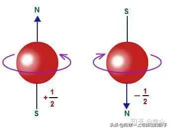
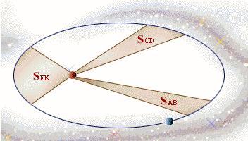
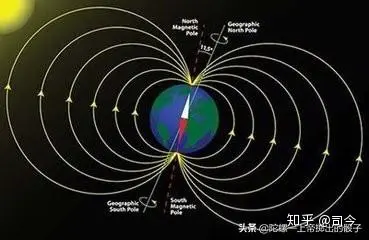
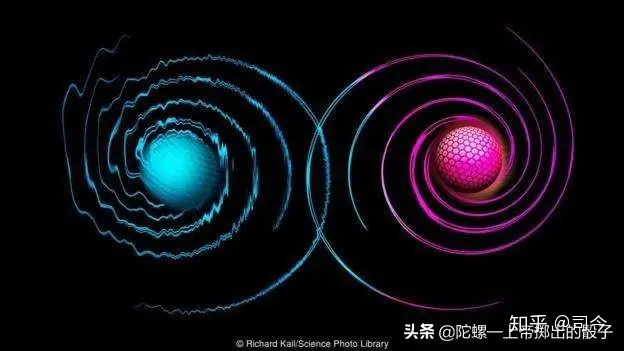
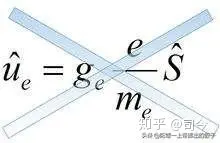
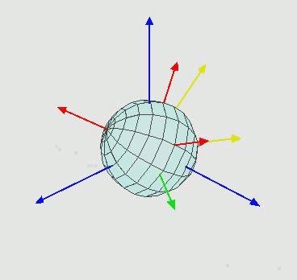
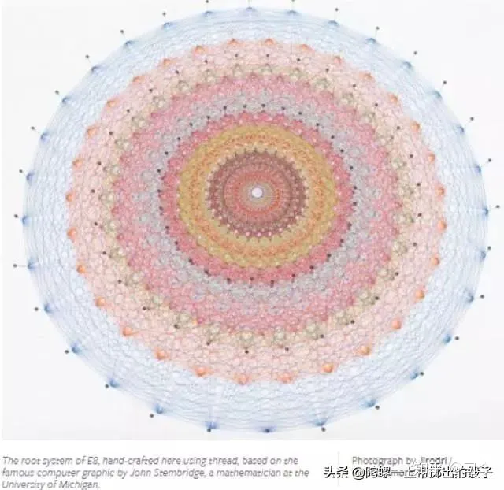
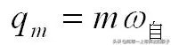

---

title: “电子自旋”趣事（8）—量子力学对电子自旋磁矩描述的困境与突破 - 知乎

date: 2024-05-13 22:34:20

categories: default

tags: 
- 无

original_url: https://zhuanlan.zhihu.com/p/102774743

---

# “电子自旋”趣事（8）—量子力学对电子自旋磁矩描述的困境与突破 - 知乎

## “电子自旋”趣事（8）—量子力学对电子自旋磁矩描述的困境与突破

司今（jiewaimuyu@126.com)

  

  

  

量子力学中的电子自旋可谓是“神来之笔”，它没有任何理论作支撑，开始仅仅是为了解释塞曼效应、斯特恩-格拉赫实验等物理现象而人为假设的概念，这一概念既没有出现在薛定谔方程中，也与所谓的“波粒二象性”没有什么关联性，其以独特的形式鹤立于量子力学中。

同时，量子力学对电子自旋及自旋磁矩的解释，着实给人们留下了诸多困惑。

  

  

量子力学认为，自旋是粒子所具有的内禀性质，由粒子内禀角动量所引起的一种固有运动，其运算规则类似于经典力学的角动量，并因此产生一个自旋磁场，即表现为自旋磁矩；也就是说，自旋是由粒子内禀角动量引起的一种运动，自旋角动量会产生磁场效应。

  

  

自旋磁矩是电子的基本性质之一，就像电子的质量、电荷等物理量一样，是描述微观粒子固有物理属性的量；但对电子的自旋不能用经典力学中的自旋去理解，因为经典概念中的自转是物体相对于其质心的旋转，比如地球自转是顺着一个通过地心的极轴所作的转动......

  

  

对此描述，我真有点头晕。

“内禀性”是什么？中文解释是“存在但并不彰显，或不为人知”，英文则把静止时不为零的量称做intrinsic量（内禀量一词的定义从英文解释就知道了,就是内在的,本质的量）,而intrinsic量的运动效应产生的量称为induced量（诱导量）。

量子力学用“内禀性”来解释电子的自旋与自旋磁矩的存在现象，就等于说电子生下来就具有这些特性，自旋、自旋磁矩同电荷、质量一样，都是用于描述电子的基本物理量，但如果你要问：电子这种奇怪的自旋运动究竟是怎么产生的？它的运作原理是什么？那对不起，不知道！如果你再问：电子自旋是如何产生的？你得到的答案也一定是不知道！而且他们还可能会规劝你：不需要刻意地去追问为什么，你只要乖乖地会计算会运用就行了。

  

  

纵观量子力学，它在承认电子具有自旋磁矩的同时又否定了电子的自转，在否定电子自转的同时又说电子存在自旋运动，即说电子自旋同时又说电子自旋不是自转；不仅如此，量子力学还认为，电子自旋为1/2自旋，即自旋了720°才算转一圈——这更让人对电子的自旋彻底地无法理解了。

可见，量子力学对自旋及自旋磁矩的“内禀性”解释只能增加人们对量子力学的神秘感，并不能为寻找粒子自旋磁性的起源带来任何裨益！

  

  

其实，熟悉量子力学的人都知道，用量子理论是根本不可能解决粒子自旋和自旋磁矩起因的，因为量子论一方面承认粒子自旋，但不承认粒子有半径大小，因为有了半径大小，其自旋就会超光速，另一方面，量子理论又用自旋角动量来描述自旋磁矩大小——这就奇怪了，角动量是一个与空间大小有关的量，即有半径大小，这与它所说的粒子是个没有空间大小的点粒子岂不矛盾？

  

  

再说，量子力学计算电子自旋会超光速，那是用电子经典半径计算得出的结论，而电子真实的半径大小到现在我们还没有测量出来；量子力学以此来否定电子半径的存在应是不合理的，电子的半径可能比我们预想的要小得多。

同时，电子自旋所产生的自旋磁矩用μs=－2μBs/h来描述也是值得榷商的议题，因为电子是基本粒子，其没有内部组成结构，那它的自旋角动量s是指什么东西在绕什么旋转呢？要知道角动量是指J=mvr，这个m又是指谁的质量呢？

  

  

如果认为电子有空间大小，依据磁矩安培分子电流观点和电子轨道磁矩描述理论，则电子内部就应该有内部组成结构，即有比电子更小的带电粒子在其内部绕核或轴旋转，但目前物理学实验并没有发现电子有内部结构的迹象；如果认为它是点粒子，则就不应该用自旋角动量来定义和描述电子的自旋磁矩。

  

  

由此看来，用现有的安培分子电流观点去解释电子自旋磁矩问题是存在困难的，这一困境里包含了二种可能：

（1）、电子半径极小，我们现代实验条件测不出来，而且有比电子更小的带电粒子存在；

（2）、安培分子电流观点对描述电子自旋磁矩无效，那就应该还存在另一种自旋生磁机制，那么这个自旋生磁机制应该是什么呢？

  

  

同时也说明，我们对微观世界的粒子属性及其运动效应了解得还是很少很少，其中还可能蕴藏了新的支配微观世界运动的物理原理，到我们现在还没有挖掘出来！

  

  

现在，首要面对的是：对粒子自旋及自旋磁矩的描述到底该看作是“点自旋”还是“体自旋”？

我相信，对这一问题的讨论不仅可能引发一场物理学的新革命，同时也可能会引发一场数学的新革命，李群代数对“点自旋”及其磁矩的描述已开了个好头，但他用坐标旋转思路最终还是没能取得实质性的突破！

  

  

对此，我的设想是：

电子电荷自旋或电子质量自旋会生磁，可以用自旋磁量qm=eω或qm=mω予以定量，这样描述出的粒子自旋磁量大小就与其旋转空间半径r大小无关了。

  

  

但这种描述究竟合不合理呢？我在思考.......

  

