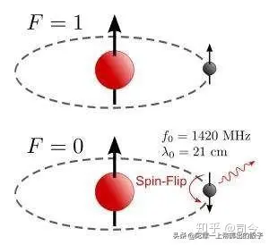

---

title: “电子自旋”趣事（10）——爱因斯坦在磁矩与自旋研究方面的贡献 - 知乎

date: 2024-05-13 22:35:29

categories: default

tags: 
- 无

original_url: https://zhuanlan.zhihu.com/p/102774913

---

# “电子自旋”趣事（10）——爱因斯坦在磁矩与自旋研究方面的贡献 - 知乎

## “电子自旋”趣事（10）——爱因斯坦在磁矩与自旋研究方面的贡献

司今（jiewaimuyu@126.com）

  

  
  
  

在那场揭开“电子自旋”奥秘的微观物理学革命中，以“相对论”著称的爱因斯坦在这方面的研究工作似乎被人遗忘了；其实，爱因斯坦在揭示基本粒子的磁场、角动量和自旋之间的关系中还是做出了一定贡献的，如“爱因斯坦－德哈斯效应”就是一例，但这在量子力学自旋发展史中却很难看到这方面的记述。

  

  
  
  

大约在1915年至1916年期间，爱因斯坦与荷兰物理学家德哈斯合作，就进行了一连串的实验，他们想验证，磁性材料中的磁性是不是来源于材料中带电粒子的轨道运动？

被物理学称为“爱因斯坦－德哈斯实验”的思想起源于经典电磁学中的安培分子电流观点；安培认为，磁性材料的磁性来自于材料内部分子不断做圆形轨道运动的电流，从而产生微小的磁偶极矩，这些偶极矩矢量合就使材料显示出磁性来。

  

  
  
  

对此，爱因斯坦设想，假如原子尺度下的磁矩来源于电子绕原子核作圆周运动的结果，那么，这样的轨道运动就必然会表现出一定的角动量。

爱因斯坦和德哈斯一起曾推导出原子磁矩与电子的轨道角动量成正比，即μ=el/2m.

  

  
  
  

在当时，电子的荷质比是已知的，他们根据荷质比推算出他们实验所要测量的对应值为：

e/2m≈8.8×10^10C.kg^﹣1.

  

  
  
  

这个值后来被量子力学称为旋磁比，用符合表示就是γ=e/2m，它表示出了磁矩与角动量之间的比例关系，但量子力学中的γ要比爱因斯坦-德哈斯计算出的γ要小一倍。

为此，爱因斯坦和德哈斯设计出了如下图所示的实验装置。

  

  
  
  

他们的实验装置原理是这样的，假设有一根圆柱形的铁棒，用一根细线吊起来，铁棒原本的磁矩方向应该向上（磁矩方向向上，则其轨道角动量方向向下），若我们在铁棒下方放置一块磁体磁场，使铁棒中的磁矩方向变为往下，那么，电子作轨道运动的角动量方向也就会跟着翻转而指向上方。

  

  
  
  

依据角动量守恒原理，整个系统就会产生一个反方向的角动量，所以铁棒就会沿着顺时针方向转动，我们就可以测量出该转动量大小，以此就可以计算出角动量变化的大小，进而就可以计算出铁棒中原子的磁旋比来。

用这个实验，愛因斯坦和德哈斯最后测量出來的結果和他们的理论计算几乎完全吻合；也就是说，他们的这个实验的确证实了磁矩起源于一个真实可以测的角动量。

但爱因斯坦-德哈斯实验测量出来的磁旋比只有后来量子力学计算出的值的一半，这是为什么？

  

  
  
  

这是因为铁棒里的磁矩来源应该主要是电子的自旋磁矩，而非电子的轨道磁矩，若考虑电子自旋磁矩，则铁棒的磁旋比应该是γ≈1.76×10^11C.kg^﹣1 。

但不管怎么说，爱因斯坦-德哈斯实验对促进当时的量子力学磁矩论的发展，还是起到巨大推动作用的，通过这个实验，也为后来爱因斯坦能够迅速接受乌伦贝克与高斯密特提出的电子自旋及其自旋磁矩假设提供了必要的心理准备。

  

  
  
  

而且后来，为了缓解广义相对论与宇宙加速膨胀、狄拉克电子自旋理论等之间的矛盾，爱因斯坦与法国数学家埃利.嘉当合作，提出了包含自旋要素的“爱因斯坦-嘉当理论”。这个理论比爱因斯坦先前提出的广义相对论更加接近真理的引力理论。

  

  
  
  

��现在，利用“爱因斯坦-嘉当理论”可以在不引入暗能量的情形下解释飞船轨道异常和宇宙加速膨胀，也可以说明星系暗物质的分布情况，还可以消除与狄拉克电子自旋理论之间的矛盾；同时，“爱因斯坦-嘉当理论”还预言：磁化物质之间除了有磁场作用力外，还应存在附加的“自旋-自旋”之间的作用力——那就是二个自旋磁矩之间的磁作用效应。

  

